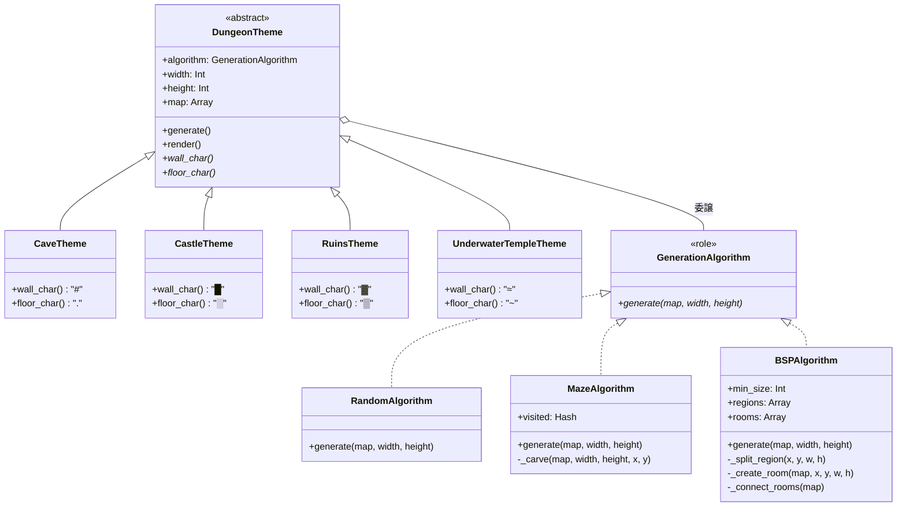

PerlとMooで「ランダムダンジョンジェネレーター」を作る連載の最終回です。



今回は、これまでの設計を振り返り、Bridgeパターンの本質と他のパターンとの違いを整理します。


## 完成したシステムの全体像

7回の連載を通じて、以下のシステムを構築しました。



## Bridgeパターンの構成要素

GoFの定義に従って、今回のシステムを整理します。

| GoFの用語 | 今回の実装 | 役割 |
|---|---|---|
| Abstraction | DungeonTheme | 抽象側の基底クラス |
| RefinedAbstraction | Cave/Castle/Ruins/UnderwaterTempleTheme | 抽象側の具象クラス |
| Implementor | GenerationAlgorithm（Role） | 実装側のインターフェース |
| ConcreteImplementor | Random/Maze/BSPAlgorithm | 実装側の具象クラス |

## Bridgeパターンが解決する問題

Bridgeパターンは、以下の問題を解決します。

1. クラス爆発の回避

n種類の抽象 × m種類の実装 = n×m クラス が必要な状況を、n+m クラスで済むようにします。

2. 独立した拡張

抽象（テーマ）と実装（アルゴリズム）を独立に拡張できます。
新しいテーマを追加しても、既存のアルゴリズムには影響しません。
逆も同様です。

3. 実行時の組み合わせ

継承では静的に決まる組み合わせを、委譲により実行時に動的に決定できます。

## 他のパターンとの比較

Bridgeパターンと混同されやすいパターンとの違いを整理します。

### Adapterパターンとの違い

| 観点 | Bridge | Adapter |
|---|---|---|
| 目的 | 抽象と実装を分離 | インターフェースを変換 |
| 設計時期 | システム設計時 | 既存システムの統合時 |
| 構造 | 両側を自ら設計 | 一方は既存 |

Adapterは「後から」既存のクラスを別のインターフェースに適合させます。
Bridgeは「最初から」拡張性を考慮して設計します。

### Strategyパターンとの違い

| 観点 | Bridge | Strategy |
|---|---|---|
| 対象 | 複数の変動軸 | 1つのアルゴリズム軸 |
| Abstraction側 | 階層を持つ | 1つのContextのみ |
| 連携 | 抽象と実装が協調 | アルゴリズムのみ交換 |

Strategyは1つの軸（アルゴリズム）だけを切り替えます。
Bridgeは2つの軸（抽象と実装）を独立に変化させます。

今回のダンジョンジェネレーターでは、もしテーマが1種類だけで、アルゴリズムだけを切り替えたいなら、Strategyパターンで十分です。

## Bridgeパターンを使うべき場面

以下の条件が揃ったときに、Bridgeパターンを検討しましょう。

- 2つの独立した変動軸がある
- それぞれの軸で拡張が見込まれる
- 組み合わせ爆発を避けたい

例えば以下のような場面です。

- 複数のOS × 複数のGUIフレームワーク
- 複数のデータベース × 複数のORM
- 複数の通知チャネル × 複数のメッセージ形式

## 実務での応用例

今回のダンジョンジェネレーターは楽しい題材でしたが、実務でもBridgeパターンは活用できます。

### レポート生成システム

- Abstraction: レポート形式（PDF、HTML、Excel）
- Implementor: データソース（DB、API、ファイル）

### 通知システム

- Abstraction: メッセージ形式（緊急、定期、リマインダー）
- Implementor: 配信チャネル（Slack、Email、SMS）

### 描画システム

- Abstraction: 図形（円、四角、三角）
- Implementor: 描画API（OpenGL、DirectX、SVG）

## 連載を通じて学んだこと

この連載では、以下のことを学びました。

- 二次元配列とASCII artでダンジョンを表現
- 複数のアルゴリズム（ランダム、迷路、BSP）
- クラス爆発問題とそのアンチパターン
- Bridgeパターンによる抽象と実装の分離
- Moo Roleを使ったインターフェース定義
- Open/Closed原則の実践

最初はシンプルなダンジョン生成から始まり、問題に直面し、パターンで解決するという体験を通じて、Bridgeパターンの本質を理解できたのではないでしょうか。

## ファイル一覧

最終的なファイル構成は以下の通りです。

```
.
├── DungeonTheme.pm          # 抽象の基底クラス
├── CaveTheme.pm             # 洞窟テーマ
├── CastleTheme.pm           # 城テーマ
├── RuinsTheme.pm            # 遺跡テーマ
├── UnderwaterTempleTheme.pm # 水中神殿テーマ
├── GenerationAlgorithm.pm   # アルゴリズムのRole
├── RandomAlgorithm.pm       # ランダム配置
├── MazeAlgorithm.pm         # 迷路型
└── BSPAlgorithm.pm          # 部屋区分型
```

9モジュールで、12通り（4テーマ×3アルゴリズム）の組み合わせを実現しています。

## 今回のまとめ

最終回では、Bridgeパターンの設計を振り返りました。

- Bridgeパターンは抽象と実装を分離する
- n×m クラスが n+m クラスに削減
- AdapterやStrategyとは目的が異なる
- 2つの独立した変動軸があるときに有効

この連載で作成したダンジョンジェネレーターは、「友人に自慢できる」成果物です。
ぜひ新しいテーマやアルゴリズムを追加して、自分だけのダンジョンを作ってみてください。


