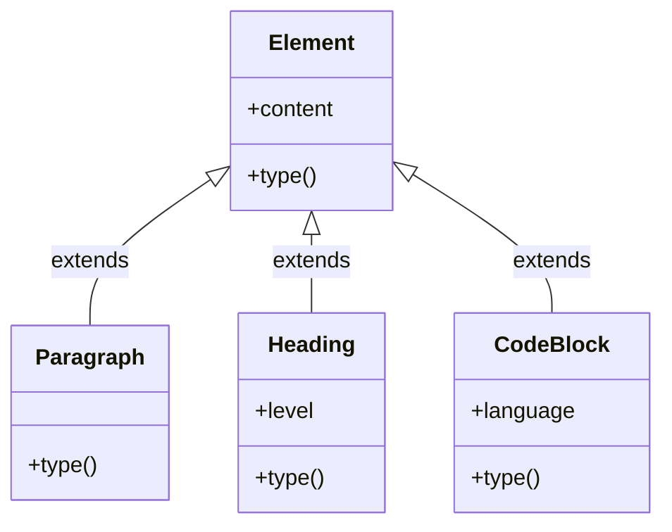

[@nqounet](https://x.com/nqounet)です。

前回は、Elementクラスを作成し、Markdownの段落をオブジェクトとして表現できるようにしました。今回は、見出しやコードブロックなど、様々な種類の要素を表現できるように拡張していきます。

## このシリーズについて

このシリーズは「Mooで覚えるオブジェクト指向プログラミング」シリーズを読了した方を対象に、実践的なドキュメント変換ツールを作りながらオブジェクト指向設計を深く学ぶシリーズです。



## 今のコードの問題点


前回のコードでは、全ての行が同じelementタイプとして扱われていました。

```perl
for my $elem (@elements) {
    say "タイプ: " . $elem->type;  # すべて "element"
}
```

でも、Markdownには見出し（`# 見出し`）やコードブロック（バッククォート3つ）など、様々な構造があります。これらを区別できないと、変換処理を書くときに困ります。

## 継承で要素クラスを分離する

Elementを基底クラスとして、各種要素を表すサブクラスを作りましょう。

### Paragraphクラス（段落）

```perl
package Paragraph;
# 言語: perl
# バージョン: 5.36以上
# 依存: Moo, Element

use Moo;
use experimental qw(signatures);
extends 'Element';

sub type ($self) {
    return 'paragraph';
}

1;
```

普通のテキスト行を表すクラスです。

### Headingクラス（見出し）

```perl
package Heading;
# 言語: perl
# バージョン: 5.36以上
# 依存: Moo, Element

use Moo;
use experimental qw(signatures);
extends 'Element';

has level => (
    is      => 'ro',
    default => 1,
);

sub type ($self) {
    return 'heading';
}

1;
```

見出しは「レベル」（h1, h2, h3など）を持つので、level属性を追加しています。

### CodeBlockクラス（コードブロック）

```perl
package CodeBlock;
# 言語: perl
# バージョン: 5.36以上
# 依存: Moo, Element

use Moo;
use experimental qw(signatures);
extends 'Element';

has language => (
    is      => 'ro',
    default => '',
);

sub type ($self) {
    return 'code_block';
}

1;
```

コードブロックは言語指定（perlやpythonなど）を持てるので、language属性を追加しています。

## クラス階層の図解

作成したクラスの関係を図にすると、以下のようになります。



## パーサーを更新する

要素クラスが増えたので、パーサーも適切なクラスを生成するように更新しましょう。

```perl
package Parser;
# 言語: perl
# バージョン: 5.36以上
# 依存: Moo, Paragraph, Heading, CodeBlock

use Moo;
use experimental qw(signatures);
use Paragraph;
use Heading;
use CodeBlock;

sub parse ($self, $text) {
    my @elements;
    my @lines = split /\n/, $text;
    
    my $in_code_block = 0;
    my $code_content = '';
    my $code_lang = '';
    
    for my $line (@lines) {
        # コードブロックの開始/終了
        if ($line =~ /^```(\w*)/) {
            if ($in_code_block) {
                # コードブロック終了
                push @elements, CodeBlock->new(
                    content  => $code_content,
                    language => $code_lang,
                );
                $code_content = '';
                $code_lang = '';
                $in_code_block = 0;
            } else {
                # コードブロック開始
                $code_lang = $1 // '';
                $in_code_block = 1;
            }
            next;
        }
        
        # コードブロック内
        if ($in_code_block) {
            $code_content .= $line . "\n";
            next;
        }
        
        # 空行はスキップ
        next if $line =~ /^\s*$/;
        
        # 見出し
        if ($line =~ /^(#+)\s+(.+)/) {
            my $level = length($1);
            my $content = $2;
            push @elements, Heading->new(
                content => $content,
                level   => $level,
            );
            next;
        }
        
        # 段落
        push @elements, Paragraph->new(content => $line);
    }
    
    return @elements;
}

1;
```

見出し（`#`で始まる行）とコードブロック（バッククォート3つで囲まれた範囲）を検出して、適切なクラスのオブジェクトを作成しています。

注意: ここでは学習用に機能を絞っています。扱っているのは「行頭の#による見出し」と「```で囲まれたフェンスドコードブロック」だけです。実際のMarkdownではリスト、引用、複数行段落、インラインコードなどがあるため、必要に応じてルールを増やす前提で進めます。

## 動かしてみよう

様々な要素を含むMarkdownをパースしてみましょう。

```perl
#!/usr/bin/env perl
# 言語: perl
# バージョン: 5.36以上
# 依存: Parser

use v5.36;
use lib '.';
use Parser;

my $markdown = <<'MARKDOWN';
# ドキュメント変換ツール

これはサンプルの段落です。

## 特徴

コードを含む例:

```perl
say "Hello, World!";
```

普通の文章も書けます。
MARKDOWN

my $parser = Parser->new();
my @elements = $parser->parse($markdown);

say "パース結果: " . scalar(@elements) . " 個の要素";
say "=" x 50;

for my $elem (@elements) {
    say "タイプ: " . $elem->type;
    
    if ($elem->type eq 'heading') {
        say "レベル: " . $elem->level;
    }
    if ($elem->type eq 'code_block') {
        say "言語: " . ($elem->language || '(なし)');
    }
    
    say "内容: " . $elem->content;
    say "-" x 50;
}
```

実行結果:

```
パース結果: 6 個の要素
==================================================
タイプ: heading
レベル: 1
内容: ドキュメント変換ツール
--------------------------------------------------
タイプ: paragraph
内容: これはサンプルの段落です。
--------------------------------------------------
タイプ: heading
レベル: 2
内容: 特徴
--------------------------------------------------
タイプ: paragraph
内容: コードを含む例:
--------------------------------------------------
タイプ: code_block
言語: perl
内容: say "Hello, World!";

--------------------------------------------------
タイプ: paragraph
内容: 普通の文章も書けます。
--------------------------------------------------
```

見出し、段落、コードブロックがそれぞれ適切なタイプとして認識されています。

## 今回のポイント

今回は以下のことを学びました。

- 継承（extends）を使って要素クラスを分離
- 各要素に固有の属性を追加（level, language）
- パーサーで適切なクラスを生成するロジック

## 今回の完成コード

以下が今回作成したコードの完成版です。

```perl
#!/usr/bin/env perl
# 言語: perl
# バージョン: 5.36以上
# 依存: Moo

use v5.36;

# === Element（基底クラス） ===
package Element {
    use Moo;
    use experimental qw(signatures);

    has content => (
        is       => 'ro',
        required => 1,
    );

    sub type ($self) {
        return 'element';
    }
}

# === Paragraph ===
package Paragraph {
    use Moo;
    use experimental qw(signatures);
    extends 'Element';

    sub type ($self) {
        return 'paragraph';
    }
}

# === Heading ===
package Heading {
    use Moo;
    use experimental qw(signatures);
    extends 'Element';

    has level => (
        is      => 'ro',
        default => 1,
    );

    sub type ($self) {
        return 'heading';
    }
}

# === CodeBlock ===
package CodeBlock {
    use Moo;
    use experimental qw(signatures);
    extends 'Element';

    has language => (
        is      => 'ro',
        default => '',
    );

    sub type ($self) {
        return 'code_block';
    }
}

# === Parser ===
package Parser {
    use Moo;
    use experimental qw(signatures);

    sub parse ($self, $text) {
        my @elements;
        my @lines = split /\n/, $text;
        
        my $in_code_block = 0;
        my $code_content = '';
        my $code_lang = '';
        
        for my $line (@lines) {
            if ($line =~ /^```(\w*)/) {
                if ($in_code_block) {
                    push @elements, CodeBlock->new(
                        content  => $code_content,
                        language => $code_lang,
                    );
                    $code_content = '';
                    $code_lang = '';
                    $in_code_block = 0;
                } else {
                    $code_lang = $1 // '';
                    $in_code_block = 1;
                }
                next;
            }
            
            if ($in_code_block) {
                $code_content .= $line . "\n";
                next;
            }
            
            next if $line =~ /^\s*$/;
            
            if ($line =~ /^(#+)\s+(.+)/) {
                my $level = length($1);
                my $content = $2;
                push @elements, Heading->new(
                    content => $content,
                    level   => $level,
                );
                next;
            }
            
            push @elements, Paragraph->new(content => $line);
        }
        
        return @elements;
    }
}

# === メイン処理 ===
package main {
    my $markdown = <<'MARKDOWN';
# ドキュメント変換ツール

これはサンプルの段落です。

## 特徴

コードを含む例:

```perl
say "Hello, World!";
```

普通の文章も書けます。
MARKDOWN

    my $parser = Parser->new();
    my @elements = $parser->parse($markdown);

    say "パース結果: " . scalar(@elements) . " 個の要素";
    say "=" x 50;

    for my $elem (@elements) {
        say "タイプ: " . $elem->type;
        
        if ($elem->type eq 'heading') {
            say "レベル: " . $elem->level;
        }
        if ($elem->type eq 'code_block') {
            say "言語: " . ($elem->language || '(なし)');
        }
        
        say "内容: " . $elem->content;
        say "-" x 50;
    }
}
```

## 次回予告

次回は、パースした要素をHTML形式に変換する機能を追加します。でも、要素タイプごとに変換処理を分岐させると、あるパターンが見えてきます...if/elseの地獄へようこそ！

お楽しみに！
