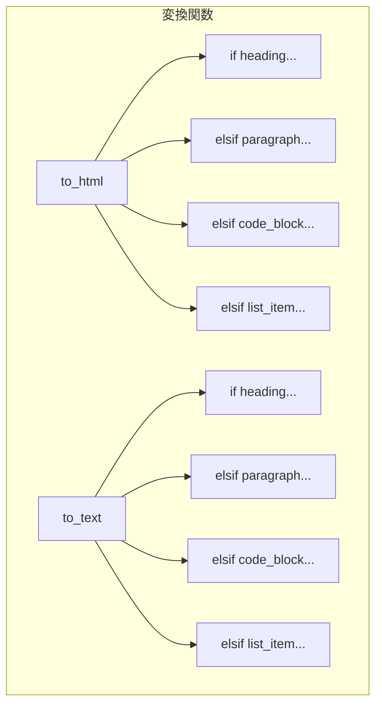

[@nqounet](https://x.com/nqounet)です。

前回は、Heading、Paragraph、CodeBlockの3つの要素クラスを作成し、Markdownの様々な要素を区別できるようになりました。今回は、これらの要素をHTMLに変換する機能を追加してみましょう。

## このシリーズについて

このシリーズは「Mooで覚えるオブジェクト指向プログラミング」シリーズを読了した方を対象に、実践的なドキュメント変換ツールを作りながらオブジェクト指向設計を深く学ぶシリーズです。



## 素直にHTML変換を実装してみる


要素の種類に応じてHTMLタグを生成すればいいので、こんな感じで書けそうです。

```perl
sub to_html ($element) {
    my $type = $element->type;
    
    if ($type eq 'heading') {
        my $level = $element->level;
        return "<h$level>" . $element->content . "</h$level>";
    }
    elsif ($type eq 'paragraph') {
        return "<p>" . $element->content . "</p>";
    }
    elsif ($type eq 'code_block') {
        my $lang = $element->language;
        if ($lang) {
            return "<pre><code class=\"language-$lang\">" 
                   . $element->content 
                   . "</code></pre>";
        }
        return "<pre><code>" . $element->content . "</code></pre>";
    }
    else {
        return $element->content;
    }
}
```

シンプルでわかりやすいですね。でも...

注意: この記事のHTML変換は学習用の最小実装です。実運用ではHTMLエスケープ（`<` や `&` の処理）や、コードブロックの末尾改行整理などが必要になります。

## 新しい要素を追加すると？

リスト要素（ListItem）を追加してみましょう。

```perl
package ListItem;
use Moo;
extends 'Element';

sub type ($self) { return 'list_item'; }
```

さて、to_html関数を修正します。

```perl
sub to_html ($element) {
    my $type = $element->type;
    
    if ($type eq 'heading') {
        my $level = $element->level;
        return "<h$level>" . $element->content . "</h$level>";
    }
    elsif ($type eq 'paragraph') {
        return "<p>" . $element->content . "</p>";
    }
    elsif ($type eq 'code_block') {
        my $lang = $element->language;
        if ($lang) {
            return "<pre><code class=\"language-$lang\">" 
                   . $element->content 
                   . "</code></pre>";
        }
        return "<pre><code>" . $element->content . "</code></pre>";
    }
    elsif ($type eq 'list_item') {  # 追加
        return "<li>" . $element->content . "</li>";
    }
    else {
        return $element->content;
    }
}
```

まだ許容範囲内です。

## さらに出力形式を追加すると？

HTMLだけでなく、プレーンテキストでも出力したくなりました。

```perl
sub to_text ($element) {
    my $type = $element->type;
    
    if ($type eq 'heading') {
        my $level = $element->level;
        my $prefix = "=" x (7 - $level);  # h1 = ======, h2 = =====, ...
        return "$prefix " . $element->content;
    }
    elsif ($type eq 'paragraph') {
        return $element->content;
    }
    elsif ($type eq 'code_block') {
        return "---\n" . $element->content . "---";
    }
    elsif ($type eq 'list_item') {
        return "  * " . $element->content;
    }
    else {
        return $element->content;
    }
}
```

ん？なんだか同じようなif/elseをまた書いていますね。

## 問題が見えてきた

今の状態を整理しましょう。



要素が4種類、出力形式が2種類で、すでに8つの条件分岐が必要です。

もしBlockquote、Link、Imageなども追加し、さらにMarkdown出力やJSON出力も追加したら？

| 要素数 | 出力形式数 | 条件分岐の総数 |
|-------|----------|--------------|
| 4種類 | 2形式 | 8個 |
| 7種類 | 4形式 | 28個 |
| 10種類 | 5形式 | 50個 |

条件分岐が爆発的に増えていきます。これはつらい。

## 何がまずいのか

問題点を整理します。

### 単一責任の原則（SRP）違反

to_html関数が、全ての要素タイプの変換処理を知っている必要があります。要素が増えるたびにto_htmlを修正しなければなりません。

### 開放閉鎖の原則（OCP）違反

新しい要素を追加するたびに、既存のto_html関数を変更する必要があります。既存のコードを変更せずに拡張することができません。

```perl
# 新しい要素を追加するたびに...
elsif ($type eq 'blockquote') {  # 変更！
    return "<blockquote>" . $element->content . "</blockquote>";
}
elsif ($type eq 'link') {  # 変更！
    return "<a href=\"...\">" . $element->content . "</a>";
}
# 終わりが見えない...
```

## 試しに動かしてみる

とりあえず今のコードをまとめて動かしてみましょう。

````perl
#!/usr/bin/env perl
use v5.36;

# （前回までのクラス定義は省略）

my $markdown = <<'MARKDOWN';
# タイトル

これは段落です。

```perl
my $x = 1;
```
MARKDOWN

my $parser = Parser->new();
my @elements = $parser->parse($markdown);

say "=== HTML出力 ===";
for my $elem (@elements) {
    say to_html($elem);
}

say "\n=== テキスト出力 ===";
for my $elem (@elements) {
    say to_text($elem);
}
````

実行結果:

```
=== HTML出力 ===
<h1>タイトル</h1>
<p>これは段落です。</p>
<pre><code class="language-perl">my $x = 1;
</code></pre>

=== テキスト出力 ===
====== タイトル
これは段落です。
---
my $x = 1;
---
```

動くには動きます。でも、このコードを保守していく自信はありません...

## 今回のポイント

今回は以下のことを学びました。

- if/elseによる変換処理の実装
- 要素と出力形式の組み合わせで条件分岐が爆発する問題
- SRP（単一責任の原則）違反の具体例
- OCP（開放閉鎖の原則）違反の具体例

## 今回の完成コード

以下が今回作成したコードの完成版です。

````perl
#!/usr/bin/env perl
# 言語: perl
# バージョン: 5.36以上
# 依存: Moo

use v5.36;

# === Element（基底クラス） ===
package Element {
    use Moo;
    use experimental qw(signatures);

    has content => (
        is       => 'ro',
        required => 1,
    );

    sub type ($self) {
        return 'element';
    }
}

# === Paragraph ===
package Paragraph {
    use Moo;
    use experimental qw(signatures);
    extends 'Element';

    sub type ($self) {
        return 'paragraph';
    }
}

# === Heading ===
package Heading {
    use Moo;
    use experimental qw(signatures);
    extends 'Element';

    has level => (
        is      => 'ro',
        default => 1,
    );

    sub type ($self) {
        return 'heading';
    }
}

# === CodeBlock ===
package CodeBlock {
    use Moo;
    use experimental qw(signatures);
    extends 'Element';

    has language => (
        is      => 'ro',
        default => '',
    );

    sub type ($self) {
        return 'code_block';
    }
}

# === Parser ===
package Parser {
    use Moo;
    use experimental qw(signatures);

    sub parse ($self, $text) {
        my @elements;
        my @lines = split /\n/, $text;
        
        my $in_code_block = 0;
        my $code_content = '';
        my $code_lang = '';
        
        for my $line (@lines) {
            if ($line =~ /^```(\w*)/) {
                if ($in_code_block) {
                    push @elements, CodeBlock->new(
                        content  => $code_content,
                        language => $code_lang,
                    );
                    $code_content = '';
                    $code_lang = '';
                    $in_code_block = 0;
                } else {
                    $code_lang = $1 // '';
                    $in_code_block = 1;
                }
                next;
            }
            
            if ($in_code_block) {
                $code_content .= $line . "\n";
                next;
            }
            
            next if $line =~ /^\s*$/;
            
            if ($line =~ /^(#+)\s+(.+)/) {
                my $level = length($1);
                my $content = $2;
                push @elements, Heading->new(
                    content => $content,
                    level   => $level,
                );
                next;
            }
            
            push @elements, Paragraph->new(content => $line);
        }
        
        return @elements;
    }
}

# === 変換関数（if/else地獄） ===
package main {
    use experimental qw(signatures);

    sub to_html ($element) {
        my $type = $element->type;
        
        if ($type eq 'heading') {
            my $level = $element->level;
            return "<h$level>" . $element->content . "</h$level>";
        }
        elsif ($type eq 'paragraph') {
            return "<p>" . $element->content . "</p>";
        }
        elsif ($type eq 'code_block') {
            my $lang = $element->language;
            if ($lang) {
                return "<pre><code class=\"language-$lang\">" 
                       . $element->content 
                       . "</code></pre>";
            }
            return "<pre><code>" . $element->content . "</code></pre>";
        }
        else {
            return $element->content;
        }
    }

    sub to_text ($element) {
        my $type = $element->type;
        
        if ($type eq 'heading') {
            my $level = $element->level;
            my $prefix = "=" x (7 - $level);
            return "$prefix " . $element->content;
        }
        elsif ($type eq 'paragraph') {
            return $element->content;
        }
        elsif ($type eq 'code_block') {
            return "---\n" . $element->content . "---";
        }
        else {
            return $element->content;
        }
    }

    my $markdown = <<'MARKDOWN';
# タイトル

これは段落です。

```perl
my $x = 1;
```
MARKDOWN

    my $parser = Parser->new();
    my @elements = $parser->parse($markdown);

    say "=== HTML出力 ===";
    for my $elem (@elements) {
        say to_html($elem);
    }

    say "\n=== テキスト出力 ===";
    for my $elem (@elements) {
        say to_text($elem);
    }
}
````

## 次回予告

次回は、この「if/else地獄」を解消するために、変換処理を別のクラスに分離していきます。ConverterクラスとHtmlConverterを作って、処理を委譲する方法を学びましょう。

お楽しみに！
