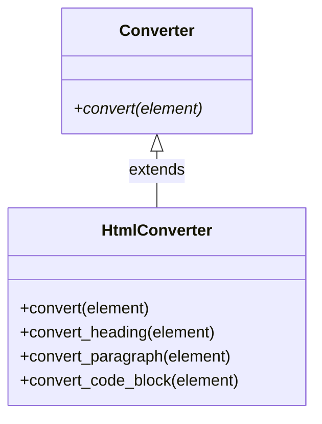

[@nqounet](https://x.com/nqounet)です。

前回は、if/elseによる変換処理が要素と出力形式の組み合わせで爆発的に増えてしまう問題を体験しました。今回は、この問題を解決するために変換処理を別のクラスに分離していきます。

## このシリーズについて

このシリーズは「Mooで覚えるオブジェクト指向プログラミング」シリーズを読了した方を対象に、実践的なドキュメント変換ツールを作りながらオブジェクト指向設計を深く学ぶシリーズです。



## 変換処理をクラスにする


まず、変換処理を担当する「Converter」クラスを作成しましょう。

```perl
package Converter;
# 言語: perl
# バージョン: 5.36以上
# 依存: Moo

use Moo;
use experimental qw(signatures);

sub convert ($self, $element) {
    die "convert must be implemented by subclass";
}

1;
```

これが基底クラスです。実際の変換処理はサブクラスで実装します。

## HtmlConverterを作る

HTML変換を担当するクラスを作成しましょう。

```perl
package HtmlConverter;
# 言語: perl
# バージョン: 5.36以上
# 依存: Moo, Converter

use Moo;
use experimental qw(signatures);
extends 'Converter';

sub convert ($self, $element) {
    my $type = $element->type;
    
    if ($type eq 'heading') {
        return $self->convert_heading($element);
    }
    elsif ($type eq 'paragraph') {
        return $self->convert_paragraph($element);
    }
    elsif ($type eq 'code_block') {
        return $self->convert_code_block($element);
    }
    else {
        return $element->content;
    }
}

sub convert_heading ($self, $element) {
    my $level = $element->level;
    return "<h$level>" . $element->content . "</h$level>";
}

sub convert_paragraph ($self, $element) {
    return "<p>" . $element->content . "</p>";
}

sub convert_code_block ($self, $element) {
    my $lang = $element->language;
    if ($lang) {
        return "<pre><code class=\"language-$lang\">" 
               . $element->content 
               . "</code></pre>";
    }
    return "<pre><code>" . $element->content . "</code></pre>";
}

1;
```

変換処理がHtmlConverterクラスに集約されました。

## 使ってみよう

````perl
#!/usr/bin/env perl
use v5.36;
use lib '.';
use Parser;
use HtmlConverter;

my $markdown = <<'MARKDOWN';
# タイトル

これは段落です。

```perl
my $x = 1;
```
MARKDOWN

my $parser = Parser->new();
my @elements = $parser->parse($markdown);

my $converter = HtmlConverter->new();

say "=== HTML出力 ===";
for my $elem (@elements) {
    say $converter->convert($elem);
}
````

実行結果:

```
=== HTML出力 ===
<h1>タイトル</h1>
<p>これは段落です。</p>
<pre><code class="language-perl">my $x = 1;
</code></pre>
```

前回と同じ結果が得られました。

## 何が変わった？

クラス構造を図にしてみましょう。



変換処理が独立したクラスになりました。これにより、以下のメリットがあります。

- 変換処理の追加が容易（新しいConverterサブクラスを追加するだけ）
- HTML変換のロジックがHtmlConverterに集約されている
- テストが書きやすい（HtmlConverterだけをテストできる）

## でもまだ問題がある

よく見ると、HtmlConverterのconvertメソッド内でまだif/elseを使っています。

```perl
sub convert ($self, $element) {
    my $type = $element->type;
    
    if ($type eq 'heading') {
        return $self->convert_heading($element);
    }
    elsif ($type eq 'paragraph') {
        # ...
    }
    # まだif/elseがある！
}
```

新しい要素を追加するたびに、HtmlConverterのconvertメソッドを修正する必要があります。OCPの問題は依然として残っています。

## 今回のポイント

今回は以下のことを学びました。

- 変換処理を専用のクラス（Converter）に分離
- HtmlConverterで具体的な変換処理を実装
- クラスに分離することで責任が明確になる

ただし、convertメソッド内のif/elseはまだ残っています。次回は、この問題を根本的に解決する方法を探ります。

## 今回の完成コード

以下が今回作成したコードの完成版です。

````perl
#!/usr/bin/env perl
# 言語: perl
# バージョン: 5.36以上
# 依存: Moo

use v5.36;

# === Element（基底クラス） ===
package Element {
    use Moo;
    use experimental qw(signatures);

    has content => (
        is       => 'ro',
        required => 1,
    );

    sub type ($self) {
        return 'element';
    }
}

# === Paragraph ===
package Paragraph {
    use Moo;
    use experimental qw(signatures);
    extends 'Element';

    sub type ($self) {
        return 'paragraph';
    }
}

# === Heading ===
package Heading {
    use Moo;
    use experimental qw(signatures);
    extends 'Element';

    has level => (
        is      => 'ro',
        default => 1,
    );

    sub type ($self) {
        return 'heading';
    }
}

# === CodeBlock ===
package CodeBlock {
    use Moo;
    use experimental qw(signatures);
    extends 'Element';

    has language => (
        is      => 'ro',
        default => '',
    );

    sub type ($self) {
        return 'code_block';
    }
}

# === Parser ===
package Parser {
    use Moo;
    use experimental qw(signatures);

    sub parse ($self, $text) {
        my @elements;
        my @lines = split /\n/, $text;
        
        my $in_code_block = 0;
        my $code_content = '';
        my $code_lang = '';
        
        for my $line (@lines) {
            if ($line =~ /^```(\w*)/) {
                if ($in_code_block) {
                    push @elements, CodeBlock->new(
                        content  => $code_content,
                        language => $code_lang,
                    );
                    $code_content = '';
                    $code_lang = '';
                    $in_code_block = 0;
                } else {
                    $code_lang = $1 // '';
                    $in_code_block = 1;
                }
                next;
            }
            
            if ($in_code_block) {
                $code_content .= $line . "\n";
                next;
            }
            
            next if $line =~ /^\s*$/;
            
            if ($line =~ /^(#+)\s+(.+)/) {
                my $level = length($1);
                my $content = $2;
                push @elements, Heading->new(
                    content => $content,
                    level   => $level,
                );
                next;
            }
            
            push @elements, Paragraph->new(content => $line);
        }
        
        return @elements;
    }
}

# === Converter（基底クラス） ===
package Converter {
    use Moo;
    use experimental qw(signatures);

    sub convert ($self, $element) {
        die "convert must be implemented by subclass";
    }
}

# === HtmlConverter ===
package HtmlConverter {
    use Moo;
    use experimental qw(signatures);
    extends 'Converter';

    sub convert ($self, $element) {
        my $type = $element->type;
        
        if ($type eq 'heading') {
            return $self->convert_heading($element);
        }
        elsif ($type eq 'paragraph') {
            return $self->convert_paragraph($element);
        }
        elsif ($type eq 'code_block') {
            return $self->convert_code_block($element);
        }
        else {
            return $element->content;
        }
    }

    sub convert_heading ($self, $element) {
        my $level = $element->level;
        return "<h$level>" . $element->content . "</h$level>";
    }

    sub convert_paragraph ($self, $element) {
        return "<p>" . $element->content . "</p>";
    }

    sub convert_code_block ($self, $element) {
        my $lang = $element->language;
        if ($lang) {
            return "<pre><code class=\"language-$lang\">" 
                   . $element->content 
                   . "</code></pre>";
        }
        return "<pre><code>" . $element->content . "</code></pre>";
    }
}

# === メイン処理 ===
package main {
    my $markdown = <<'MARKDOWN';
# タイトル

これは段落です。

```perl
my $x = 1;
```
MARKDOWN

    my $parser = Parser->new();
    my @elements = $parser->parse($markdown);

    my $converter = HtmlConverter->new();

    say "=== HTML出力 ===";
    for my $elem (@elements) {
        say $converter->convert($elem);
    }
}
````

## 次回予告

次回は、残っているif/elseを完全に排除する方法を探ります。「要素自身が変換方法を決める」という発想で、acceptメソッドとvisit_*メソッドの仕組みを導入しましょう。この仕組みは「Double Dispatch（二重ディスパッチ）」と呼ばれるテクニックです。

お楽しみに！
