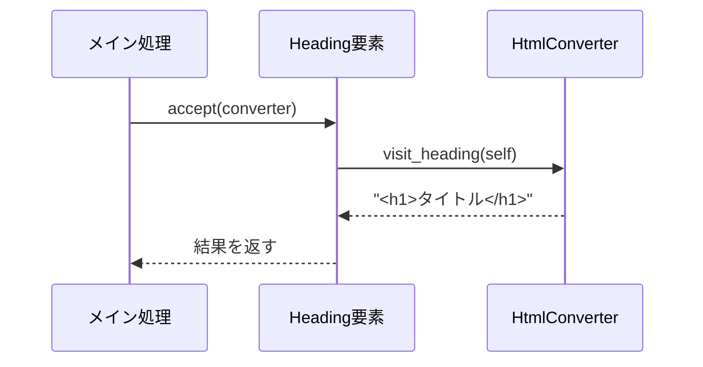

[@nqounet](https://x.com/nqounet)です。

前回は、変換処理をConverterクラスに分離しました。でも、convertメソッド内にはまだif/elseが残っています。今回は、このif/elseを完全に排除する方法を考えてみましょう。

## このシリーズについて

このシリーズは「Mooで覚えるオブジェクト指向プログラミング」シリーズを読了した方を対象に、実践的なドキュメント変換ツールを作りながらオブジェクト指向設計を深く学ぶシリーズです。



## 発想の転換


今までのアプローチでは、Converter側が「この要素はどのタイプか？」を判断していました。

```perl
# Converter側が判断している
sub convert ($self, $element) {
    my $type = $element->type;
    if ($type eq 'heading') { ... }  # Converterが判断
    elsif ($type eq 'paragraph') { ... }
}
```

これを逆にして、要素側が「私はこうやって変換してね」とConverter側に伝えるようにしたらどうでしょう？

## acceptメソッドを導入する

各要素クラスにacceptメソッドを追加します。このメソッドは、渡されたConverterに「私を訪問して（visit）」と伝えます。

```perl
package Element {
    use Moo;
    use experimental qw(signatures);

    has content => (
        is       => 'ro',
        required => 1,
    );

    sub accept ($self, $visitor) {
        die "accept must be implemented by subclass";
    }
}
```

そして、各サブクラスでacceptを実装します。

```perl
package Paragraph {
    use Moo;
    use experimental qw(signatures);
    extends 'Element';

    sub accept ($self, $visitor) {
        return $visitor->visit_paragraph($self);
    }
}

package Heading {
    use Moo;
    use experimental qw(signatures);
    extends 'Element';

    has level => (
        is      => 'ro',
        default => 1,
    );

    sub accept ($self, $visitor) {
        return $visitor->visit_heading($self);
    }
}

package CodeBlock {
    use Moo;
    use experimental qw(signatures);
    extends 'Element';

    has language => (
        is      => 'ro',
        default => '',
    );

    sub accept ($self, $visitor) {
        return $visitor->visit_code_block($self);
    }
}
```

各クラスが「私を訪問するときはvisit_paragraphを呼んで」「私はvisit_headingを呼んで」と自分で決めています。

## HtmlConverterにvisit_*メソッドを追加

Converter側では、各要素タイプに対応するvisit_*メソッドを用意します。

```perl
package HtmlConverter {
    use Moo;
    use experimental qw(signatures);

    sub visit_heading ($self, $element) {
        my $level = $element->level;
        return "<h$level>" . $element->content . "</h$level>";
    }

    sub visit_paragraph ($self, $element) {
        return "<p>" . $element->content . "</p>";
    }

    sub visit_code_block ($self, $element) {
        my $lang = $element->language;
        if ($lang) {
            return "<pre><code class=\"language-$lang\">" 
                   . $element->content 
                   . "</code></pre>";
        }
        return "<pre><code>" . $element->content . "</code></pre>";
    }
}
```

if/elseがなくなりました！

## 処理の流れを理解する

この仕組みがどう動くか、図で確認しましょう。



1. メイン処理が要素のacceptメソッドを呼ぶ
2. 要素が「私はHeadingなので、visit_headingを呼んで」とConverterに伝える
3. Converterのvisit_headingが実行される

これを「Double Dispatch（二重ディスパッチ）」と呼びます。処理の決定が2回行われるからです。

1. 最初のディスパッチ: element.acceptの呼び出し（どの要素か）
2. 2番目のディスパッチ: visitor.visit_xxxの呼び出し（どのvisitor＋どの要素か）

## 動かしてみよう

```perl
#!/usr/bin/env perl
use v5.36;
use lib '.';

# （クラス定義は省略）

my $markdown = <<'MARKDOWN';
# タイトル

これは段落です。

```perl
my $x = 1;
```
MARKDOWN

my $parser = Parser->new();
my @elements = $parser->parse($markdown);

my $converter = HtmlConverter->new();

say "=== HTML出力（acceptを使用） ===";
for my $elem (@elements) {
    say $elem->accept($converter);  # 要素にconverterを渡す
}
```

実行結果:

```
=== HTML出力（acceptを使用） ===
<h1>タイトル</h1>
<p>これは段落です。</p>
<pre><code class="language-perl">my $x = 1;
</code></pre>
```

前回と同じ結果が得られました。

## 何が嬉しいのか

この設計の最大のメリットは、新しい要素を追加してもConverterのconvertメソッドを修正する必要がないことです。

例えば、Blockquote要素を追加する場合:

```perl
package Blockquote {
    use Moo;
    extends 'Element';

    sub accept ($self, $visitor) {
        return $visitor->visit_blockquote($self);
    }
}
```

そしてHtmlConverterにvisit_blockquoteを追加するだけ:

```perl
sub visit_blockquote ($self, $element) {
    return "<blockquote>" . $element->content . "</blockquote>";
}
```

if/elseの塊を修正する必要がありません。

## 今回のポイント

今回は以下のことを学びました。

- acceptメソッドで要素が「訪問者」を受け入れる
- visit_*メソッドで各要素タイプの処理を実装
- Double Dispatch（二重ディスパッチ）の仕組み
- if/elseを完全に排除できた

## 今回の完成コード

以下が今回作成したコードの完成版です。

```perl
#!/usr/bin/env perl
# 言語: perl
# バージョン: 5.36以上
# 依存: Moo

use v5.36;

# === Element（基底クラス） ===
package Element {
    use Moo;
    use experimental qw(signatures);

    has content => (
        is       => 'ro',
        required => 1,
    );

    sub accept ($self, $visitor) {
        die "accept must be implemented by subclass";
    }
}

# === Paragraph ===
package Paragraph {
    use Moo;
    use experimental qw(signatures);
    extends 'Element';

    sub accept ($self, $visitor) {
        return $visitor->visit_paragraph($self);
    }
}

# === Heading ===
package Heading {
    use Moo;
    use experimental qw(signatures);
    extends 'Element';

    has level => (
        is      => 'ro',
        default => 1,
    );

    sub accept ($self, $visitor) {
        return $visitor->visit_heading($self);
    }
}

# === CodeBlock ===
package CodeBlock {
    use Moo;
    use experimental qw(signatures);
    extends 'Element';

    has language => (
        is      => 'ro',
        default => '',
    );

    sub accept ($self, $visitor) {
        return $visitor->visit_code_block($self);
    }
}

# === Parser ===
package Parser {
    use Moo;
    use experimental qw(signatures);

    sub parse ($self, $text) {
        my @elements;
        my @lines = split /\n/, $text;
        
        my $in_code_block = 0;
        my $code_content = '';
        my $code_lang = '';
        
        for my $line (@lines) {
            if ($line =~ /^```(\w*)/) {
                if ($in_code_block) {
                    push @elements, CodeBlock->new(
                        content  => $code_content,
                        language => $code_lang,
                    );
                    $code_content = '';
                    $code_lang = '';
                    $in_code_block = 0;
                } else {
                    $code_lang = $1 // '';
                    $in_code_block = 1;
                }
                next;
            }
            
            if ($in_code_block) {
                $code_content .= $line . "\n";
                next;
            }
            
            next if $line =~ /^\s*$/;
            
            if ($line =~ /^(#+)\s+(.+)/) {
                my $level = length($1);
                my $content = $2;
                push @elements, Heading->new(
                    content => $content,
                    level   => $level,
                );
                next;
            }
            
            push @elements, Paragraph->new(content => $line);
        }
        
        return @elements;
    }
}

# === HtmlConverter ===
package HtmlConverter {
    use Moo;
    use experimental qw(signatures);

    sub visit_heading ($self, $element) {
        my $level = $element->level;
        return "<h$level>" . $element->content . "</h$level>";
    }

    sub visit_paragraph ($self, $element) {
        return "<p>" . $element->content . "</p>";
    }

    sub visit_code_block ($self, $element) {
        my $lang = $element->language;
        if ($lang) {
            return "<pre><code class=\"language-$lang\">" 
                   . $element->content 
                   . "</code></pre>";
        }
        return "<pre><code>" . $element->content . "</code></pre>";
    }
}

# === メイン処理 ===
package main {
    my $markdown = <<'MARKDOWN';
# タイトル

これは段落です。

```perl
my $x = 1;
```
MARKDOWN

    my $parser = Parser->new();
    my @elements = $parser->parse($markdown);

    my $converter = HtmlConverter->new();

    say "=== HTML出力（acceptを使用） ===";
    for my $elem (@elements) {
        say $elem->accept($converter);
    }
}
```

## 次回予告

次回は、この仕組みの真価を発揮します。HtmlConverterだけでなく、TextConverterを追加してみましょう。既存のコードをほとんど変更せずに、新しい出力形式を追加できることを体験します。これがOCP（開放閉鎖の原則）の実践です。

お楽しみに！
