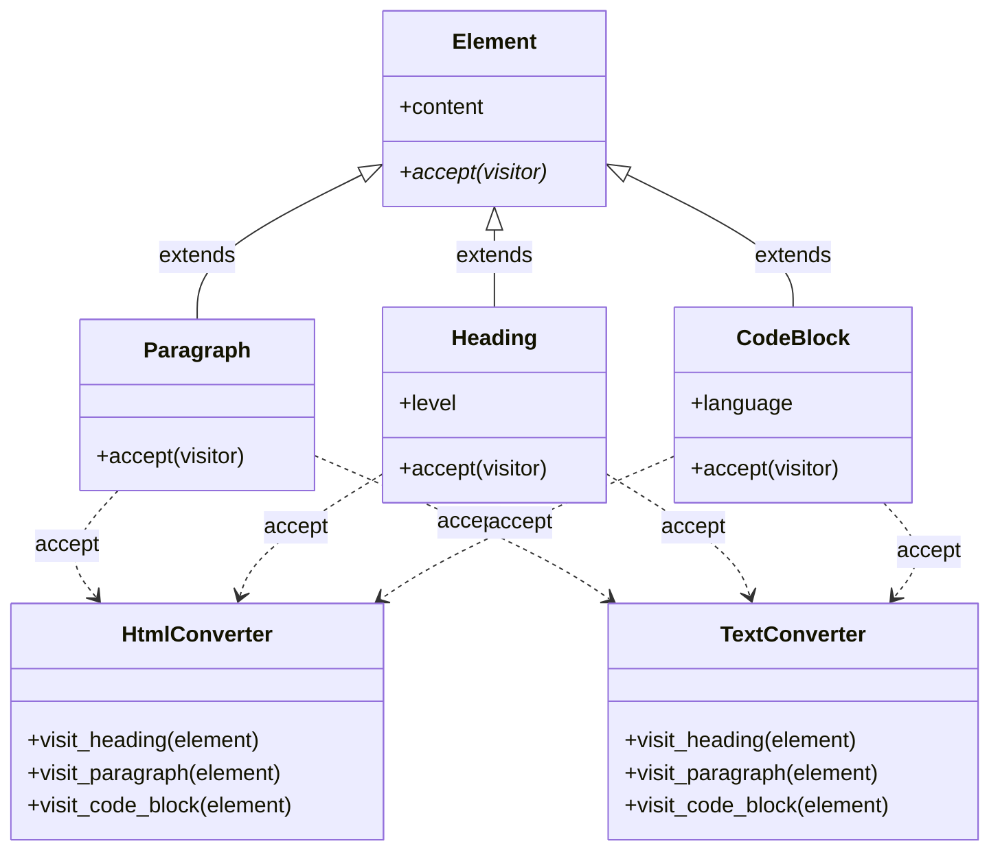

[@nqounet](https://x.com/nqounet)です。

前回は、acceptメソッドとvisit_*メソッドを使った「Double Dispatch」の仕組みを導入しました。今回は、この設計の真価を発揮します。新しい出力形式を追加してみましょう。

## このシリーズについて

このシリーズは「Mooで覚えるオブジェクト指向プログラミング」シリーズを読了した方を対象に、実践的なドキュメント変換ツールを作りながらオブジェクト指向設計を深く学ぶシリーズです。



## TextConverterを追加する


Markdownをプレーンテキストに変換するTextConverterを作成しましょう。

```perl
package TextConverter;
# 言語: perl
# バージョン: 5.36以上
# 依存: Moo

use Moo;
use experimental qw(signatures);

sub visit_heading ($self, $element) {
    my $level = $element->level;
    my $prefix = "=" x (7 - $level);  # h1 = ======, h2 = =====, ...
    return "$prefix " . $element->content;
}

sub visit_paragraph ($self, $element) {
    return $element->content;
}

sub visit_code_block ($self, $element) {
    my $content = $element->content;
    $content =~ s/\n$//;  # 末尾の改行を削除
    return "---\n" . $content . "\n---";
}

1;
```

これだけです。

## 既存のコードを変更したか？

確認してみましょう。

| クラス | 変更あり？ |
|-------|----------|
| Element | なし |
| Paragraph | なし |
| Heading | なし |
| CodeBlock | なし |
| Parser | なし |
| HtmlConverter | なし |
| TextConverter | 新規追加 |

既存のコードを一切変更せずに、新しい機能（テキスト変換）を追加できました。これがOCP（開放閉鎖の原則）です。

## 使ってみよう

````perl
#!/usr/bin/env perl
use v5.36;
use lib '.';
use Parser;
use HtmlConverter;
use TextConverter;

my $markdown = <<'MARKDOWN';
# タイトル

これは段落です。

## サブタイトル

```perl
my $x = 1;
```

最後の段落です。
MARKDOWN

my $parser = Parser->new();
my @elements = $parser->parse($markdown);

my $html_converter = HtmlConverter->new();
my $text_converter = TextConverter->new();

say "=== HTML出力 ===";
for my $elem (@elements) {
    say $elem->accept($html_converter);
}

say "\n=== テキスト出力 ===";
for my $elem (@elements) {
    say $elem->accept($text_converter);
}
````

実行結果:

```
=== HTML出力 ===
<h1>タイトル</h1>
<p>これは段落です。</p>
<h2>サブタイトル</h2>
<pre><code class="language-perl">my $x = 1;
</code></pre>
<p>最後の段落です。</p>

=== テキスト出力 ===
====== タイトル
これは段落です。
===== サブタイトル
---
my $x = 1;
---
最後の段落です。
```

同じ要素に対して、異なる変換結果が得られています。

## クラス構造を確認

現在のクラス構造を図にしてみましょう。



要素クラス（左側）と変換クラス（右側）が分離されていて、組み合わせ自由になっています。

## if/elseアプローチとの比較

第3回で見たif/elseアプローチと比較してみましょう。

### if/elseアプローチで出力形式を追加する場合

```perl
# 新しい関数を追加
sub to_text ($element) {
    my $type = $element->type;
    
    if ($type eq 'heading') { ... }
    elsif ($type eq 'paragraph') { ... }
    elsif ($type eq 'code_block') { ... }
    # すべての要素タイプに対応する分岐が必要
}
```

### 今回のアプローチで出力形式を追加する場合

```perl
# 新しいクラスを追加するだけ
package TextConverter {
    sub visit_heading { ... }
    sub visit_paragraph { ... }
    sub visit_code_block { ... }
}
```

今回のアプローチの方が、以下の点で優れています。

- 既存のコードを変更しない（バグを入れるリスクがない）
- 新機能が1つのクラスに集約されている（保守しやすい）
- テストが書きやすい（TextConverterだけをテストできる）

## 今回のポイント

今回は以下のことを学びました。

- TextConverterの追加で新しい出力形式を実現
- 既存コードを変更せずに機能拡張（OCP）
- 要素と変換処理の組み合わせが自由自在

## 今回の完成コード

以下が今回作成したコードの完成版です。

````perl
#!/usr/bin/env perl
# 言語: perl
# バージョン: 5.36以上
# 依存: Moo

use v5.36;

# === Element（基底クラス） ===
package Element {
    use Moo;
    use experimental qw(signatures);

    has content => (
        is       => 'ro',
        required => 1,
    );

    sub accept ($self, $visitor) {
        die "accept must be implemented by subclass";
    }
}

# === Paragraph ===
package Paragraph {
    use Moo;
    use experimental qw(signatures);
    extends 'Element';

    sub accept ($self, $visitor) {
        return $visitor->visit_paragraph($self);
    }
}

# === Heading ===
package Heading {
    use Moo;
    use experimental qw(signatures);
    extends 'Element';

    has level => (
        is      => 'ro',
        default => 1,
    );

    sub accept ($self, $visitor) {
        return $visitor->visit_heading($self);
    }
}

# === CodeBlock ===
package CodeBlock {
    use Moo;
    use experimental qw(signatures);
    extends 'Element';

    has language => (
        is      => 'ro',
        default => '',
    );

    sub accept ($self, $visitor) {
        return $visitor->visit_code_block($self);
    }
}

# === Parser ===
package Parser {
    use Moo;
    use experimental qw(signatures);

    sub parse ($self, $text) {
        my @elements;
        my @lines = split /\n/, $text;
        
        my $in_code_block = 0;
        my $code_content = '';
        my $code_lang = '';
        
        for my $line (@lines) {
            if ($line =~ /^```(\w*)/) {
                if ($in_code_block) {
                    push @elements, CodeBlock->new(
                        content  => $code_content,
                        language => $code_lang,
                    );
                    $code_content = '';
                    $code_lang = '';
                    $in_code_block = 0;
                } else {
                    $code_lang = $1 // '';
                    $in_code_block = 1;
                }
                next;
            }
            
            if ($in_code_block) {
                $code_content .= $line . "\n";
                next;
            }
            
            next if $line =~ /^\s*$/;
            
            if ($line =~ /^(#+)\s+(.+)/) {
                my $level = length($1);
                my $content = $2;
                push @elements, Heading->new(
                    content => $content,
                    level   => $level,
                );
                next;
            }
            
            push @elements, Paragraph->new(content => $line);
        }
        
        return @elements;
    }
}

# === HtmlConverter ===
package HtmlConverter {
    use Moo;
    use experimental qw(signatures);

    sub visit_heading ($self, $element) {
        my $level = $element->level;
        return "<h$level>" . $element->content . "</h$level>";
    }

    sub visit_paragraph ($self, $element) {
        return "<p>" . $element->content . "</p>";
    }

    sub visit_code_block ($self, $element) {
        my $lang = $element->language;
        if ($lang) {
            return "<pre><code class=\"language-$lang\">" 
                   . $element->content 
                   . "</code></pre>";
        }
        return "<pre><code>" . $element->content . "</code></pre>";
    }
}

# === TextConverter ===
package TextConverter {
    use Moo;
    use experimental qw(signatures);

    sub visit_heading ($self, $element) {
        my $level = $element->level;
        my $prefix = "=" x (7 - $level);
        return "$prefix " . $element->content;
    }

    sub visit_paragraph ($self, $element) {
        return $element->content;
    }

    sub visit_code_block ($self, $element) {
        my $content = $element->content;
        $content =~ s/\n$//;
        return "---\n" . $content . "\n---";
    }
}

# === メイン処理 ===
package main {
    my $markdown = <<'MARKDOWN';
# タイトル

これは段落です。

## サブタイトル

```perl
my $x = 1;
```

最後の段落です。
MARKDOWN

    my $parser = Parser->new();
    my @elements = $parser->parse($markdown);

    my $html_converter = HtmlConverter->new();
    my $text_converter = TextConverter->new();

    say "=== HTML出力 ===";
    for my $elem (@elements) {
        say $elem->accept($html_converter);
    }

    say "\n=== テキスト出力 ===";
    for my $elem (@elements) {
        say $elem->accept($text_converter);
    }
}
````

## 次回予告

次回は、さらに別の種類の操作を追加します。変換だけでなく、「単語数カウント」や「リンク抽出」といった分析系の操作も、同じ仕組みで追加できることを確認しましょう。複数のVisitorが共存する世界を体験します。

お楽しみに！
