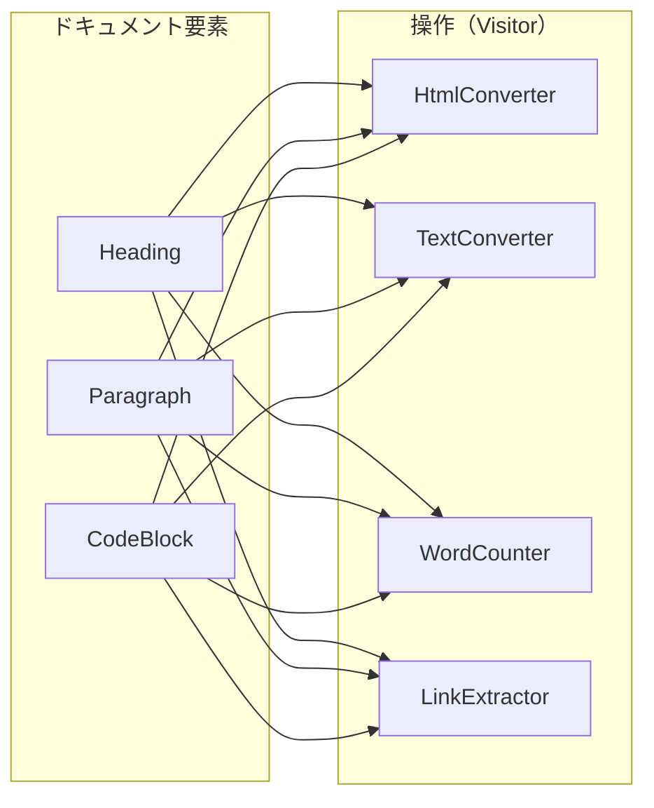

[@nqounet](https://x.com/nqounet)です。

前回は、TextConverterを追加して、OCP（開放閉鎖の原則）を体験しました。今回は、変換以外の操作も追加してみましょう。

## このシリーズについて

このシリーズは「Mooで覚えるオブジェクト指向プログラミング」シリーズを読了した方を対象に、実践的なドキュメント変換ツールを作りながらオブジェクト指向設計を深く学ぶシリーズです。



## 変換だけじゃない


これまでは「変換」操作（HTML変換、テキスト変換）を追加してきました。でも、ドキュメントに対して行いたい操作は変換だけではありません。

- 単語数をカウントしたい
- リンクを抽出したい
- 見出しだけを抜き出して目次を作りたい

こうした「分析」操作も、同じ仕組みで追加できます。

## WordCounterを作る

まず、ドキュメント全体の単語数（日本語の場合は文字数）をカウントするVisitorを作りましょう。

```perl
package WordCounter;
# 言語: perl
# バージョン: 5.36以上
# 依存: Moo

use Moo;
use experimental qw(signatures);

has total_chars => (
    is      => 'rw',
    default => 0,
);

sub visit_heading ($self, $element) {
    my $chars = length($element->content);
    $self->total_chars($self->total_chars + $chars);
    return $chars;
}

sub visit_paragraph ($self, $element) {
    my $chars = length($element->content);
    $self->total_chars($self->total_chars + $chars);
    return $chars;
}

sub visit_code_block ($self, $element) {
    # コードブロックは文字数に含めない
    return 0;
}

sub get_total ($self) {
    return $self->total_chars;
}

1;
```

このVisitorは、各要素を訪問するたびに文字数を累積していきます。

注意: 今回は「単語数」ではなく「文字数」をカウントしています。英語の単語数などを正確に数えるには、トークナイズのルールが別途必要です。

## LinkExtractorを作る

次に、ドキュメント内のリンク（URLっぽい文字列）を抽出するVisitorを作りましょう。

```perl
package LinkExtractor;
# 言語: perl
# バージョン: 5.36以上
# 依存: Moo

use Moo;
use experimental qw(signatures);

has links => (
    is      => 'rw',
    default => sub { [] },
);

sub visit_heading ($self, $element) {
    $self->_extract_links($element->content);
    return;
}

sub visit_paragraph ($self, $element) {
    $self->_extract_links($element->content);
    return;
}

sub visit_code_block ($self, $element) {
    # コードブロック内のURLは無視
    return;
}

sub _extract_links ($self, $text) {
    # URLっぽい文字列を抽出
    while ($text =~ m{(https?://[^\s<>\"]+)}g) {
        push $self->links->@*, $1;
    }
}

sub get_links ($self) {
    return $self->links->@*;
}

1;
```

このVisitorは、テキスト内からURLパターンにマッチする文字列を抽出していきます。

注意: ここでは「URLっぽい文字列」を正規表現で拾っているだけで、Markdownのリンク記法（`[text](url)`）を厳密に解析しているわけではありません。必要に応じてパーサー側の強化を検討してください。

## 使ってみよう

複数のVisitorを同じドキュメントに適用してみましょう。

```perl
#!/usr/bin/env perl
use v5.36;
use lib '.';
use Parser;
use HtmlConverter;
use TextConverter;
use WordCounter;
use LinkExtractor;

my $markdown = <<'MARKDOWN';
# ドキュメント変換ツール

このツールはMarkdownをHTMLに変換できます。
詳細は https://example.com/docs を参照してください。

## 使い方

公式サイト https://example.com からダウンロードできます。

```perl
my $parser = Parser->new();
```

上記のコードで使えます。
MARKDOWN

my $parser = Parser->new();
my @elements = $parser->parse($markdown);

# 文字数カウント
my $counter = WordCounter->new();
for my $elem (@elements) {
    $elem->accept($counter);
}

# リンク抽出
my $extractor = LinkExtractor->new();
for my $elem (@elements) {
    $elem->accept($extractor);
}

say "=== 文字数 ===";
say "総文字数: " . $counter->get_total . " 文字";

say "\n=== 抽出されたリンク ===";
for my $link ($extractor->get_links) {
    say "  - $link";
}
```

実行結果:

```
=== 文字数 ===
総文字数: 122 文字

=== 抽出されたリンク ===
  - https://example.com/docs
  - https://example.com
```

## 3種類のVisitorが共存している

現在、以下のVisitorが同じ要素構造に対して動作しています。



要素クラスを変更することなく、新しい操作をいくらでも追加できます。

## 各Visitorの役割まとめ

| Visitor | 役割 | 状態の保持 |
|---------|------|----------|
| HtmlConverter | HTML変換 | なし |
| TextConverter | テキスト変換 | なし |
| WordCounter | 文字数カウント | total_chars |
| LinkExtractor | リンク抽出 | links |

ConverterはStateless（状態なし）で、CounterやExtractorはStateful（状態あり）です。どちらのパターンも同じ仕組みで実現できています。

## 今回のポイント

今回は以下のことを学びました。

- 変換以外の操作（分析）も同じ仕組みで追加できる
- 状態を持つVisitor（カウンター、コレクター）の実装
- 複数のVisitorが同じ要素構造に対して動作できる

## 今回の完成コード

以下が今回作成したコードの完成版です。

```perl
#!/usr/bin/env perl
# 言語: perl
# バージョン: 5.36以上
# 依存: Moo

use v5.36;

# === Element（基底クラス） ===
package Element {
    use Moo;
    use experimental qw(signatures);

    has content => (
        is       => 'ro',
        required => 1,
    );

    sub accept ($self, $visitor) {
        die "accept must be implemented by subclass";
    }
}

# === Paragraph ===
package Paragraph {
    use Moo;
    use experimental qw(signatures);
    extends 'Element';

    sub accept ($self, $visitor) {
        return $visitor->visit_paragraph($self);
    }
}

# === Heading ===
package Heading {
    use Moo;
    use experimental qw(signatures);
    extends 'Element';

    has level => (
        is      => 'ro',
        default => 1,
    );

    sub accept ($self, $visitor) {
        return $visitor->visit_heading($self);
    }
}

# === CodeBlock ===
package CodeBlock {
    use Moo;
    use experimental qw(signatures);
    extends 'Element';

    has language => (
        is      => 'ro',
        default => '',
    );

    sub accept ($self, $visitor) {
        return $visitor->visit_code_block($self);
    }
}

# === Parser ===
package Parser {
    use Moo;
    use experimental qw(signatures);

    sub parse ($self, $text) {
        my @elements;
        my @lines = split /\n/, $text;
        
        my $in_code_block = 0;
        my $code_content = '';
        my $code_lang = '';
        
        for my $line (@lines) {
            if ($line =~ /^```(\w*)/) {
                if ($in_code_block) {
                    push @elements, CodeBlock->new(
                        content  => $code_content,
                        language => $code_lang,
                    );
                    $code_content = '';
                    $code_lang = '';
                    $in_code_block = 0;
                } else {
                    $code_lang = $1 // '';
                    $in_code_block = 1;
                }
                next;
            }
            
            if ($in_code_block) {
                $code_content .= $line . "\n";
                next;
            }
            
            next if $line =~ /^\s*$/;
            
            if ($line =~ /^(#+)\s+(.+)/) {
                my $level = length($1);
                my $content = $2;
                push @elements, Heading->new(
                    content => $content,
                    level   => $level,
                );
                next;
            }
            
            push @elements, Paragraph->new(content => $line);
        }
        
        return @elements;
    }
}

# === HtmlConverter ===
package HtmlConverter {
    use Moo;
    use experimental qw(signatures);

    sub visit_heading ($self, $element) {
        my $level = $element->level;
        return "<h$level>" . $element->content . "</h$level>";
    }

    sub visit_paragraph ($self, $element) {
        return "<p>" . $element->content . "</p>";
    }

    sub visit_code_block ($self, $element) {
        my $lang = $element->language;
        if ($lang) {
            return "<pre><code class=\"language-$lang\">" 
                   . $element->content 
                   . "</code></pre>";
        }
        return "<pre><code>" . $element->content . "</code></pre>";
    }
}

# === TextConverter ===
package TextConverter {
    use Moo;
    use experimental qw(signatures);

    sub visit_heading ($self, $element) {
        my $level = $element->level;
        my $prefix = "=" x (7 - $level);
        return "$prefix " . $element->content;
    }

    sub visit_paragraph ($self, $element) {
        return $element->content;
    }

    sub visit_code_block ($self, $element) {
        my $content = $element->content;
        $content =~ s/\n$//;
        return "---\n" . $content . "\n---";
    }
}

# === WordCounter ===
package WordCounter {
    use Moo;
    use experimental qw(signatures);

    has total_chars => (
        is      => 'rw',
        default => 0,
    );

    sub visit_heading ($self, $element) {
        my $chars = length($element->content);
        $self->total_chars($self->total_chars + $chars);
        return $chars;
    }

    sub visit_paragraph ($self, $element) {
        my $chars = length($element->content);
        $self->total_chars($self->total_chars + $chars);
        return $chars;
    }

    sub visit_code_block ($self, $element) {
        return 0;
    }

    sub get_total ($self) {
        return $self->total_chars;
    }
}

# === LinkExtractor ===
package LinkExtractor {
    use Moo;
    use experimental qw(signatures);

    has links => (
        is      => 'rw',
        default => sub { [] },
    );

    sub visit_heading ($self, $element) {
        $self->_extract_links($element->content);
        return;
    }

    sub visit_paragraph ($self, $element) {
        $self->_extract_links($element->content);
        return;
    }

    sub visit_code_block ($self, $element) {
        return;
    }

    sub _extract_links ($self, $text) {
        while ($text =~ m{(https?://[^\s<>\"]+)}g) {
            push $self->links->@*, $1;
        }
    }

    sub get_links ($self) {
        return $self->links->@*;
    }
}

# === メイン処理 ===
package main {
    my $markdown = <<'MARKDOWN';
# ドキュメント変換ツール

このツールはMarkdownをHTMLに変換できます。
詳細は https://example.com/docs を参照してください。

## 使い方

公式サイト https://example.com からダウンロードできます。

```perl
my $parser = Parser->new();
```

上記のコードで使えます。
MARKDOWN

    my $parser = Parser->new();
    my @elements = $parser->parse($markdown);

    my $counter = WordCounter->new();
    for my $elem (@elements) {
        $elem->accept($counter);
    }

    my $extractor = LinkExtractor->new();
    for my $elem (@elements) {
        $elem->accept($extractor);
    }

    say "=== 文字数 ===";
    say "総文字数: " . $counter->get_total . " 文字";

    say "\n=== 抽出されたリンク ===";
    for my $link ($extractor->get_links) {
        say "  - $link";
    }
}
```

## 次回予告

最終回では、私たちがこのシリーズで作り上げてきたものの正体を明かします。実は、この設計は「Visitorパターン」という有名なデザインパターンだったのです！

パターンの正式な定義、構成要素の対応表、そしてこのパターンが威力を発揮する場面について解説します。

お楽しみに！
