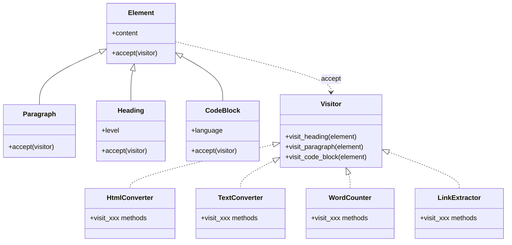
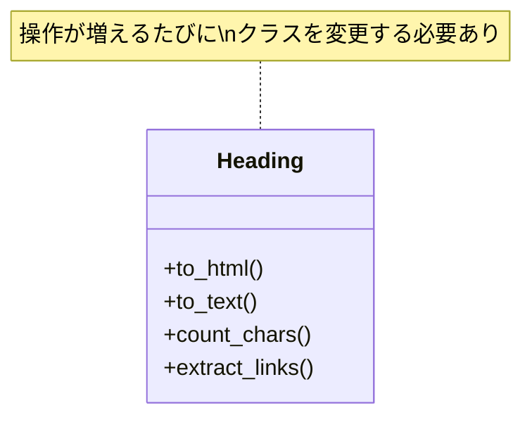
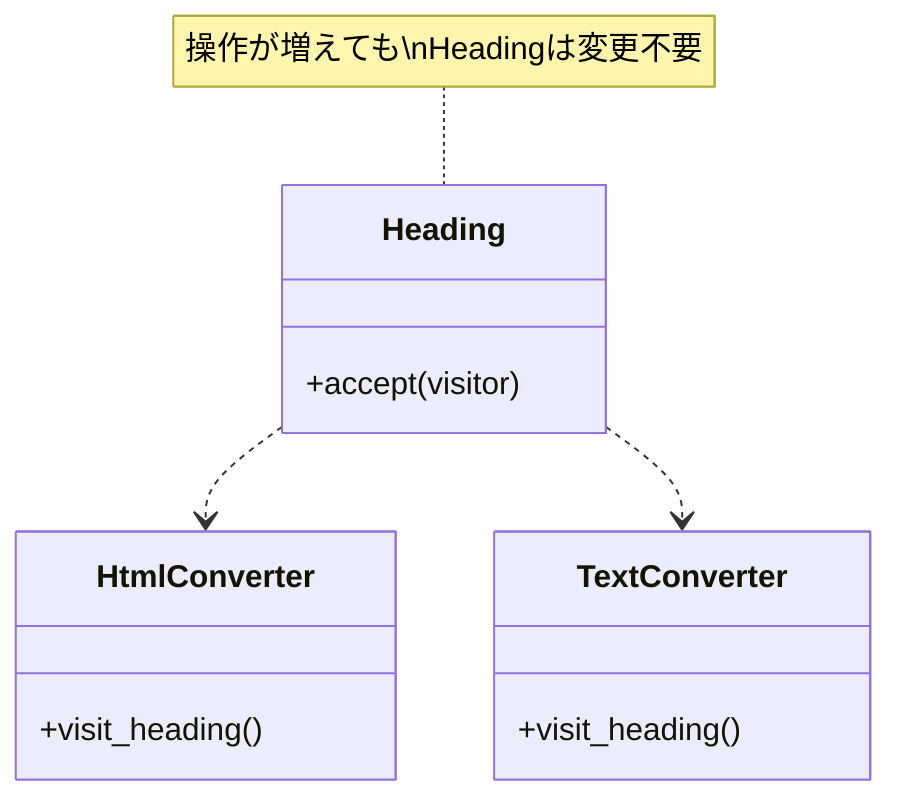

[@nqounet](https://x.com/nqounet)です。

いよいよ最終回です。このシリーズで私たちが作り上げてきた設計の正体を明かしましょう。

## このシリーズについて

このシリーズは「Mooで覚えるオブジェクト指向プログラミング」シリーズを読了した方を対象に、実践的なドキュメント変換ツールを作りながらオブジェクト指向設計を深く学ぶシリーズです。



## 振り返り：何を作ってきたか


シリーズを通して、以下のような構造を作ってきました。



これは「Visitorパターン」と呼ばれるデザインパターンです。

## Visitorパターンとは

GoF（Gang of Four）による定義:

> オブジェクト構造の要素に対して実行する操作を表現する。Visitorを使うことで、操作対象のクラスを変更することなく、新しい操作を定義できる。

私たちの実装に当てはめると:

| パターンの構成要素 | 私たちの実装 |
|------------------|-------------|
| Element（要素） | Element, Paragraph, Heading, CodeBlock |
| Visitor（訪問者） | HtmlConverter, TextConverter, WordCounter, LinkExtractor |
| accept() | 各要素クラスのacceptメソッド |
| visit() | visit_heading, visit_paragraph, visit_code_block |

## なぜVisitorパターンなのか

このパターンの本質は「操作の分離」です。

### 従来のアプローチ

```perl
# 要素クラス内に操作を定義
package Heading {
    sub to_html { ... }
    sub to_text { ... }
    sub count_chars { ... }
    # 操作が増えるたびにクラスを修正
}
```

要素に操作が密結合している:



### Visitorパターンのアプローチ

```perl
# 要素クラスはacceptのみ
package Heading {
    sub accept ($self, $visitor) {
        return $visitor->visit_heading($self);
    }
}

# 操作は別クラスで定義
package HtmlConverter {
    sub visit_heading { ... }
}
```

要素と操作が分離されている:



## Double Dispatch（二重ディスパッチ）

Visitorパターンの核心は「Double Dispatch」です。

```perl
$element->accept($visitor);
# 1回目のディスパッチ: どのacceptを呼ぶか（Heading? Paragraph?）

# accept内部で
$visitor->visit_heading($self);
# 2回目のディスパッチ: どのvisit_xxxを呼ぶか（HtmlConverter? TextConverter?）
```

2回のメソッド呼び出しにより、「要素の種類」と「操作の種類」の組み合わせで処理が決定されます。

## SOLID原則との関係

Visitorパターンは、SOLID原則のうち特に以下の2つを実現しています。

### SRP（単一責任の原則）

各Visitorクラスは1つの操作だけを担当します。

- HtmlConverter: HTML変換のみ
- WordCounter: 文字数カウントのみ
- LinkExtractor: リンク抽出のみ

### OCP（開放閉鎖の原則）

新しい操作を追加する場合、既存のコードを変更せずに拡張できます。

```perl
# 新しいVisitorを追加するだけ
package JsonExporter {
    sub visit_heading { ... }
    sub visit_paragraph { ... }
    sub visit_code_block { ... }
}
```

Element、Paragraph、Heading、CodeBlockは一切変更不要です。

## Visitorパターンが有効な場面

このパターンが力を発揮するのは:

1. オブジェクト構造（要素の種類）が安定している
2. 操作の種類が頻繁に追加される
3. 操作ごとにコードをまとめたい

今回のドキュメント変換ツールはまさにこの条件に当てはまります。

- 要素の種類（見出し、段落、コードブロック）は比較的安定
- 出力形式や分析処理は後からいくらでも追加したい

## Visitorパターンの注意点

逆に、このパターンが不向きな場面もあります。

1. 要素の種類が頻繁に変更される場合
   - 新しい要素を追加すると、全てのVisitorにvisit_xxxメソッドを追加する必要がある
2. オブジェクト構造が複雑でない場合
   - シンプルな構造なら、if/elseで十分な場合もある

## 完成したドキュメント変換ツール

シリーズを通して作成した完成版です。

```perl
#!/usr/bin/env perl
# 言語: perl
# バージョン: 5.36以上
# 依存: Moo

use v5.36;

# === Element（基底クラス） ===
package Element {
    use Moo;
    use experimental qw(signatures);

    has content => (
        is       => 'ro',
        required => 1,
    );

    sub accept ($self, $visitor) {
        die "accept must be implemented by subclass";
    }
}

# === Paragraph ===
package Paragraph {
    use Moo;
    use experimental qw(signatures);
    extends 'Element';

    sub accept ($self, $visitor) {
        return $visitor->visit_paragraph($self);
    }
}

# === Heading ===
package Heading {
    use Moo;
    use experimental qw(signatures);
    extends 'Element';

    has level => (
        is      => 'ro',
        default => 1,
    );

    sub accept ($self, $visitor) {
        return $visitor->visit_heading($self);
    }
}

# === CodeBlock ===
package CodeBlock {
    use Moo;
    use experimental qw(signatures);
    extends 'Element';

    has language => (
        is      => 'ro',
        default => '',
    );

    sub accept ($self, $visitor) {
        return $visitor->visit_code_block($self);
    }
}

# === Parser ===
package Parser {
    use Moo;
    use experimental qw(signatures);

    sub parse ($self, $text) {
        my @elements;
        my @lines = split /\n/, $text;
        
        my $in_code_block = 0;
        my $code_content = '';
        my $code_lang = '';
        
        for my $line (@lines) {
            if ($line =~ /^```(\w*)/) {
                if ($in_code_block) {
                    push @elements, CodeBlock->new(
                        content  => $code_content,
                        language => $code_lang,
                    );
                    $code_content = '';
                    $code_lang = '';
                    $in_code_block = 0;
                } else {
                    $code_lang = $1 // '';
                    $in_code_block = 1;
                }
                next;
            }
            
            if ($in_code_block) {
                $code_content .= $line . "\n";
                next;
            }
            
            next if $line =~ /^\s*$/;
            
            if ($line =~ /^(#+)\s+(.+)/) {
                my $level = length($1);
                my $content = $2;
                push @elements, Heading->new(
                    content => $content,
                    level   => $level,
                );
                next;
            }
            
            push @elements, Paragraph->new(content => $line);
        }
        
        return @elements;
    }
}

# === HtmlConverter ===
package HtmlConverter {
    use Moo;
    use experimental qw(signatures);

    sub visit_heading ($self, $element) {
        my $level = $element->level;
        return "<h$level>" . $element->content . "</h$level>";
    }

    sub visit_paragraph ($self, $element) {
        return "<p>" . $element->content . "</p>";
    }

    sub visit_code_block ($self, $element) {
        my $lang = $element->language;
        if ($lang) {
            return "<pre><code class=\"language-$lang\">" 
                   . $element->content 
                   . "</code></pre>";
        }
        return "<pre><code>" . $element->content . "</code></pre>";
    }
}

# === TextConverter ===
package TextConverter {
    use Moo;
    use experimental qw(signatures);

    sub visit_heading ($self, $element) {
        my $level = $element->level;
        my $prefix = "=" x (7 - $level);
        return "$prefix " . $element->content;
    }

    sub visit_paragraph ($self, $element) {
        return $element->content;
    }

    sub visit_code_block ($self, $element) {
        my $content = $element->content;
        $content =~ s/\n$//;
        return "---\n" . $content . "\n---";
    }
}

# === WordCounter ===
package WordCounter {
    use Moo;
    use experimental qw(signatures);

    has total_chars => (
        is      => 'rw',
        default => 0,
    );

    sub visit_heading ($self, $element) {
        my $chars = length($element->content);
        $self->total_chars($self->total_chars + $chars);
        return $chars;
    }

    sub visit_paragraph ($self, $element) {
        my $chars = length($element->content);
        $self->total_chars($self->total_chars + $chars);
        return $chars;
    }

    sub visit_code_block ($self, $element) {
        return 0;
    }

    sub get_total ($self) {
        return $self->total_chars;
    }
}

# === LinkExtractor ===
package LinkExtractor {
    use Moo;
    use experimental qw(signatures);

    has links => (
        is      => 'rw',
        default => sub { [] },
    );

    sub visit_heading ($self, $element) {
        $self->_extract_links($element->content);
        return;
    }

    sub visit_paragraph ($self, $element) {
        $self->_extract_links($element->content);
        return;
    }

    sub visit_code_block ($self, $element) {
        return;
    }

    sub _extract_links ($self, $text) {
        while ($text =~ m{(https?://[^\s<>\"]+)}g) {
            push $self->links->@*, $1;
        }
    }

    sub get_links ($self) {
        return $self->links->@*;
    }
}

# === メイン処理 ===
package main {
    my $markdown = <<'MARKDOWN';
# ドキュメント変換ツール

このツールはMarkdownをHTMLに変換できます。
詳細は https://example.com/docs を参照してください。

## 使い方

公式サイト https://example.com からダウンロードできます。

```perl
my $parser = Parser->new();
my @elements = $parser->parse($markdown);
```

上記のコードで使えます。
MARKDOWN

    my $parser = Parser->new();
    my @elements = $parser->parse($markdown);

    say "=" x 60;
    say "  ドキュメント変換ツール - Visitorパターンのデモ";
    say "=" x 60;

    say "\n【HTML出力】";
    my $html_converter = HtmlConverter->new();
    for my $elem (@elements) {
        say $elem->accept($html_converter);
    }

    say "\n【テキスト出力】";
    my $text_converter = TextConverter->new();
    for my $elem (@elements) {
        say $elem->accept($text_converter);
    }

    say "\n【文字数カウント】";
    my $counter = WordCounter->new();
    for my $elem (@elements) {
        $elem->accept($counter);
    }
    say "総文字数: " . $counter->get_total . " 文字";

    say "\n【リンク抽出】";
    my $extractor = LinkExtractor->new();
    for my $elem (@elements) {
        $elem->accept($extractor);
    }
    for my $link ($extractor->get_links) {
        say "  - $link";
    }

    say "\n" . "=" x 60;
    say "  完了！";
    say "=" x 60;
}
```

## シリーズのまとめ

このシリーズを通して、以下のことを学びました。

| 回 | 学んだこと |
|----|----------|
| 第1回 | 基本のElementクラスとパース処理 |
| 第2回 | 継承による要素クラスの分離 |
| 第3回 | if/else分岐の限界（SRP/OCP違反） |
| 第4回 | Converterクラスへの処理の委譲 |
| 第5回 | accept/visitによるDouble Dispatch |
| 第6回 | OCPの実践（TextConverter追加） |
| 第7回 | 複数Visitorの共存 |
| 第8回 | Visitorパターンの正体 |

Visitorパターンは、オブジェクト構造と操作を分離することで、拡張性の高い設計を実現します。ぜひ実務でも活用してみてください。

最後まで読んでいただき、ありがとうございました！
