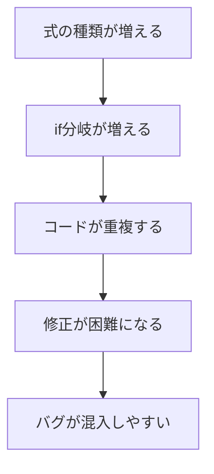

## 前回の振り返り



前回は、「2d6」のようなダイス記法を解釈してダイスを振るDiceクラスを作りました。

今回は、「2d6+3」や「3d8*2-1」のような計算式に対応していきましょう。

## 単純な加算に対応する

まずは「2d6+3」のような、ダイスに数値を足す式に対応してみます。

```perl
#!/usr/bin/env perl
use v5.36;

package DiceCalculator {
    use Moo;

    sub evaluate($self, $expression) {
        # 2d6+3 形式に対応
        if ($expression =~ /^(\d+)d(\d+)\+(\d+)$/) {
            my ($count, $sides, $bonus) = ($1, $2, $3);
            my $total = 0;
            for (1 .. $count) {
                $total += int(rand($sides)) + 1;
            }
            return $total + $bonus;
        }

        die "不正な式: $expression";
    }
}

my $calc = DiceCalculator->new;
say "2d6+3の結果: " . $calc->evaluate('2d6+3');
```

動きました。では次に、減算にも対応しましょう。

## 減算にも対応

```perl
sub evaluate($self, $expression) {
    # 2d6+3 形式に対応
    if ($expression =~ /^(\d+)d(\d+)\+(\d+)$/) {
        my ($count, $sides, $bonus) = ($1, $2, $3);
        my $total = 0;
        for (1 .. $count) {
            $total += int(rand($sides)) + 1;
        }
        return $total + $bonus;
    }

    # 2d6-3 形式に対応
    if ($expression =~ /^(\d+)d(\d+)-(\d+)$/) {
        my ($count, $sides, $penalty) = ($1, $2, $3);
        my $total = 0;
        for (1 .. $count) {
            $total += int(rand($sides)) + 1;
        }
        return $total - $penalty;
    }

    die "不正な式: $expression";
}
```

似たようなコードが増えてきましたが、まだ何とかなります。

## 乗算・除算にも対応

```perl
sub evaluate($self, $expression) {
    # 2d6+3 形式
    if ($expression =~ /^(\d+)d(\d+)\+(\d+)$/) {
        my ($count, $sides, $bonus) = ($1, $2, $3);
        my $total = 0;
        for (1 .. $count) {
            $total += int(rand($sides)) + 1;
        }
        return $total + $bonus;
    }

    # 2d6-3 形式
    if ($expression =~ /^(\d+)d(\d+)-(\d+)$/) {
        my ($count, $sides, $penalty) = ($1, $2, $3);
        my $total = 0;
        for (1 .. $count) {
            $total += int(rand($sides)) + 1;
        }
        return $total - $penalty;
    }

    # 2d6*2 形式
    if ($expression =~ /^(\d+)d(\d+)\*(\d+)$/) {
        my ($count, $sides, $multiplier) = ($1, $2, $3);
        my $total = 0;
        for (1 .. $count) {
            $total += int(rand($sides)) + 1;
        }
        return $total * $multiplier;
    }

    # 2d6/2 形式
    if ($expression =~ /^(\d+)d(\d+)\/(\d+)$/) {
        my ($count, $sides, $divisor) = ($1, $2, $3);
        my $total = 0;
        for (1 .. $count) {
            $total += int(rand($sides)) + 1;
        }
        return int($total / $divisor);
    }

    die "不正な式: $expression";
}
```

ここでは結果を整数にそろえるため、割り算は切り捨て（`int`）にしています。小数を扱いたい場合は別の設計が必要になります。

コードが膨れ上がってきました。しかも、まだ問題があります。

## 複合演算を追加しようとすると

「2d6+3*2」のような複数の演算子を含む式に対応しようとすると、事態はさらに複雑になります。

```perl
# 2d6+3*2 形式
if ($expression =~ /^(\d+)d(\d+)\+(\d+)\*(\d+)$/) {
    my ($count, $sides, $bonus, $multiplier) = ($1, $2, $3, $4);
    my $total = 0;
    for (1 .. $count) {
        $total += int(rand($sides)) + 1;
    }
    return ($total + $bonus) * $multiplier;
}

# 2d6*2+3 形式
if ($expression =~ /^(\d+)d(\d+)\*(\d+)\+(\d+)$/) {
    my ($count, $sides, $multiplier, $bonus) = ($1, $2, $3, $4);
    my $total = 0;
    for (1 .. $count) {
        $total += int(rand($sides)) + 1;
    }
    return $total * $multiplier + $bonus;
}

# 2d6+1d8 形式
if ($expression =~ /^(\d+)d(\d+)\+(\d+)d(\d+)$/) {
    # ...さらに複雑に
}
```

演算子の組み合わせごとにif分岐が増えていきます。これは明らかに破綻しています。

## 問題点の整理



現在の設計には以下の問題があります。

### 1. コードの重複

ダイスを振る処理が、すべてのif分岐で繰り返されています。ダイスの振り方を変更したい場合、すべての箇所を修正する必要があります。

### 2. 演算子の組み合わせ爆発

演算子が4種類（+、-、*、/）あるだけでも、2つの演算子を組み合わせると16パターン。3つ以上になると手に負えません。

### 3. 優先順位の問題

「2d6+3*2」は、数学的には「2d6 + (3*2)」と解釈すべきですが、現在の実装では演算子の優先順位を正しく扱えません。

### 4. 拡張性の欠如

新しい機能（括弧、関数など）を追加するたびに、既存のコードを大幅に書き換える必要があります。

## SOLID原則から見た問題

この設計は、SOLID原則の観点からも問題があります。

### 単一責任の原則（SRP）違反

evaluateメソッドが、パースと評価と演算のすべてを担当しています。責務が多すぎます。

### 開放閉鎖の原則（OCP）違反

新しい演算子を追加するたびに、既存のevaluateメソッドを修正しなければなりません。「拡張に対して開いて、修正に対して閉じている」という原則に反しています。

## 今回のまとめ

今回は、ダイス言語に計算式を追加しようとして、コードが複雑になる問題を確認しました。

- 演算子ごとにif分岐が増える
- コードの重複が発生する
- 演算子の組み合わせが爆発する
- SOLID原則に違反している

次回は、この問題を解決するために、数値とダイスを独立したオブジェクトとして設計し直します。
