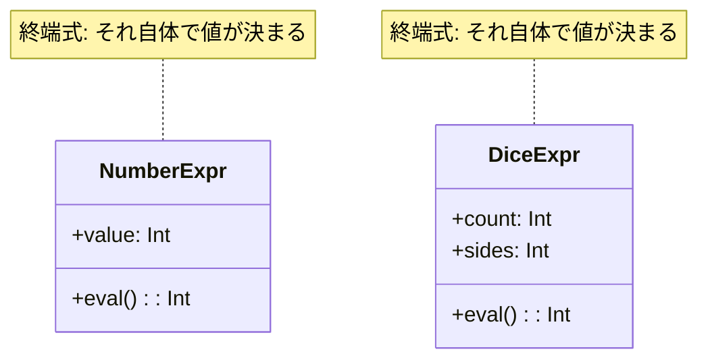

## 前回の振り返り



前回は、計算式を追加しようとしてif/elseの嵐に陥りました。

問題の根本原因は、すべての処理が1つのメソッドに詰め込まれていたことです。今回は、数値とダイスをそれぞれ独立したオブジェクトとして設計し直します。

## 数値を表すクラス: NumberExpr

まずは、単純な数値を表すクラスを作ります。

```perl
package NumberExpr {
    use Moo;

    has value => (is => 'ro', required => 1);

    sub eval($self) {
        return $self->value;
    }
}
```

このクラスには、evalメソッドがあります。evalはevaluate（評価する）の略で、式の値を計算して返します。

Perlの組み込み関数`eval`とは別物なので、ここでは「式の評価メソッド」として扱います。

NumberExprの場合、evalは単に保持している数値を返すだけです。

```perl
my $num = NumberExpr->new(value => 5);
say $num->eval;  # 5
```

## ダイスを表すクラス: DiceExpr

次に、ダイスを表すクラスを作ります。

```perl
package DiceExpr {
    use Moo;

    has count => (is => 'ro', required => 1);
    has sides => (is => 'ro', required => 1);

    sub eval($self) {
        my $total = 0;
        for (1 .. $self->count) {
            $total += int(rand($self->sides)) + 1;
        }
        return $total;
    }
}
```

DiceExprのevalメソッドは、ダイスを振って合計を返します。これは前回のDiceクラスのrollメソッドと同じ処理です。

```perl
my $dice = DiceExpr->new(count => 2, sides => 6);
say $dice->eval;  # 2d6の結果（例: 8）
```

## 終端式という考え方

NumberExprとDiceExprには共通点があります。

- どちらもevalメソッドを持つ
- evalを呼ぶと、即座に値が決まる
- 他の式を内部に持たない

このような式を「終端式（TerminalExpression）」と呼びます。



終端式は、式のツリー構造における「葉」（リーフ）に相当します。これ以上分解できない、最も基本的な式です。

## 完成コード

ここまでの内容をまとめた完成コードです。

```perl
#!/usr/bin/env perl
use v5.36;

package NumberExpr {
    use Moo;

    has value => (is => 'ro', required => 1);

    sub eval($self) {
        return $self->value;
    }
}

package DiceExpr {
    use Moo;

    has count => (is => 'ro', required => 1);
    has sides => (is => 'ro', required => 1);

    sub eval($self) {
        my $total = 0;
        for (1 .. $self->count) {
            $total += int(rand($self->sides)) + 1;
        }
        return $total;
    }
}

# 使ってみる
my $num = NumberExpr->new(value => 5);
say "数値5: " . $num->eval;

my $dice = DiceExpr->new(count => 2, sides => 6);
say "2d6: " . $dice->eval;

my $dice20 = DiceExpr->new(count => 1, sides => 20);
say "1d20: " . $dice20->eval;
```

実行結果の例です。

```text
数値5: 5
2d6: 7
1d20: 14
```

## 設計の改善点

この設計変更で何が良くなったでしょうか。

### 責務の分離

- NumberExprは数値の評価だけを担当
- DiceExprはダイスの評価だけを担当

各クラスが1つの責務に集中しています。単一責任の原則（SRP）に沿った設計です。

### 統一されたインターフェース

どちらのクラスもevalメソッドで値を取得できます。使う側は、相手がNumberExprでもDiceExprでも、同じように扱えます。

```perl
sub print_result($expr) {
    say "結果: " . $expr->eval;
}

print_result(NumberExpr->new(value => 10));
print_result(DiceExpr->new(count => 2, sides => 6));
```

これがオブジェクト指向の「ポリモーフィズム」（多態性）です。

## 今回のまとめ

今回は、数値とダイスをそれぞれ独立したクラスに分離しました。

- NumberExprクラス: 数値を表す終端式
- DiceExprクラス: ダイスを表す終端式
- どちらもevalメソッドで値を返す

次回は、「+」のような演算子を表すクラスを作り、式を組み合わせる方法を学びます。
