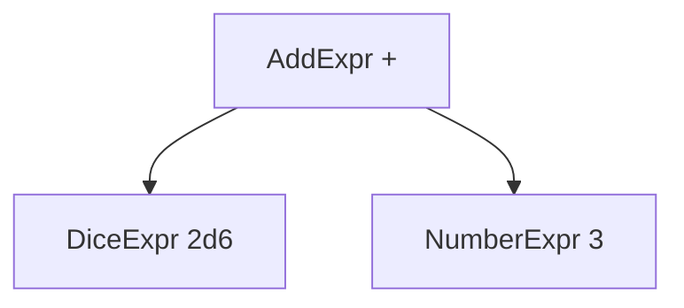
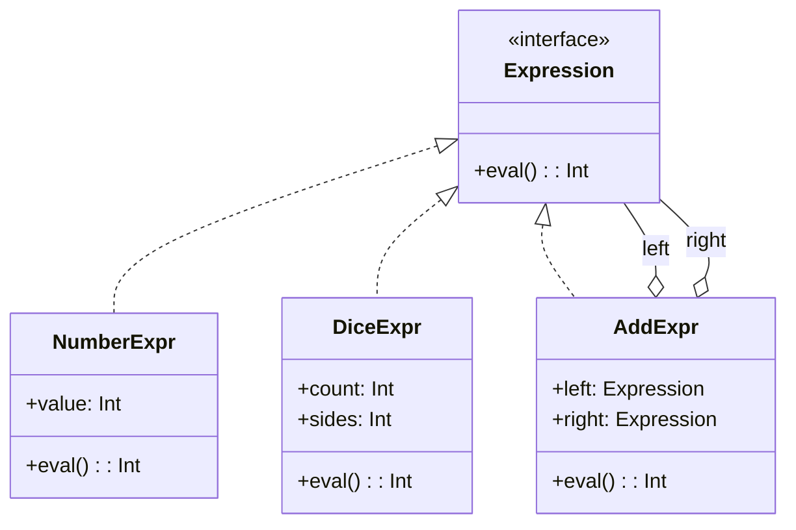
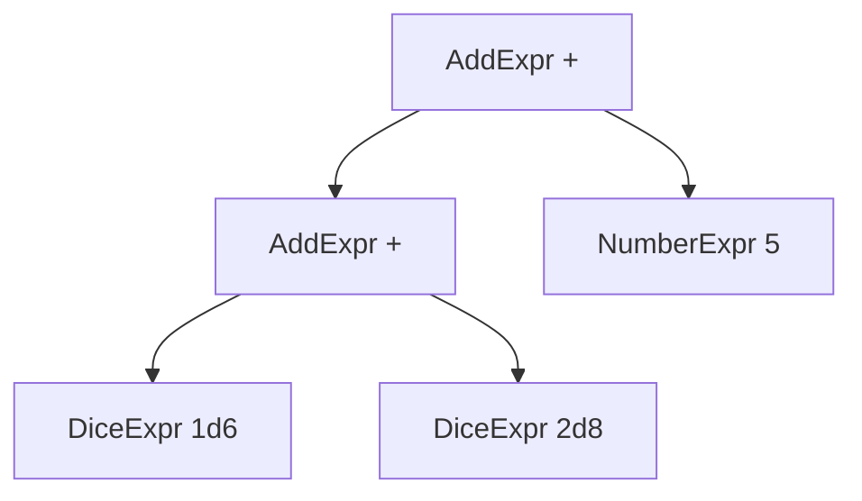

## 前回の振り返り



前回は、数値を表すNumberExprとダイスを表すDiceExprを作りました。どちらもevalメソッドを持つ「終端式」です。

今回は、「2d6+3」のような足し算を表現するためのAddExprクラスを作ります。

## 足し算をオブジェクトで表現する

足し算には、左辺（left）と右辺（right）があります。「2d6+3」なら、左辺が「2d6」、右辺が「3」です。



この構造をクラスで表現します。

```perl
package AddExpr {
    use Moo;

    has left  => (is => 'ro', required => 1);
    has right => (is => 'ro', required => 1);

    sub eval($self) {
        return $self->left->eval + $self->right->eval;
    }
}
```

AddExprのevalメソッドは、左辺と右辺それぞれのevalを呼び出し、結果を足して返します。

## 実際に使ってみる

「2d6+3」を表現してみましょう。

```perl
#!/usr/bin/env perl
use v5.36;

package NumberExpr {
    use Moo;
    has value => (is => 'ro', required => 1);
    sub eval($self) { return $self->value; }
}

package DiceExpr {
    use Moo;
    has count => (is => 'ro', required => 1);
    has sides => (is => 'ro', required => 1);
    sub eval($self) {
        my $total = 0;
        for (1 .. $self->count) {
            $total += int(rand($self->sides)) + 1;
        }
        return $total;
    }
}

package AddExpr {
    use Moo;
    has left  => (is => 'ro', required => 1);
    has right => (is => 'ro', required => 1);
    sub eval($self) {
        return $self->left->eval + $self->right->eval;
    }
}

# 2d6+3 を組み立てる
my $expr = AddExpr->new(
    left  => DiceExpr->new(count => 2, sides => 6),
    right => NumberExpr->new(value => 3),
);

say "2d6+3の結果: " . $expr->eval;
```

実行するたびに異なる結果が得られます。

```text
2d6+3の結果: 11
```

## 非終端式という考え方

AddExprは、他の式（left、right）を内部に持っています。evalを呼ぶと、まず子の式を評価し、その結果を使って自分の値を計算します。

このような式を「非終端式（NonterminalExpression）」と呼びます。



- 終端式: それ自体で値が決まる（NumberExpr、DiceExpr）
- 非終端式: 子の式を組み合わせて値を決める（AddExpr）

## 入れ子の式も表現できる

非終端式の素晴らしいところは、入れ子にもできることです。

「1d6+2d8+5」を表現してみましょう。

```perl
# 1d6+2d8+5 → (1d6+2d8)+5 として組み立て
my $inner = AddExpr->new(
    left  => DiceExpr->new(count => 1, sides => 6),
    right => DiceExpr->new(count => 2, sides => 8),
);

my $expr = AddExpr->new(
    left  => $inner,
    right => NumberExpr->new(value => 5),
);

say "1d6+2d8+5の結果: " . $expr->eval;
```

このように、式をツリー構造で表現できます。



evalメソッドが呼ばれると、ツリーを再帰的に辿って評価が行われます。

## 再帰的な評価の流れ

「1d6+2d8+5」の評価がどう進むか見てみましょう。

1. 最上位のAddExpr.evalが呼ばれる
2. left（内側のAddExpr）のevalを呼ぶ
   - その中でleft（1d6）のevalを呼ぶ → 例: 4
   - right（2d8）のevalを呼ぶ → 例: 12
   - 4 + 12 = 16を返す
3. right（5）のevalを呼ぶ → 5
4. 16 + 5 = 21を返す

どんなに複雑な式でも、同じパターンで評価できます。

## 今回のまとめ

今回は、足し算を表すAddExprクラスを作りました。

- AddExprは左辺と右辺の式を持つ
- evalメソッドは子の式を再帰的に評価して加算
- これが「非終端式」という概念

次回は、すべての式クラスが共通のインターフェースを持つよう、Moo::Roleを使って整理します。
