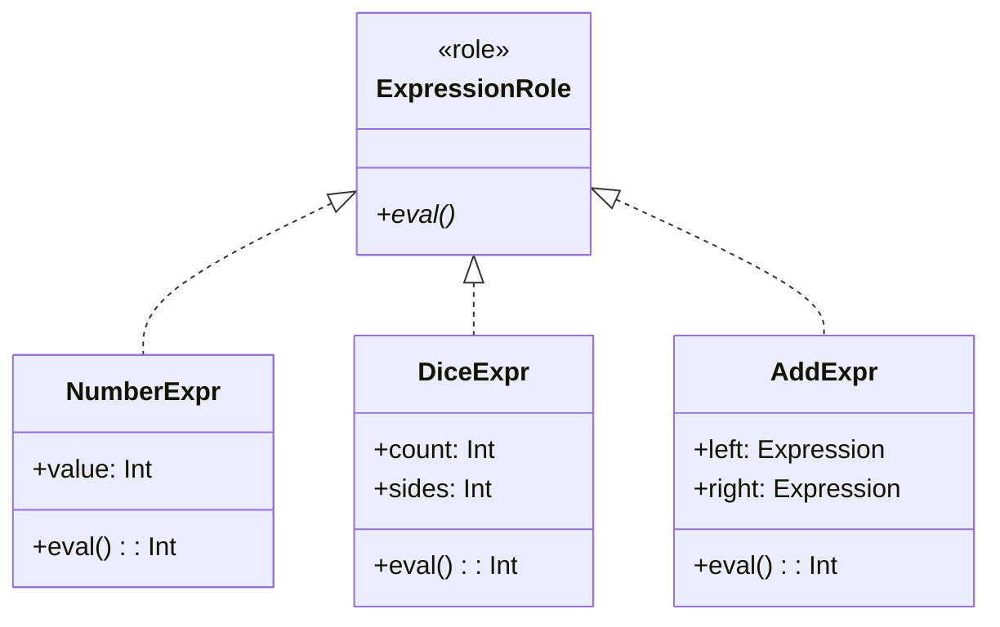

## 前回の振り返り



前回は、足し算を表すAddExprを作り、式を木構造で表現できるようになりました。

現在、NumberExpr、DiceExpr、AddExprの3つのクラスがあります。すべてevalメソッドを持っていますが、これは単なる約束事であり、強制力がありません。

今回は、Moo::Roleを使ってこの約束を明文化します。

## 問題: evalメソッドを実装し忘れたら

新しい式クラスを追加するとき、evalメソッドを実装し忘れたらどうなるでしょうか。

```perl
package BrokenExpr {
    use Moo;
    # evalメソッドを忘れた！
}

my $expr = AddExpr->new(
    left  => BrokenExpr->new,
    right => NumberExpr->new(value => 5),
);

$expr->eval;  # 実行時エラー！
```

evalを呼んだときに初めてエラーになります。コードを書いた時点では気づけません。

## Roleでインターフェースを定義する

Moo::Roleを使うと、「このメソッドは必ず実装してね」という約束を強制できます。

```perl
package ExpressionRole {
    use Moo::Role;

    requires 'eval';
}
```

`requires`で指定されたメソッドを実装していないクラスは、ロードした時点でエラーになります。

## 各クラスにRoleを適用する

NumberExpr、DiceExpr、AddExprにExpressionRoleを適用しましょう。

```perl
package NumberExpr {
    use Moo;
    with 'ExpressionRole';

    has value => (is => 'ro', required => 1);

    sub eval($self) {
        return $self->value;
    }
}
```

`with 'ExpressionRole'`と書くことで、ロールを適用します。evalメソッドがないと、このクラスをロードした時点でエラーになります。

## 完成コード

すべてのクラスにロールを適用した完成コードです。

```perl
#!/usr/bin/env perl
use v5.36;

package ExpressionRole {
    use Moo::Role;

    requires 'eval';
}

package NumberExpr {
    use Moo;
    with 'ExpressionRole';

    has value => (is => 'ro', required => 1);

    sub eval($self) {
        return $self->value;
    }
}

package DiceExpr {
    use Moo;
    with 'ExpressionRole';

    has count => (is => 'ro', required => 1);
    has sides => (is => 'ro', required => 1);

    sub eval($self) {
        my $total = 0;
        for (1 .. $self->count) {
            $total += int(rand($self->sides)) + 1;
        }
        return $total;
    }
}

package AddExpr {
    use Moo;
    with 'ExpressionRole';

    has left  => (is => 'ro', required => 1);
    has right => (is => 'ro', required => 1);

    sub eval($self) {
        return $self->left->eval + $self->right->eval;
    }
}

# 2d6+3 を組み立てて評価
my $expr = AddExpr->new(
    left  => DiceExpr->new(count => 2, sides => 6),
    right => NumberExpr->new(value => 3),
);

say "2d6+3の結果: " . $expr->eval;
```

## ロールの効果



ExpressionRoleがあることで、以下のメリットが得られます。

### 1. 早期エラー検出

evalメソッドが未実装のクラスは、ロード時点（`use`した時点）でエラーになります。

```perl
package BrokenExpr {
    use Moo;
    with 'ExpressionRole';
    # evalがない → ロード時にエラー
}
```

```text
'ExpressionRole' requires the method 'eval' to be implemented by 'BrokenExpr'
```

### 2. ドキュメント効果

ロールを見れば、式クラスが満たすべき契約が明確にわかります。新しい開発者がコードを読むときの道しるべになります。

### 3. 型チェックへの応用

Roleは、Type::Tinyなどの型システムと組み合わせて、引数の型チェックにも使えます。

```perl
use Types::Standard qw(ConsumerOf);

has left => (
    is       => 'ro',
    isa      => ConsumerOf['ExpressionRole'],
    required => 1,
);
```

この例を動かすにはType::Tiny（Types::Standard）を導入する必要があります。概念紹介として読み進めてください。

## インターフェースという設計思想

ExpressionRoleのような「メソッドの約束だけを定義したロール」は、他の言語では「インターフェース」と呼ばれます。

- Java: interface
- TypeScript: interface
- Go: interface
- Perl: Moo::Role + requires

インターフェースを使うと、「何ができるか」に焦点を当てた設計ができます。具体的な実装は知らなくても、evalメソッドがあることだけ分かっていれば、その式を使えます。

## 今回のまとめ

今回は、ExpressionRoleを定義してすべての式クラスに適用しました。

- `requires 'eval'`でメソッドの実装を強制
- 未実装クラスはロード時にエラーになる
- ロールはインターフェースとして機能する

次回は、SubExprやMulExprを追加して、引き算と掛け算に対応します。開放閉鎖の原則（OCP）を実践します。
