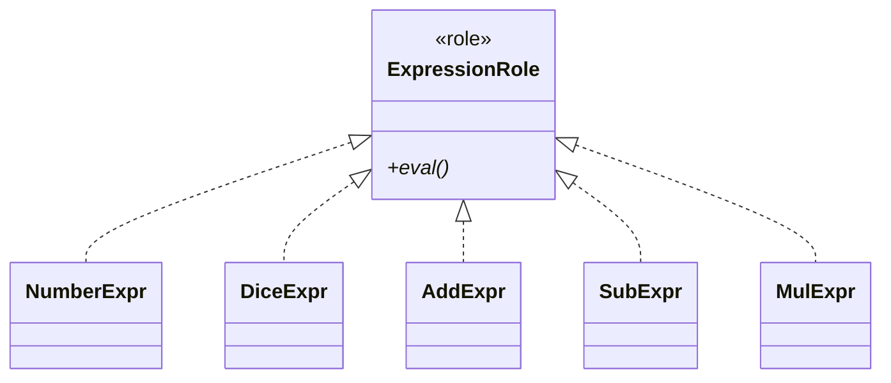

## 前回の振り返り



前回は、ExpressionRoleを定義してすべての式クラスに共通のインターフェースを与えました。

今回は、引き算と掛け算に対応するクラスを追加します。重要なのは、既存のコードを変更せずに機能を拡張できることです。

除算（DivExpr）も同じ要領で追加できますが、今回はOCPの練習として引き算・掛け算に絞ります。

## 引き算クラス: SubExpr

AddExprと同じパターンで、SubExpr（引き算）を作ります。

```perl
package SubExpr {
    use Moo;
    with 'ExpressionRole';

    has left  => (is => 'ro', required => 1);
    has right => (is => 'ro', required => 1);

    sub eval($self) {
        return $self->left->eval - $self->right->eval;
    }
}
```

## 掛け算クラス: MulExpr

同様に、MulExpr（掛け算）を作ります。

```perl
package MulExpr {
    use Moo;
    with 'ExpressionRole';

    has left  => (is => 'ro', required => 1);
    has right => (is => 'ro', required => 1);

    sub eval($self) {
        return $self->left->eval * $self->right->eval;
    }
}
```

## 開放閉鎖の原則（OCP）

ここで注目すべきは、NumberExpr、DiceExpr、AddExpr、ExpressionRoleのコードを一切変更していないことです。

これはSOLID原則の2番目、「開放閉鎖の原則」（Open-Closed Principle）の実践です。

- 拡張に対して開いている: 新しい式クラスをいくらでも追加できる
- 修正に対して閉じている: 既存のクラスを変更する必要がない



## 完成コード

```perl
#!/usr/bin/env perl
use v5.36;

package ExpressionRole {
    use Moo::Role;
    requires 'eval';
}

package NumberExpr {
    use Moo;
    with 'ExpressionRole';
    has value => (is => 'ro', required => 1);
    sub eval($self) { return $self->value; }
}

package DiceExpr {
    use Moo;
    with 'ExpressionRole';
    has count => (is => 'ro', required => 1);
    has sides => (is => 'ro', required => 1);
    sub eval($self) {
        my $total = 0;
        for (1 .. $self->count) {
            $total += int(rand($self->sides)) + 1;
        }
        return $total;
    }
}

package AddExpr {
    use Moo;
    with 'ExpressionRole';
    has left  => (is => 'ro', required => 1);
    has right => (is => 'ro', required => 1);
    sub eval($self) { return $self->left->eval + $self->right->eval; }
}

package SubExpr {
    use Moo;
    with 'ExpressionRole';
    has left  => (is => 'ro', required => 1);
    has right => (is => 'ro', required => 1);
    sub eval($self) { return $self->left->eval - $self->right->eval; }
}

package MulExpr {
    use Moo;
    with 'ExpressionRole';
    has left  => (is => 'ro', required => 1);
    has right => (is => 'ro', required => 1);
    sub eval($self) { return $self->left->eval * $self->right->eval; }
}

# (2d6-1)*2
my $expr = MulExpr->new(
    left => SubExpr->new(
        left  => DiceExpr->new(count => 2, sides => 6),
        right => NumberExpr->new(value => 1),
    ),
    right => NumberExpr->new(value => 2),
);
say "(2d6-1)*2: " . $expr->eval;
```

## 今回のまとめ

今回は、SubExprとMulExprを追加し、開放閉鎖の原則を実践しました。

次回は、文字列「2d6+3」から自動的に式ツリーを構築するパーサーを作り、ダイス言語インタプリタを完成させます。
