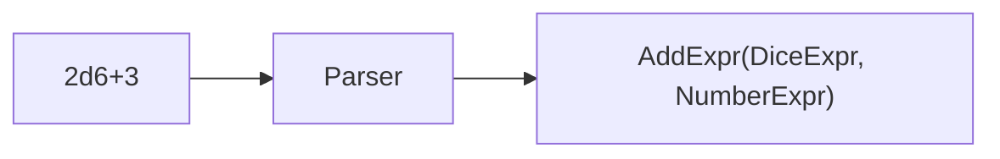

## 前回の振り返り



前回は、SubExprとMulExprを追加し、四則演算に対応しました。

しかし、まだ式を手動で組み立てる必要があります。今回は、文字列から自動的に式ツリーを構築するパーサーを作り、ダイス言語インタプリタを完成させます。

## パーサーの設計

「2d6+3」のような文字列を、AddExprやDiceExprのツリーに変換します。



簡易パーサーとして、正規表現で分解するアプローチを取ります。

## DiceParserクラス

```perl
package DiceParser {
    use Moo;

    sub parse($self, $input) {
        # 空白を除去
        $input =~ s/\s+//g;
        die "パースエラー: 空文字列" if $input eq '';

        return $self->_parse_additive($input);
    }

    sub _parse_additive($self, $input) {
        # +または-で分割（最後の演算子を探す）
        if ($input =~ /^(.+)([\+\-])([^\+\-]+)$/) {
            my ($left, $op, $right) = ($1, $2, $3);
            my $left_expr  = $self->_parse_additive($left);
            my $right_expr = $self->_parse_multiplicative($right);

            return $op eq '+'
                ? AddExpr->new(left => $left_expr, right => $right_expr)
                : SubExpr->new(left => $left_expr, right => $right_expr);
        }
        return $self->_parse_multiplicative($input);
    }

    sub _parse_multiplicative($self, $input) {
        # *で分割
        if ($input =~ /^(.+)\*([^\*]+)$/) {
            my ($left, $right) = ($1, $2);
            my $left_expr  = $self->_parse_multiplicative($left);
            my $right_expr = $self->_parse_primary($right);
            return MulExpr->new(left => $left_expr, right => $right_expr);
        }
        return $self->_parse_primary($input);
    }

    sub _parse_primary($self, $input) {
        # ダイス記法: NdM
        if ($input =~ /^(\d+)d(\d+)$/) {
            return DiceExpr->new(count => $1, sides => $2);
        }
        # 数値
        if ($input =~ /^(\d+)$/) {
            return NumberExpr->new(value => $1);
        }
        die "パースエラー: $input";
    }
}
```

## 演算子の優先順位

パーサーは演算子の優先順位を考慮しています。

- 加減算（+、-）を先に分割
- 次に乗算（*）を分割
- 最後にダイスと数値をパース

これにより、「2d6+3*2」は「2d6 + (3*2)」として正しく解釈されます。

## 現時点の制約

この簡易パーサーは、学習用に仕様を絞っています。

- 括弧は未対応
- 除算は未対応
- 数値は正の整数のみ
- 連続する演算子（例: `2d6+-3`）は未対応

次の拡張ポイントとして、これらを足していくと設計の強さがより体感できます。

## 完成版スクリプト

```perl
#!/usr/bin/env perl
use v5.36;

package ExpressionRole {
    use Moo::Role;
    requires 'eval';
}

package NumberExpr {
    use Moo;
    with 'ExpressionRole';
    has value => (is => 'ro', required => 1);
    sub eval($self) { return $self->value; }
}

package DiceExpr {
    use Moo;
    with 'ExpressionRole';
    has count => (is => 'ro', required => 1);
    has sides => (is => 'ro', required => 1);
    sub eval($self) {
        my $total = 0;
        for (1 .. $self->count) {
            $total += int(rand($self->sides)) + 1;
        }
        return $total;
    }
}

package AddExpr {
    use Moo;
    with 'ExpressionRole';
    has left  => (is => 'ro', required => 1);
    has right => (is => 'ro', required => 1);
    sub eval($self) { return $self->left->eval + $self->right->eval; }
}

package SubExpr {
    use Moo;
    with 'ExpressionRole';
    has left  => (is => 'ro', required => 1);
    has right => (is => 'ro', required => 1);
    sub eval($self) { return $self->left->eval - $self->right->eval; }
}

package MulExpr {
    use Moo;
    with 'ExpressionRole';
    has left  => (is => 'ro', required => 1);
    has right => (is => 'ro', required => 1);
    sub eval($self) { return $self->left->eval * $self->right->eval; }
}

package DiceParser {
    use Moo;

    sub parse($self, $input) {
        $input =~ s/\s+//g;
        die "パースエラー: 空文字列" if $input eq '';
        return $self->_parse_additive($input);
    }

    sub _parse_additive($self, $input) {
        if ($input =~ /^(.+)([\+\-])([^\+\-]+)$/) {
            my ($left, $op, $right) = ($1, $2, $3);
            my $left_expr  = $self->_parse_additive($left);
            my $right_expr = $self->_parse_multiplicative($right);
            return $op eq '+'
                ? AddExpr->new(left => $left_expr, right => $right_expr)
                : SubExpr->new(left => $left_expr, right => $right_expr);
        }
        return $self->_parse_multiplicative($input);
    }

    sub _parse_multiplicative($self, $input) {
        if ($input =~ /^(.+)\*([^\*]+)$/) {
            my ($left, $right) = ($1, $2);
            return MulExpr->new(
                left  => $self->_parse_multiplicative($left),
                right => $self->_parse_primary($right),
            );
        }
        return $self->_parse_primary($input);
    }

    sub _parse_primary($self, $input) {
        return DiceExpr->new(count => $1, sides => $2) if $input =~ /^(\d+)d(\d+)$/;
        return NumberExpr->new(value => $1) if $input =~ /^(\d+)$/;
        die "パースエラー: $input";
    }
}

# ダイス言語インタプリタを使う
my $parser = DiceParser->new;

my @expressions = ('2d6', '2d6+3', '3d8-5', '1d20*2', '2d6+3*2');

for my $input (@expressions) {
    my $expr   = $parser->parse($input);
    my $result = $expr->eval;
    say "$input = $result";
}
```

## 今回のまとめ

今回は、DiceParserを実装してダイス言語インタプリタを完成させました。

- 文字列から式ツリーを自動構築
- 演算子の優先順位を正しく処理
- 全コンポーネントを統合

次回は、この設計がデザインパターンとしてどのように名付けられているかを明かします。
