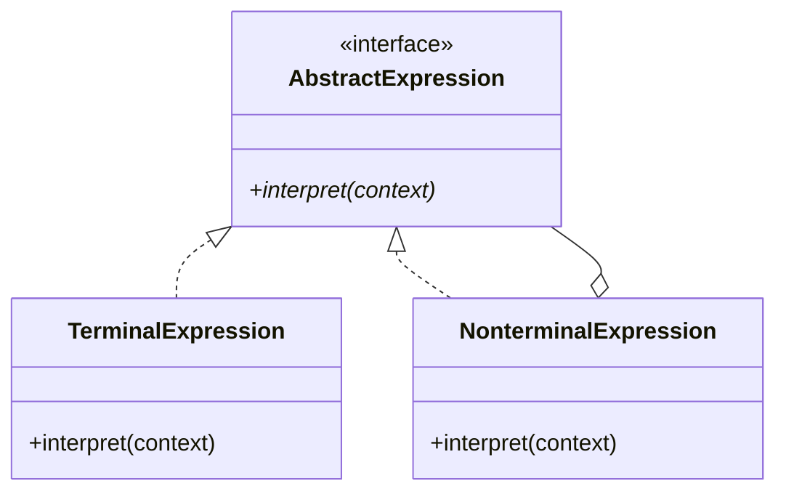
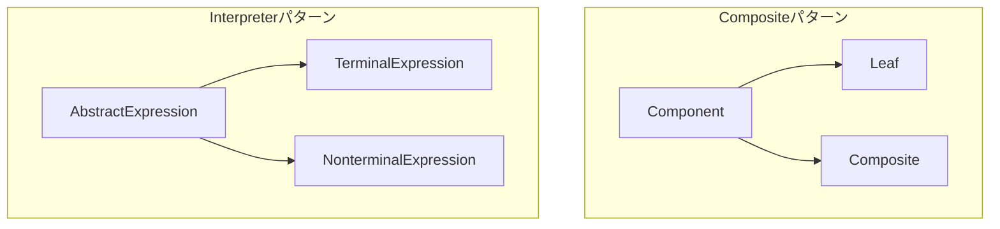

## 前回の振り返り



前回は、パーサーを追加してダイス言語インタプリタを完成させました。

文字列「2d6+3」から式ツリーを構築し、評価できるようになりました。実は、この設計には名前があります。

## Interpreterパターン

私たちが作った設計は「Interpreterパターン」と呼ばれます。GoF（Gang of Four）が定義した23のデザインパターンの1つです。

## クラスの対応表

私たちが作ったクラスとInterpreterパターンの対応です。

| GoFの用語 | 私たちのクラス |
|----------|---------------|
| AbstractExpression | ExpressionRole |
| TerminalExpression | NumberExpr, DiceExpr |
| NonterminalExpression | AddExpr, SubExpr, MulExpr |
| interpret() | eval() |
| Client | メインスクリプト |
| Context | （今回は未使用） |

今回は変数や環境を扱わないためContextを省略しました。もし「$x+2d6」のような変数評価をしたくなったら、Contextを導入して変数テーブルを持たせる設計が自然です。

## Interpreterパターンの構造

Interpreterパターンの核心は、文法規則をクラスで表現することです。

- 各クラスが1つの文法規則を表す
- 終端式と非終端式の2種類がある
- 式は木構造（抽象構文木）を形成する
- 評価は木を再帰的に辿る

私たちが自然に到達した設計が、まさにこれでした。

## Compositeパターンとの関係

Interpreterパターンは、Compositeパターンと密接な関係があります。

- Component ≒ AbstractExpression
- Leaf ≒ TerminalExpression
- Composite ≒ NonterminalExpression

Interpreterパターンの抽象構文木は、Compositeパターンのツリー構造と同じです。

## SOLID原則との対応

このシリーズで実践したSOLID原則を振り返ります。

| 原則 | 実践内容 |
|------|---------|
| 単一責任（SRP） | 各クラスが1種類の式だけを担当 |
| 開放閉鎖（OCP） | 新しい演算子を追加しても既存コード不変 |
| リスコフ置換（LSP） | すべての式がExpressionRoleを満たす |
| インターフェース分離（ISP） | ExpressionRoleはevalのみを要求 |
| 依存性逆転（DIP） | 具象クラスではなくRoleに依存 |

## Interpreterパターンの適用場面

Interpreterパターンは以下のような場面で有効です。

- DSL（ドメイン固有言語）の実装
- 設定ファイルの解析
- 検索クエリの評価
- 数式処理
- ルールエンジン

ダイス記法は、TRPGドメインのDSLと言えます。

一方で、文法が大規模・複雑になる場合はパーサージェネレーターの導入も検討対象になります。Interpreterパターンは「シンプルな文法をクラスで表現する」場面に向いています。

## 発展のヒント

このダイス言語は、以下のように拡張できます。

- 除算（DivExpr）の追加
- 括弧のサポート
- 最大値取得（例: 4d6k3 = 4個振って上位3個）
- リロール機能
- Discord Botへの組み込み

Interpreterパターンの強みは、新しい文法を追加しても既存コードを変更しなくてよいことです。

## シリーズのまとめ

全8回を通じて、以下を学びました。

1. ダイスを振る基本実装
2. if/elseの限界と設計の破綻
3. 終端式（NumberExpr、DiceExpr）
4. 非終端式（AddExpr）と再帰評価
5. Moo::Roleによるインターフェース定義
6. 開放閉鎖の原則（OCP）の実践
7. パーサーによる統合
8. Interpreterパターンの理解

「2d6+3」という文字列がオブジェクトのツリーに変換され、再帰的に評価される仕組みを、自分の手で作り上げました。

この経験は、他のデザインパターンを学ぶときにも活きてきます。オブジェクト指向の力を実感できたのではないでしょうか。
