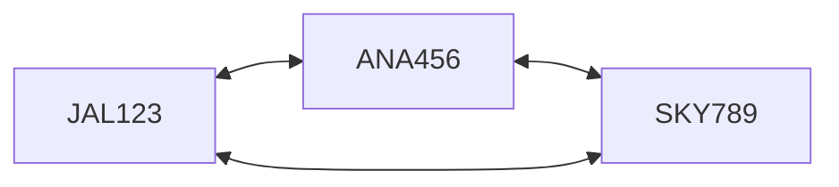

## 前回の振り返り



前回は、Aircraftクラスを作成し、航空機の離着陸をシミュレートできるようにしました。

今回は、2機の航空機が同時に着陸しようとしたとき、どんな問題が起こるかを見ていきます。

## 滑走路という制約

実際の空港では、滑走路は限られた資源です。同時に2機の航空機が同じ滑走路に着陸しようとすれば、大事故になります。

現在のコードを見てみましょう。

```perl
#!/usr/bin/env perl
use v5.36;

package Aircraft {
    use Moo;

    has flight_number => (is => 'ro', required => 1);

    sub request_landing($self) {
        say $self->flight_number . ": 着陸します";
    }
}

my $flight1 = Aircraft->new(flight_number => 'JAL123');
my $flight2 = Aircraft->new(flight_number => 'ANA456');

# 同時に着陸を要求
$flight1->request_landing;
$flight2->request_landing;
```

実行結果:

```
JAL123: 着陸します
ANA456: 着陸します
```

2機とも何の調整もなく着陸しています。これでは衝突事故が起きてしまいます。

## 航空機同士が直接調整する？

解決策として、航空機同士が直接やり取りして調整することを考えてみましょう。

```perl
#!/usr/bin/env perl
use v5.36;

package Aircraft {
    use Moo;

    has flight_number => (is => 'ro', required => 1);
    has other_aircraft => (is => 'rw');

    sub request_landing($self) {
        # 他の航空機が着陸中かチェック
        if ($self->other_aircraft && $self->other_aircraft->is_landing) {
            say $self->flight_number . ": 待機します（" . 
                $self->other_aircraft->flight_number . "が着陸中）";
            return;
        }
        $self->_is_landing(1);
        say $self->flight_number . ": 着陸します";
        $self->_is_landing(0);
    }

    has _is_landing => (is => 'rw', default => 0);

    sub is_landing($self) {
        return $self->_is_landing;
    }
}

my $flight1 = Aircraft->new(flight_number => 'JAL123');
my $flight2 = Aircraft->new(flight_number => 'ANA456');

# お互いを知っている状態にする
$flight1->other_aircraft($flight2);
$flight2->other_aircraft($flight1);

$flight1->request_landing;
$flight2->request_landing;
```

これで2機の間で調整ができるようになりました。しかし、この設計には問題があります。

## 3機目を追加すると…

3機目の航空機を追加してみましょう。

```perl
my $flight1 = Aircraft->new(flight_number => 'JAL123');
my $flight2 = Aircraft->new(flight_number => 'ANA456');
my $flight3 = Aircraft->new(flight_number => 'SKY789');

# お互いを知っている状態にする...あれ？
$flight1->other_aircraft($flight2);  # flight3は？
$flight2->other_aircraft($flight1);  # flight3は？
$flight3->other_aircraft($flight1);  # flight2は？
```

問題が見えてきました。`other_aircraft`は1機しか参照できません。3機以上になると、すべての航空機がお互いを知っている必要があります。

## 相互依存の問題



N機の航空機がある場合、各航空機は他のN-1機すべてを知っている必要があります。これはN×(N-1)個の参照が必要ということです。

- 2機: 2×1 = 2個の参照
- 3機: 3×2 = 6個の参照
- 10機: 10×9 = 90個の参照
- 100機: 100×99 = 9,900個の参照

航空機が増えるほど、管理が爆発的に複雑になります。これを相互依存（密結合）の問題といいます。

## 問題のあるコード

参照を配列で持つようにしても、根本的な問題は解決しません。

```perl
package Aircraft {
    use Moo;

    has flight_number => (is => 'ro', required => 1);
    has other_aircrafts => (is => 'ro', default => sub { [] });

    sub register_aircraft($self, $aircraft) {
        push @{$self->other_aircrafts}, $aircraft;
    }

    sub request_landing($self) {
        # すべての他の航空機をチェック
        for my $other (@{$self->other_aircrafts}) {
            if ($other->is_landing) {
                say $self->flight_number . ": 待機します";
                return;
            }
        }
        # 着陸処理...
    }
}
```

すべての航空機に対して、他のすべての航空機を登録する必要があります。新しい航空機を追加するたびに、既存のすべての航空機の設定を更新しなければなりません。

## 今回のまとめ

今回は、複数の航空機が同じ滑走路を使おうとするときの問題を体験しました。

- 航空機同士が直接参照すると、相互依存が発生する
- 航空機の数が増えると、参照の数が爆発的に増加する
- 新しい航空機を追加するたびに、既存の設定を更新する必要がある（開放閉鎖の原則に違反）

これは明らかに良くない設計です。実際の空港では、どうやってこの問題を解決しているでしょうか？

次回は、実際の空港にヒントを得て、この問題を解決する方法を見ていきます。


