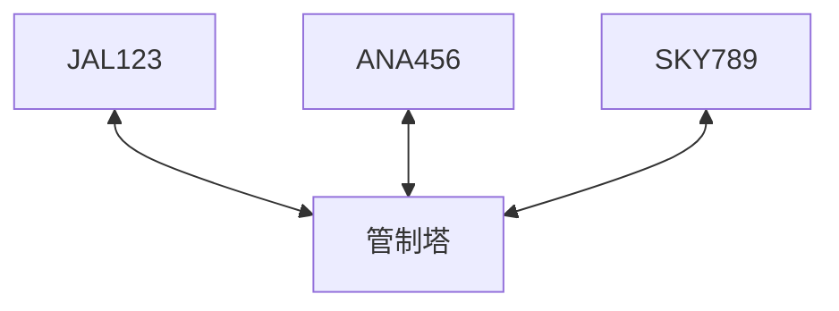
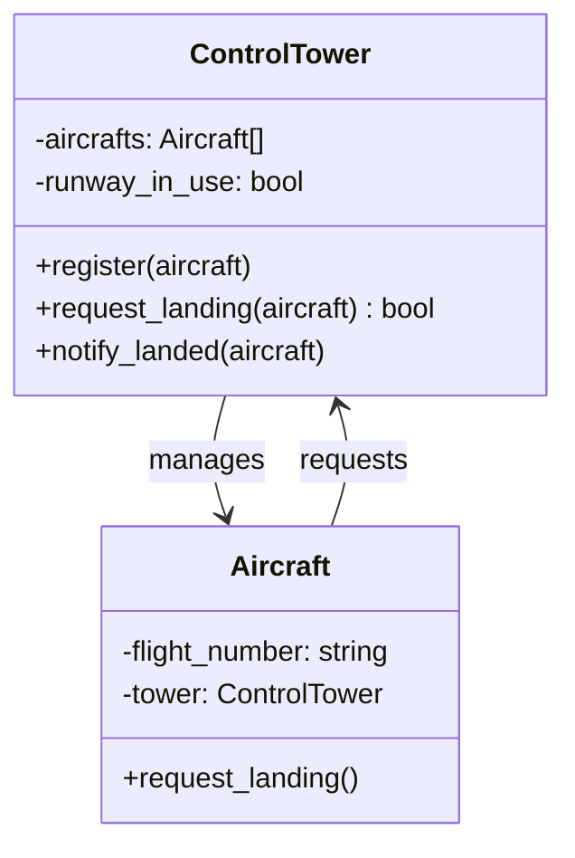

## 前回の振り返り



前回は、航空機同士が直接参照するとN×(N-1)個の参照が必要になり、管理が爆発的に複雑になることを確認しました。

今回は、実際の空港にヒントを得て、この問題を解決します。

## 実際の空港はどうしている？

実際の空港では、航空機同士が直接やり取りすることはありません。すべての通信は管制塔を経由して行われます。



航空機は他の航空機の存在を知る必要がありません。管制塔だけを知っていれば良いのです。

- N機の場合: N個の参照だけで済む（各航空機が管制塔を参照）
- 新しい航空機を追加しても、既存の設定を変更する必要がない

## 管制塔クラスを作る

管制塔（ControlTower）クラスを作りましょう。

```perl
package ControlTower {
    use Moo;

    has aircrafts => (is => 'ro', default => sub { [] });
    has runway_in_use => (is => 'rw', default => 0);

    sub register($self, $aircraft) {
        push @{$self->aircrafts}, $aircraft;
        say "管制塔: " . $aircraft->flight_number . "を登録しました";
    }

    sub request_landing($self, $aircraft) {
        if ($self->runway_in_use) {
            say "管制塔: " . $aircraft->flight_number . 
                "、滑走路使用中です。待機してください";
            return 0;
        }
        $self->runway_in_use(1);
        say "管制塔: " . $aircraft->flight_number . "、着陸を許可します";
        return 1;
    }

    sub notify_landed($self, $aircraft) {
        $self->runway_in_use(0);
        say "管制塔: " . $aircraft->flight_number . 
            "の着陸を確認。滑走路クリア";
    }
}
```

管制塔は以下の役割を持ちます:

- `register`: 航空機を登録する
- `request_landing`: 着陸許可を判断する
- `notify_landed`: 着陸完了の通知を受け取る

## Aircraftクラスを修正

航空機は管制塔を参照するように変更します。

```perl
package Aircraft {
    use Moo;

    has flight_number => (is => 'ro', required => 1);
    has tower => (is => 'rw');

    sub request_landing($self) {
        say $self->flight_number . ": 着陸許可をリクエストします";
        if ($self->tower->request_landing($self)) {
            say $self->flight_number . ": 着陸します";
            $self->tower->notify_landed($self);
        } else {
            say $self->flight_number . ": 待機します";
        }
    }
}
```

航空機は他の航空機を知りません。管制塔だけを参照しています。

## 完成コード

```perl
#!/usr/bin/env perl
use v5.36;

package ControlTower {
    use Moo;

    has aircrafts => (is => 'ro', default => sub { [] });
    has runway_in_use => (is => 'rw', default => 0);

    sub register($self, $aircraft) {
        push @{$self->aircrafts}, $aircraft;
        $aircraft->tower($self);
        say "管制塔: " . $aircraft->flight_number . "を登録しました";
    }

    sub request_landing($self, $aircraft) {
        if ($self->runway_in_use) {
            say "管制塔: " . $aircraft->flight_number . 
                "、滑走路使用中です。待機してください";
            return 0;
        }
        $self->runway_in_use(1);
        say "管制塔: " . $aircraft->flight_number . "、着陸を許可します";
        return 1;
    }

    sub notify_landed($self, $aircraft) {
        $self->runway_in_use(0);
        say "管制塔: " . $aircraft->flight_number . 
            "の着陸を確認。滑走路クリア";
    }
}

package Aircraft {
    use Moo;

    has flight_number => (is => 'ro', required => 1);
    has tower => (is => 'rw');

    sub request_landing($self) {
        say $self->flight_number . ": 着陸許可をリクエストします";
        if ($self->tower->request_landing($self)) {
            say $self->flight_number . ": 着陸します";
            $self->tower->notify_landed($self);
        } else {
            say $self->flight_number . ": 待機します";
        }
    }
}

# 管制塔を作成
my $tower = ControlTower->new;

# 航空機を作成して登録
my $flight1 = Aircraft->new(flight_number => 'JAL123');
my $flight2 = Aircraft->new(flight_number => 'ANA456');
my $flight3 = Aircraft->new(flight_number => 'SKY789');

$tower->register($flight1);
$tower->register($flight2);
$tower->register($flight3);

say "---";

# 着陸を要求
$flight1->request_landing;
say "---";
$flight2->request_landing;
say "---";
$flight3->request_landing;
```

実行結果:

```
管制塔: JAL123を登録しました
管制塔: ANA456を登録しました
管制塔: SKY789を登録しました
---
JAL123: 着陸許可をリクエストします
管制塔: JAL123、着陸を許可します
JAL123: 着陸します
管制塔: JAL123の着陸を確認。滑走路クリア
---
ANA456: 着陸許可をリクエストします
管制塔: ANA456、着陸を許可します
ANA456: 着陸します
管制塔: ANA456の着陸を確認。滑走路クリア
---
SKY789: 着陸許可をリクエストします
管制塔: SKY789、着陸を許可します
SKY789: 着陸します
管制塔: SKY789の着陸を確認。滑走路クリア
```

すべての航空機が管制塔を通じて安全に着陸できました。

## 新しい設計の利点



- 航空機同士は互いを知らない（疎結合）
- 新しい航空機を追加しても、既存のコードを変更する必要がない
- 着陸の順序やルールは管制塔が一元管理

## 今回のまとめ

今回は、管制塔クラスを導入して相互依存の問題を解決しました。

- 管制塔がすべての通信を仲介する
- 航空機は管制塔だけを知っていれば良い
- N機あっても参照はN個だけ

次回は、AircraftクラスにMoo::Roleを使って共通のインターフェースを定義します。


