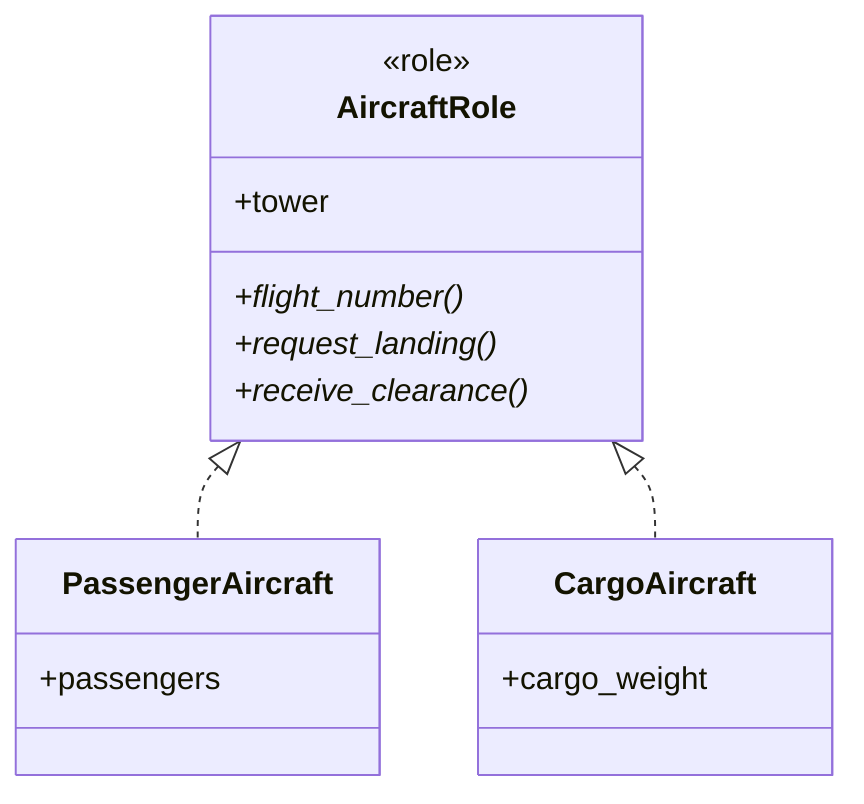

## 前回の振り返り



前回は、管制塔クラスを導入して航空機間の相互依存を解消しました。

今回は、航空機クラスに共通のインターフェースを定義してさらに設計を改善します。

## なぜインターフェースが必要か

現在のAircraftクラスは1種類ですが、実際の空港には様々な航空機がやってきます。ジャンボジェットから小型のプロペラ機まで、サイズも見た目も様々です。

- 旅客機（PassengerAircraft）— お客さんを乗せて飛ぶ
- 貨物機（CargoAircraft）— 荷物専門の働き者
- 小型機（SmallAircraft）— 身軽で小回りが利く

管制塔は、これらすべての航空機と同じ方法で通信できなければなりません。「あなたは旅客機だからこう話して、貨物機はこう…」なんて面倒ですよね。共通のインターフェースがあれば、どんな航空機でも同じ方法で扱えます。

## Aircraft::Roleを定義

Moo::Roleを使って、航空機の共通インターフェースを定義します。Moo::Roleについては、以下のシリーズで詳しく解説しています。



```perl
package Aircraft::Role {
    use Moo::Role;

    requires 'request_landing';
    requires 'receive_clearance';

    has tower => (is => 'rw');
}
```

`requires`で必須メソッドを宣言し、`has`で共通の属性を定義しています。

## 旅客機クラス

Aircraft::Roleを使って旅客機クラスを作ります。

```perl
package PassengerAircraft {
    use Moo;
    with 'Aircraft::Role';

    has flight_number => (is => 'ro', required => 1);
    has passengers => (is => 'ro', default => 0);

    sub request_landing($self) {
        say $self->flight_number . 
            "（旅客機）: 着陸許可をリクエストします";
        $self->tower->request_landing($self);
    }

    sub receive_clearance($self, $cleared) {
        if ($cleared) {
            say $self->flight_number . ": 着陸許可を受信。着陸します";
            $self->tower->notify_landed($self);
        } else {
            say $self->flight_number . ": 待機指示を受信。待機します";
        }
    }
}
```

## 貨物機クラス

同様に貨物機クラスを作ります。

```perl
package CargoAircraft {
    use Moo;
    with 'Aircraft::Role';

    has flight_number => (is => 'ro', required => 1);
    has cargo_weight => (is => 'ro', default => 0);

    sub request_landing($self) {
        say $self->flight_number . 
            "（貨物機）: 着陸許可をリクエストします";
        $self->tower->request_landing($self);
    }

    sub receive_clearance($self, $cleared) {
        if ($cleared) {
            say $self->flight_number . ": 着陸許可を受信。着陸します";
            $self->tower->notify_landed($self);
        } else {
            say $self->flight_number . ": 待機指示を受信。待機します";
        }
    }
}
```

## 管制塔を修正

管制塔からreceive_clearanceを呼び出すように修正します。

```perl
package ControlTower {
    use Moo;

    has aircrafts => (is => 'ro', default => sub { [] });
    has runway_in_use => (is => 'rw', default => 0);

    sub register($self, $aircraft) {
        push @{$self->aircrafts}, $aircraft;
        $aircraft->tower($self);
        say "管制塔: " . $aircraft->flight_number . "を登録しました";
    }

    sub request_landing($self, $aircraft) {
        if ($self->runway_in_use) {
            say "管制塔: " . $aircraft->flight_number . 
                "、滑走路使用中です";
            $aircraft->receive_clearance(0);
            return;
        }
        $self->runway_in_use(1);
        say "管制塔: " . $aircraft->flight_number . 
            "、着陸を許可します";
        $aircraft->receive_clearance(1);
    }

    sub notify_landed($self, $aircraft) {
        $self->runway_in_use(0);
        say "管制塔: " . $aircraft->flight_number . 
            "の着陸を確認。滑走路クリア";
    }
}
```

## 完成コード

```perl
#!/usr/bin/env perl
use v5.36;

package Aircraft::Role {
    use Moo::Role;

    requires 'request_landing';
    requires 'receive_clearance';

    has tower => (is => 'rw');
}

package ControlTower {
    use Moo;

    has aircrafts => (is => 'ro', default => sub { [] });
    has runway_in_use => (is => 'rw', default => 0);

    sub register($self, $aircraft) {
        push @{$self->aircrafts}, $aircraft;
        $aircraft->tower($self);
        say "管制塔: " . $aircraft->flight_number . "を登録しました";
    }

    sub request_landing($self, $aircraft) {
        if ($self->runway_in_use) {
            say "管制塔: " . $aircraft->flight_number . 
                "、滑走路使用中です";
            $aircraft->receive_clearance(0);
            return;
        }
        $self->runway_in_use(1);
        say "管制塔: " . $aircraft->flight_number . 
            "、着陸を許可します";
        $aircraft->receive_clearance(1);
    }

    sub notify_landed($self, $aircraft) {
        $self->runway_in_use(0);
        say "管制塔: " . $aircraft->flight_number . 
            "の着陸を確認。滑走路クリア";
    }
}

package PassengerAircraft {
    use Moo;
    with 'Aircraft::Role';

    has flight_number => (is => 'ro', required => 1);
    has passengers => (is => 'ro', default => 0);

    sub request_landing($self) {
        say $self->flight_number . 
            "（旅客機）: 着陸許可をリクエストします";
        $self->tower->request_landing($self);
    }

    sub receive_clearance($self, $cleared) {
        if ($cleared) {
            say $self->flight_number . ": 着陸許可を受信。着陸します";
            $self->tower->notify_landed($self);
        } else {
            say $self->flight_number . ": 待機指示を受信。待機します";
        }
    }
}

package CargoAircraft {
    use Moo;
    with 'Aircraft::Role';

    has flight_number => (is => 'ro', required => 1);
    has cargo_weight => (is => 'ro', default => 0);

    sub request_landing($self) {
        say $self->flight_number . 
            "（貨物機）: 着陸許可をリクエストします";
        $self->tower->request_landing($self);
    }

    sub receive_clearance($self, $cleared) {
        if ($cleared) {
            say $self->flight_number . ": 着陸許可を受信。着陸します";
            $self->tower->notify_landed($self);
        } else {
            say $self->flight_number . ": 待機指示を受信。待機します";
        }
    }
}

# 管制塔を作成
my $tower = ControlTower->new;

# 旅客機と貨物機を作成
my $passenger = PassengerAircraft->new(
    flight_number => 'JAL123',
    passengers => 180
);
my $cargo = CargoAircraft->new(
    flight_number => 'FDX456',
    cargo_weight => 50000
);

$tower->register($passenger);
$tower->register($cargo);

say "---";

$passenger->request_landing;
say "---";
$cargo->request_landing;
```

実行結果:

```
管制塔: JAL123を登録しました
管制塔: FDX456を登録しました
---
JAL123（旅客機）: 着陸許可をリクエストします
管制塔: JAL123、着陸を許可します
JAL123: 着陸許可を受信。着陸します
管制塔: JAL123の着陸を確認。滑走路クリア
---
FDX456（貨物機）: 着陸許可をリクエストします
管制塔: FDX456、着陸を許可します
FDX456: 着陸許可を受信。着陸します
管制塔: FDX456の着陸を確認。滑走路クリア
```

異なる種類の航空機が同じインターフェースで管制塔と通信できています。

## Roleの効果



- 管制塔はどの種類の航空機でも同じ方法で扱える
- 新しい航空機の種類を追加しても、管制塔のコードを変更する必要がない
- インターフェースを守れば、自由に新しい航空機クラスを作れる

## 今回のまとめ

今回は、Aircraft::Roleで航空機の共通インターフェースを定義しました。

- `requires`で必須メソッドを宣言
- 異なる種類の航空機を統一的に扱える
- 新しい航空機クラスの追加が容易

次回は、滑走路を別のクラスとして分離し、リソース管理の仕組みを実装します。


