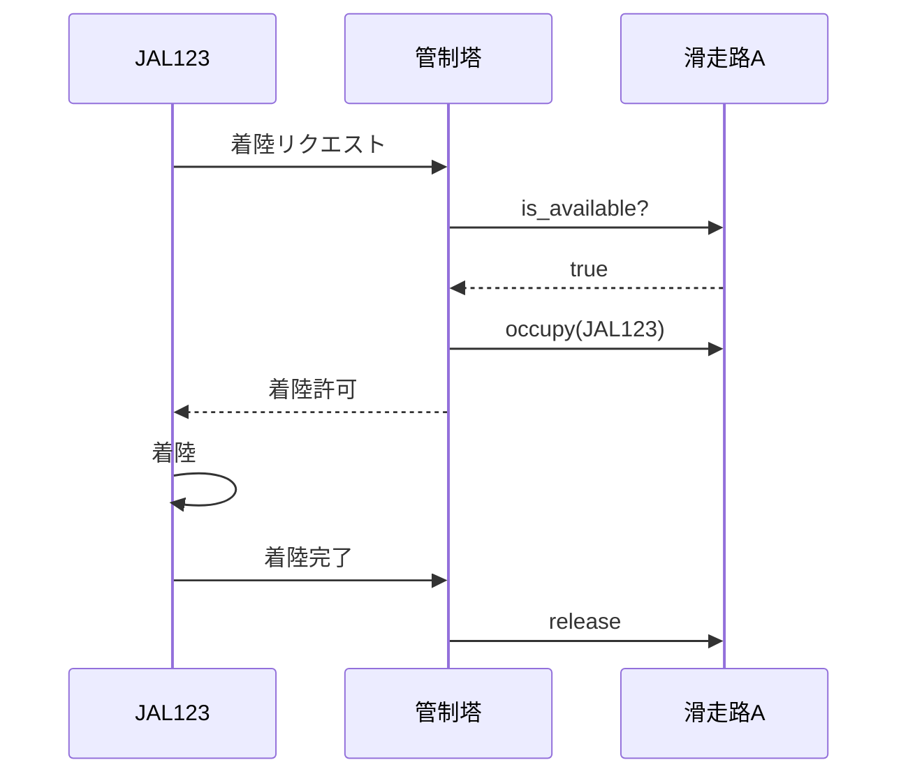

## 前回の振り返り



前回は、Aircraft::Roleを使って航空機の共通インターフェースを定義しました。

今回は、滑走路を別のクラスとして分離し、リソース管理の仕組みを実装します。

## 滑走路クラスの必要性

現在は管制塔の`runway_in_use`フラグで滑走路の状態を管理していますが、これでは少し雑すぎます。実際の空港には複数の滑走路があり、滑走路ごとに「今誰が使っているか」を把握する必要があります。

滑走路は貴重な資源です。滑走路の管理ロジック（使用中かどうかの判定、占有・解放）を独立したクラスにすることで、責任の分離ができます。管制塔は「調整役」に専念し、滑走路は「自分の状態管理」に専念する。それぞれが自分の仕事に集中できる設計です。

## Runwayクラスを作る

滑走路を表すクラスを作りましょう。

```perl
package Runway {
    use Moo;

    has name => (is => 'ro', required => 1);
    has occupied_by => (is => 'rw', default => undef);

    sub is_available($self) {
        return !defined $self->occupied_by;
    }

    sub occupy($self, $aircraft) {
        if (!$self->is_available) {
            return 0;
        }
        $self->occupied_by($aircraft);
        say "滑走路" . $self->name . ": " . 
            $aircraft->flight_number . "が使用開始";
        return 1;
    }

    sub release($self) {
        my $aircraft = $self->occupied_by;
        $self->occupied_by(undef);
        say "滑走路" . $self->name . ": " . 
            $aircraft->flight_number . "が使用終了";
    }
}
```

滑走路の責任:

- 使用可能かどうかを判定する（is_available）
- 航空機に占有される（occupy）
- 解放される（release）

## 管制塔を修正

管制塔がRunwayオブジェクトを使うように修正します。

```perl
package ControlTower {
    use Moo;

    has aircrafts => (is => 'ro', default => sub { [] });
    has runway => (is => 'ro', required => 1);

    sub register($self, $aircraft) {
        push @{$self->aircrafts}, $aircraft;
        $aircraft->tower($self);
        say "管制塔: " . $aircraft->flight_number . "を登録しました";
    }

    sub request_landing($self, $aircraft) {
        if (!$self->runway->is_available) {
            say "管制塔: " . $aircraft->flight_number . 
                "、滑走路使用中です";
            $aircraft->receive_clearance(0);
            return;
        }
        $self->runway->occupy($aircraft);
        say "管制塔: " . $aircraft->flight_number . 
            "、着陸を許可します";
        $aircraft->receive_clearance(1);
    }

    sub notify_landed($self, $aircraft) {
        $self->runway->release;
        say "管制塔: " . $aircraft->flight_number . 
            "の着陸を確認";
    }
}
```

## 完成コード

```perl
#!/usr/bin/env perl
use v5.36;

package Aircraft::Role {
    use Moo::Role;
    requires 'request_landing';
    requires 'receive_clearance';
    has tower => (is => 'rw');
}

package Runway {
    use Moo;

    has name => (is => 'ro', required => 1);
    has occupied_by => (is => 'rw', default => undef);

    sub is_available($self) {
        return !defined $self->occupied_by;
    }

    sub occupy($self, $aircraft) {
        if (!$self->is_available) {
            return 0;
        }
        $self->occupied_by($aircraft);
        say "滑走路" . $self->name . ": " . 
            $aircraft->flight_number . "が使用開始";
        return 1;
    }

    sub release($self) {
        my $aircraft = $self->occupied_by;
        $self->occupied_by(undef);
        say "滑走路" . $self->name . ": " . 
            $aircraft->flight_number . "が使用終了";
    }
}

package ControlTower {
    use Moo;

    has aircrafts => (is => 'ro', default => sub { [] });
    has runway => (is => 'ro', required => 1);

    sub register($self, $aircraft) {
        push @{$self->aircrafts}, $aircraft;
        $aircraft->tower($self);
        say "管制塔: " . $aircraft->flight_number . "を登録しました";
    }

    sub request_landing($self, $aircraft) {
        if (!$self->runway->is_available) {
            say "管制塔: " . $aircraft->flight_number . 
                "、滑走路使用中です";
            $aircraft->receive_clearance(0);
            return;
        }
        $self->runway->occupy($aircraft);
        say "管制塔: " . $aircraft->flight_number . 
            "、着陸を許可します";
        $aircraft->receive_clearance(1);
    }

    sub notify_landed($self, $aircraft) {
        $self->runway->release;
        say "管制塔: " . $aircraft->flight_number . 
            "の着陸を確認";
    }
}

package Aircraft {
    use Moo;
    with 'Aircraft::Role';

    has flight_number => (is => 'ro', required => 1);

    sub request_landing($self) {
        say $self->flight_number . ": 着陸許可をリクエストします";
        $self->tower->request_landing($self);
    }

    sub receive_clearance($self, $cleared) {
        if ($cleared) {
            say $self->flight_number . ": 着陸します";
            $self->tower->notify_landed($self);
        } else {
            say $self->flight_number . ": 待機します";
        }
    }
}

# 滑走路と管制塔を作成
my $runway = Runway->new(name => 'A');
my $tower = ControlTower->new(runway => $runway);

# 航空機を作成して登録
my $flight1 = Aircraft->new(flight_number => 'JAL123');
my $flight2 = Aircraft->new(flight_number => 'ANA456');

$tower->register($flight1);
$tower->register($flight2);

say "---";
$flight1->request_landing;
say "---";
$flight2->request_landing;
```

実行結果:

```
管制塔: JAL123を登録しました
管制塔: ANA456を登録しました
---
JAL123: 着陸許可をリクエストします
滑走路A: JAL123が使用開始
管制塔: JAL123、着陸を許可します
JAL123: 着陸します
滑走路A: JAL123が使用終了
管制塔: JAL123の着陸を確認
---
ANA456: 着陸許可をリクエストします
滑走路A: ANA456が使用開始
管制塔: ANA456、着陸を許可します
ANA456: 着陸します
滑走路A: ANA456が使用終了
管制塔: ANA456の着陸を確認
```

## 排他制御の仕組み



滑走路クラスがリソースの排他制御を担当することで:

- 管制塔の責任が軽減される
- 複数の滑走路を持つ空港も作れる
- 滑走路のロジックをテストしやすい

## 今回のまとめ

今回は、Runwayクラスを分離してリソース管理を実装しました。

- 滑走路は1機ずつしか使えない（排他制御）
- occupy/releaseでリソースの確保・解放を管理
- 単一責任の原則に従った設計

しかし、現在の実装では滑走路が使用中の場合、航空機は待機するだけで二度と着陸できません。次回は、着陸待ちのキューを実装します。


