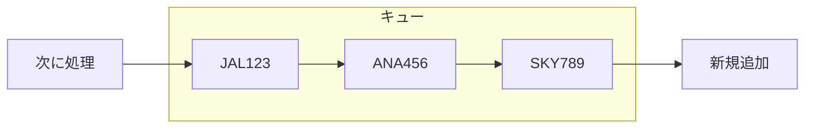

## 前回の振り返り



前回は、滑走路クラスを分離してリソース管理を実装しました。

しかし、滑走路が使用中のとき航空機は待機するだけで、二度と着陸できませんでした。今回は、着陸待ちのキューを実装して、順番に処理できるようにします。

## キューとは

キュー（Queue）は「先入れ先出し」（FIFO: First In, First Out）のデータ構造です。先に並んだものが先に処理されます。



空港の着陸待ちも同じです。先に着陸を要求した航空機から順番に着陸します。

## 管制塔にキューを追加

管制塔にwaiting_queueを追加し、着陸待ちの航空機を管理します。

```perl
package ControlTower {
    use Moo;

    has aircrafts => (is => 'ro', default => sub { [] });
    has runway => (is => 'ro', required => 1);
    has waiting_queue => (is => 'ro', default => sub { [] });

    sub register($self, $aircraft) {
        push @{$self->aircrafts}, $aircraft;
        $aircraft->tower($self);
        say "管制塔: " . $aircraft->flight_number . "を登録しました";
    }

    sub request_landing($self, $aircraft) {
        if (!$self->runway->is_available) {
            say "管制塔: " . $aircraft->flight_number . 
                "、滑走路使用中です。キューに追加します";
            push @{$self->waiting_queue}, $aircraft;
            $aircraft->receive_clearance(0);
            return;
        }
        $self->_grant_landing($aircraft);
    }

    sub _grant_landing($self, $aircraft) {
        $self->runway->occupy($aircraft);
        say "管制塔: " . $aircraft->flight_number . 
            "、着陸を許可します";
        $aircraft->receive_clearance(1);
    }

    sub notify_landed($self, $aircraft) {
        $self->runway->release;
        say "管制塔: " . $aircraft->flight_number . 
            "の着陸を確認";
        $self->_process_queue;
    }

    sub _process_queue($self) {
        if (@{$self->waiting_queue} == 0) {
            say "管制塔: 待機中の航空機はありません";
            return;
        }
        my $next = shift @{$self->waiting_queue};
        say "管制塔: 次は" . $next->flight_number . "です";
        $self->_grant_landing($next);
    }
}
```

ポイント:

- `waiting_queue`: 着陸待ちの航空機を格納する配列
- `_process_queue`: 着陸完了後に次の航空機を処理

## 完成コード

```perl
#!/usr/bin/env perl
use v5.36;

package Aircraft::Role {
    use Moo::Role;
    requires 'request_landing';
    requires 'receive_clearance';
    has tower => (is => 'rw');
}

package Runway {
    use Moo;

    has name => (is => 'ro', required => 1);
    has occupied_by => (is => 'rw', default => undef);

    sub is_available($self) {
        return !defined $self->occupied_by;
    }

    sub occupy($self, $aircraft) {
        $self->occupied_by($aircraft);
        say "滑走路" . $self->name . ": " . 
            $aircraft->flight_number . "が使用開始";
    }

    sub release($self) {
        my $aircraft = $self->occupied_by;
        $self->occupied_by(undef);
        say "滑走路" . $self->name . ": " . 
            $aircraft->flight_number . "が使用終了";
    }
}

package ControlTower {
    use Moo;

    has aircrafts => (is => 'ro', default => sub { [] });
    has runway => (is => 'ro', required => 1);
    has waiting_queue => (is => 'ro', default => sub { [] });

    sub register($self, $aircraft) {
        push @{$self->aircrafts}, $aircraft;
        $aircraft->tower($self);
        say "管制塔: " . $aircraft->flight_number . "を登録しました";
    }

    sub request_landing($self, $aircraft) {
        if (!$self->runway->is_available) {
            say "管制塔: " . $aircraft->flight_number . 
                "、滑走路使用中です。キューに追加します";
            push @{$self->waiting_queue}, $aircraft;
            $aircraft->receive_clearance(0);
            return;
        }
        $self->_grant_landing($aircraft);
    }

    sub _grant_landing($self, $aircraft) {
        $self->runway->occupy($aircraft);
        say "管制塔: " . $aircraft->flight_number . 
            "、着陸を許可します";
        $aircraft->receive_clearance(1);
    }

    sub notify_landed($self, $aircraft) {
        $self->runway->release;
        say "管制塔: " . $aircraft->flight_number . 
            "の着陸を確認";
        $self->_process_queue;
    }

    sub _process_queue($self) {
        if (@{$self->waiting_queue} == 0) {
            say "管制塔: 待機中の航空機はありません";
            return;
        }
        my $next = shift @{$self->waiting_queue};
        say "管制塔: 次は" . $next->flight_number . "です";
        $self->_grant_landing($next);
    }
}

package Aircraft {
    use Moo;
    with 'Aircraft::Role';

    has flight_number => (is => 'ro', required => 1);

    sub request_landing($self) {
        say $self->flight_number . ": 着陸許可をリクエストします";
        $self->tower->request_landing($self);
    }

    sub receive_clearance($self, $cleared) {
        if ($cleared) {
            say $self->flight_number . ": 着陸します";
            $self->tower->notify_landed($self);
        } else {
            say $self->flight_number . ": 待機します";
        }
    }
}

# 滑走路と管制塔を作成
my $runway = Runway->new(name => 'A');
my $tower = ControlTower->new(runway => $runway);

# 航空機を作成して登録
my $flight1 = Aircraft->new(flight_number => 'JAL123');
my $flight2 = Aircraft->new(flight_number => 'ANA456');
my $flight3 = Aircraft->new(flight_number => 'SKY789');

$tower->register($flight1);
$tower->register($flight2);
$tower->register($flight3);

say "=== 全機が同時に着陸をリクエスト ===";

# 全機が同時に着陸をリクエスト
$flight1->request_landing;
say "---";
$flight2->request_landing;
say "---";
$flight3->request_landing;
```

実行結果:

```
管制塔: JAL123を登録しました
管制塔: ANA456を登録しました
管制塔: SKY789を登録しました
=== 全機が同時に着陸をリクエスト ===
JAL123: 着陸許可をリクエストします
滑走路A: JAL123が使用開始
管制塔: JAL123、着陸を許可します
JAL123: 着陸します
滑走路A: JAL123が使用終了
管制塔: JAL123の着陸を確認
管制塔: 待機中の航空機はありません
---
ANA456: 着陸許可をリクエストします
滑走路A: ANA456が使用開始
管制塔: ANA456、着陸を許可します
ANA456: 着陸します
滑走路A: ANA456が使用終了
管制塔: ANA456の着陸を確認
管制塔: 待機中の航空機はありません
---
SKY789: 着陸許可をリクエストします
滑走路A: SKY789が使用開始
管制塔: SKY789、着陸を許可します
SKY789: 着陸します
滑走路A: SKY789が使用終了
管制塔: SKY789の着陸を確認
管制塔: 待機中の航空機はありません
```

この例では着陸が即座に完了するため、キューが溜まっていません。実際の運用では着陸に時間がかかるため、複数の航空機がキューで待機することになります。

## キューの動作確認

キューが正しく動作することを確認するために、着陸完了を遅延させてみましょう。

```perl
# 滑走路が使用中の状態を作る
$runway->occupy($flight1);  # 手動で占有

# その状態で2機がリクエスト
$flight2->request_landing;  # キューに追加
$flight3->request_landing;  # キューに追加

# flight1が着陸完了
$tower->notify_landed($flight1);  # キューから処理開始
```

## 今回のまとめ

今回は、着陸待ちのキューを実装しました。

- 滑走路が使用中なら、waiting_queueに追加
- 着陸完了後、キューから次の航空機を処理
- FIFO（先入れ先出し）で公平に処理

しかし、現実の航空管制では「燃料切れ」などの緊急事態が発生することがあります。次回は、緊急事態の航空機を優先する機能を追加します。


