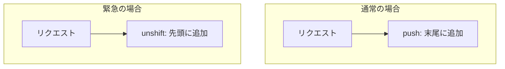

## 前回の振り返り



前回は、着陸待ちのキューを実装し、先着順で公平に処理できるようにしました。

しかし、現実の航空管制では「燃料切れ」「機体トラブル」などの緊急事態が発生することがあります。今回は、緊急事態の航空機を優先する機能を追加します。

## 緊急事態とは

航空管制で「Mayday」や「Pan-Pan」と呼ばれる緊急宣言があります。これらは通常の着陸よりも優先されます。

今回は、以下の優先度を実装します:

- 緊急（emergency）: 最優先で着陸
- 通常（normal）: 先着順

## Aircraftクラスに優先度を追加

航空機に緊急状態を示す属性を追加します。

```perl
package Aircraft {
    use Moo;
    with 'Aircraft::Role';

    has flight_number => (is => 'ro', required => 1);
    has is_emergency => (is => 'rw', default => 0);

    sub declare_emergency($self) {
        $self->is_emergency(1);
        say $self->flight_number . ": MAYDAY! MAYDAY! 緊急事態を宣言します";
    }

    sub request_landing($self) {
        if ($self->is_emergency) {
            say $self->flight_number . ": 緊急着陸を要請します！";
        } else {
            say $self->flight_number . ": 着陸許可をリクエストします";
        }
        $self->tower->request_landing($self);
    }

    sub receive_clearance($self, $cleared) {
        if ($cleared) {
            say $self->flight_number . ": 着陸します";
            $self->tower->notify_landed($self);
        } else {
            say $self->flight_number . ": 待機します";
        }
    }
}
```

## 管制塔で優先度を処理

緊急事態の航空機はキューの先頭に追加します。

```perl
package ControlTower {
    use Moo;

    has aircrafts => (is => 'ro', default => sub { [] });
    has runway => (is => 'ro', required => 1);
    has waiting_queue => (is => 'ro', default => sub { [] });

    sub register($self, $aircraft) {
        push @{$self->aircrafts}, $aircraft;
        $aircraft->tower($self);
        say "管制塔: " . $aircraft->flight_number . "を登録しました";
    }

    sub request_landing($self, $aircraft) {
        if (!$self->runway->is_available) {
            if ($aircraft->is_emergency) {
                # 緊急はキューの先頭に
                say "管制塔: " . $aircraft->flight_number . 
                    "、緊急事態を確認。優先キューに追加します";
                unshift @{$self->waiting_queue}, $aircraft;
            } else {
                say "管制塔: " . $aircraft->flight_number . 
                    "、滑走路使用中です。キューに追加します";
                push @{$self->waiting_queue}, $aircraft;
            }
            $aircraft->receive_clearance(0);
            return;
        }
        $self->_grant_landing($aircraft);
    }

    sub _grant_landing($self, $aircraft) {
        $self->runway->occupy($aircraft);
        if ($aircraft->is_emergency) {
            say "管制塔: " . $aircraft->flight_number . 
                "、緊急着陸を許可します！全機待機！";
        } else {
            say "管制塔: " . $aircraft->flight_number . 
                "、着陸を許可します";
        }
        $aircraft->receive_clearance(1);
    }

    sub notify_landed($self, $aircraft) {
        $self->runway->release;
        say "管制塔: " . $aircraft->flight_number . 
            "の着陸を確認";
        $self->_process_queue;
    }

    sub _process_queue($self) {
        if (@{$self->waiting_queue} == 0) {
            say "管制塔: 待機中の航空機はありません";
            return;
        }
        my $next = shift @{$self->waiting_queue};
        say "管制塔: 次は" . $next->flight_number . "です";
        $self->_grant_landing($next);
    }
}
```

ポイント:

- `unshift`: 緊急時はキューの先頭に追加
- `push`: 通常時はキューの末尾に追加

## 完成コード

```perl
#!/usr/bin/env perl
use v5.36;

package Aircraft::Role {
    use Moo::Role;
    requires 'request_landing';
    requires 'receive_clearance';
    has tower => (is => 'rw');
}

package Runway {
    use Moo;

    has name => (is => 'ro', required => 1);
    has occupied_by => (is => 'rw', default => undef);

    sub is_available($self) {
        return !defined $self->occupied_by;
    }

    sub occupy($self, $aircraft) {
        $self->occupied_by($aircraft);
        say "滑走路" . $self->name . ": " . 
            $aircraft->flight_number . "が使用開始";
    }

    sub release($self) {
        my $aircraft = $self->occupied_by;
        $self->occupied_by(undef);
        say "滑走路" . $self->name . ": " . 
            $aircraft->flight_number . "が使用終了";
    }
}

package ControlTower {
    use Moo;

    has aircrafts => (is => 'ro', default => sub { [] });
    has runway => (is => 'ro', required => 1);
    has waiting_queue => (is => 'ro', default => sub { [] });

    sub register($self, $aircraft) {
        push @{$self->aircrafts}, $aircraft;
        $aircraft->tower($self);
        say "管制塔: " . $aircraft->flight_number . "を登録しました";
    }

    sub request_landing($self, $aircraft) {
        if (!$self->runway->is_available) {
            if ($aircraft->is_emergency) {
                say "管制塔: " . $aircraft->flight_number . 
                    "、緊急事態を確認。優先キューに追加します";
                unshift @{$self->waiting_queue}, $aircraft;
            } else {
                say "管制塔: " . $aircraft->flight_number . 
                    "、滑走路使用中です。キューに追加します";
                push @{$self->waiting_queue}, $aircraft;
            }
            $aircraft->receive_clearance(0);
            return;
        }
        $self->_grant_landing($aircraft);
    }

    sub _grant_landing($self, $aircraft) {
        $self->runway->occupy($aircraft);
        if ($aircraft->is_emergency) {
            say "管制塔: " . $aircraft->flight_number . 
                "、緊急着陸を許可します！全機待機！";
        } else {
            say "管制塔: " . $aircraft->flight_number . 
                "、着陸を許可します";
        }
        $aircraft->receive_clearance(1);
    }

    sub notify_landed($self, $aircraft) {
        $self->runway->release;
        say "管制塔: " . $aircraft->flight_number . 
            "の着陸を確認";
        $self->_process_queue;
    }

    sub _process_queue($self) {
        if (@{$self->waiting_queue} == 0) {
            say "管制塔: 待機中の航空機はありません";
            return;
        }
        my $next = shift @{$self->waiting_queue};
        say "管制塔: 次は" . $next->flight_number . "です";
        $self->_grant_landing($next);
    }
}

package Aircraft {
    use Moo;
    with 'Aircraft::Role';

    has flight_number => (is => 'ro', required => 1);
    has is_emergency => (is => 'rw', default => 0);

    sub declare_emergency($self) {
        $self->is_emergency(1);
        say $self->flight_number . 
            ": MAYDAY! MAYDAY! 緊急事態を宣言します";
    }

    sub request_landing($self) {
        if ($self->is_emergency) {
            say $self->flight_number . ": 緊急着陸を要請します！";
        } else {
            say $self->flight_number . ": 着陸許可をリクエストします";
        }
        $self->tower->request_landing($self);
    }

    sub receive_clearance($self, $cleared) {
        if ($cleared) {
            say $self->flight_number . ": 着陸します";
            $self->tower->notify_landed($self);
        } else {
            say $self->flight_number . ": 待機します";
        }
    }
}

# 滑走路と管制塔を作成
my $runway = Runway->new(name => 'A');
my $tower = ControlTower->new(runway => $runway);

# 航空機を作成して登録
my $flight1 = Aircraft->new(flight_number => 'JAL123');
my $flight2 = Aircraft->new(flight_number => 'ANA456');
my $flight3 = Aircraft->new(flight_number => 'SKY789');

$tower->register($flight1);
$tower->register($flight2);
$tower->register($flight3);

say "=== シナリオ: 緊急事態発生 ===";

# flight1が滑走路を占有
$runway->occupy($flight1);

# flight2が着陸リクエスト（キューに入る）
$flight2->request_landing;

# flight3が緊急事態を宣言してリクエスト
$flight3->declare_emergency;
$flight3->request_landing;

say "--- flight1が着陸完了 ---";
$tower->notify_landed($flight1);
```

実行結果:

```
管制塔: JAL123を登録しました
管制塔: ANA456を登録しました
管制塔: SKY789を登録しました
=== シナリオ: 緊急事態発生 ===
滑走路A: JAL123が使用開始
ANA456: 着陸許可をリクエストします
管制塔: ANA456、滑走路使用中です。キューに追加します
ANA456: 待機します
SKY789: MAYDAY! MAYDAY! 緊急事態を宣言します
SKY789: 緊急着陸を要請します！
管制塔: SKY789、緊急事態を確認。優先キューに追加します
SKY789: 待機します
--- flight1が着陸完了 ---
滑走路A: JAL123が使用終了
管制塔: JAL123の着陸を確認
管制塔: 次はSKY789です
滑走路A: SKY789が使用開始
管制塔: SKY789、緊急着陸を許可します！全機待機！
SKY789: 着陸します
滑走路A: SKY789が使用終了
管制塔: SKY789の着陸を確認
管制塔: 次はANA456です
滑走路A: ANA456が使用開始
管制塔: ANA456、着陸を許可します
ANA456: 着陸します
滑走路A: ANA456が使用終了
管制塔: ANA456の着陸を確認
管制塔: 待機中の航空機はありません
```

ANA456より後にリクエストしたSKY789が、緊急事態により先に着陸できました。

## 優先度キューの仕組み



Perlの配列操作を使って簡易的な優先度キューを実現しています:

- `push`: 末尾に追加（通常）
- `unshift`: 先頭に追加（緊急）

## 今回のまとめ

今回は、緊急事態の航空機を優先する機能を追加しました。

- `is_emergency`属性で緊急状態を管理
- `unshift`で緊急機をキューの先頭に
- 管制塔が優先度を判断して処理

次回はいよいよ最終回。このシリーズで作ってきたものが何だったのか、その正体を明かします。


