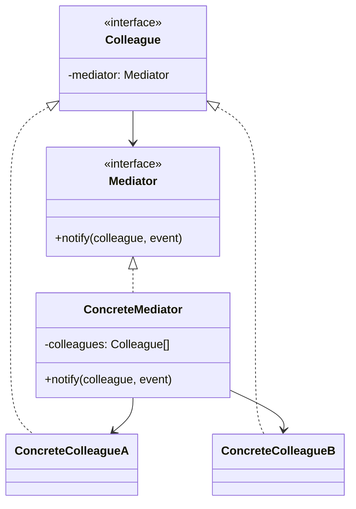
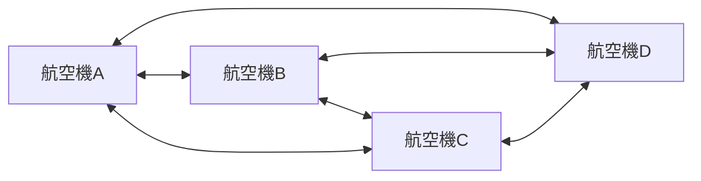
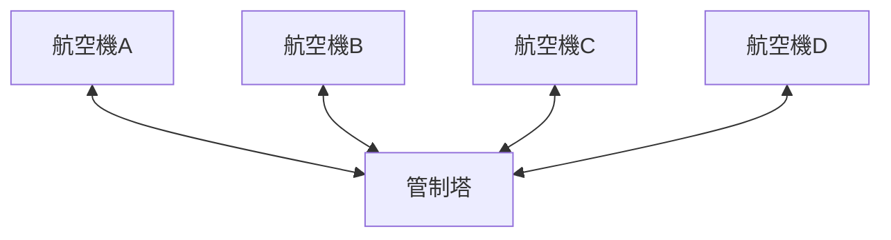
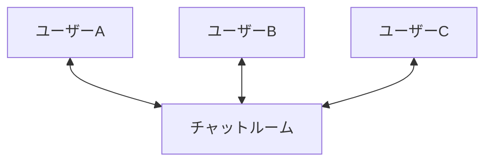

## 前回の振り返り



前回は、緊急事態の航空機を優先する機能を追加しました。

今回はいよいよ最終回。このシリーズで作ってきたものの正体を明かします。

## パターンの名前

このシリーズで作ってきた「管制塔が航空機間の通信を仲介する」という設計には、名前がついています。

GoF（Gang of Four）のデザインパターンの一つ、Mediatorパターン（仲介者パターン）です。

## Mediatorパターンとは

Mediatorパターンは、複数のオブジェクト間の複雑な相互作用を、仲介者オブジェクトにカプセル化するパターンです。



本シリーズでの対応:

| GoFの用語 | 本シリーズの実装 |
|-----------|------------------|
| Mediator | 管制塔のインターフェース |
| ConcreteMediator | ControlTowerクラス |
| Colleague | Aircraft::Role |
| ConcreteColleague | Aircraftクラス（各航空機） |

## なぜMediatorパターンを使うのか

### 問題: N×(N-1)の相互依存

第2回で見たように、オブジェクト同士が直接やり取りすると、相互依存が爆発的に増加します。



### 解決策: 仲介者を通じた通信

Mediatorパターンを使うと、すべての通信が仲介者を経由します。依存関係がシンプルになります。



## Mediatorパターンのメリット

1. 疎結合: 同僚オブジェクト同士は互いを知らない
2. 一元管理: 相互作用のロジックが仲介者に集約される
3. 拡張性: 新しい同僚オブジェクトを追加しても、既存のコードを変更しなくてよい
4. 再利用性: 同僚オブジェクトを別の仲介者と組み合わせて再利用できる

## 他の応用例

Mediatorパターンは様々な場面で活用されています。

### チャットルーム

複数のユーザーがチャットルーム（仲介者）を通じてメッセージをやり取りする。



### GUIダイアログ

ダイアログ内の複数のUI要素（ボタン、テキストフィールド、チェックボックス）がダイアログ（仲介者）を通じて連携する。

### スマートホーム

照明、エアコン、センサーなどのデバイスがスマートホームハブ（仲介者）を通じて協調動作する。

## Observerパターンとの違い

同じGoFパターンのObserverパターンと混同しやすいので、違いを明確にしておきましょう。

| 項目 | Mediatorパターン | Observerパターン |
|-----|-----------------|-----------------|
| 目的 | 相互作用を中央集権化 | 状態変化を通知 |
| 関係 | 多対多（双方向） | 一対多（単方向） |
| 通信の流れ | Colleague ↔ Mediator ↔ Colleague | Subject → Observer |
| 使い所 | 複雑な相互依存の整理 | 状態変化の通知・購読 |

本サイトでは、Observerパターンを使ったシリーズも公開しています。興味があれば読み比べてみてください。





## シリーズ全体の振り返り

全8回を通じて、以下のことを学びました。

| 回 | 学んだこと |
|----|----------|
| 第1回 | 航空機クラスの基本実装 |
| 第2回 | 直接参照による相互依存の問題 |
| 第3回 | 管制塔による仲介の導入 |
| 第4回 | Moo::Roleによるインターフェース定義 |
| 第5回 | 滑走路の排他制御（リソース管理） |
| 第6回 | 着陸待ちキュー（FIFO） |
| 第7回 | 緊急事態の優先処理 |
| 第8回 | Mediatorパターンの解説 |

## 最終コード

シリーズで作成した航空管制シミュレーターの最終版です。

```perl
#!/usr/bin/env perl
use v5.36;

package Aircraft::Role {
    use Moo::Role;
    requires 'request_landing';
    requires 'receive_clearance';
    has tower => (is => 'rw');
}

package Runway {
    use Moo;

    has name => (is => 'ro', required => 1);
    has occupied_by => (is => 'rw', default => undef);

    sub is_available($self) {
        return !defined $self->occupied_by;
    }

    sub occupy($self, $aircraft) {
        $self->occupied_by($aircraft);
        say "滑走路" . $self->name . ": " . 
            $aircraft->flight_number . "が使用開始";
    }

    sub release($self) {
        my $aircraft = $self->occupied_by;
        $self->occupied_by(undef);
        say "滑走路" . $self->name . ": " . 
            $aircraft->flight_number . "が使用終了";
    }
}

package ControlTower {
    use Moo;

    has aircrafts => (is => 'ro', default => sub { [] });
    has runway => (is => 'ro', required => 1);
    has waiting_queue => (is => 'ro', default => sub { [] });

    sub register($self, $aircraft) {
        push @{$self->aircrafts}, $aircraft;
        $aircraft->tower($self);
        say "管制塔: " . $aircraft->flight_number . "を登録";
    }

    sub request_landing($self, $aircraft) {
        if (!$self->runway->is_available) {
            if ($aircraft->is_emergency) {
                say "管制塔: " . $aircraft->flight_number . 
                    " [緊急] 優先キューに追加";
                unshift @{$self->waiting_queue}, $aircraft;
            } else {
                say "管制塔: " . $aircraft->flight_number . 
                    " キューに追加";
                push @{$self->waiting_queue}, $aircraft;
            }
            $aircraft->receive_clearance(0);
            return;
        }
        $self->_grant_landing($aircraft);
    }

    sub _grant_landing($self, $aircraft) {
        $self->runway->occupy($aircraft);
        my $msg = $aircraft->is_emergency ? " [緊急着陸許可]" : " 着陸許可";
        say "管制塔: " . $aircraft->flight_number . $msg;
        $aircraft->receive_clearance(1);
    }

    sub notify_landed($self, $aircraft) {
        $self->runway->release;
        $self->_process_queue;
    }

    sub _process_queue($self) {
        return if @{$self->waiting_queue} == 0;
        my $next = shift @{$self->waiting_queue};
        $self->_grant_landing($next);
    }
}

package Aircraft {
    use Moo;
    with 'Aircraft::Role';

    has flight_number => (is => 'ro', required => 1);
    has is_emergency => (is => 'rw', default => 0);

    sub declare_emergency($self) {
        $self->is_emergency(1);
        say $self->flight_number . ": MAYDAY!";
    }

    sub request_landing($self) {
        $self->tower->request_landing($self);
    }

    sub receive_clearance($self, $cleared) {
        if ($cleared) {
            say $self->flight_number . ": 着陸";
            $self->tower->notify_landed($self);
        }
    }
}

# デモ
my $runway = Runway->new(name => 'A');
my $tower = ControlTower->new(runway => $runway);

my @flights = map { Aircraft->new(flight_number => $_) } 
    qw(JAL123 ANA456 SKY789);

$tower->register($_) for @flights;

say "---";
$_->request_landing for @flights;
```

## まとめ

このシリーズでは、航空管制シミュレーターを題材に、Mediatorパターンを学びました。

- 複数オブジェクト間の相互作用を仲介者に集約
- オブジェクト間の結合度を下げ、保守性を向上
- 新しいオブジェクトの追加が容易

Mediatorパターンは、複雑な相互依存を整理したいときに非常に有効なパターンです。ぜひ自分のプロジェクトでも活用してみてください。

前提知識となる「Mooで覚えるオブジェクト指向プログラミング」シリーズも合わせてどうぞ。


