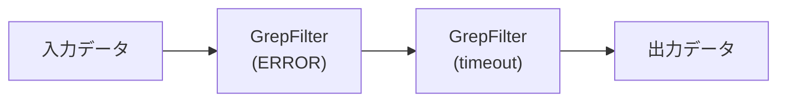

[@nqounet](https://x.com/nqounet)です。

Unixの `cat file.txt | grep "error"` というコマンド、使ったことはありますか？小さなツールを組み合わせて複雑な処理を実現する、Unix哲学の真骨頂ですね。

この「パイプライン」という考え方をPerlのオブジェクト指向で再現してみましょう。今回はその第一歩として、シンプルなテキストフィルターを作ります。

## このシリーズについて

このシリーズは「Mooで覚えるオブジェクト指向プログラミング」シリーズを読了した方を対象に、テキスト処理パイプラインを作りながらオブジェクト指向設計の実践を深く学ぶシリーズです。

全6回を通じて、Chain of Responsibility（責任連鎖）パターンとDecoratorパターンを組み合わせた、拡張しやすいテキスト処理システムを構築します。



## パイプラインとは何か


Unixのパイプラインは、複数のコマンドを `|` で繋げて、前のコマンドの出力を次のコマンドの入力にする仕組みです。

```bash
cat access.log | grep "error" | sort | uniq
```

このコマンドは以下の処理を順番に行います。

1. `cat access.log` でログファイルを読む
2. `grep "error"` で「error」を含む行だけを取り出す
3. `sort` で行をソートする
4. `uniq` で重複を除く

各コマンドは「1つのことをうまくやる」というUnix哲学に従っており、それらを組み合わせることで複雑な処理を実現します。

## Perlでパイプラインを作る方針

同じ考え方をPerlのオブジェクト指向で実現してみましょう。

設計方針は以下の通りです。

- 各フィルターはクラスとして実装する
- フィルターは「入力を受け取り、処理し、次のフィルターに渡す」という共通の振る舞いを持つ
- フィルターを自由に組み合わせてパイプラインを構築できる

これは「Chain of Responsibility（責任連鎖）パターン」と呼ばれるデザインパターンに相当します。

## まずはシンプルなフィルターから

最初に作るのは、GrepFilter（正規表現でフィルタリングするクラス）です。

```perl
package GrepFilter;
use Moo;
use experimental qw(signatures);

has pattern => (
    is       => 'ro',
    required => 1,
);

has next_filter => (
    is        => 'ro',
    predicate => 'has_next_filter',
);

sub process ($self, $lines) {
    my $pattern = $self->pattern;
    my @filtered = grep { /$pattern/ } @$lines;
    
    if ($self->has_next_filter) {
        return $self->next_filter->process(\@filtered);
    }
    return \@filtered;
}

1;
```

このクラスの動作を説明します。

- `pattern` 属性でフィルタリング条件（正規表現）を保持する
- `next_filter` 属性で次のフィルターへの参照を保持する
- `process` メソッドで入力行を処理し、次のフィルターに渡す

ポイントは `process` メソッドの最後の部分です。次のフィルターがあれば、そちらに処理を委譲します。なければ自分の処理結果を返します。

## 実行してみよう

このGrepFilterを使ったサンプルを動かしてみましょう。

```perl
#!/usr/bin/env perl
use v5.36;

# サンプルデータ
my @log_lines = (
    '2026-01-30 10:00:01 INFO: Application started',
    '2026-01-30 10:00:05 ERROR: Connection failed',
    '2026-01-30 10:00:10 INFO: Retrying connection',
    '2026-01-30 10:00:15 ERROR: Database timeout',
    '2026-01-30 10:00:20 INFO: Connection restored',
);

# GrepFilterでERRORを含む行だけを取り出す
my $filter = GrepFilter->new(pattern => 'ERROR');
my $result = $filter->process(\@log_lines);

say "=== ERRORを含む行 ===";
say $_ for @$result;
```

実行結果は以下のようになります。

```
=== ERRORを含む行 ===
2026-01-30 10:00:05 ERROR: Connection failed
2026-01-30 10:00:15 ERROR: Database timeout
```

Unixの `grep ERROR` と同じ結果が得られました。

## フィルターを2つ繋げてみる

次に、2つのフィルターを繋げてみましょう。まず「ERROR」を含む行を取り出し、さらに「timeout」を含む行に絞り込みます。

```perl
# 2つのフィルターを繋げる
my $second_filter = GrepFilter->new(pattern => 'timeout');
my $first_filter = GrepFilter->new(
    pattern     => 'ERROR',
    next_filter => $second_filter,
);

my $result = $first_filter->process(\@log_lines);

say "=== ERRORかつtimeoutを含む行 ===";
say $_ for @$result;
```

実行結果は以下の通りです。

```
=== ERRORかつtimeoutを含む行 ===
2026-01-30 10:00:15 ERROR: Database timeout
```

これはUnixで `grep ERROR | grep timeout` とした結果と同じです。

## Chain of Responsibilityパターンとは

ここまでで実装したのが、Chain of Responsibility（責任連鎖）パターンです。



このパターンの特徴は以下の通りです。

- 各処理（フィルター）は独立したオブジェクトである
- 各オブジェクトは次の処理者への参照を持つ
- リクエスト（データ）は連鎖に沿って順番に処理される
- 処理者を自由に追加・削除・並び替えできる

Unix哲学の「小さなプログラムを組み合わせる」という考え方と非常に相性が良いパターンです。

## 今回のポイント

- Unixのパイプラインをオブジェクト指向で再現する方法を学んだ
- GrepFilterクラスを作成し、正規表現でのフィルタリングを実装した
- フィルターを連鎖させる「Chain of Responsibility」パターンの基礎を理解した
- `next_filter` を使って処理を委譲する仕組みを学んだ

## 今回の完成コード

以下が今回作成したコードの完成版です。

```perl
#!/usr/bin/env perl
# 言語: perl
# バージョン: 5.36以上
# 依存: Moo

use v5.36;

# === GrepFilter ===
package GrepFilter {
    use Moo;
    use experimental qw(signatures);

    has pattern => (
        is       => 'ro',
        required => 1,
    );

    has next_filter => (
        is        => 'ro',
        predicate => 'has_next_filter',
    );

    sub process ($self, $lines) {
        my $pattern = $self->pattern;
        my @filtered = grep { /$pattern/ } @$lines;
        
        if ($self->has_next_filter) {
            return $self->next_filter->process(\@filtered);
        }
        return \@filtered;
    }
}

# === メイン処理 ===
package main {
    # サンプルデータ
    my @log_lines = (
        '2026-01-30 10:00:01 INFO: Application started',
        '2026-01-30 10:00:05 ERROR: Connection failed',
        '2026-01-30 10:00:10 INFO: Retrying connection',
        '2026-01-30 10:00:15 ERROR: Database timeout',
        '2026-01-30 10:00:20 INFO: Connection restored',
    );

    # 単一フィルターの例
    my $single = GrepFilter->new(pattern => 'ERROR');
    my $result1 = $single->process(\@log_lines);
    
    say "=== ERRORを含む行 ===";
    say $_ for @$result1;

    say "";

    # 2つのフィルターを繋げる例
    my $second_filter = GrepFilter->new(pattern => 'timeout');
    my $first_filter = GrepFilter->new(
        pattern     => 'ERROR',
        next_filter => $second_filter,
    );

    my $result2 = $first_filter->process(\@log_lines);
    
    say "=== ERRORかつtimeoutを含む行 ===";
    say $_ for @$result2;
}
```

## 次回予告

次回は、SortFilterやUniqFilterを追加し、複数のフィルターを組み合わせたパイプラインを構築します。そしてDecoratorパターンについても学んでいきます。

お楽しみに！
