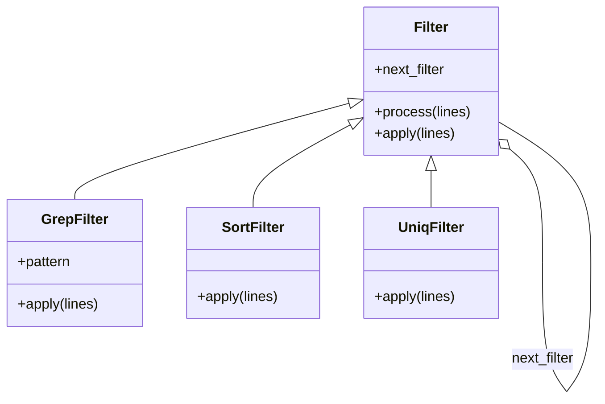

[@nqounet](https://x.com/nqounet)です。

前回は、GrepFilterを作成してChain of Responsibilityパターンの基礎を学びました。今回は、SortFilterとUniqFilterを追加し、Decoratorパターンの考え方も取り入れてみましょう。

## このシリーズについて



## 前回の振り返り

前回はGrepFilterを作成し、フィルターを連鎖させる仕組みを構築しました。

```perl
my $second = GrepFilter->new(pattern => 'timeout');
my $first = GrepFilter->new(
    pattern     => 'ERROR',
    next_filter => $second,
);
```

この方法でも動作しますが、フィルターの種類が増えると、それぞれのクラスに同じような `next_filter` の処理を書く必要が出てきます。これは重複コードの問題（DRY原則違反）につながります。

## 基底クラスを導入する


まずは共通部分を基底クラスに抽出しましょう。

```perl
package Filter;
use Moo;
use experimental qw(signatures);

has next_filter => (
    is        => 'ro',
    predicate => 'has_next_filter',
);

sub process ($self, $lines) {
    my $result = $self->apply($lines);
    
    if ($self->has_next_filter) {
        return $self->next_filter->process($result);
    }
    return $result;
}

sub apply ($self, $lines) {
    # サブクラスでオーバーライドする
    return $lines;
}

1;
```

この設計がDecoratorパターンの核心です。

- `process` メソッドは連鎖の制御を担当する
- `apply` メソッドは各フィルター固有の処理を担当する
- サブクラスは `apply` だけをオーバーライドすればよい

## GrepFilterを書き換える

基底クラスを継承してGrepFilterを書き換えます。

```perl
package GrepFilter;
use Moo;
use experimental qw(signatures);
extends 'Filter';

has pattern => (
    is       => 'ro',
    required => 1,
);

sub apply ($self, $lines) {
    my $pattern = $self->pattern;
    return [grep { /$pattern/ } @$lines];
}

1;
```

コードがとてもシンプルになりました。`apply` メソッドでフィルタリング処理だけを記述すればよくなっています。

## SortFilterを追加する

同様にSortFilterを作成します。

```perl
package SortFilter;
use Moo;
use experimental qw(signatures);
extends 'Filter';

sub apply ($self, $lines) {
    return [sort @$lines];
}

1;
```

驚くほどシンプルです。基底クラスが連鎖処理を担当してくれるため、このクラスはソート処理だけを記述すればよいのです。

## UniqFilterを追加する

重複を除去するUniqFilterも作成します。

```perl
package UniqFilter;
use Moo;
use experimental qw(signatures);
extends 'Filter';

sub apply ($self, $lines) {
    my %seen;
    return [grep { !$seen{$_}++ } @$lines];
}

1;
```

Perlの `%seen` テクニックを使った、重複除去の定番実装です。

## Decoratorパターンとは

ここで、Decoratorパターンについて解説します。



Decoratorパターンのポイントは以下の通りです。

- 元のオブジェクトを包み込んで機能を追加する
- クライアントから見ると、装飾前と同じインターフェースで使える
- 実行時に動的に機能を追加・削除できる

Chain of Responsibilityとの違いを整理すると、こうなります。

| パターン | 目的 | フォーカス |
|---------|------|-----------|
| Chain of Responsibility | リクエストを順番に処理者に渡す | 処理の連鎖と責任の分担 |
| Decorator | オブジェクトに機能を動的に追加 | 機能の拡張と合成 |

今回の実装では、両方のパターンを組み合わせています。連鎖の仕組み（Chain of Responsibility）を使いながら、各フィルターが機能を追加する（Decorator）という設計です。

## 3つのフィルターを繋げてみる

では、GrepFilter、SortFilter、UniqFilterを繋げてみましょう。

```perl
my @log_lines = (
    '2026-01-30 10:00:15 ERROR: Database timeout',
    '2026-01-30 10:00:05 ERROR: Connection failed',
    '2026-01-30 10:00:15 ERROR: Database timeout',
    '2026-01-30 10:00:20 INFO: Connection restored',
    '2026-01-30 10:00:05 ERROR: Connection failed',
);

my $uniq = UniqFilter->new();
my $sort = SortFilter->new(next_filter => $uniq);
my $grep = GrepFilter->new(
    pattern     => 'ERROR',
    next_filter => $sort,
);

my $result = $grep->process(\@log_lines);

say "=== ERROR行をソートして重複除去 ===";
say $_ for @$result;
```

実行結果は以下の通りです。

```
=== ERROR行をソートして重複除去 ===
2026-01-30 10:00:05 ERROR: Connection failed
2026-01-30 10:00:15 ERROR: Database timeout
```

Unixの `grep ERROR | sort | uniq` と同じ結果が得られました。

## 問題点に気づく

今の書き方には問題があります。

```perl
my $uniq = UniqFilter->new();
my $sort = SortFilter->new(next_filter => $uniq);
my $grep = GrepFilter->new(
    pattern     => 'ERROR',
    next_filter => $sort,
);
```

パイプラインを構築するには、逆順にフィルターを作成する必要があります。最後に実行したい処理から先に作成しなければなりません。

これは直感に反しており、コードを読む人にとって混乱の元になります。また、フィルターの順序を変更したい場合にも、大幅な書き換えが必要です。

この問題は次回、パイプラインビルダーを導入することで解決します。

## 今回のポイント

- 基底クラスFilterを導入し、共通処理を抽出した
- SortFilterとUniqFilterを追加した
- Decoratorパターンの考え方を学んだ
- Chain of ResponsibilityとDecoratorの組み合わせを理解した
- 現在の設計の問題点（逆順構築）に気づいた

## 今回の完成コード

以下が今回作成したコードの完成版です。

```perl
#!/usr/bin/env perl
# 言語: perl
# バージョン: 5.36以上
# 依存: Moo

use v5.36;

# === Filter（基底クラス） ===
package Filter {
    use Moo;
    use experimental qw(signatures);

    has next_filter => (
        is        => 'ro',
        predicate => 'has_next_filter',
    );

    sub process ($self, $lines) {
        my $result = $self->apply($lines);
        
        if ($self->has_next_filter) {
            return $self->next_filter->process($result);
        }
        return $result;
    }

    sub apply ($self, $lines) {
        return $lines;
    }
}

# === GrepFilter ===
package GrepFilter {
    use Moo;
    use experimental qw(signatures);
    extends 'Filter';

    has pattern => (
        is       => 'ro',
        required => 1,
    );

    sub apply ($self, $lines) {
        my $pattern = $self->pattern;
        return [grep { /$pattern/ } @$lines];
    }
}

# === SortFilter ===
package SortFilter {
    use Moo;
    use experimental qw(signatures);
    extends 'Filter';

    sub apply ($self, $lines) {
        return [sort @$lines];
    }
}

# === UniqFilter ===
package UniqFilter {
    use Moo;
    use experimental qw(signatures);
    extends 'Filter';

    sub apply ($self, $lines) {
        my %seen;
        return [grep { !$seen{$_}++ } @$lines];
    }
}

# === メイン処理 ===
package main {
    my @log_lines = (
        '2026-01-30 10:00:15 ERROR: Database timeout',
        '2026-01-30 10:00:05 ERROR: Connection failed',
        '2026-01-30 10:00:15 ERROR: Database timeout',
        '2026-01-30 10:00:20 INFO: Connection restored',
        '2026-01-30 10:00:05 ERROR: Connection failed',
    );

    # パイプライン構築（逆順に作成する必要がある）
    my $uniq = UniqFilter->new();
    my $sort = SortFilter->new(next_filter => $uniq);
    my $grep = GrepFilter->new(
        pattern     => 'ERROR',
        next_filter => $sort,
    );

    my $result = $grep->process(\@log_lines);

    say "=== ERROR行をソートして重複除去 ===";
    say $_ for @$result;
}
```

## 次回予告

次回は、逆順構築の問題を解決するためにパイプラインビルダーを導入します。Fluent Interface（流れるようなインターフェース）を使って、直感的にパイプラインを構築できるようにしましょう。

お楽しみに！
