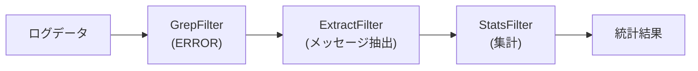

[@nqounet](https://x.com/nqounet)です。

前回は、PipelineBuilderを導入して直感的なパイプライン構築を実現しました。今回は、これまでとは少し異なる種類の処理、集約処理（Aggregator）をパイプラインに追加します。

## このシリーズについて



## 集約処理とは

これまで作成したフィルターは、入力行を加工して出力行として返すものでした。

- GrepFilter: 条件に合う行を抽出する
- SortFilter: 行を並び替える
- UniqFilter: 重複する行を除去する

これらは「行を処理して行を返す」という点で共通しています。

一方、Unixには `wc -l`（行数カウント）や `awk` の統計機能のように、複数の行を集約して別の情報を生成するコマンドもあります。

```bash
# 行数をカウント
cat access.log | grep ERROR | wc -l

# 各行の出現回数をカウント
cat access.log | sort | uniq -c
```

今回は、このような集約処理をパイプラインに追加します。

## CountFilterの実装


まずは行数をカウントするCountFilterを作成します。

```perl
package CountFilter;
use Moo;
use experimental qw(signatures);
extends 'Filter';

sub apply ($self, $lines) {
    my $count = scalar @$lines;
    return ["$count lines"];
}

1;
```

このフィルターは入力行の数をカウントし、結果を1行の文字列として返します。

## StatsFilterの実装

次に、各行の出現回数をカウントするStatsFilterを作成します。これはUnixの `sort | uniq -c` と同等の機能です。

```perl
package StatsFilter;
use Moo;
use experimental qw(signatures);
extends 'Filter';

sub apply ($self, $lines) {
    my %count;
    $count{$_}++ for @$lines;
    
    my @result;
    for my $line (sort { $count{$b} <=> $count{$a} } keys %count) {
        push @result, sprintf("%4d %s", $count{$line}, $line);
    }
    
    return \@result;
}

1;
```

このフィルターはハッシュを使って各行の出現回数をカウントし、出現回数の多い順にソートして返します。

## PipelineBuilderに追加

新しいフィルターをPipelineBuilderに追加します。

```perl
package PipelineBuilder;
use Moo;
use experimental qw(signatures);

has _filters => (
    is      => 'ro',
    default => sub { [] },
);

sub grep ($self, $pattern) {
    push $self->_filters->@*, GrepFilter->new(pattern => $pattern);
    return $self;
}

sub sort ($self) {
    push $self->_filters->@*, SortFilter->new();
    return $self;
}

sub uniq ($self) {
    push $self->_filters->@*, UniqFilter->new();
    return $self;
}

sub count ($self) {
    push $self->_filters->@*, CountFilter->new();
    return $self;
}

sub stats ($self) {
    push $self->_filters->@*, StatsFilter->new();
    return $self;
}

sub build ($self) {
    my @filters = $self->_filters->@*;
    return undef unless @filters;
    
    my $pipeline = pop @filters;
    while (my $filter = pop @filters) {
        $pipeline = $filter->with_next($pipeline);
    }
    
    return $pipeline;
}

1;
```

`count` と `stats` メソッドを追加しました。

## 使ってみる

では、新しいフィルターを使ってみましょう。

```perl
my @log_lines = (
    '2026-01-30 10:00:05 ERROR: Connection failed',
    '2026-01-30 10:00:10 INFO: Retrying connection',
    '2026-01-30 10:00:15 ERROR: Database timeout',
    '2026-01-30 10:00:20 ERROR: Connection failed',
    '2026-01-30 10:00:25 INFO: Connection restored',
    '2026-01-30 10:00:30 ERROR: Database timeout',
    '2026-01-30 10:00:35 ERROR: Database timeout',
);

# ERRORの行数をカウント
my $count_pipeline = PipelineBuilder->new()
    ->grep('ERROR')
    ->count()
    ->build();

say "=== ERROR行数 ===";
say $_ for $count_pipeline->process(\@log_lines)->@*;

# ERRORの種類別に集計
my $stats_pipeline = PipelineBuilder->new()
    ->grep('ERROR')
    ->stats()
    ->build();

say "";
say "=== ERROR種類別集計 ===";
say $_ for $stats_pipeline->process(\@log_lines)->@*;
```

実行結果は以下の通りです。

```
=== ERROR行数 ===
5 lines

=== ERROR種類別集計 ===
   3 2026-01-30 10:00:35 ERROR: Database timeout
   1 2026-01-30 10:00:05 ERROR: Connection failed
   1 2026-01-30 10:00:15 ERROR: Database timeout
   1 2026-01-30 10:00:20 ERROR: Connection failed
   1 2026-01-30 10:00:30 ERROR: Database timeout
```

あれ？結果がおかしいですね。同じ「Database timeout」や「Connection failed」が別の行としてカウントされています。

## 問題：タイムスタンプの影響

問題は、同じエラーでもタイムスタンプが違うため、別の行として扱われていることです。

エラーの種類だけで集計したい場合は、タイムスタンプを除去する必要があります。

## ExtractFilterの追加

特定のパターンを抽出するExtractFilterを作成します。

```perl
package ExtractFilter;
use Moo;
use experimental qw(signatures);
extends 'Filter';

has pattern => (
    is       => 'ro',
    required => 1,
);

sub _clone_attributes ($self) {
    return (pattern => $self->pattern);
}

sub apply ($self, $lines) {
    my $pattern = $self->pattern;
    my @result;
    
    for my $line (@$lines) {
        if ($line =~ /$pattern/) {
            push @result, $1 // $&;
        }
    }
    
    return \@result;
}

1;
```

このフィルターは、正規表現にマッチした部分（キャプチャグループがあればその内容）を抽出します。

## PipelineBuilderに追加

```perl
sub extract ($self, $pattern) {
    push $self->_filters->@*, ExtractFilter->new(pattern => $pattern);
    return $self;
}
```

## 改善版で試す

```perl
# エラーメッセージ部分だけを抽出して集計
my $extract_pipeline = PipelineBuilder->new()
    ->grep('ERROR')
    ->extract('ERROR: (.+)')
    ->stats()
    ->build();

say "=== エラー種類別集計（改善版） ===";
say $_ for $extract_pipeline->process(\@log_lines)->@*;
```

実行結果は以下の通りです。

```
=== エラー種類別集計（改善版） ===
   3 Database timeout
   2 Connection failed
```

期待通りの結果が得られました。

## パイプラインの柔軟性

今回の例で、パイプラインの柔軟性が実感できたのではないでしょうか。



各フィルターは単一の責任を持ち、それらを組み合わせることで複雑な処理を実現しています。これはSOLID原則の単一責任の原則（SRP）に従った設計です。

## 今回のポイント

- 集約処理（Aggregator）の概念を学んだ
- CountFilterで行数カウントを実装した
- StatsFilterで出現頻度の集計を実装した
- ExtractFilterでパターン抽出を実装した
- フィルターを組み合わせて複雑な処理を実現した

## 今回の完成コード

以下が今回作成したコードの完成版です。

```perl
#!/usr/bin/env perl
# 言語: perl
# バージョン: 5.36以上
# 依存: Moo

use v5.36;

# === Filter（基底クラス） ===
package Filter {
    use Moo;
    use experimental qw(signatures);

    has next_filter => (
        is        => 'ro',
        predicate => 'has_next_filter',
    );

    sub with_next ($self, $next) {
        return ref($self)->new(
            $self->_clone_attributes(),
            next_filter => $next,
        );
    }

    sub _clone_attributes ($self) {
        return ();
    }

    sub process ($self, $lines) {
        my $result = $self->apply($lines);
        
        if ($self->has_next_filter) {
            return $self->next_filter->process($result);
        }
        return $result;
    }

    sub apply ($self, $lines) {
        return $lines;
    }
}

# === GrepFilter ===
package GrepFilter {
    use Moo;
    use experimental qw(signatures);
    extends 'Filter';

    has pattern => (
        is       => 'ro',
        required => 1,
    );

    sub _clone_attributes ($self) {
        return (pattern => $self->pattern);
    }

    sub apply ($self, $lines) {
        my $pattern = $self->pattern;
        return [grep { /$pattern/ } @$lines];
    }
}

# === SortFilter ===
package SortFilter {
    use Moo;
    use experimental qw(signatures);
    extends 'Filter';

    sub apply ($self, $lines) {
        return [sort @$lines];
    }
}

# === UniqFilter ===
package UniqFilter {
    use Moo;
    use experimental qw(signatures);
    extends 'Filter';

    sub apply ($self, $lines) {
        my %seen;
        return [grep { !$seen{$_}++ } @$lines];
    }
}

# === CountFilter ===
package CountFilter {
    use Moo;
    use experimental qw(signatures);
    extends 'Filter';

    sub apply ($self, $lines) {
        my $count = scalar @$lines;
        return ["$count lines"];
    }
}

# === StatsFilter ===
package StatsFilter {
    use Moo;
    use experimental qw(signatures);
    extends 'Filter';

    sub apply ($self, $lines) {
        my %count;
        $count{$_}++ for @$lines;
        
        my @result;
        for my $line (sort { $count{$b} <=> $count{$a} } keys %count) {
            push @result, sprintf("%4d %s", $count{$line}, $line);
        }
        
        return \@result;
    }
}

# === ExtractFilter ===
package ExtractFilter {
    use Moo;
    use experimental qw(signatures);
    extends 'Filter';

    has pattern => (
        is       => 'ro',
        required => 1,
    );

    sub _clone_attributes ($self) {
        return (pattern => $self->pattern);
    }

    sub apply ($self, $lines) {
        my $pattern = $self->pattern;
        my @result;
        
        for my $line (@$lines) {
            if ($line =~ /$pattern/) {
                push @result, $1 // $&;
            }
        }
        
        return \@result;
    }
}

# === PipelineBuilder ===
package PipelineBuilder {
    use Moo;
    use experimental qw(signatures);

    has _filters => (
        is      => 'ro',
        default => sub { [] },
    );

    sub grep ($self, $pattern) {
        push $self->_filters->@*, GrepFilter->new(pattern => $pattern);
        return $self;
    }

    sub sort ($self) {
        push $self->_filters->@*, SortFilter->new();
        return $self;
    }

    sub uniq ($self) {
        push $self->_filters->@*, UniqFilter->new();
        return $self;
    }

    sub count ($self) {
        push $self->_filters->@*, CountFilter->new();
        return $self;
    }

    sub stats ($self) {
        push $self->_filters->@*, StatsFilter->new();
        return $self;
    }

    sub extract ($self, $pattern) {
        push $self->_filters->@*, ExtractFilter->new(pattern => $pattern);
        return $self;
    }

    sub build ($self) {
        my @filters = $self->_filters->@*;
        return undef unless @filters;
        
        my $pipeline = pop @filters;
        while (my $filter = pop @filters) {
            $pipeline = $filter->with_next($pipeline);
        }
        
        return $pipeline;
    }
}

# === メイン処理 ===
package main {
    my @log_lines = (
        '2026-01-30 10:00:05 ERROR: Connection failed',
        '2026-01-30 10:00:10 INFO: Retrying connection',
        '2026-01-30 10:00:15 ERROR: Database timeout',
        '2026-01-30 10:00:20 ERROR: Connection failed',
        '2026-01-30 10:00:25 INFO: Connection restored',
        '2026-01-30 10:00:30 ERROR: Database timeout',
        '2026-01-30 10:00:35 ERROR: Database timeout',
    );

    # ERRORの行数をカウント
    my $count_pipeline = PipelineBuilder->new()
        ->grep('ERROR')
        ->count()
        ->build();

    say "=== ERROR行数 ===";
    say $_ for $count_pipeline->process(\@log_lines)->@*;

    say "";

    # エラーメッセージ部分だけを抽出して集計
    my $extract_pipeline = PipelineBuilder->new()
        ->grep('ERROR')
        ->extract('ERROR: (.+)')
        ->stats()
        ->build();

    say "=== エラー種類別集計 ===";
    say $_ for $extract_pipeline->process(\@log_lines)->@*;
}
```

## 次回予告

次回は、実践的なアクセスログ解析パイプラインを構築します。Apache/Nginxのアクセスログから、アクセス数の多いURLや時間帯別のアクセス数など、実務で役立つ解析を行いましょう。

お楽しみに！
