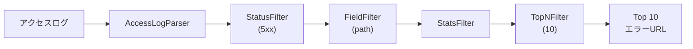

[@nqounet](https://x.com/nqounet)です。

前回は、集約処理（Aggregator）を学び、CountFilterやStatsFilterを追加しました。今回は、これまでに作ったフィルターを組み合わせて、実践的なアクセスログ解析パイプラインを構築します。

## このシリーズについて



## Apacheアクセスログの形式

Apache（やNginx）のアクセスログは、以下のような形式で記録されます。

```
192.168.1.1 - - [30/Jan/2026:10:00:01 +0900] "GET /index.html HTTP/1.1" 200 1234
192.168.1.2 - - [30/Jan/2026:10:00:02 +0900] "GET /api/users HTTP/1.1" 200 567
192.168.1.1 - - [30/Jan/2026:10:00:03 +0900] "POST /api/login HTTP/1.1" 401 89
```

各フィールドの意味は以下の通りです。

- IPアドレス
- 識別子（通常 `-`）
- ユーザー名（通常 `-`）
- 日時
- リクエスト（メソッド、パス、プロトコル）
- ステータスコード
- レスポンスサイズ

## ログパーサーの作成


まず、アクセスログの各フィールドを解析するパーサーを作成します。

```perl
package AccessLogParser {
    use Moo;
    use experimental qw(signatures);
    extends 'Filter';

    my $LOG_PATTERN = qr{
        ^
        (\S+)           # IP
        \s+\S+\s+\S+    # ident, user
        \s+\[(.+?)\]    # datetime
        \s+"(\S+)\s+(\S+)\s+\S+"  # method, path
        \s+(\d+)        # status
        \s+(\d+|-)      # size
    }x;

    sub apply ($self, $lines) {
        my @result;
        
        for my $line (@$lines) {
            if ($line =~ $LOG_PATTERN) {
                push @result, {
                    ip       => $1,
                    datetime => $2,
                    method   => $3,
                    path     => $4,
                    status   => $5,
                    size     => $6 eq '-' ? 0 : $6,
                    raw      => $line,
                };
            }
        }
        
        return \@result;
    }
}

1;
```

このパーサーはログ行をハッシュリファレンスに変換します。`apply` メソッドの戻り値が文字列の配列ではなくハッシュリファレンスの配列になっている点に注目してください。

## FieldFilterの作成

パース済みのデータから特定のフィールドを取り出すフィルターを作成します。

```perl
package FieldFilter {
    use Moo;
    use experimental qw(signatures);
    extends 'Filter';

    has field => (
        is       => 'ro',
        required => 1,
    );

    sub _clone_attributes ($self) {
        return (field => $self->field);
    }

    sub apply ($self, $records) {
        my $field = $self->field;
        return [map { $_->{$field} } @$records];
    }
}

1;
```

## StatusFilterの作成

HTTPステータスコードでフィルタリングするフィルターを作成します。

```perl
package StatusFilter {
    use Moo;
    use experimental qw(signatures);
    extends 'Filter';

    has status => (
        is       => 'ro',
        required => 1,
    );

    sub _clone_attributes ($self) {
        return (status => $self->status);
    }

    sub apply ($self, $records) {
        my $status = $self->status;
        
        # パターンマッチ（4xx, 5xx など）と完全一致をサポート
        if ($status =~ /x/) {
            my $pattern = $status;
            $pattern =~ s/x/\\d/g;
            return [grep { $_->{status} =~ /^$pattern$/ } @$records];
        }
        
        return [grep { $_->{status} eq $status } @$records];
    }
}

1;
```

`4xx` や `5xx` のようなパターンで、400番台・500番台のエラーをまとめて抽出できます。

## TopNFilterの作成

上位N件を取得するフィルターを作成します。

```perl
package TopNFilter {
    use Moo;
    use experimental qw(signatures);
    extends 'Filter';

    has n => (
        is      => 'ro',
        default => 10,
    );

    sub _clone_attributes ($self) {
        return (n => $self->n);
    }

    sub apply ($self, $lines) {
        my $n = $self->n;
        my @top = @$lines[0 .. ($n < @$lines ? $n - 1 : $#$lines)];
        return \@top;
    }
}

1;
```

## PipelineBuilderの拡張

新しいフィルターをPipelineBuilderに追加します。

```perl
sub parse_access_log ($self) {
    push $self->_filters->@*, AccessLogParser->new();
    return $self;
}

sub field ($self, $name) {
    push $self->_filters->@*, FieldFilter->new(field => $name);
    return $self;
}

sub status ($self, $code) {
    push $self->_filters->@*, StatusFilter->new(status => $code);
    return $self;
}

sub top ($self, $n = 10) {
    push $self->_filters->@*, TopNFilter->new(n => $n);
    return $self;
}
```

## 実践：Top 10 URLを抽出

では、実際にアクセスログを解析してみましょう。

```perl
my @access_log = (
    '192.168.1.1 - - [30/Jan/2026:10:00:01 +0900] "GET /index.html HTTP/1.1" 200 1234',
    '192.168.1.2 - - [30/Jan/2026:10:00:02 +0900] "GET /api/users HTTP/1.1" 200 567',
    '192.168.1.3 - - [30/Jan/2026:10:00:03 +0900] "GET /index.html HTTP/1.1" 200 1234',
    '192.168.1.1 - - [30/Jan/2026:10:00:04 +0900] "GET /api/users HTTP/1.1" 200 567',
    '192.168.1.2 - - [30/Jan/2026:10:00:05 +0900] "POST /api/login HTTP/1.1" 401 89',
    '192.168.1.4 - - [30/Jan/2026:10:00:06 +0900] "GET /index.html HTTP/1.1" 200 1234',
    '192.168.1.3 - - [30/Jan/2026:10:00:07 +0900] "GET /api/products HTTP/1.1" 500 0',
    '192.168.1.1 - - [30/Jan/2026:10:00:08 +0900] "GET /index.html HTTP/1.1" 200 1234',
    '192.168.1.5 - - [30/Jan/2026:10:00:09 +0900] "GET /api/users HTTP/1.1" 200 567',
    '192.168.1.2 - - [30/Jan/2026:10:00:10 +0900] "GET /favicon.ico HTTP/1.1" 404 0',
);

# Top 10 URL（アクセス数順）
my $top_urls = PipelineBuilder->new()
    ->parse_access_log()
    ->field('path')
    ->stats()
    ->top(10)
    ->build();

say "=== Top 10 URL ===";
say $_ for $top_urls->process(\@access_log)->@*;
```

実行結果は以下の通りです。

```
=== Top 10 URL ===
   4 /index.html
   3 /api/users
   1 /api/login
   1 /api/products
   1 /favicon.ico
```

## 実践：エラーログの分析

4xx/5xxエラーを抽出してみましょう。

```perl
# 4xxエラーのURL
my $client_errors = PipelineBuilder->new()
    ->parse_access_log()
    ->status('4xx')
    ->field('path')
    ->stats()
    ->build();

say "=== 4xx クライアントエラー ===";
say $_ for $client_errors->process(\@access_log)->@*;

# 5xxエラーのURL
my $server_errors = PipelineBuilder->new()
    ->parse_access_log()
    ->status('5xx')
    ->field('path')
    ->stats()
    ->build();

say "";
say "=== 5xx サーバーエラー ===";
say $_ for $server_errors->process(\@access_log)->@*;
```

実行結果は以下の通りです。

```
=== 4xx クライアントエラー ===
   1 /api/login
   1 /favicon.ico

=== 5xx サーバーエラー ===
   1 /api/products
```

## 実践：IP別アクセス数

```perl
my $top_ips = PipelineBuilder->new()
    ->parse_access_log()
    ->field('ip')
    ->stats()
    ->build();

say "=== IP別アクセス数 ===";
say $_ for $top_ips->process(\@access_log)->@*;
```

実行結果は以下の通りです。

```
=== IP別アクセス数 ===
   3 192.168.1.1
   3 192.168.1.2
   2 192.168.1.3
   1 192.168.1.4
   1 192.168.1.5
```

## パイプラインの組み合わせの柔軟性

今回作成したフィルターを組み合わせることで、様々な解析が可能です。



各フィルターは単一の責任を持ち、それらを自由に組み合わせることで複雑な解析を実現しています。

## 今回のポイント

- Apacheアクセスログのパーサーを実装した
- 構造化データ（ハッシュリファレンス）を扱うフィルターを作成した
- FieldFilter、StatusFilter、TopNFilterを追加した
- 実践的なログ解析シナリオを体験した

## 今回の完成コード

以下が今回作成したコードの完成版です。

```perl
#!/usr/bin/env perl
# 言語: perl
# バージョン: 5.36以上
# 依存: Moo

use v5.36;

# === Filter（基底クラス） ===
package Filter {
    use Moo;
    use experimental qw(signatures);

    has next_filter => (
        is        => 'ro',
        predicate => 'has_next_filter',
    );

    sub with_next ($self, $next) {
        return ref($self)->new(
            $self->_clone_attributes(),
            next_filter => $next,
        );
    }

    sub _clone_attributes ($self) {
        return ();
    }

    sub process ($self, $lines) {
        my $result = $self->apply($lines);
        
        if ($self->has_next_filter) {
            return $self->next_filter->process($result);
        }
        return $result;
    }

    sub apply ($self, $lines) {
        return $lines;
    }
}

# === StatsFilter ===
package StatsFilter {
    use Moo;
    use experimental qw(signatures);
    extends 'Filter';

    sub apply ($self, $lines) {
        my %count;
        $count{$_}++ for @$lines;
        
        my @result;
        for my $line (sort { $count{$b} <=> $count{$a} } keys %count) {
            push @result, sprintf("%4d %s", $count{$line}, $line);
        }
        
        return \@result;
    }
}

# === TopNFilter ===
package TopNFilter {
    use Moo;
    use experimental qw(signatures);
    extends 'Filter';

    has n => (
        is      => 'ro',
        default => 10,
    );

    sub _clone_attributes ($self) {
        return (n => $self->n);
    }

    sub apply ($self, $lines) {
        my $n = $self->n;
        my @top = @$lines[0 .. ($n < @$lines ? $n - 1 : $#$lines)];
        return \@top;
    }
}

# === AccessLogParser ===
package AccessLogParser {
    use Moo;
    use experimental qw(signatures);
    extends 'Filter';

    my $LOG_PATTERN = qr{
        ^
        (\S+)           # IP
        \s+\S+\s+\S+    # ident, user
        \s+\[(.+?)\]    # datetime
        \s+"(\S+)\s+(\S+)\s+\S+"  # method, path
        \s+(\d+)        # status
        \s+(\d+|-)      # size
    }x;

    sub apply ($self, $lines) {
        my @result;
        
        for my $line (@$lines) {
            if ($line =~ $LOG_PATTERN) {
                push @result, {
                    ip       => $1,
                    datetime => $2,
                    method   => $3,
                    path     => $4,
                    status   => $5,
                    size     => $6 eq '-' ? 0 : $6,
                    raw      => $line,
                };
            }
        }
        
        return \@result;
    }
}

# === FieldFilter ===
package FieldFilter {
    use Moo;
    use experimental qw(signatures);
    extends 'Filter';

    has field => (
        is       => 'ro',
        required => 1,
    );

    sub _clone_attributes ($self) {
        return (field => $self->field);
    }

    sub apply ($self, $records) {
        my $field = $self->field;
        return [map { $_->{$field} } @$records];
    }
}

# === StatusFilter ===
package StatusFilter {
    use Moo;
    use experimental qw(signatures);
    extends 'Filter';

    has status => (
        is       => 'ro',
        required => 1,
    );

    sub _clone_attributes ($self) {
        return (status => $self->status);
    }

    sub apply ($self, $records) {
        my $status = $self->status;
        
        if ($status =~ /x/) {
            my $pattern = $status;
            $pattern =~ s/x/\\d/g;
            return [grep { $_->{status} =~ /^$pattern$/ } @$records];
        }
        
        return [grep { $_->{status} eq $status } @$records];
    }
}

# === PipelineBuilder ===
package PipelineBuilder {
    use Moo;
    use experimental qw(signatures);

    has _filters => (
        is      => 'ro',
        default => sub { [] },
    );

    sub parse_access_log ($self) {
        push $self->_filters->@*, AccessLogParser->new();
        return $self;
    }

    sub field ($self, $name) {
        push $self->_filters->@*, FieldFilter->new(field => $name);
        return $self;
    }

    sub status ($self, $code) {
        push $self->_filters->@*, StatusFilter->new(status => $code);
        return $self;
    }

    sub stats ($self) {
        push $self->_filters->@*, StatsFilter->new();
        return $self;
    }

    sub top ($self, $n = 10) {
        push $self->_filters->@*, TopNFilter->new(n => $n);
        return $self;
    }

    sub build ($self) {
        my @filters = $self->_filters->@*;
        return undef unless @filters;
        
        my $pipeline = pop @filters;
        while (my $filter = pop @filters) {
            $pipeline = $filter->with_next($pipeline);
        }
        
        return $pipeline;
    }
}

# === メイン処理 ===
package main {
    my @access_log = (
        '192.168.1.1 - - [30/Jan/2026:10:00:01 +0900] "GET /index.html HTTP/1.1" 200 1234',
        '192.168.1.2 - - [30/Jan/2026:10:00:02 +0900] "GET /api/users HTTP/1.1" 200 567',
        '192.168.1.3 - - [30/Jan/2026:10:00:03 +0900] "GET /index.html HTTP/1.1" 200 1234',
        '192.168.1.1 - - [30/Jan/2026:10:00:04 +0900] "GET /api/users HTTP/1.1" 200 567',
        '192.168.1.2 - - [30/Jan/2026:10:00:05 +0900] "POST /api/login HTTP/1.1" 401 89',
        '192.168.1.4 - - [30/Jan/2026:10:00:06 +0900] "GET /index.html HTTP/1.1" 200 1234',
        '192.168.1.3 - - [30/Jan/2026:10:00:07 +0900] "GET /api/products HTTP/1.1" 500 0',
        '192.168.1.1 - - [30/Jan/2026:10:00:08 +0900] "GET /index.html HTTP/1.1" 200 1234',
        '192.168.1.5 - - [30/Jan/2026:10:00:09 +0900] "GET /api/users HTTP/1.1" 200 567',
        '192.168.1.2 - - [30/Jan/2026:10:00:10 +0900] "GET /favicon.ico HTTP/1.1" 404 0',
    );

    # Top 10 URL
    my $top_urls = PipelineBuilder->new()
        ->parse_access_log()
        ->field('path')
        ->stats()
        ->top(10)
        ->build();

    say "=== Top 10 URL ===";
    say $_ for $top_urls->process(\@access_log)->@*;

    say "";

    # IP別アクセス数
    my $top_ips = PipelineBuilder->new()
        ->parse_access_log()
        ->field('ip')
        ->stats()
        ->build();

    say "=== IP別アクセス数 ===";
    say $_ for $top_ips->process(\@access_log)->@*;

    say "";

    # 4xxエラー
    my $client_errors = PipelineBuilder->new()
        ->parse_access_log()
        ->status('4xx')
        ->field('path')
        ->stats()
        ->build();

    say "=== 4xx クライアントエラー ===";
    say $_ for $client_errors->process(\@access_log)->@*;
}
```

## 次回予告

次回はいよいよ最終回。プラグイン機構を導入し、外部からカスタムフィルターを動的に読み込む仕組みを作ります。これでテキスト処理パイプラインの拡張性は究極の領域に到達します。

お楽しみに！
