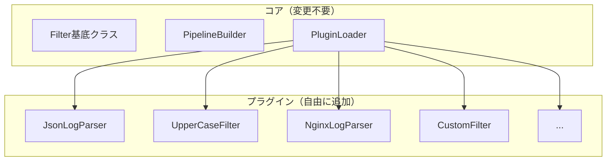

[@nqounet](https://x.com/nqounet)です。

いよいよ最終回です。前回までに、様々なフィルターを実装してパイプラインを構築してきました。今回は、プラグイン機構を導入して、外部からカスタムフィルターを動的に読み込めるようにします。

## このシリーズについて



## なぜプラグイン機構が必要なのか

これまでに作成したフィルターは以下の通りです。

- GrepFilter
- SortFilter
- UniqFilter
- CountFilter
- StatsFilter
- ExtractFilter
- AccessLogParser
- FieldFilter
- StatusFilter
- TopNFilter

すでに10種類ものフィルターがあります。しかし、実際の業務ではさらに多くのフィルターが必要になるでしょう。

- Nginx専用のログパーサー
- JSONログのパーサー
- 特定のビジネスロジックに基づくフィルター
- 社内独自フォーマットの変換フィルター

これらすべてをパイプラインのコア部分に組み込んでいたら、コードは肥大化し、保守が困難になります。

解決策は、フィルターをプラグインとして外部化し、必要なものだけを動的に読み込む仕組みを作ることです。

## プラグインローダーの設計

プラグインは以下の規約に従うものとします。

- `Pipeline::Plugin::Xxx` という名前空間を持つ
- `Filter` クラスを継承している
- 特定のディレクトリに配置されている

これに基づいてプラグインローダーを実装します。


```perl
package Pipeline::PluginLoader;
use Moo;
use experimental qw(signatures);
use File::Find qw(find);

has plugin_dirs => (
    is      => 'ro',
    default => sub { ['./plugins'] },
);

has _loaded => (
    is      => 'ro',
    default => sub { {} },
);

sub load_all ($self) {
    my @plugins;
    
    for my $dir ($self->plugin_dirs->@*) {
        next unless -d $dir;
        
        find(sub {
            return unless /\.pm$/;
            my $file = $File::Find::name;
            push @plugins, $self->load_plugin($file);
        }, $dir);
    }
    
    return @plugins;
}

sub load_plugin ($self, $file) {
    return $self->_loaded->{$file} if exists $self->_loaded->{$file};
    
    my $package = $self->_file_to_package($file);
    
    eval { require $file };
    if ($@) {
        warn "Failed to load plugin $file: $@";
        return;
    }
    
    $self->_loaded->{$file} = $package;
    return $package;
}

sub _file_to_package ($self, $file) {
    my $package = $file;
    $package =~ s{^\./plugins/}{};
    $package =~ s{/}{::}g;
    $package =~ s{\.pm$}{};
    return "Pipeline::Plugin::$package";
}

1;
```

## プラグインの例：JsonLogParser

JSONフォーマットのログを解析するプラグインを作成してみましょう。

`plugins/JsonLogParser.pm`:

```perl
package Pipeline::Plugin::JsonLogParser;
use Moo;
use experimental qw(signatures);
use JSON::PP qw(decode_json);
extends 'Filter';

sub apply ($self, $lines) {
    my @result;
    
    for my $line (@$lines) {
        eval {
            my $data = decode_json($line);
            push @result, $data;
        };
        if ($@) {
            warn "Failed to parse JSON: $line";
        }
    }
    
    return \@result;
}

1;
```

## プラグインの例：UpperCaseFilter

テキストを大文字に変換するシンプルなプラグインです。

`plugins/UpperCaseFilter.pm`:

```perl
package Pipeline::Plugin::UpperCaseFilter;
use Moo;
use experimental qw(signatures);
extends 'Filter';

sub apply ($self, $lines) {
    return [map { uc($_) } @$lines];
}

1;
```

## プラグインをPipelineBuilderに統合

PipelineBuilderにプラグインを使うためのメソッドを追加します。

```perl
package PipelineBuilder;
use Moo;
use experimental qw(signatures);

has _filters => (
    is      => 'ro',
    default => sub { [] },
);

has plugin_loader => (
    is      => 'ro',
    lazy    => 1,
    builder => sub { Pipeline::PluginLoader->new() },
);

sub use_plugin ($self, $name, %args) {
    my $package = "Pipeline::Plugin::$name";
    
    # プラグインがロードされていなければロード
    eval "require $package";
    if ($@) {
        die "Failed to load plugin $name: $@";
    }
    
    push $self->_filters->@*, $package->new(%args);
    return $self;
}

# 既存のメソッドは省略...

sub build ($self) {
    my @filters = $self->_filters->@*;
    return undef unless @filters;
    
    my $pipeline = pop @filters;
    while (my $filter = pop @filters) {
        $pipeline = $filter->with_next($pipeline);
    }
    
    return $pipeline;
}

1;
```

## プラグインを使ったパイプライン

```perl
my @json_logs = (
    '{"timestamp": "2026-01-30T10:00:01", "level": "ERROR", "message": "Connection failed"}',
    '{"timestamp": "2026-01-30T10:00:02", "level": "INFO", "message": "Retrying"}',
    '{"timestamp": "2026-01-30T10:00:03", "level": "ERROR", "message": "Timeout"}',
);

my $pipeline = PipelineBuilder->new()
    ->use_plugin('JsonLogParser')
    ->field('message')
    ->use_plugin('UpperCaseFilter')
    ->build();

my $result = $pipeline->process(\@json_logs);

say "=== 大文字変換したメッセージ ===";
say $_ for @$result;
```

実行結果は以下の通りです。

```
=== 大文字変換したメッセージ ===
CONNECTION FAILED
RETRYING
TIMEOUT
```

## 開放閉鎖の原則（OCP）の体現

プラグイン機構を導入したことで、開放閉鎖の原則（OCP）が完全に実現されました。

- 拡張に対して開いている：新しいプラグインを追加するだけで機能を拡張できる
- 修正に対して閉じている：コア部分のコードを変更する必要がない



新しい要件が発生しても、プラグインを追加するだけです。既存のコードには一切手を加えません。

## シリーズ全体の振り返り

全6回を通じて、以下のことを学びました。

| 回 | テーマ | 学んだこと |
|---|--------|-----------|
| 第1回 | 基礎 | Chain of Responsibilityパターン、GrepFilter |
| 第2回 | Decorator | 基底クラス、SortFilter、UniqFilter |
| 第3回 | ビルダー | Fluent Interface、PipelineBuilder |
| 第4回 | 集約 | Aggregator、CountFilter、StatsFilter |
| 第5回 | 実践 | アクセスログ解析、構造化データ処理 |
| 第6回 | プラグイン | 動的ロード、開放閉鎖の原則 |

2つのデザインパターン（Chain of ResponsibilityとDecorator）を組み合わせ、Unix哲学に基づいたモジュラーなテキスト処理システムを構築しました。

## 今回のポイント

- プラグイン機構の必要性と設計を学んだ
- PluginLoaderクラスで動的なモジュールロードを実装した
- `use_plugin` メソッドでプラグインをパイプラインに統合した
- 開放閉鎖の原則（OCP）が完全に実現された

## 今回の完成コード

以下が今回作成したコードの完成版です。

```perl
#!/usr/bin/env perl
# 言語: perl
# バージョン: 5.36以上
# 依存: Moo

use v5.36;
use File::Find qw(find);

# === Filter（基底クラス） ===
package Filter {
    use Moo;
    use experimental qw(signatures);

    has next_filter => (
        is        => 'ro',
        predicate => 'has_next_filter',
    );

    sub with_next ($self, $next) {
        return ref($self)->new(
            $self->_clone_attributes(),
            next_filter => $next,
        );
    }

    sub _clone_attributes ($self) {
        return ();
    }

    sub process ($self, $lines) {
        my $result = $self->apply($lines);
        
        if ($self->has_next_filter) {
            return $self->next_filter->process($result);
        }
        return $result;
    }

    sub apply ($self, $lines) {
        return $lines;
    }
}

# === FieldFilter ===
package FieldFilter {
    use Moo;
    use experimental qw(signatures);
    extends 'Filter';

    has field => (
        is       => 'ro',
        required => 1,
    );

    sub _clone_attributes ($self) {
        return (field => $self->field);
    }

    sub apply ($self, $records) {
        my $field = $self->field;
        return [map { $_->{$field} } @$records];
    }
}

# === Pipeline::PluginLoader ===
package Pipeline::PluginLoader {
    use Moo;
    use experimental qw(signatures);

    has plugin_dirs => (
        is      => 'ro',
        default => sub { ['./plugins'] },
    );

    has _loaded => (
        is      => 'ro',
        default => sub { {} },
    );

    sub load_all ($self) {
        my @plugins;
        
        for my $dir ($self->plugin_dirs->@*) {
            next unless -d $dir;
            
            find(sub {
                return unless /\.pm$/;
                my $file = $File::Find::name;
                push @plugins, $self->load_plugin($file);
            }, $dir);
        }
        
        return @plugins;
    }

    sub load_plugin ($self, $file) {
        return $self->_loaded->{$file} if exists $self->_loaded->{$file};
        
        my $package = $self->_file_to_package($file);
        
        eval { require $file };
        if ($@) {
            warn "Failed to load plugin $file: $@";
            return;
        }
        
        $self->_loaded->{$file} = $package;
        return $package;
    }

    sub _file_to_package ($self, $file) {
        my $package = $file;
        $package =~ s{^\./plugins/}{};
        $package =~ s{/}{::}g;
        $package =~ s{\.pm$}{};
        return "Pipeline::Plugin::$package";
    }
}

# === インラインプラグイン（デモ用） ===
package Pipeline::Plugin::JsonLogParser {
    use Moo;
    use experimental qw(signatures);
    use JSON::PP qw(decode_json);
    extends 'Filter';

    sub apply ($self, $lines) {
        my @result;
        
        for my $line (@$lines) {
            eval {
                my $data = decode_json($line);
                push @result, $data;
            };
            warn "Failed to parse JSON: $line" if $@;
        }
        
        return \@result;
    }
}

package Pipeline::Plugin::UpperCaseFilter {
    use Moo;
    use experimental qw(signatures);
    extends 'Filter';

    sub apply ($self, $lines) {
        return [map { uc($_) } @$lines];
    }
}

# === PipelineBuilder ===
package PipelineBuilder {
    use Moo;
    use experimental qw(signatures);

    has _filters => (
        is      => 'ro',
        default => sub { [] },
    );

    has plugin_loader => (
        is      => 'ro',
        lazy    => 1,
        builder => sub { Pipeline::PluginLoader->new() },
    );

    sub use_plugin ($self, $name, %args) {
        my $package = "Pipeline::Plugin::$name";
        
        eval "require $package" unless $package->can('new');
        die "Failed to load plugin $name: $@" if $@ && !$package->can('new');
        
        push $self->_filters->@*, $package->new(%args);
        return $self;
    }

    sub field ($self, $name) {
        push $self->_filters->@*, FieldFilter->new(field => $name);
        return $self;
    }

    sub build ($self) {
        my @filters = $self->_filters->@*;
        return undef unless @filters;
        
        my $pipeline = pop @filters;
        while (my $filter = pop @filters) {
            $pipeline = $filter->with_next($pipeline);
        }
        
        return $pipeline;
    }
}

# === メイン処理 ===
package main {
    my @json_logs = (
        '{"timestamp": "2026-01-30T10:00:01", "level": "ERROR", "message": "Connection failed"}',
        '{"timestamp": "2026-01-30T10:00:02", "level": "INFO", "message": "Retrying"}',
        '{"timestamp": "2026-01-30T10:00:03", "level": "ERROR", "message": "Timeout"}',
    );

    my $pipeline = PipelineBuilder->new()
        ->use_plugin('JsonLogParser')
        ->field('message')
        ->use_plugin('UpperCaseFilter')
        ->build();

    my $result = $pipeline->process(\@json_logs);

    say "=== 大文字変換したメッセージ ===";
    say $_ for @$result;
}
```

## おわりに

全6回を通じて、テキスト処理パイプラインを一から構築してきました。

Chain of ResponsibilityパターンとDecoratorパターンという、パイプライン処理と最も相性の良い2つのパターンを組み合わせることで、Unix哲学をオブジェクト指向で再現しました。

小さなフィルターを組み合わせて大きな処理を実現する。このアプローチは、Perlの伝統的な強みであるテキスト処理と完璧にマッチしています。

ぜひ、このシリーズで学んだ知識を活かして、自分だけのフィルターやパイプラインを作ってみてください。

お疲れ様でした！
