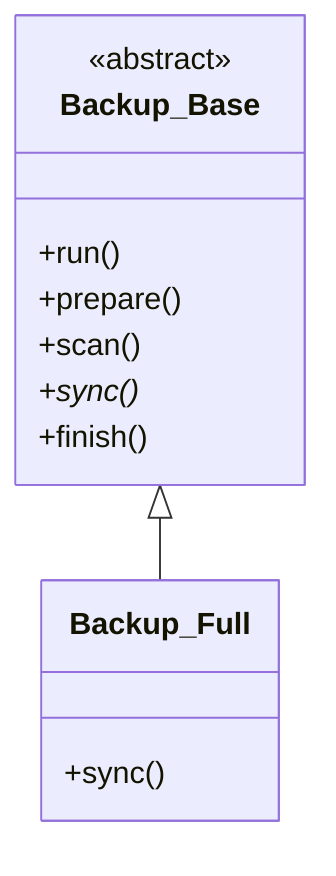

「機能を追加するたびに、コードがスパゲッティのように絡まっていく...」
開発者なら誰もが一度は味わう苦しみです。前回までのコードも、if文の追加で徐々にその兆候が見え始めました。

ここで立ち止まり、武器を取りましょう。Template Method パターン という武器を。
今回は、バックアップ処理の「骨格」をきれいに整理し、美しいコードへの第一歩を踏み出します。

> [!NOTE]
> コードが複雑化するのは、1つの箇所に多くの責任（ロジック）が集中しているためです。これは SOLID原則 の「単一責任の原則（SRP）」に違反している状態と言えます。

> [前回: タイムスタンプ比較で差分検出](/2026/01/30/003208/) | [目次](/2026/01/30/003407/) | [次回: 複数のバックアップ戦略](/2026/01/30/003242/)

<!--more-->

## Template Method パターンとは

親クラスで処理の「大枠（テンプレート）」を定義し、具体的な処理内容は子クラスで実装するパターンです。

料理のレシピに例えると、「1. 材料を切る 2. 炒める 3. 盛り付ける」という手順（テンプレート）は共通ですが、「何を切るか」「何で炒めるか」は料理（子クラス）によって異なります。

## 設計：バックアップの骨格

バックアップ処理を以下のステップに分解してみましょう。

1.  prepare: 準備（ディレクトリ確認など）
2.  scan: コピー元ファイルのリストアップ
3.  sync: 実際の同期処理（コピー/スキップ判定）
4.  finish: 後処理（結果表示など）

この流れを親クラス `Backup::Base` で定義します。



## 実装：親クラス（Mooを使用）

ここからはモダンなPerlの書き方、オブジェクト指向モジュール `Moo` を導入します。

```perl
package Backup::Base;
use Moo;
use Path::Tiny;
use Time::HiRes qw(gettimeofday tv_interval);

has source_dir => (is => 'ro', required => 1, coerce => sub { path($_[0]) });
has dest_dir   => (is => 'ro', required => 1, coerce => sub { path($_[0]) });
has dry_run    => (is => 'ro', default => 0); # 予行演習モード

# これが Template Method
sub run {
    my $self = shift;
    
    print "Starting backup...\n";
    my $t0 = [gettimeofday];

    $self->prepare;
    my $files = $self->scan;
    $self->sync($files);
    $self->finish(tv_interval($t0));
}

# デフォルト実装または抽象メソッド
sub prepare {
    my $self = shift;
    die "Source does not exist" unless $self->source_dir->is_dir;
    $self->dest_dir->mkpath unless $self->dest_dir->exists;
}

sub scan {
    my $self = shift;
    # デフォルトは全ファイルスキャン
    my @files;
    my $iter = $self->source_dir->iterator({ recurse => 1 });
    while (my $path = $iter->()) {
        push @files, $path unless $path->is_dir;
    }
    return \@files; # 配列リファレンスを返す
}

# これは必ず子クラスで実装させる（抽象メソッド的扱い）
sub sync {
    my ($self, $files) = @_;
    die "Method 'sync' must be implemented by subclass";
}

sub finish {
    my ($self, $elapsed) = @_;
    printf "Backup process finished in %.2f seconds.\n", $elapsed;
}

1;
```

## 実装：子クラス（単純コピー版）

この親クラスを使って、第1回で作った「単純バックアップ（全コピー）」をクラス化してみます。

```perl
package Backup::Full;
use Moo;
use File::Copy qw(copy);
extends 'Backup::Base';

sub sync {
    my ($self, $files) = @_;
    my $count = 0;

    foreach my $file (@$files) {
        my $rel_path = $file->relative($self->source_dir);
        my $dest_path = $self->dest_dir->child($rel_path);

        $dest_path->parent->mkpath unless $dest_path->parent->exists;
        
        if ($self->dry_run) {
            print "[DryRun] Copy $rel_path\n";
        } else {
            copy($file, $dest_path) or warn "Copy failed: $!";
            $count++;
        }
    }
    print "Copied $count files.\n";
}

1;
```

## 実行スクリプト

これを使うスクリプトはこうなります。

```perl
#!/usr/bin/env perl
use strict;
use warnings;
use FindBin;
use lib "$FindBin::Bin/lib"; # モジュールパスを通す
use Backup::Full;

my $backup = Backup::Full->new(
    source_dir => './my_photos',
    dest_dir   => './backup_full',
);

$backup->run;
```

## 何が嬉しくなったのか？

コードの行数は増えましたが、重要なメリットが生まれました。

1.  処理フローの明確化: `run` メソッドを見れば、バックアップがどのような手順で行われるか一目瞭然です。
2.  関心の分離: 「ファイルをどう集めるか（scan）」と「どう同期するか（sync）」がメソッドとして分離されました。
3.  拡張性: 新しいバックアップ方式（例えば差分バックアップ）を作りたければ、`Backup::Base` を継承して `sync` メソッドだけ書き換えれば済みます。

次回はこの拡張性を活かして、前回実装した「差分バックアップ」や、さらに高度な「増分バックアップ」を Strategy パターン として組み込んでいきます。
