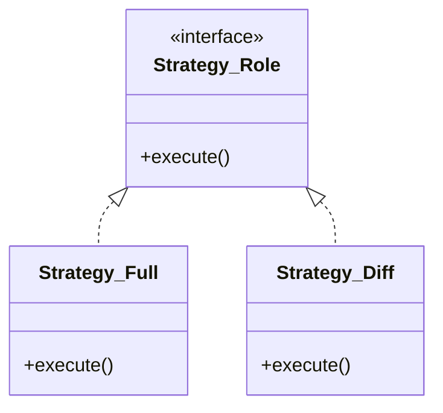

前回は Template Method パターンで処理の骨格を作りました。今回は、その骨格の中で差し替え可能な部品として、バックアップの「戦略（アルゴリズム）」を Strategy パターン で実装します。

> [前回: 処理フローを整理する骨格](/2026/01/30/003225/) | [目次](/2026/01/30/003407/) | [次回: 2パターンの協調動作](/2026/01/30/003259/)

<!--more-->

## Strategy パターンとは

アルゴリズムをクラスとしてカプセル化し、実行時に交換可能にするパターンです。「戦術（Strategy）を切り替える」イメージです。今回は「フルバックアップ」「差分バックアップ」という異なる戦術を切り替えます。

## 実装：戦略クラスの実装

前回は `Backup::Full` というクラス自体が戦略を持っていました（サブクラス化によるTemplate Methodパターンの利用）。それを Strategy パターンに移行するには、戦略部分を別クラスに委譲します。

まず、戦略のインターフェース的なもの（Role）を定義します。

```perl
package Backup::Strategy::Role;
use Moo::Role;

requires 'execute'; # このメソッドの実装を強制

1;
```

次に、具体的な戦略クラスを作ります。



1. フルバックアップ戦略

```perl
package Backup::Strategy::Full;
use Moo;
use File::Copy qw(copy);
with 'Backup::Strategy::Role';

sub execute {
    my ($self, $context, $file, $dest_path) = @_;
    # 無条件コピー
    copy($file, $dest_path);
    return 1; # コピーした
}

1;
```

2. 差分バックアップ戦略（mtime比較）

```perl
package Backup::Strategy::Diff;
use Moo;
use File::Copy qw(copy);
with 'Backup::Strategy::Role';

sub execute {
    my ($self, $context, $file, $dest_path) = @_;
    
    if (-e $dest_path && (stat($file))[9] <= (stat($dest_path))[9]) {
        return 0; # スキップ（更新日時が古くないなら）
    }

    copy($file, $dest_path);
    utime((stat($file))[8], (stat($file))[9], $dest_path); # mtime同期
    return 1;
}

1;
```

## コンテキスト側の変更

呼び出し側（前回でいう `Backup::Base` に近いもの）は、戦略オブジェクトを持ち、それを実行時に呼び出します。これが次回の「Template MethodとStrategyの融合」への布石になりますが、一旦ここでは単純に Strategy を使うクラスを示します。

```perl
package Backup::Manager;
use Moo;
use Path::Tiny;

has strategy => (is => 'ro', required => 1); # Strategyオブジェクトを持つ

sub run_backup {
    my ($self, $source, $dest) = @_;
    my $iter = path($source)->iterator({recurse => 1});
    
    while (my $file = $iter->()) {
        next if $file->is_dir;
        my $dest_path = path($dest)->child($file->relative($source));
        $dest_path->parent->mkpath;

        # 戦略に委譲する！
        if ($self->strategy->execute($self, $file, $dest_path)) {
            print "Copied: $file\n";
        } else {
            print "Skipped: $file\n";
        }
    }
}
1;
```

## 利用イメージ

コマンドライン引数などで戦略を切り替えることができます。

```perl
use Backup::Manager;
use Backup::Strategy::Full;
use Backup::Strategy::Diff;

my $mode = shift || 'diff';
my $strategy;

if ($mode eq 'full') {
    $strategy = Backup::Strategy::Full->new;
} elsif ($mode eq 'diff') {
    $strategy = Backup::Strategy::Diff->new;
}

my $manager = Backup::Manager->new(strategy => $strategy);
$manager->run_backup('./source', './dest');
```

## パフォーマンス比較

実際にファイル数10,000件のディレクトリで、2回目以降（差分なし）の実行速度を比較してみましょう。

```perl
use Benchmark qw(cmpthese);
# ... (準備コード省略) ...

cmpthese(10, {
    'Full' => sub { $full_strategy_manager->run_backup(...) },
    'Diff' => sub { $diff_strategy_manager->run_backup(...) },
});
```

実行結果:

```text
       Rate Full Diff
Full 0.15/s   -- -99%
Diff 18.5/s 12233%   --
```

Strategyを切り替えるだけで、これだけの性能差が出ることが確認できました。重要なのは、この性能差を 「呼び出し側のコードを一行も変えずに」 実現できたことです。

## メリット

- アルゴリズムの独立: 「差分判定ロジック」だけが `Strategy::Diff` に閉じ込められ、`Backup::Manager` はいかにしてファイルをコピーするかを知る必要がなくなりました。
- 動的な切り替え: 実行時に `if` 文でクラスを差し替えるだけで、挙動をガラリと変えられます。

次回は、第3回の Template Method と、今回の Strategy を組み合わせて、最強のバックアップツールアーキテクチャを完成させます。
