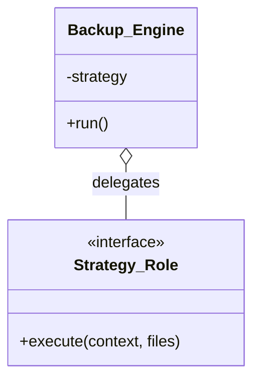

前回までに、Template Method（処理の骨格）と Strategy（具体的なアルゴリズム）を個別に実装しました。今回はこれらを組み合わせ、柔軟かつ堅牢なバックアップツールとして完成させます。

> [前回: 複数のバックアップ戦略](/2026/01/30/003242/) | [目次](/2026/01/30/003407/) | [次回: 圧縮機能の追加](/2026/01/30/003316/)

<!--more-->

## アーキテクチャの統合

目指す構造は以下の通りです。

1.  Backup::Engine (Template Method): バックアップ全体の進行管理（準備、スキャン、終了報告）を担当。
2.  Backup::Strategy::\* (Strategy): 実際に「ファイルをどう扱うか」を担当。

`Backup::Engine` は `sync` フェーズにおいて、自身が持つ `Strategy` オブジェクトに処理を委譲します。



## 課題：イテレーションの責務はどっち？

ここで設計上の重要な判断があります。
「ファイルを1つずつループする処理」は、Engine（呼び出し側）がやるべきでしょうか？それともStrategy（戦略側）がやるべきでしょうか？

-   案A: Engineがループして、ファイルごとにStrategyを呼ぶ
    -   シンプル。前回の実装に近い。
    -   しかし、「全ファイルをまとめて1つのアーカイブにする（tar）」ような戦略が作れない。

-   案B: Engineはファイルリストを渡し、Strategyがループする
    -   戦略側が自由なイテレーション制御を持てる。
    -   こちらの方が汎用性が高い。

今回は拡張性を重視し、案B を採用します。

## 実装

### 1. Strategy Role の再定義

リストを受け取る形に変更します。

```perl
package Backup::Strategy::Role;
use Moo::Role;

# executeメソッドは、context(engine), files(配列ref) を受け取る
requires 'execute';

1;
```

### 2. Backup::Engine (統合されたContext)

第3回の `Backup::Base` をベースに、Strategyを持つように改良します。

```perl
package Backup::Engine;
use Moo;
use Path::Tiny;
use Time::HiRes qw(gettimeofday tv_interval);

has source_dir => (is => 'ro', required => 1, coerce => sub { path($_[0]) });
has dest_dir   => (is => 'ro', required => 1, coerce => sub { path($_[0]) });
has strategy   => (is => 'ro', required => 1, does => 'Backup::Strategy::Role');

sub run {
    my $self = shift;
    print "Starting backup...\n";
    my $t0 = [gettimeofday];

    $self->prepare;
    my $files = $self->scan;
    
    print "Scanning done. Found " . scalar(@$files) . " files.\n";
    
    # ここで委譲！
    $self->strategy->execute($self, $files);

    $self->finish(tv_interval($t0));
}

sub prepare {
    my $self = shift;
    die "Source missing" unless $self->source_dir->is_dir;
    $self->dest_dir->mkpath unless $self->dest_dir->exists;
}

sub scan {
    my $self = shift;
    my @files;
    my $iter = $self->source_dir->iterator({ recurse => 1 });
    while (my $path = $iter->()) {
        push @files, $path unless $path->is_dir;
    }
    return \@files;
}

sub finish {
    my ($self, $elap) = @_;
    printf "All done in %.2f sec.\n", $elap;
}

1;
```

### 3. Strategyの実装（差分バックアップ）

ループ処理がStrategy側に来たことに注目してください。

```perl
package Backup::Strategy::Diff;
use Moo;
use File::Copy qw(copy);
with 'Backup::Strategy::Role';

sub execute {
    my ($self, $engine, $files) = @_;
    my $count = 0;
    
    foreach my $file (@$files) {
        my $rel = $file->relative($engine->source_dir);
        my $dest = $engine->dest_dir->child($rel);
        
        # 差分判定
        next if -e $dest && $file->stat->mtime <= $dest->stat->mtime;
        
        $dest->parent->mkpath;
        copy($file, $dest) or warn "Copy failed: $!";
        utime($file->stat->atime, $file->stat->mtime, $dest);
        $count++;
    }
    print "Diff Strategy: Copied $count files.\n";
}
1;
```

## 利用コード

```perl
use Backup::Engine;
use Backup::Strategy::Diff;

my $engine = Backup::Engine->new(
    source_dir => './src',
    dest_dir   => './dst',
    strategy   => Backup::Strategy::Diff->new,
);

$engine->run;
```

## まとめ

これで、以下の構成が完成しました。

-   Backup::Engine: 処理フローの管理者（変わらない部分）
-   Backup::Strategy::\*: 具体的な作業者（変わる部分）

この設計の優れた点は、`Backup::Engine` を一切変更することなく、全く異なるバックアップ方式を追加できる点です。次回はそれを証明するために、「圧縮バックアップ」という全く異なる挙動をする戦略を追加してみます。
