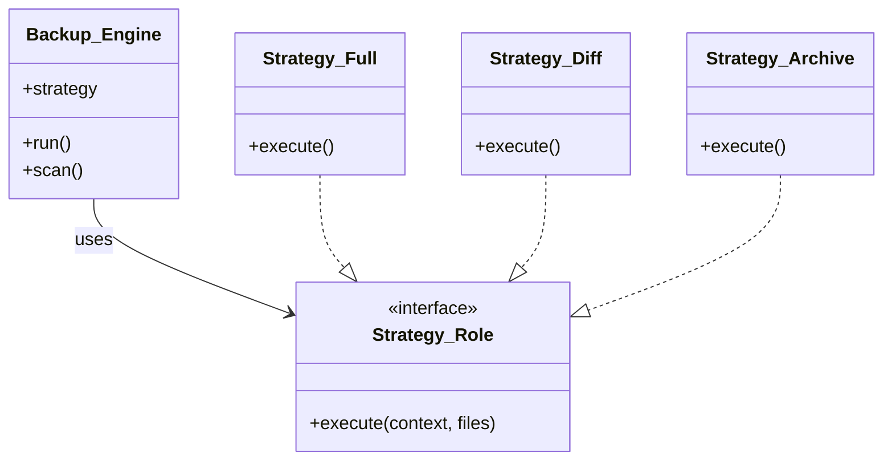

全8回にわたり、「Perlで作るファイルバックアップツール」を開発してきました。
今回は最終回として、私たちが構築した設計を振り返り、今後どのように発展させていけるかを考えます。

> [前回: ログとエラーハンドリング](/2026/01/30/003333/) | [目次](/2026/01/30/003407/)

<!--more-->

## 設計の振り返り

最初は「動けばいい」という発想で、単純な再帰コピーから始めました。しかし、機能追加（差分、増分、圧縮...）の要望が出るたびに、コードが複雑化するリスクに直面しました。

そこで導入したのが2つのデザインパターンです。

### 1. Template Method パターン (Backup::Engine)

「変わらない処理フロー」 を守るために使いました。

- 準備 (Prepare)
- スキャン (Scan)
- 同期実行 (Sync)
- 後処理 (Finish)

この流れは、どんなバックアップ方式でも共通です。ここを親クラスに固定することで、コードの迷子を防ぎました。

### 2. Strategy パターン (Backup::Strategy::*)

「変わり続けるアルゴリズム」 を切り出すために使いました。

- Diff: 更新日時を比較してコピー
- Full: 無条件にコピー
- Archive: tar.gzに固める

新しい戦略を追加する際、`Backup::Engine` を一切触る必要がなかったのが最大のメリットです。

### アーキテクチャ図

最終的なクラス構成は以下のようになりました。

## さらなる発展のアイデア

このツールはまだまだ拡張できます。この設計の真価は、これらの拡張を「既存コードを壊さずに」実現できる点にあります。

### 1. クラウドストレージへのバックアップ

現在、`Backup::Engine` はローカルパス（またはマウントされたパス）を前提としていますが、Strategyの中で `AWS::S3` や `Furl` を使えば、クラウドへのアップロードも可能です。

`Backup::Strategy::S3` を作り、`execute` メソッド内で S3 API を叩くだけです。

### 2. 暗号化

`Backup::Strategy::Encrypt` を作れば、ファイルを暗号化してから保存することも可能です。`Crypt::CBC` などを使えば実装できます。

### 3. イベント通知 (Observerパターンの導入)

もし「失敗時にSlackに通知したい」「完了時にメールしたい」という要望が出たら、Observerパターン の出番です。`Backup::Engine` にイベントリスナーの登録機能をつければ、これもきれいに実装できるでしょう。

## 最後に

「デザインパターン」と聞くと小難しく感じるかもしれませんが、要は 「変更しやすい場所に切れ目を入れる」 技術です。

今回のバックアップツール開発を通じて、「ここに切れ目（インターフェース）があれば楽になるな」という感覚を掴んでいただけたなら幸いです。

ぜひ、あなただけの最強バックアップ戦略を作ってみてください！
