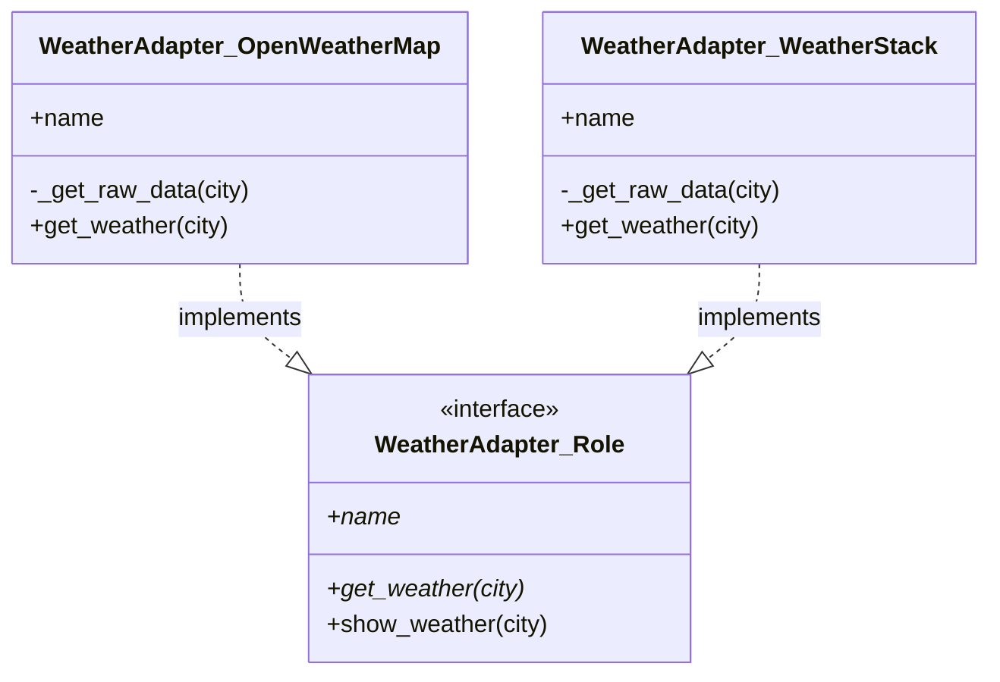

## 前回の振り返り

前回は、複数のAPIを統合しようとしてコードが破綻していく様子を体験しました。if文が肥大化し、同じ処理が重複し、新しいAPIの追加が困難になりました。



今回は、この問題を「Adapterパターン」で解決します。

## 今回の目標

第3回となる今回は、Adapterパターンを使って各APIのインターフェースを統一します。どのAPIを使っても同じ `get_weather($city)` というメソッドで天気情報を取得できるようにします。

## Adapterパターンとは

Adapterパターンは、互換性のないインターフェースを変換して、一緒に動作できるようにするデザインパターンです。

日常生活の例で言えば、海外旅行で使う電源アダプターと同じです。日本のプラグ（インターフェースA）を、海外のコンセント（インターフェースB）に接続できるように変換します。

### APIへの適用

今回のケースでは、各APIの異なるレスポンス構造を、共通の形式に変換します。

```
OpenWeatherMap → 共通形式（city, temperature, humidity, condition）
    ↓ Adapter
WeatherStack   → 共通形式（city, temperature, humidity, condition）
    ↓ Adapter
WeatherAPI     → 共通形式（city, temperature, humidity, condition）
```

### Adapterパターンのクラス図



各Adapterは共通のRole（インターフェース）を実装することで、呼び出し側からは同じ方法で扱えるようになります。

## 共通インターフェースの設計

まず、すべてのAdapterが持つべき共通インターフェースを定義します。Moo::Roleを使って実装します。

```perl
# 天気サービスの共通インターフェース
package WeatherAdapter::Role {
    use v5.36;
    use Moo::Role;

    # サブクラスで必ず実装するメソッド
    requires 'get_weather';
    requires 'name';  # サービス名を取得

    # 共通の表示メソッド
    sub show_weather ($self, $city) {
        my $weather = $self->get_weather($city);
        if ($weather) {
            say "$weather->{city}: $weather->{condition}（気温 $weather->{temperature}℃、湿度 $weather->{humidity}%）";
        }
        else {
            say "$city: データを取得できませんでした";
        }
    }
}
```

このRoleは以下を定義しています。

- `requires 'get_weather'` - 各Adapterが必ず実装すべきメソッド
- `requires 'name'` - サービス名を返すメソッド（後の回で使用）
- `show_weather` - 共通の表示処理

## OpenWeatherMap用Adapterの実装

まず、OpenWeatherMap API用のAdapterを作成します。

```perl
package WeatherAdapter::OpenWeatherMap {
    use v5.36;
    use Moo;

    has name => (is => 'ro', default => 'OpenWeatherMap');

    with 'WeatherAdapter::Role';

    # APIモックデータ
    sub _get_raw_data ($self, $city) {
        my %mock_data = (
            'Tokyo' => {
                name => 'Tokyo',
                main => { temp => 25.5, humidity => 60 },
                weather => [{ description => '晴れ' }],
            },
            'Osaka' => {
                name => 'Osaka',
                main => { temp => 27.2, humidity => 65 },
                weather => [{ description => '曇り' }],
            },
            'Sapporo' => {
                name => 'Sapporo',
                main => { temp => 18.3, humidity => 70 },
                weather => [{ description => '雨' }],
            },
        );
        return $mock_data{$city};
    }

    # 共通形式に変換して返す
    sub get_weather ($self, $city) {
        my $data = $self->_get_raw_data($city);
        return unless $data;

        return {
            city        => $data->{name},
            temperature => $data->{main}{temp},
            humidity    => $data->{main}{humidity},
            condition   => $data->{weather}[0]{description},
        };
    }
}
```

ポイントは`get_weather`メソッドです。OpenWeatherMap固有のデータ構造を、共通形式のハッシュリファレンスに変換しています。

## WeatherStack用Adapterの実装

次に、WeatherStack API用のAdapterを作成します。

```perl
package WeatherAdapter::WeatherStack {
    use v5.36;
    use Moo;

    has name => (is => 'ro', default => 'WeatherStack');

    with 'WeatherAdapter::Role';

    # APIモックデータ
    sub _get_raw_data ($self, $city) {
        my %mock_data = (
            'Tokyo' => {
                location => { name => 'Tokyo', country => 'Japan' },
                current  => { 
                    temperature => 26, 
                    humidity => 58, 
                    weather_descriptions => ['Sunny'] 
                },
            },
            'Osaka' => {
                location => { name => 'Osaka', country => 'Japan' },
                current  => { 
                    temperature => 28, 
                    humidity => 63, 
                    weather_descriptions => ['Partly cloudy'] 
                },
            },
            'Sapporo' => {
                location => { name => 'Sapporo', country => 'Japan' },
                current  => { 
                    temperature => 19, 
                    humidity => 68, 
                    weather_descriptions => ['Light rain'] 
                },
            },
        );
        return $mock_data{$city};
    }

    # 共通形式に変換して返す
    sub get_weather ($self, $city) {
        my $data = $self->_get_raw_data($city);
        return unless $data;

        return {
            city        => $data->{location}{name},
            temperature => $data->{current}{temperature},
            humidity    => $data->{current}{humidity},
            condition   => $data->{current}{weather_descriptions}[0],
        };
    }
}
```

WeatherStackの固有データ構造（`location.name`、`current.temperature`など）を、同じ共通形式に変換しています。

## 完成コード

すべてをまとめた完成コードです。

```perl
#!/usr/bin/env perl
use v5.36;

# 天気サービスの共通インターフェース（Role）
package WeatherAdapter::Role {
    use v5.36;
    use Moo::Role;

    requires 'get_weather';
    requires 'name';

    sub show_weather ($self, $city) {
        my $weather = $self->get_weather($city);
        if ($weather) {
            say "$weather->{city}: $weather->{condition}（気温 $weather->{temperature}℃、湿度 $weather->{humidity}%）";
        }
        else {
            say "$city: データを取得できませんでした";
        }
    }
}

# OpenWeatherMap用Adapter
package WeatherAdapter::OpenWeatherMap {
    use v5.36;
    use Moo;

    has name => (is => 'ro', default => 'OpenWeatherMap');

    with 'WeatherAdapter::Role';

    sub _get_raw_data ($self, $city) {
        my %mock_data = (
            'Tokyo'   => { name => 'Tokyo',   main => { temp => 25.5, humidity => 60 }, weather => [{ description => '晴れ' }] },
            'Osaka'   => { name => 'Osaka',   main => { temp => 27.2, humidity => 65 }, weather => [{ description => '曇り' }] },
            'Sapporo' => { name => 'Sapporo', main => { temp => 18.3, humidity => 70 }, weather => [{ description => '雨' }] },
        );
        return $mock_data{$city};
    }

    sub get_weather ($self, $city) {
        my $data = $self->_get_raw_data($city);
        return unless $data;
        return {
            city        => $data->{name},
            temperature => $data->{main}{temp},
            humidity    => $data->{main}{humidity},
            condition   => $data->{weather}[0]{description},
        };
    }
}

# WeatherStack用Adapter
package WeatherAdapter::WeatherStack {
    use v5.36;
    use Moo;

    has name => (is => 'ro', default => 'WeatherStack');

    with 'WeatherAdapter::Role';

    sub _get_raw_data ($self, $city) {
        my %mock_data = (
            'Tokyo'   => { location => { name => 'Tokyo' },   current => { temperature => 26, humidity => 58, weather_descriptions => ['Sunny'] } },
            'Osaka'   => { location => { name => 'Osaka' },   current => { temperature => 28, humidity => 63, weather_descriptions => ['Cloudy'] } },
            'Sapporo' => { location => { name => 'Sapporo' }, current => { temperature => 19, humidity => 68, weather_descriptions => ['Rain'] } },
        );
        return $mock_data{$city};
    }

    sub get_weather ($self, $city) {
        my $data = $self->_get_raw_data($city);
        return unless $data;
        return {
            city        => $data->{location}{name},
            temperature => $data->{current}{temperature},
            humidity    => $data->{current}{humidity},
            condition   => $data->{current}{weather_descriptions}[0],
        };
    }
}

# メイン処理
package main {
    use v5.36;

    say "=== 天気予報アグリゲーター（Adapter版） ===";
    say "";

    # 各Adapterを作成
    my $owm = WeatherAdapter::OpenWeatherMap->new;
    my $ws  = WeatherAdapter::WeatherStack->new;

    say "--- OpenWeatherMap ---";
    $owm->show_weather('Tokyo');
    $owm->show_weather('Osaka');
    $owm->show_weather('Sapporo');

    say "";
    say "--- WeatherStack ---";
    $ws->show_weather('Tokyo');
    $ws->show_weather('Osaka');
    $ws->show_weather('Sapporo');

    say "";
    say "--- 統一インターフェースで扱う ---";
    my @adapters = ($owm, $ws);
    for my $adapter (@adapters) {
        my $weather = $adapter->get_weather('Tokyo');
        say "Tokyo: $weather->{temperature}℃";
    }
}
```

実行結果:

```
=== 天気予報アグリゲーター（Adapter版） ===

--- OpenWeatherMap ---
Tokyo: 晴れ（気温 25.5℃、湿度 60%）
Osaka: 曇り（気温 27.2℃、湿度 65%）
Sapporo: 雨（気温 18.3℃、湿度 70%）

--- WeatherStack ---
Tokyo: Sunny（気温 26℃、湿度 58%）
Osaka: Cloudy（気温 28℃、湿度 63%）
Sapporo: Rain（気温 19℃、湿度 68%）

--- 統一インターフェースで扱う ---
Tokyo: 25.5℃
Tokyo: 26℃
```

## Adapterパターンのメリット

### ポリモーフィズムの実現

どのAdapterも同じ`get_weather`メソッドを持っているため、呼び出し側はどのAPIを使っているか意識する必要がありません。

```perl
for my $adapter (@adapters) {
    my $weather = $adapter->get_weather('Tokyo');
    # どのAdapterでも同じように扱える
}
```

### 単一責任の原則（SRP）への準拠

各Adapterは「自分のAPIのデータを共通形式に変換する」という単一の責任だけを持っています。

### 新しいAPIの追加が容易

3つ目のAPIを追加する場合、既存のコードを修正する必要はありません。新しいAdapterクラスを追加するだけです。

```perl
package WeatherAdapter::WeatherAPI {
    use v5.36;
    use Moo;
    with 'WeatherAdapter::Role';

    # 新しいAPIのAdapter実装...
}
```

これは開放閉鎖の原則（OCP）に準拠しています。

## まとめ

今回は、Adapterパターンを使って複数のAPIを統一的に扱えるようにしました。

- Moo::Roleで共通インターフェースを定義した
- 各API用のAdapterクラスを作成した
- ポリモーフィズムにより、どのAdapterも同じように扱えるようになった
- 単一責任の原則、開放閉鎖の原則に準拠した設計になった

コードがだいぶスッキリしました。

## 次回予告

Adapterでインターフェースは統一できましたが、まだ問題が残っています。呼び出し側で「どのAdapterを使うか」「失敗したら次を試す」などのロジックが必要です。次回は、この問題を解決するために「Facadeパターン」を導入します。お楽しみに！
