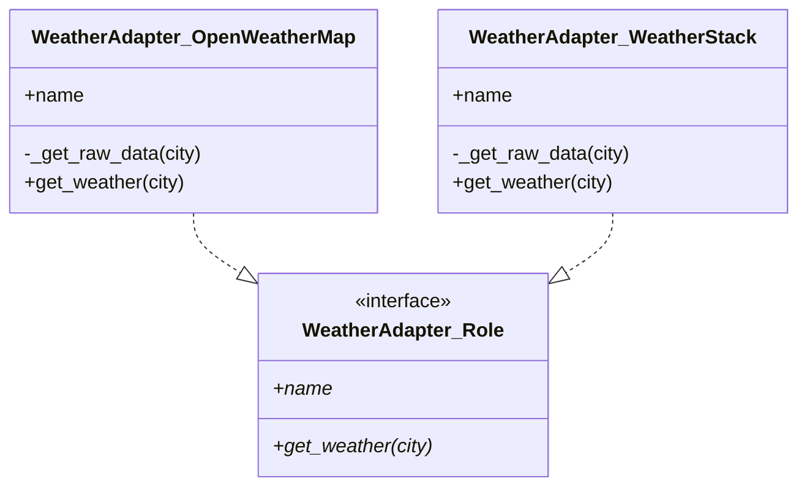
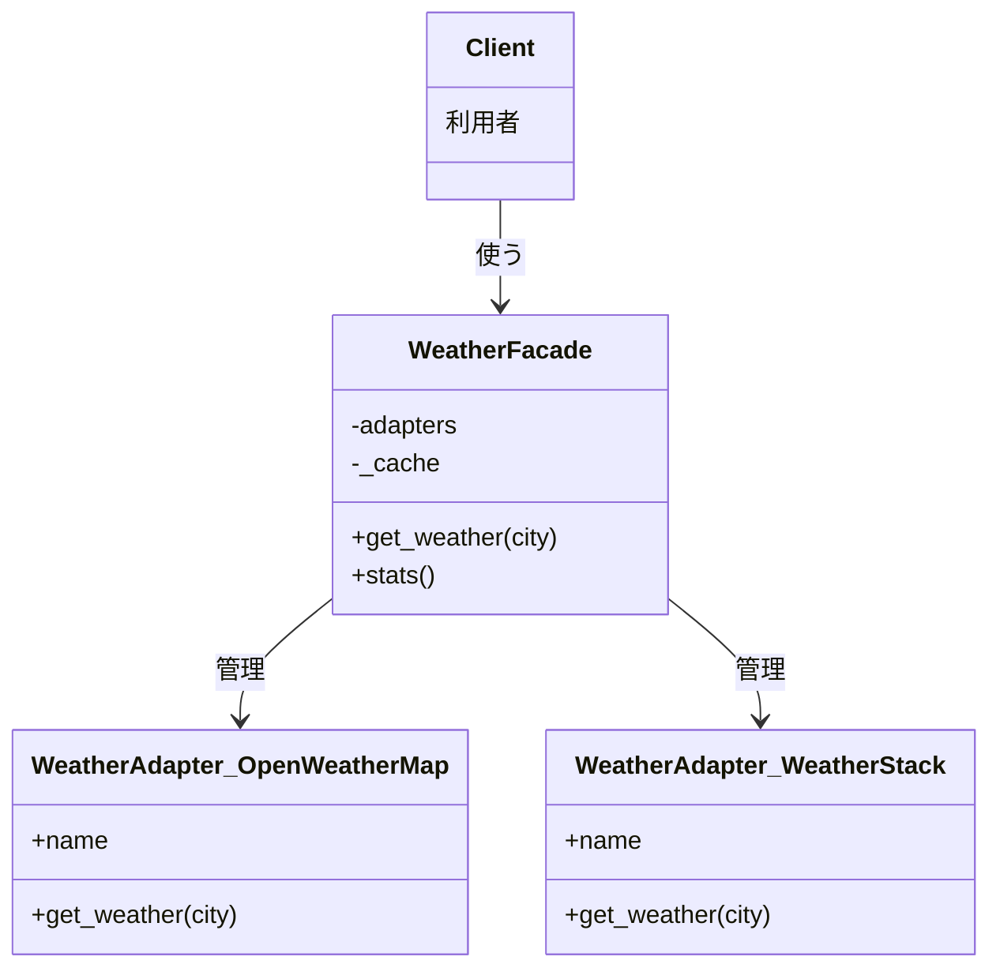

## 前回の振り返り

前回は、エラーハンドリングとデフォルト値の設計を学びました。Try::Tinyで例外をキャッチし、Null Object的なデフォルト値を返すことで、障害に強いシステムになりました。



今回は最終回です。これまで作成してきたすべての機能を統合し、使った2つのパターンの「正体」を明かします。

## 今回の目標

第8回（最終回）となる今回は、以下を行います。

1. 全機能を統合した完成版コードの作成
2. 2つのデザインパターンの正体を明かす
3. SOLID原則との対応を解説

## 完成版コード

これまで作成してきたすべての機能を1つのファイルにまとめます。

```perl
#!/usr/bin/env perl
# weather_cli.pl - 天気予報アグリゲーター（完成版）
use v5.36;
use Try::Tiny;

# ===================================================
# 天気サービスの共通インターフェース（Role）
# ===================================================
package WeatherAdapter::Role {
    use v5.36;
    use Moo::Role;

    requires 'get_weather';
    requires 'name';
}

# ===================================================
# OpenWeatherMap用Adapter
# ===================================================
package WeatherAdapter::OpenWeatherMap {
    use v5.36;
    use Moo;
    use Try::Tiny;

    has name => (is => 'ro', default => 'OpenWeatherMap');

    with 'WeatherAdapter::Role';

    sub _get_raw_data ($self, $city) {
        # 実際の実装ではHTTP::Tinyでリクエストを送信
        my %mock_data = (
            'Tokyo'    => { name => 'Tokyo',    main => { temp => 25.5, humidity => 60 }, weather => [{ description => '晴れ' }] },
            'Osaka'    => { name => 'Osaka',    main => { temp => 27.2, humidity => 65 }, weather => [{ description => '曇り' }] },
            'Nagoya'   => { name => 'Nagoya',   main => { temp => 26.8, humidity => 62 }, weather => [{ description => '晴れ' }] },
            'Kyoto'    => { name => 'Kyoto',    main => { temp => 28.1, humidity => 58 }, weather => [{ description => '晴れ' }] },
            'Yokohama' => { name => 'Yokohama', main => { temp => 24.9, humidity => 68 }, weather => [{ description => '曇り' }] },
        );
        return $mock_data{$city};
    }

    sub get_weather ($self, $city) {
        try {
            my $data = $self->_get_raw_data($city);
            return unless $data;
            return {
                city        => $data->{name},
                temperature => $data->{main}{temp},
                humidity    => $data->{main}{humidity},
                condition   => $data->{weather}[0]{description},
                source      => $self->name,
            };
        }
        catch {
            warn "[$self->{name}] $city: $_";
            return;
        };
    }
}

# ===================================================
# WeatherStack用Adapter
# ===================================================
package WeatherAdapter::WeatherStack {
    use v5.36;
    use Moo;
    use Try::Tiny;

    has name => (is => 'ro', default => 'WeatherStack');

    with 'WeatherAdapter::Role';

    sub _get_raw_data ($self, $city) {
        my %mock_data = (
            'Tokyo'    => { location => { name => 'Tokyo' },    current => { temperature => 26, humidity => 58, weather_descriptions => ['Sunny'] } },
            'Sapporo'  => { location => { name => 'Sapporo' },  current => { temperature => 19, humidity => 68, weather_descriptions => ['Rain'] } },
            'Sendai'   => { location => { name => 'Sendai' },   current => { temperature => 22, humidity => 65, weather_descriptions => ['Cloudy'] } },
            'Fukuoka'  => { location => { name => 'Fukuoka' },  current => { temperature => 29, humidity => 70, weather_descriptions => ['Sunny'] } },
            'Hiroshima'=> { location => { name => 'Hiroshima'},current => { temperature => 28, humidity => 62, weather_descriptions => ['Clear'] } },
        );
        return $mock_data{$city};
    }

    sub get_weather ($self, $city) {
        try {
            my $data = $self->_get_raw_data($city);
            return unless $data;
            return {
                city        => $data->{location}{name},
                temperature => $data->{current}{temperature},
                humidity    => $data->{current}{humidity},
                condition   => $data->{current}{weather_descriptions}[0],
                source      => $self->name,
            };
        }
        catch {
            warn "[$self->{name}] $city: $_";
            return;
        };
    }
}

# ===================================================
# Facade: 統合インターフェース（キャッシュ＆エラーハンドリング付き）
# ===================================================
package WeatherFacade {
    use v5.36;
    use Moo;

    has adapters        => (is => 'ro', required => 1);
    has cache_ttl       => (is => 'ro', default => 300);
    has max_cache_size  => (is => 'ro', default => 100);
    has use_default     => (is => 'ro', default => 1);
    has default_message => (is => 'ro', default => '情報を取得できませんでした');

    has _cache       => (is => 'ro', default => sub { {} });
    has _cache_order => (is => 'ro', default => sub { [] });
    has _stats       => (is => 'ro', default => sub { { hits => 0, misses => 0, api_calls => 0 } });

    # デフォルト天気データ
    sub _default_weather ($self, $city) {
        return {
            city        => $city,
            temperature => undef,
            humidity    => undef,
            condition   => $self->default_message,
            source      => 'default',
            is_default  => 1,
            from_cache  => 0,
        };
    }

    # キャッシュから取得
    sub _get_from_cache ($self, $city) {
        return unless exists $self->_cache->{$city};

        my $cached = $self->_cache->{$city};
        my $age = time() - $cached->{cached_at};

        if ($age >= $self->cache_ttl) {
            $self->_remove_from_cache($city);
            return;
        }

        # LRU順序を更新
        $self->_cache_order->@* = grep { $_ ne $city } $self->_cache_order->@*;
        push $self->_cache_order->@*, $city;

        return $cached->{data};
    }

    # キャッシュに保存
    sub _set_to_cache ($self, $city, $data) {
        while (scalar($self->_cache_order->@*) >= $self->max_cache_size) {
            my $oldest = shift $self->_cache_order->@*;
            delete $self->_cache->{$oldest};
        }

        $self->_cache->{$city} = {
            data      => $data,
            cached_at => time(),
        };
        push $self->_cache_order->@*, $city;
    }

    # キャッシュから削除
    sub _remove_from_cache ($self, $city) {
        delete $self->_cache->{$city};
        $self->_cache_order->@* = grep { $_ ne $city } $self->_cache_order->@*;
    }

    # 天気情報を取得（メインAPI）
    sub get_weather ($self, $city) {
        # 1. キャッシュをチェック
        if (my $cached = $self->_get_from_cache($city)) {
            $self->_stats->{hits}++;
            return { $cached->%*, from_cache => 1, is_default => 0 };
        }

        $self->_stats->{misses}++;

        # 2. APIから取得（フォールバック付き）
        for my $adapter ($self->adapters->@*) {
            $self->_stats->{api_calls}++;
            my $weather = $adapter->get_weather($city);
            if ($weather) {
                $self->_set_to_cache($city, $weather);
                return { $weather->%*, from_cache => 0, is_default => 0 };
            }
        }

        # 3. すべて失敗 → デフォルト値
        if ($self->use_default) {
            return $self->_default_weather($city);
        }
        return;
    }

    # 統計情報
    sub stats ($self) {
        my $total = $self->_stats->{hits} + $self->_stats->{misses};
        my $hit_rate = $total > 0 ? ($self->_stats->{hits} / $total * 100) : 0;
        return {
            cache_hits   => $self->_stats->{hits},
            cache_misses => $self->_stats->{misses},
            hit_rate     => sprintf("%.1f%%", $hit_rate),
            api_calls    => $self->_stats->{api_calls},
            cache_size   => scalar($self->_cache_order->@*),
        };
    }

    # キャッシュクリア
    sub clear_cache ($self) {
        $self->_cache->%* = ();
        $self->_cache_order->@* = ();
    }
}

# ===================================================
# メイン処理
# ===================================================
package main {
    use v5.36;

    say "=" x 50;
    say "  天気予報アグリゲーター（完成版）";
    say "=" x 50;
    say "";

    # Facadeを初期化
    my $weather = WeatherFacade->new(
        adapters => [
            WeatherAdapter::OpenWeatherMap->new,
            WeatherAdapter::WeatherStack->new,
        ],
        cache_ttl      => 300,   # 5分
        max_cache_size => 50,
        use_default    => 1,
    );

    # 複数都市の天気を取得
    my @cities = qw(Tokyo Osaka Sapporo Nagoya Fukuoka Sendai Unknown);

    say "[天気情報]";
    say "-" x 50;

    for my $city (@cities) {
        my $data = $weather->get_weather($city);

        my $temp = defined $data->{temperature} 
            ? sprintf("%.1f℃", $data->{temperature})
            : "---";

        my $status = "";
        if ($data->{is_default}) {
            $status = "[デフォルト]";
        }
        elsif ($data->{from_cache}) {
            $status = "[キャッシュ]";
        }
        else {
            $status = "[via $data->{source}]";
        }

        printf "%-10s: %-20s %8s %s\n",
            $data->{city}, $data->{condition}, $temp, $status;
    }

    say "";
    say "[2回目の取得（キャッシュから）]";
    say "-" x 50;

    for my $city (qw(Tokyo Osaka Sapporo)) {
        my $data = $weather->get_weather($city);
        my $status = $data->{from_cache} ? "キャッシュから" : "APIから";
        say "$city: $status";
    }

    say "";
    say "[統計情報]";
    say "-" x 50;

    my $stats = $weather->stats;
    say "キャッシュヒット: $stats->{cache_hits}";
    say "キャッシュミス:   $stats->{cache_misses}";
    say "ヒット率:         $stats->{hit_rate}";
    say "API呼び出し回数:  $stats->{api_calls}";
    say "キャッシュサイズ: $stats->{cache_size}";
}
```

実行結果:

```
==================================================
  天気予報アグリゲーター（完成版）
==================================================

[天気情報]
--------------------------------------------------
Tokyo     : 晴れ                   25.5℃ [via OpenWeatherMap]
Osaka     : 曇り                   27.2℃ [via OpenWeatherMap]
Sapporo   : Rain                   19.0℃ [via WeatherStack]
Nagoya    : 晴れ                   26.8℃ [via OpenWeatherMap]
Fukuoka   : Sunny                  29.0℃ [via WeatherStack]
Sendai    : Cloudy                 22.0℃ [via WeatherStack]
Unknown   : 情報を取得できませんでした      --- [デフォルト]

[2回目の取得（キャッシュから）]
--------------------------------------------------
Tokyo: キャッシュから
Osaka: キャッシュから
Sapporo: キャッシュから

[統計情報]
--------------------------------------------------
キャッシュヒット: 3
キャッシュミス:   7
ヒット率:         30.0%
API呼び出し回数:  9
キャッシュサイズ: 6
```

## 2つのパターンの正体

さて、このシリーズで使った2つのデザインパターンの正体を明かしましょう。

### Adapterパターン



役割: 異なるインターフェースを持つAPIを、共通のインターフェースに変換する

第3回で導入: OpenWeatherMapとWeatherStackの異なるレスポンス構造を、統一された`get_weather`メソッドで扱えるようにした

### Facadeパターン



役割: 複雑なサブシステムに対して、シンプルなインターフェースを提供する

第5回で導入: 複数のAdapterを内部で管理し、フォールバック・キャッシュ・エラーハンドリングをカプセル化した

## SOLID原則との対応

このシリーズで作ったコードは、オブジェクト指向設計の基本原則「SOLID」に準拠しています。

### S: 単一責任の原則（Single Responsibility Principle）

> クラスは1つの責任だけを持つべき

| クラス | 責任 |
|--------|------|
| WeatherAdapter::OpenWeatherMap | OpenWeatherMap APIのデータ変換 |
| WeatherAdapter::WeatherStack | WeatherStack APIのデータ変換 |
| WeatherFacade | 複数Adapterの統合管理 |

各クラスが明確に1つの責任だけを持っています。

### O: 開放閉鎖の原則（Open-Closed Principle）

> 拡張に対して開いており、修正に対して閉じている

新しいAPIを追加する場合を考えてみましょう。

```perl
# 新しいAdapter（追加コード）
package WeatherAdapter::Tomorrow {
    use v5.36;
    use Moo;

    has name => (is => 'ro', default => 'Tomorrow.io');

    with 'WeatherAdapter::Role';

    sub get_weather ($self, $city) {
        # Tomorrow.io API用の実装
    }
}

# 使用時（既存コードの修正なし）
my $facade = WeatherFacade->new(
    adapters => [
        WeatherAdapter::OpenWeatherMap->new,
        WeatherAdapter::WeatherStack->new,
        WeatherAdapter::Tomorrow->new,  # 追加するだけ
    ],
);
```

既存のAdapter、Facadeのコードを一切修正せずに、新しいAPIを追加できます。

### L: リスコフの置換原則（Liskov Substitution Principle）

> サブクラスは親クラスと置換可能であるべき

すべてのAdapterは`WeatherAdapter::Role`を実装しており、互いに置換可能です。

```perl
for my $adapter ($facade->adapters->@*) {
    # どのAdapterでも同じように扱える
    my $weather = $adapter->get_weather($city);
}
```

### I: インターフェース分離の原則（Interface Segregation Principle）

> クライアントは使用しないメソッドに依存すべきでない

`WeatherAdapter::Role`は必要最小限のメソッド（`get_weather`、`name`）だけを要求しています。

### D: 依存性逆転の原則（Dependency Inversion Principle）

> 上位モジュールは下位モジュールに依存すべきでない。両者は抽象に依存すべき

```perl
# Facadeは具体的なAdapterクラスではなく、Roleに依存
for my $adapter ($self->adapters->@*) {
    # $adapterがWeatherAdapter::Roleを実装していれば何でもOK
    my $weather = $adapter->get_weather($city);
}
```

FacadeはAdapter::Roleインターフェースに依存しており、具体的なAdapter実装には依存していません。

## シリーズの振り返り

全8回を通じて、以下のことを学びました。

| 回 | テーマ | 学んだこと |
|----|--------|------------|
| 1 | 最初の一歩 | Perl HTTP API入門 |
| 2 | 破綻する | 複数API統合の課題 |
| 3 | Adapterで統一 | Adapterパターン実装 |
| 4 | まだ足りない | API統合の設計課題 |
| 5 | Facadeで一本化 | Facadeパターン実装 |
| 6 | キャッシュで賢く | APIキャッシュ戦略 |
| 7 | エラーを優雅に | Perl例外処理とNull Object |
| 8 | 完成と正体 | デザインパターン総まとめ |

## このパターンの応用

Adapter + Facadeの組み合わせは、以下のような場面で応用できます。

### 1. 支払いゲートウェイの統合

```perl
my $payment = PaymentFacade->new(
    adapters => [
        PaymentAdapter::Stripe->new,
        PaymentAdapter::PayPal->new,
        PaymentAdapter::Square->new,
    ],
);

$payment->charge($amount);  # どのサービスを使うか意識しない
```

### 2. ログ出力の統合

```perl
my $logger = LoggerFacade->new(
    adapters => [
        LogAdapter::CloudWatch->new,
        LogAdapter::Elasticsearch->new,
        LogAdapter::File->new,
    ],
);

$logger->info($message);  # 全サービスに同時出力
```

### 3. 通知サービスの統合

```perl
my $notifier = NotificationFacade->new(
    adapters => [
        NotifyAdapter::Slack->new,
        NotifyAdapter::Email->new,
        NotifyAdapter::SMS->new,
    ],
);

$notifier->send($message);  # 優先順位でフォールバック
```

## おわりに

このシリーズを通じて、2つのデザインパターンを実践的に学びました。

- Adapterパターン: 異なるインターフェースを統一
- Facadeパターン: 複雑なサブシステムをシンプルに

これらのパターンは「教科書で学ぶもの」ではなく、「実際の問題を解決するためのツール」です。今回の天気予報アグリゲーターのように、身近な題材で実装してみると、パターンの本質が理解できます。

次に何か複雑なシステムを設計するとき、「これはAdapterで統一できないか？」「Facadeで隠蔽できないか？」と考えてみてください。きっと、よりシンプルで保守しやすいコードが書けるはずです。

最後まで読んでいただき、ありがとうございました！
