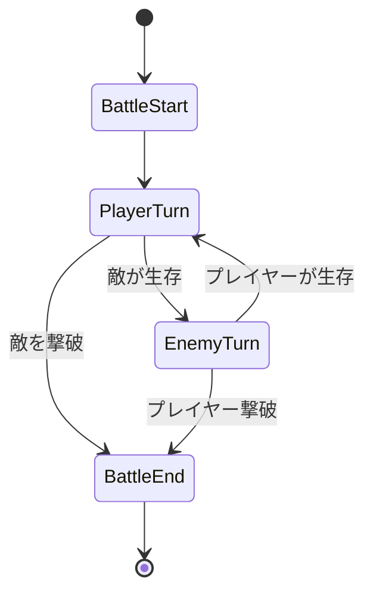

前回、Commandパターンで行動をオブジェクト化しました。これでさまざまな行動を柔軟に追加できるようになりました。

しかし、戦闘にはもう1つ重要な要素があります。それは「フェーズ」です。

- 戦闘開始: 敵が出現し、戦闘が始まる
- プレイヤーターン: プレイヤーが行動を選ぶ
- 敵ターン: 敵が行動する
- 戦闘終了: どちらかが倒れて戦闘が終わる

これらのフェーズを管理するために、Stateパターンを導入しましょう。

前回までに導入した`max_hp`などの属性は維持したまま、状態遷移の仕組みだけを追加する方針です。


## Stateパターンとは

Stateパターンは、オブジェクトの内部状態に応じて振る舞いを変えるデザインパターンです。状態をオブジェクトとして表現し、状態の切り替えによって動作が変わります。

自動販売機を例に考えてみましょう。

- 待機中: お金を入れられる
- 商品選択中: ボタンを押すと商品が出る
- 販売中: 商品を出している最中

状態によって「ボタンを押したときの動作」が変わります。戦闘システムも同様に、フェーズによって可能な操作が変わるのです。

## BattleStateロールを定義する

すべての戦闘状態が実装すべきインターフェースを定義します。

```perl
package BattleState;
use v5.36;
use Moo::Role;

requires 'enter';    # この状態に入ったときの処理
requires 'execute';  # この状態での処理を実行
requires 'exit';     # この状態から出るときの処理
```

`enter`は状態に入ったときの初期化処理、`execute`はその状態でのメイン処理、`exit`は状態を出るときの後処理です。

## BattleContext: 状態を管理するクラス

状態を保持し、状態遷移を管理するコンテキストクラスを作ります。

```perl
package BattleContext;
use v5.36;
use Moo;

has player => (
    is       => 'ro',
    required => 1,
);

has enemy => (
    is       => 'ro',
    required => 1,
);

has current_state => (
    is      => 'rw',
    default => sub { undef },
);

has is_finished => (
    is      => 'rw',
    default => 0,
);

sub change_state($self, $new_state) {
    $self->current_state->exit($self) if $self->current_state;
    $self->current_state($new_state);
    $new_state->enter($self);
}

sub update($self) {
    return if $self->is_finished;
    $self->current_state->execute($self) if $self->current_state;
}
```

`change_state`で状態を切り替え、`update`で現在の状態の処理を実行します。

## 各状態を実装する

### BattleStartState: 戦闘開始

```perl
package BattleStartState;
use v5.36;
use Moo;

with 'BattleState';

sub enter($self, $context) {
    say "=== 戦闘開始！ ===";
    say $context->enemy->name . "が現れた！";
}

sub execute($self, $context) {
    say "";
    say $context->player->name . " HP: " . $context->player->hp;
    say $context->enemy->name . " HP: " . $context->enemy->hp;
    say "";
    
    # プレイヤーターンへ遷移
    $context->change_state(PlayerTurnState->new());
}

sub exit($self, $context) {
    # 特に処理なし
}
```

### PlayerTurnState: プレイヤーターン

```perl
package PlayerTurnState;
use v5.36;
use Moo;

with 'BattleState';

sub enter($self, $context) {
    say "--- " . $context->player->name . "のターン ---";
}

sub execute($self, $context) {
    # プレイヤーの行動を実行（簡易版: 常に攻撃）
    my $command = AttackCommand->new(
        actor  => $context->player,
        target => $context->enemy,
    );
    $command->execute();
    
    # 敵が倒れたか確認
    unless ($context->enemy->is_alive) {
        $context->change_state(BattleEndState->new(winner => 'player'));
        return;
    }
    
    # 敵ターンへ遷移
    $context->change_state(EnemyTurnState->new());
}

sub exit($self, $context) {
    # 特に処理なし
}
```

### EnemyTurnState: 敵ターン

```perl
package EnemyTurnState;
use v5.36;
use Moo;

with 'BattleState';

sub enter($self, $context) {
    say "";
    say "--- " . $context->enemy->name . "のターン ---";
}

sub execute($self, $context) {
    # 敵の行動を実行（簡易版: 常に攻撃）
    my $command = AttackCommand->new(
        actor  => $context->enemy,
        target => $context->player,
    );
    $command->execute();
    
    # プレイヤーが倒れたか確認
    unless ($context->player->is_alive) {
        $context->change_state(BattleEndState->new(winner => 'enemy'));
        return;
    }
    
    # プレイヤーターンへ遷移
    $context->change_state(PlayerTurnState->new());
}

sub exit($self, $context) {
    # 特に処理なし
}
```

### BattleEndState: 戦闘終了

```perl
package BattleEndState;
use v5.36;
use Moo;

with 'BattleState';

has winner => (
    is       => 'ro',
    required => 1,
);

sub enter($self, $context) {
    say "";
    say "=== 戦闘終了！ ===";
}

sub execute($self, $context) {
    if ($self->winner eq 'player') {
        say $context->enemy->name . "を倒した！";
    } else {
        say $context->player->name . "は倒れた...";
    }
    $context->is_finished(1);
}

sub exit($self, $context) {
    # 特に処理なし
}
```

## 状態遷移図



## 完成コード

```perl
#!/usr/bin/env perl
use v5.36;

package Command {
    use Moo::Role;
    requires 'execute';
    
    has actor => (
        is       => 'ro',
        required => 1,
    );
    
    has target => (
        is       => 'ro',
        required => 0,
    );
}

package Character {
    use Moo;
    
    has name => (
        is       => 'ro',
        required => 1,
    );
    
    has hp => (
        is      => 'rw',
        default => 100,
    );

    has max_hp => (
        is      => 'ro',
        default => 100,
    );
    
    has attack_power => (
        is      => 'ro',
        default => 10,
    );
    
    has is_defending => (
        is      => 'rw',
        default => 0,
    );
    
    sub is_alive($self) {
        return $self->hp > 0;
    }
    
    sub take_damage($self, $damage) {
        my $actual_damage = $self->is_defending ? int($damage / 2) : $damage;
        my $new_hp = $self->hp - $actual_damage;
        $self->hp($new_hp < 0 ? 0 : $new_hp);
        $self->is_defending(0);
        return $actual_damage;
    }
}

package AttackCommand {
    use Moo;
    with 'Command';
    
    sub execute($self) {
        my $actor = $self->actor;
        my $target = $self->target;
        my $damage = $actor->attack_power;
        my $actual = $target->take_damage($damage);

        my $msg = $actor->name . "の攻撃！ " . $target->name . "に " . $actual . " のダメージ！";
        $msg .= "（防御で軽減）" if $actual < $damage;
        say $msg;
    }
}

package BattleState {
    use Moo::Role;
    requires 'enter';
    requires 'execute';
    requires 'exit';
}

package BattleContext {
    use Moo;
    
    has player => (
        is       => 'ro',
        required => 1,
    );
    
    has enemy => (
        is       => 'ro',
        required => 1,
    );
    
    has current_state => (
        is      => 'rw',
        default => sub { undef },
    );
    
    has is_finished => (
        is      => 'rw',
        default => 0,
    );
    
    sub change_state($self, $new_state) {
        $self->current_state->exit($self) if $self->current_state;
        $self->current_state($new_state);
        $new_state->enter($self);
    }
    
    sub update($self) {
        return if $self->is_finished;
        $self->current_state->execute($self) if $self->current_state;
    }
}

package BattleStartState {
    use Moo;
    with 'BattleState';
    
    sub enter($self, $context) {
        say "=== 戦闘開始！ ===";
        say $context->enemy->name . "が現れた！";
    }
    
    sub execute($self, $context) {
        say "";
        say $context->player->name . " HP: " . $context->player->hp;
        say $context->enemy->name . " HP: " . $context->enemy->hp;
        say "";
        $context->change_state(PlayerTurnState->new());
    }
    
    sub exit($self, $context) {}
}

package PlayerTurnState {
    use Moo;
    with 'BattleState';
    
    sub enter($self, $context) {
        say "--- " . $context->player->name . "のターン ---";
    }
    
    sub execute($self, $context) {
        my $command = AttackCommand->new(
            actor  => $context->player,
            target => $context->enemy,
        );
        $command->execute();
        
        unless ($context->enemy->is_alive) {
            $context->change_state(BattleEndState->new(winner => 'player'));
            return;
        }
        
        $context->change_state(EnemyTurnState->new());
    }
    
    sub exit($self, $context) {}
}

package EnemyTurnState {
    use Moo;
    with 'BattleState';
    
    sub enter($self, $context) {
        say "";
        say "--- " . $context->enemy->name . "のターン ---";
    }
    
    sub execute($self, $context) {
        my $command = AttackCommand->new(
            actor  => $context->enemy,
            target => $context->player,
        );
        $command->execute();
        
        unless ($context->player->is_alive) {
            $context->change_state(BattleEndState->new(winner => 'enemy'));
            return;
        }
        
        $context->change_state(PlayerTurnState->new());
    }
    
    sub exit($self, $context) {}
}

package BattleEndState {
    use Moo;
    with 'BattleState';
    
    has winner => (
        is       => 'ro',
        required => 1,
    );
    
    sub enter($self, $context) {
        say "";
        say "=== 戦闘終了！ ===";
    }
    
    sub execute($self, $context) {
        if ($self->winner eq 'player') {
            say $context->enemy->name . "を倒した！";
        } else {
            say $context->player->name . "は倒れた...";
        }
        $context->is_finished(1);
    }
    
    sub exit($self, $context) {}
}

# メイン処理
my $hero = Character->new(
    name         => '勇者',
    hp           => 100,
    attack_power => 15,
);

my $slime = Character->new(
    name         => 'スライム',
    hp           => 30,
    attack_power => 5,
);

my $battle = BattleContext->new(
    player => $hero,
    enemy  => $slime,
);

$battle->change_state(BattleStartState->new());

while (!$battle->is_finished) {
    $battle->update();
}
```

## 実行結果

```
=== 戦闘開始！ ===
スライムが現れた！

勇者 HP: 100
スライム HP: 30

--- 勇者のターン ---
勇者の攻撃！ スライムに 15 のダメージ！

--- スライムのターン ---
スライムの攻撃！ 勇者に 5 のダメージ！
--- 勇者のターン ---
勇者の攻撃！ スライムに 15 のダメージ！

=== 戦闘終了！ ===
スライムを倒した！
```

## 今回のポイント

- Stateパターンは状態をオブジェクトとして表現する
- 状態ごとに`enter`、`execute`、`exit`を実装する
- BattleContextが現在の状態を保持し、遷移を管理する
- 状態遷移が明確になり、複雑な制御フローが整理される

現在、敵は常に攻撃しかしません。次回は、敵のAIを切り替えられるようにするためにStrategyパターンを導入します。

---

前回: 

次回: 
