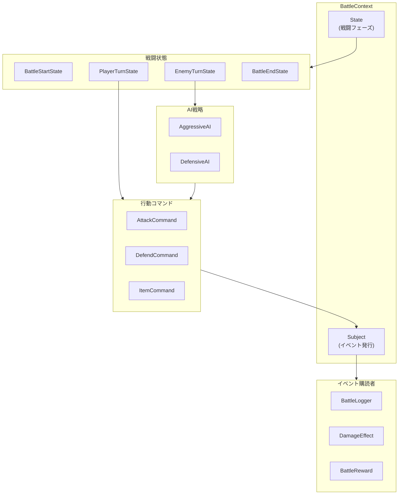
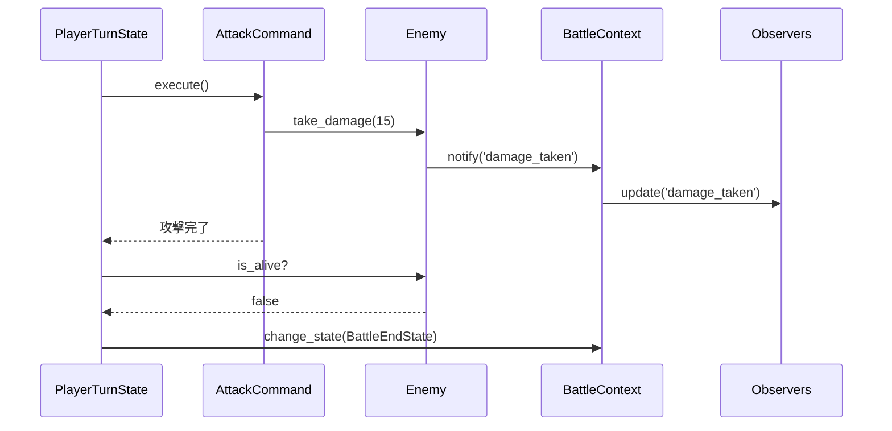

ここまでの7回で、4つのデザインパターンを導入してきました。

- Command: 行動をオブジェクトとしてカプセル化
- State: 戦闘フェーズを状態として管理
- Strategy: 敵のAIアルゴリズムを交換可能に
- Observer: イベントを購読者に自動通知

今回は、これらのパターンがどのように連携して戦闘システムを構成しているかを俯瞰します。


## パターン間の関係図



## 処理の流れ

戦闘が進行する際、各パターンは以下のように連携します。

1. BattleContextが`BattleStartState`に遷移（State）
2. `PlayerTurnState`でプレイヤーがCommandを選択・実行（Command）
3. `EnemyTurnState`でAI戦略がCommandを決定・実行（Strategy + Command）
4. ダメージ発生時にイベントを通知（Observer）
5. 勝敗が決まると`BattleEndState`に遷移（State）

## シーケンス図



## 各パターンの責務

| パターン | 責務 | 例 |
|---------|------|-----|
| State | 戦闘フェーズの管理と遷移 | 開始→プレイヤー→敵→終了 |
| Command | 行動のカプセル化と実行 | 攻撃、防御、アイテム |
| Strategy | AIアルゴリズムの選択 | 攻撃的、防御的 |
| Observer | イベントの通知と処理 | ログ、エフェクト、報酬 |

## パターンを組み合わせるメリット

### 関心の分離

各パターンが異なる責務を担当しているため、コードが整理されています。

### 拡張性

新しい機能を追加するとき、既存のコードをほとんど変更せずに済みます。

- 新しい行動? → 新しいCommandクラスを追加
- 新しいAI? → 新しいStrategyクラスを追加
- 新しいイベント処理? → 新しいObserverクラスを追加

### テスト容易性

各コンポーネントを独立してテストできます。

```perl
# Commandのテスト
my $attack = AttackCommand->new(actor => $hero, target => $slime);
$attack->execute();
is($slime->hp, 85, 'ダメージが正しく与えられた');
```

## 統合コード（簡略版）

4つのパターンがどのように連携するかを示す簡略版コードです。

```perl
#!/usr/bin/env perl
use v5.36;

# === ロール定義（4パターン）===
package Command    { use Moo::Role; requires 'execute'; has actor => (is => 'ro', required => 1) }
package BattleState { use Moo::Role; requires 'enter', 'execute', 'exit' }
package AIStrategy { use Moo::Role; requires 'decide_action' }
package Subject    { use Moo::Role; has obs => (is => 'ro', default => sub{[]}); sub notify($s,$e,$d){ $_->update($e,$d) for $s->obs->@* } }
package Observer   { use Moo::Role; requires 'update' }

# === Command: 行動をオブジェクト化 ===
package AttackCommand { use Moo; with 'Command'; has target => (is => 'ro');
    sub execute($s) { say $s->actor->name . "の攻撃！" } }

# === 最小キャラクター ===
package Character { use Moo; has name => (is => 'ro', required => 1) }

# === 最小コンテキスト ===
package BattleContext { use Moo; has player => (is => 'ro', required => 1); has enemy => (is => 'ro', required => 1) }

# === Strategy: AIアルゴリズムを交換 ===
package AggressiveAI { use Moo; with 'AIStrategy';
    sub decide_action($s,$actor,$target) { AttackCommand->new(actor=>$actor,target=>$target) } }

# === State: フェーズ管理 ===
package PlayerTurn { use Moo; with 'BattleState';
    sub enter($s,$c)   { say "プレイヤーターン" }
    sub execute($s,$c) { AttackCommand->new(actor=>$c->player,target=>$c->enemy)->execute() }
    sub exit($s,$c)    {} }

# === Observer: イベント通知 ===
package DamageLogger { use Moo; with 'Observer';
    sub update($s,$ev,$d) { say "[LOG] $ev" if $ev eq 'damage' } }

# === 連携デモ ===
my $ctx = BattleContext->new(
    player => Character->new(name => '勇者'),
    enemy  => Character->new(name => 'スライム'),
);
PlayerTurn->new->execute($ctx);
```

この簡略版では、各パターンが最小限のコードでどのように協調するかを示しています。実際の完成版は次回（第9回）で紹介します。

## 今回のポイント

- State→Command→Strategy→Observerの連携を確認
- 各パターンが異なる責務を担い、関心が分離されている
- 新機能の追加が既存コードに影響しにくい設計
- 各コンポーネントを独立してテスト可能

次回は、これまでの成果を統合して対話型のバトルシステムを完成させます。

---

前回: 

次回: 
