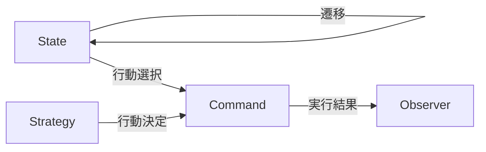

全10回のシリーズを通じて、テキストRPG戦闘エンジンを完成させました。最終回では、使用した4つのデザインパターンがなぜこの組み合わせで機能するのかを振り返り、他の場面への応用を考えます。

## 使用したパターンの振り返り

| パターン | 導入回 | 解決した問題 |
|---------|-------|-------------|
| Command | 第4回 | 行動のif/else分岐の爆発 |
| State | 第5回 | 戦闘フェーズの複雑な制御 |
| Strategy | 第6回 | AIアルゴリズムの切り替え |
| Observer | 第7回 | イベント発生時の副作用処理 |

## なぜこの4パターンなのか

### 問題領域との対応

RPG戦闘システムには、4つの主要な関心事があります。

1. 何をするか（行動）→ Command
2. いつするか（フェーズ）→ State
3. どう判断するか（AI）→ Strategy  
4. 何が起きたか（通知）→ Observer

これらは互いに独立した関心事であり、それぞれに適したパターンを適用しました。

### SOLID原則の実践

| 原則 | 実践例 |
|------|--------|
| 単一責任（SRP） | 各パターンが1つの責務を担当 |
| 開放閉鎖（OCP） | 新クラス追加で拡張、既存変更不要 |
| リスコフ置換（LSP） | ロールを実装すれば差し替え可能 |
| インターフェース分離（ISP） | 各ロールが最小限のメソッドを要求 |
| 依存性逆転（DIP） | 具象クラスでなくロールに依存 |

## パターン間の協調

1. Stateが現在のフェーズを管理
2. プレイヤーターンではCommandを直接選択
3. 敵ターンではStrategyがCommandを決定
4. Commandの実行結果をObserverが受け取る

## 応用例

### ボードゲームAI

チェスや将棋のAIにも同じパターンが使えます。

- State: ゲームフェーズ（序盤/中盤/終盤）
- Command: 駒の移動
- Strategy: 評価関数の切り替え
- Observer: 棋譜の記録

### ワークフローエンジン

業務システムの申請フローにも適用できます。

- State: 申請状態（下書き/申請中/承認済/却下）
- Command: 承認/却下/差し戻し
- Strategy: 承認ルール（金額別、部署別）
- Observer: メール通知、ログ記録

### GUIアプリケーション

デスクトップアプリやWebアプリのUI制御にも使えます。

- State: 画面状態（編集中/プレビュー/保存済）
- Command: ユーザー操作（編集/保存/取消）
- Strategy: バリデーションルール
- Observer: UI更新、エラー表示

## パターン組み合わせのガイドライン

### 組み合わせが有効なケース

- 複数の独立した関心事がある
- 各関心事に明確な責務がある
- 将来の拡張が予想される
- テスト容易性が重要

### 避けるべきケース

- 単純な処理で過剰設計になる
- パターン間の依存が複雑化する
- チームがパターンに不慣れ

## シリーズのまとめ

| 回 | テーマ | 学んだこと |
|---|-------|-----------|
| 1 | 殴り合い | 基本の戦闘ループ |
| 2 | 行動の分離 | クラス設計の基礎 |
| 3 | if/elseの破綻 | コードスメルの認識 |
| 4 | Command導入 | 行動のオブジェクト化 |
| 5 | State導入 | 状態遷移の管理 |
| 6 | Strategy導入 | アルゴリズムの交換 |
| 7 | Observer導入 | イベント駆動 |
| 8 | パターン協調 | 複合設計の理解 |
| 9 | 完成版 | 統合と実装 |
| 10 | 振り返り | 応用と発展 |

## 発展課題

さらに学びたい方への課題です。

1. Undo/Redo機能の追加（Commandパターンの拡張）
2. 複数の敵との戦闘（Compositeパターン）
3. 戦闘ログのリプレイ機能（Mementoパターン）
4. 装備による能力変化（Decoratorパターン）

## おわりに

このシリーズでは、RPG戦闘エンジンという題材を通じて、複数のデザインパターンを組み合わせる方法を学びました。

重要なのは、パターンを知識として覚えることではなく、「なぜこのパターンを使うのか」を理解することです。問題を分析し、適切なパターンを選び、組み合わせる。この判断力こそが、設計力の核心です。

ぜひ完成したコードに機能を追加したり、別の題材でパターンを試したりして、理解を深めてください。

お疲れさまでした。

---

前回: 
