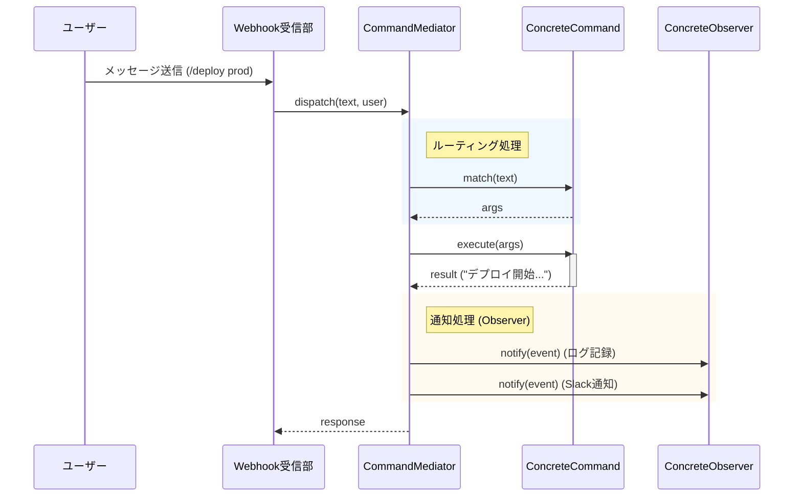

ここまで、Mediator、Command、Observerの3つのパターンを個別に実装してきました。
今回は、これらをすべて組み合わせて、実際に動く「指令センター」の全体像を完成させます。

バラバラだった部品が噛み合い、美しいピタゴラスイッチのように連動する様子をご覧ください。




<!--more-->

## 全体アーキテクチャ図

データの流れは以下のようになります。これは典型的な「イベント駆動アーキテクチャ」の縮図です。



重要なのは、「入力（Webhook）」と「処理（Command）」と「出力（Observer）」が完全に疎結合になっている点です。Mediatorだけがすべてを知っており、他のコンポーネントはお互いを知りません。

## 統合コード (bootstrap.pl)

アプリケーションの起動（構築）部分のコードです。ここで部品を組み立てます。

```perl
#!/usr/bin/env perl
use strict;
use warnings;

# クラスのロード
use Bot::CommandMediator;
use Bot::Command::Deploy;
use Bot::Command::Log;
use Bot::Command::Help;
use Bot::Observer::SlackNotifier;
use Bot::Observer::FileLogger;

# 1. Mediator（指令塔）の生成
my $mediator = Bot::CommandMediator->new;

# 2. Command（手足）の登録
$mediator->register_command(Bot::Command::Deploy->new);
$mediator->register_command(Bot::Command::Log->new);
$mediator->register_command(Bot::Command::Help->new(mediator => $mediator));

# 3. Observer（監視者）の登録
$mediator->add_observer(Bot::Observer::FileLogger->new);
# 実際はここに本物のSlack APIトークンなどを渡す
$mediator->add_observer(Bot::Observer::SlackNotifier->new);

# --- ここまでが初期化 ---

# 4. 実行シミュレーション（Webhookからの入力を想定）
print "--- Case 1: 正常なデプロイ ---\n";
my $result1 = $mediator->dispatch("/deploy production", "admin", "nobu");
print "Return: $result1\n\n";

print "--- Case 2: 権限不足 ---\n";
my $result2 = $mediator->dispatch("/deploy production", "guest", "unknown_user");
print "Return: $result2\n\n";

print "--- Case 3: ログ取得 ---\n";
my $result3 = $mediator->dispatch("/log error --lines 50", "admin", "nobu");
print "Return: $result3\n";
```

## 実行結果

このスクリプトを実行すると、以下のようにすべてのパターンが連携して動作するのがわかります。

```text
--- Case 1: 正常なデプロイ ---
[ファイルログ] [2026-01-31 00:47:17] Command: Bot::Command::Deploy, User: nobu, Result: 🚀 production 環境へのデプロイを開始しました...
[Slack通知] 🚀 production 環境へのデプロイを開始しました...
Return: 🚀 production 環境へのデプロイを開始しました...

--- Case 2: 権限不足 ---
Return: ⛔ 権限が不足しています（必要権限: admin）
(※ 権限エラーの場合、Commandのexecuteまで到達しないため、イベント通知も飛ばない設定になっています)

--- Case 3: ログ取得 ---
[ファイルログ] [2026-01-31 00:47:17] Command: Bot::Command::Log, User: nobu, Result: 📋 error ログを直近 50 行取得しました...
[Slack通知] 📋 error ログを直近 50 行取得しました...
Return: 📋 error ログを直近 50 行取得しました...
```

## パターンの恩恵

この「初期化コード」を見てください。
新しい機能を追加したいとき、どこを触ればいいか一目瞭然です。

- 新しいコマンド？ → `register_command` を1行足すだけ。
- 新しい通知先？ → `add_observer` を1行足すだけ。

「変更箇所が局所化されている」。これこそが良い設計の証です。

次回は、より実践的なトピックとして、セキュリティとエラーハンドリングに焦点を当てます。非同期処理やタイムアウトなど、現実世界の問題にどう対処するかを見ていきましょう。



## 今回の完成コード

今回の記事本文で紹介した `bootstrap.pl` が、全パターンを統合した完成コードそのものです。記事内のコードを参照してください。
このスクリプトを実行することで、Mediator、Command、Observerの連携を確認できます。
