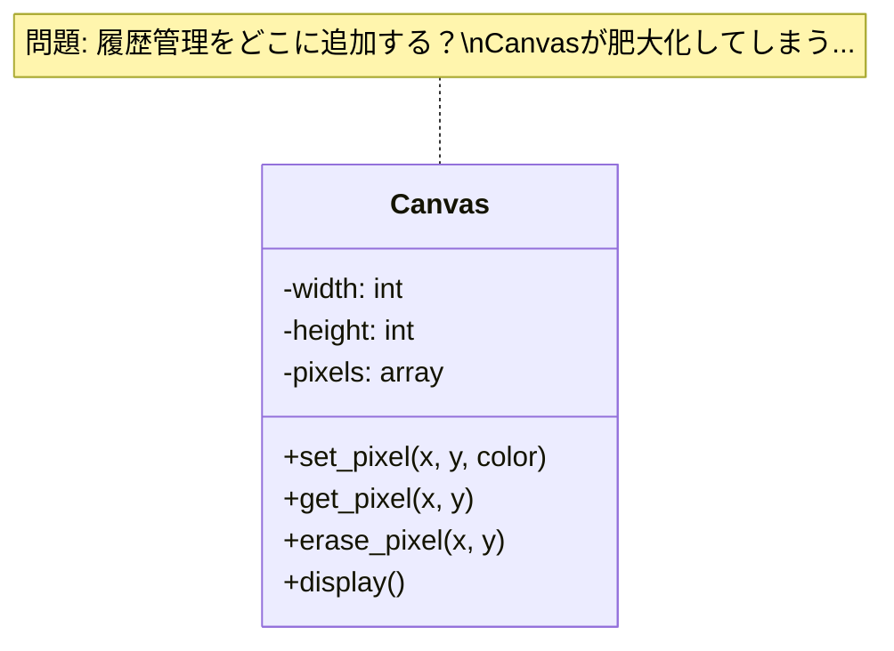
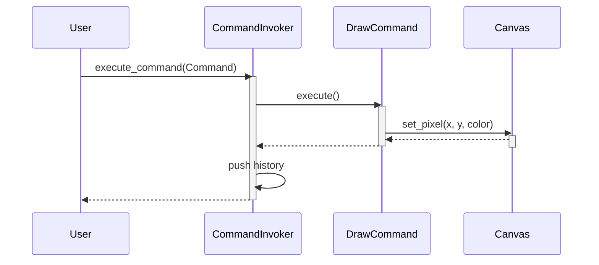
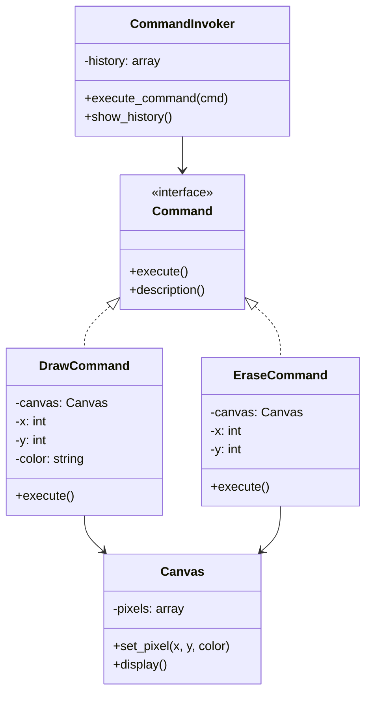
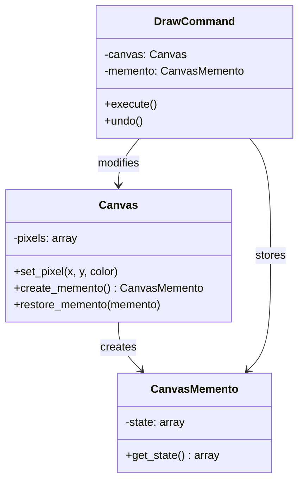
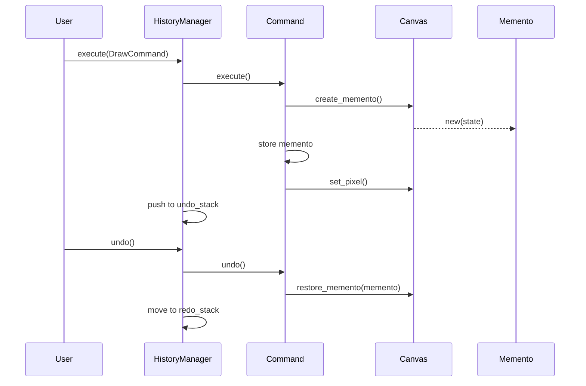

ターミナル上で動作するドット絵エディタを作ってみませんか？

今回は、PerlとMooを使って、1ピクセルずつ描画できるPixelアートエディタを段階的に構築していきます。最終的には、無限のUndo/Redo機能で「時間を巻き戻す」体験ができるツールを完成させます。

この記事では、デザインパターンの中でも特に相性の良いMementoパターンとCommandパターンを組み合わせることで、「操作の履歴管理」という実務で頻出する課題を解決する方法を学びます。

## この記事の対象読者

- Perl入学式を卒業したレベルの方
- MooでのOOP入門を完了した方（「Mooで覚えるオブジェクト指向プログラミング」シリーズを読み終えた方に最適）

## 使用技術

- Perl v5.36以降（signatures、postfix dereference対応）
- Moo（オブジェクト指向フレームワーク）
- Term::ANSIColor（ターミナルカラー表示、コア標準）
- Storable（ディープコピー、コア標準）

## 学習目標

この記事を読み終えると、以下のことができるようになります:

- Memento+Commandの2パターンが自然に組み合わさる場面を体感できる
- 「操作の履歴管理」という実務で頻出する課題の解決方法を習得できる
- Undo/Redo機能の設計原理を理解し、他のアプリケーションにも応用できる

---

## 第1章: ターミナルでPixelアート基礎

ターミナルでドット絵を描く――そう聞くと「え、CLI環境で？」と思われるかもしれませんが、これが意外と楽しいんです。

この章では、ターミナルで色付きの点を表示する最小限のキャンバスを作成します。

### 新しい概念: Canvasクラス

まずは、ピクセルを管理するための基本的なキャンバスクラスを作りましょう。

```perl
# lib/Canvas.pm
package Canvas {
    use v5.36;
    use Moo;
    use Term::ANSIColor qw(colored);

    has width  => (is => 'ro', required => 1);
    has height => (is => 'ro', required => 1);
    has pixels => (is => 'rw', lazy => 1, builder => '_build_pixels');

    sub _build_pixels($self) {
        my @pixels;
        for my $y (0 .. $self->height - 1) {
            for my $x (0 .. $self->width - 1) {
                $pixels[$y][$x] = ' ';  # 空白で初期化
            }
        }
        return \@pixels;
    }

    sub set_pixel($self, $x, $y, $color) {
        return if $x < 0 || $x >= $self->width;
        return if $y < 0 || $y >= $self->height;
        $self->pixels->[$y][$x] = $color;
    }

    sub get_pixel($self, $x, $y) {
        return ' ' if $x < 0 || $x >= $self->width;
        return ' ' if $y < 0 || $y >= $self->height;
        return $self->pixels->[$y][$x];
    }

    sub display($self) {
        say "+" . ("-" x ($self->width * 2)) . "+";
        for my $y (0 .. $self->height - 1) {
            print "|";
            for my $x (0 .. $self->width - 1) {
                my $pixel = $self->pixels->[$y][$x];
                if ($pixel eq ' ') {
                    print "  ";
                } else {
                    print colored("██", $pixel);
                }
            }
            say "|";
        }
        say "+" . ("-" x ($self->width * 2)) . "+";
    }
}

1;
```

シンプルですね。`width` と `height` でキャンバスのサイズを指定し、`pixels` 配列でピクセルデータを管理します。

### Term::ANSIColorでカラー表示

ターミナルで色を表示するには、`Term::ANSIColor` モジュールを使います。これはPerlのコア標準モジュールなので、追加インストールは不要です。

```perl
# 使用例
use v5.36;
use lib 'lib';
use Canvas;

my $canvas = Canvas->new(width => 8, height => 8);

# いくつかのピクセルを描画
$canvas->set_pixel(2, 2, 'red');
$canvas->set_pixel(3, 2, 'red');
$canvas->set_pixel(4, 2, 'red');
$canvas->set_pixel(3, 3, 'yellow');
$canvas->set_pixel(2, 4, 'green');
$canvas->set_pixel(3, 4, 'green');
$canvas->set_pixel(4, 4, 'green');

$canvas->display();
```

実行すると、ターミナルに色付きのドット絵が表示されます。

### この章のまとめ

- Canvasクラスでピクセルデータを2次元配列で管理
- Term::ANSIColorでターミナルにカラー表示
- set_pixel/get_pixelで個別のピクセルを操作

---

## 第2章: 消しゴムで消したら戻せない！

この章では、消しゴム機能を追加しますが、問題点が浮き彫りになります。

### 新しい概念: 破綻の認識

消しゴム機能を追加してみましょう。

```perl
# Canvasクラスに追加
sub erase_pixel($self, $x, $y) {
    $self->set_pixel($x, $y, ' ');
}
```

簡単ですね。では、実際に使ってみましょう。

```perl
# 使用例
my $canvas = Canvas->new(width => 8, height => 8);

# 力作を描く
$canvas->set_pixel(3, 3, 'red');
$canvas->set_pixel(4, 3, 'red');
$canvas->set_pixel(3, 4, 'blue');
$canvas->set_pixel(4, 4, 'blue');

say "=== 力作完成！ ===";
$canvas->display();

# うっかり消しゴムで消してしまう
$canvas->erase_pixel(3, 3);
$canvas->erase_pixel(4, 3);

say "=== あっ、間違えた... ===";
$canvas->display();

# 元に戻したい...けど、どうやって？
```

問題が見えてきましたか？

この瞬間、私たちは「Undo機能のありがたさ」を痛感します。

一度消してしまったピクセルは、元に戻せません。描き直すしかない。これは辛い。

### 問題点の整理

現在のコードには、以下の問題があります:

1. 操作の履歴がない: 何をしたか記録していない
2. 状態の保存がない: 過去の状態に戻れない
3. Undo機能がない: 「元に戻す」ができない

これは、単一責任の原則（SRP）に違反しているとも言えます。Canvasクラスが「ピクセルの管理」と「操作の実行」を同時に担っているため、履歴管理を追加しようとすると、コードが複雑になってしまいます。



### この章のまとめ

- 消しゴム機能を追加したが、元に戻せない
- 操作履歴・状態保存がない設計の問題点を認識
- SRP違反: Canvasが多くの責務を抱えている

---

## 第3章: 描画操作をCommandパターン化

この章では、Commandパターンを導入して、描画操作をオブジェクト化します。ここでは「操作履歴を記録する」ことに注目します（実際にUndo機能を実装するのは次章以降です）。

### 新しい概念: Commandパターン導入

Commandパターンとは、操作をオブジェクトとしてカプセル化するパターンです。これにより、操作を記録したり、取り消したり、やり直したりできるようになります。

まず、描画コマンドを作りましょう。

```perl
# lib/DrawCommand.pm
package DrawCommand {
    use v5.36;
    use Moo;

    has canvas => (is => 'ro', required => 1);
    has x      => (is => 'ro', required => 1);
    has y      => (is => 'ro', required => 1);
    has color  => (is => 'ro', required => 1);

    sub execute($self) {
        $self->canvas->set_pixel($self->x, $self->y, $self->color);
    }

    sub description($self) {
        return sprintf("Draw %s at (%d, %d)", $self->color, $self->x, $self->y);
    }
}

1;
```

次に、消しゴムコマンドも作ります。

```perl
# lib/EraseCommand.pm
package EraseCommand {
    use v5.36;
    use Moo;

    has canvas => (is => 'ro', required => 1);
    has x      => (is => 'ro', required => 1);
    has y      => (is => 'ro', required => 1);

    sub execute($self) {
        $self->canvas->set_pixel($self->x, $self->y, ' ');
    }

    sub description($self) {
        return sprintf("Erase at (%d, %d)", $self->x, $self->y);
    }
}

1;
```

### CommandInvoker: 履歴スタックで管理

コマンドを管理するためのInvokerクラスを作ります。

```perl
# lib/CommandInvoker.pm
package CommandInvoker {
    use v5.36;
    use Moo;

    has history => (is => 'rw', default => sub { [] });

    sub execute_command($self, $command) {
        $command->execute();
        push $self->history->@*, $command;
        say "[History] " . $command->description();
    }

    sub show_history($self) {
        say "=== Command History ===";
        my $i = 1;
        for my $cmd ($self->history->@*) {
            say sprintf("%2d. %s", $i++, $cmd->description());
        }
    }
}

1;
```

これで、すべての操作が記録されるようになりました。

```perl
# 使用例
use v5.36;
use lib 'lib';
use Canvas;
use DrawCommand;
use EraseCommand;
use CommandInvoker;

my $canvas = Canvas->new(width => 8, height => 8);
my $invoker = CommandInvoker->new();

# コマンドを通じて操作
$invoker->execute_command(
    DrawCommand->new(canvas => $canvas, x => 3, y => 3, color => 'red')
);
$invoker->execute_command(
    DrawCommand->new(canvas => $canvas, x => 4, y => 3, color => 'red')
);
$invoker->execute_command(
    EraseCommand->new(canvas => $canvas, x => 3, y => 3)
);

$canvas->display();
$invoker->show_history();
```





### この章のまとめ

- Commandパターンで操作をオブジェクト化
- DrawCommand、EraseCommandを作成
- CommandInvokerで履歴スタックを管理
- 操作履歴を表示できるようになった

### 開放閉鎖原則（OCP）の体現

Commandパターンを導入することで、開放閉鎖原則（OCP: Open-Closed Principle）が実現されています。

- 拡張に対して開いている: 新しいCommandクラス（例: FillCommand、LineCommandなど）を追加できる
- 変更に対して閉じている: 新しいCommandを追加してもCommandInvokerや他の既存コードは変更不要

つまり、「機能追加時に既存コードを壊すリスク」が大幅に下がります。

しかし、まだ「元に戻す」機能はありません。履歴は記録できましたが、過去の状態を復元する方法がありません。次の章で解決しましょう。

---

## 第4章: 過去の状態をMementoで保存

この章では、Mementoパターンを導入して、キャンバスの状態を保存・復元できるようにします。

### 新しい概念: Mementoパターン導入

Mementoパターンとは、オブジェクトの内部状態を保存し、後で復元できるようにするパターンです。これをCommandパターンと組み合わせることで、Undo機能を実現できます。

まず、キャンバスの状態を保存するMementoクラスを作ります。

```perl
# lib/CanvasMemento.pm
package CanvasMemento {
    use v5.36;
    use Moo;

    has state => (is => 'ro', required => 1);

    sub get_state($self) {
        return $self->state;
    }
}

1;
```

次に、Canvasクラスにメメント作成・復元のメソッドを追加します。

```perl
# lib/Canvas.pm に追加
use Storable qw(dclone);

sub create_memento($self) {
    return CanvasMemento->new(state => dclone($self->pixels));
}

sub restore_memento($self, $memento) {
    $self->pixels(dclone($memento->get_state()));
}
```

`Storable::dclone` を使ってディープコピーを行います。これは非常に重要です。参照渡しのPerlで、配列を完全にコピーする頼もしい方法です。これを使わないと、「復元したはずなのに元に戻らない」という罠にハマります。

### コマンドにメメントを統合

DrawCommandにメメントを保存する機能を追加しましょう。

```perl
# lib/DrawCommand.pm を更新
package DrawCommand {
    use v5.36;
    use Moo;

    has canvas  => (is => 'ro', required => 1);
    has x       => (is => 'ro', required => 1);
    has y       => (is => 'ro', required => 1);
    has color   => (is => 'ro', required => 1);
    has memento => (is => 'rw');  # 実行前の状態を保存

    sub execute($self) {
        # 実行前の状態を保存
        $self->memento($self->canvas->create_memento());
        # 描画を実行
        $self->canvas->set_pixel($self->x, $self->y, $self->color);
    }

    sub undo($self) {
        # 保存した状態を復元
        if ($self->memento) {
            $self->canvas->restore_memento($self->memento);
        }
    }

    sub description($self) {
        return sprintf("Draw %s at (%d, %d)", $self->color, $self->x, $self->y);
    }
}

1;
```

EraseCommandも同様に更新します。

```perl
# lib/EraseCommand.pm を更新
package EraseCommand {
    use v5.36;
    use Moo;

    has canvas  => (is => 'ro', required => 1);
    has x       => (is => 'ro', required => 1);
    has y       => (is => 'ro', required => 1);
    has memento => (is => 'rw');

    sub execute($self) {
        $self->memento($self->canvas->create_memento());
        $self->canvas->set_pixel($self->x, $self->y, ' ');
    }

    sub undo($self) {
        if ($self->memento) {
            $self->canvas->restore_memento($self->memento);
        }
    }

    sub description($self) {
        return sprintf("Erase at (%d, %d)", $self->x, $self->y);
    }
}

1;
```



### この章のまとめ

- Mementoパターンでキャンバス状態をスナップショット保存
- Storable::dcloneでディープコピーを実現
- 各コマンドが実行前の状態を保持し、undoで復元可能に

---

## 第5章: 無限Undo/Redo機能の完成

この章では、MementoとCommandを統合し、完全なUndo/Redo機能を実装します。

### 新しい概念: パターン間の協調

これまでに作成したCommandパターンとMementoパターンを組み合わせて、本格的な履歴管理システムを構築しましょう。

```perl
# lib/HistoryManager.pm
package HistoryManager {
    use v5.36;
    use Moo;

    has undo_stack => (is => 'rw', default => sub { [] });
    has redo_stack => (is => 'rw', default => sub { [] });

    sub execute($self, $command) {
        $command->execute();
        push $self->undo_stack->@*, $command;
        # 新しい操作を実行したら、Redoスタックをクリア
        $self->redo_stack([]);
        say "[Execute] " . $command->description();
    }

    sub undo($self) {
        return unless $self->undo_stack->@*;
        my $command = pop $self->undo_stack->@*;
        $command->undo();
        push $self->redo_stack->@*, $command;
        say "[Undo] " . $command->description();
    }

    sub redo($self) {
        return unless $self->redo_stack->@*;
        my $command = pop $self->redo_stack->@*;
        $command->execute();
        push $self->undo_stack->@*, $command;
        say "[Redo] " . $command->description();
    }

    sub can_undo($self) {
        return scalar $self->undo_stack->@*;
    }

    sub can_redo($self) {
        return scalar $self->redo_stack->@*;
    }

    sub status($self) {
        return sprintf("Undo: %d / Redo: %d", 
            scalar($self->undo_stack->@*),
            scalar($self->redo_stack->@*)
        );
    }
}

1;
```

### 統合デモ

これで、無限のUndo/Redo機能が使えるようになりました。

```perl
# 使用例
use v5.36;
use lib 'lib';
use Canvas;
use DrawCommand;
use EraseCommand;
use HistoryManager;

my $canvas = Canvas->new(width => 8, height => 8);
my $history = HistoryManager->new();

# 描画操作を実行
$history->execute(
    DrawCommand->new(canvas => $canvas, x => 3, y => 3, color => 'red')
);
$history->execute(
    DrawCommand->new(canvas => $canvas, x => 4, y => 3, color => 'blue')
);
$history->execute(
    DrawCommand->new(canvas => $canvas, x => 3, y => 4, color => 'green')
);

say "\n=== 描画後 ===";
$canvas->display();
say $history->status();

# Undoを3回実行
say "\n=== Undo x3 ===";
$history->undo();
$history->undo();
$history->undo();
$canvas->display();
say $history->status();

# Redoを2回実行
say "\n=== Redo x2 ===";
$history->redo();
$history->redo();
$canvas->display();
say $history->status();
```

実行結果:

```
[Execute] Draw red at (3, 3)
[Execute] Draw blue at (4, 3)
[Execute] Draw green at (3, 4)

=== 描画後 ===
+----------------+
|                |
|                |
|                |
|      ████      |
|      ██        |
|                |
|                |
|                |
+----------------+
Undo: 3 / Redo: 0

=== Undo x3 ===
[Undo] Draw green at (3, 4)
[Undo] Draw blue at (4, 3)
[Undo] Draw red at (3, 3)
+----------------+
|                |
|                |
|                |
|                |
|                |
|                |
|                |
|                |
+----------------+
Undo: 0 / Redo: 3

=== Redo x2 ===
[Redo] Draw red at (3, 3)
[Redo] Draw blue at (4, 3)
+----------------+
|                |
|                |
|                |
|      ████      |
|                |
|                |
|                |
|                |
+----------------+
Undo: 2 / Redo: 1
```

時間を自由に行き来できるようになりました。これぞMemento+Commandの真骨頂です。

### 実行フローの全体像

Undo/Redoがどのように動作しているか、シーケンス図で確認しましょう。注目すべきは以下の2つのフローです:

1. Execute時: Command実行前にMementoを作成し、Undo可能な状態にする
2. Undo時: 保存したMementoからCanvasの状態を復元する

この「実行前に保存、Undo時に復元」という流れが、Memento+Commandの核心です。



### この章のまとめ

- HistoryManagerでUndo/Redoスタックを管理
- 新しい操作でRedoスタックをクリア
- Command + Mementoの協調で完全な履歴管理を実現

---

## 第6章: 完成！対話型Pixelアートエディタ

この章では、REPLモードで対話的に操作できる完成版を作成します。

### 新しい概念: REPL対話モード

最後に、すべてを統合した対話型エディタを作りましょう。

```perl
#!/usr/bin/env perl
# pixel_art_editor.pl - 完成版Pixelアートエディタ
use v5.36;
use lib 'lib';
use Canvas;
use DrawCommand;
use EraseCommand;
use HistoryManager;

my $canvas = Canvas->new(width => 16, height => 12);
my $history = HistoryManager->new();

sub show_help {
    say <<'HELP';
=== Pixel Art Editor Commands ===
  draw X Y COLOR  - ピクセルを描画 (例: draw 5 5 red)
  erase X Y       - ピクセルを消去
  undo            - 元に戻す
  redo            - やり直す
  show            - キャンバスを表示
  clear           - キャンバスをクリア
  status          - 履歴の状態を表示
  colors          - 使用可能な色を表示
  help            - このヘルプを表示
  quit            - 終了

使用可能な色: red, green, blue, yellow, cyan, magenta, white
HELP
}

sub show_colors {
    use Term::ANSIColor qw(colored);
    my @colors = qw(red green blue yellow cyan magenta white);
    say "=== Available Colors ===";
    for my $color (@colors) {
        print colored("██", $color) . " $color\n";
    }
}

sub process_command($input) {
    my @parts = split /\s+/, $input;
    my $cmd = lc(shift @parts // '');
    
    if ($cmd eq 'draw' && @parts >= 3) {
        my ($x, $y, $color) = @parts;
        $history->execute(
            DrawCommand->new(
                canvas => $canvas, 
                x => $x, 
                y => $y, 
                color => $color
            )
        );
        $canvas->display();
    }
    elsif ($cmd eq 'erase' && @parts >= 2) {
        my ($x, $y) = @parts;
        $history->execute(
            EraseCommand->new(canvas => $canvas, x => $x, y => $y)
        );
        $canvas->display();
    }
    elsif ($cmd eq 'undo') {
        if ($history->can_undo()) {
            $history->undo();
            $canvas->display();
        } else {
            say "Nothing to undo.";
        }
    }
    elsif ($cmd eq 'redo') {
        if ($history->can_redo()) {
            $history->redo();
            $canvas->display();
        } else {
            say "Nothing to redo.";
        }
    }
    elsif ($cmd eq 'show') {
        $canvas->display();
    }
    elsif ($cmd eq 'clear') {
        # 全ピクセルをクリア（履歴に残る）
        for my $y (0 .. $canvas->height - 1) {
            for my $x (0 .. $canvas->width - 1) {
                if ($canvas->get_pixel($x, $y) ne ' ') {
                    $history->execute(
                        EraseCommand->new(canvas => $canvas, x => $x, y => $y)
                    );
                }
            }
        }
        $canvas->display();
    }
    elsif ($cmd eq 'status') {
        say $history->status();
    }
    elsif ($cmd eq 'colors') {
        show_colors();
    }
    elsif ($cmd eq 'help') {
        show_help();
    }
    elsif ($cmd eq 'quit' || $cmd eq 'exit' || $cmd eq 'q') {
        say "Goodbye!";
        exit 0;
    }
    else {
        say "Unknown command. Type 'help' for available commands.";
    }
}

# メインループ
say "=== Pixel Art Editor ===";
say "Type 'help' for available commands.\n";
$canvas->display();

while (1) {
    print "> ";
    my $input = <STDIN>;
    last unless defined $input;
    chomp $input;
    next if $input eq '';
    process_command($input);
}
```

### おまけ: JSON保存・読込機能

作品をJSONファイルに保存・読み込みする機能も追加できます（コア標準の JSON::PP を使用）。

```perl
# lib/Canvas.pm に追加
use JSON::PP;

sub save_to_file($self, $filename) {
    my $data = {
        width  => $self->width,
        height => $self->height,
        pixels => $self->pixels,
    };
    open my $fh, '>', $filename or die "Cannot open $filename: $!";
    print $fh JSON::PP->new->pretty->encode($data);
    close $fh;
    say "Saved to $filename";
}

sub load_from_file($class, $filename) {
    open my $fh, '<', $filename or die "Cannot open $filename: $!";
    my $json = do { local $/; <$fh> };
    close $fh;
    my $data = JSON::PP->new->decode($json);
    my $canvas = $class->new(
        width  => $data->{width},
        height => $data->{height},
    );
    $canvas->pixels($data->{pixels});
    say "Loaded from $filename";
    return $canvas;
}
```

### この章のまとめ

- REPL形式で対話的に操作可能
- draw、erase、undo、redo、show、clearなどのコマンド
- JSON保存・読み込み機能でアートを永続化

---

## 全体のまとめ

この記事では、PerlとMooを使って、ターミナルで動作するPixelアートエディタを段階的に構築しました。

### 学んだこと

1. Canvasクラス: 2次元配列でピクセルデータを管理
2. 破綻の認識: 履歴管理なしでは「元に戻す」ができない
3. Commandパターン: 操作をオブジェクト化し、履歴として記録
4. Mementoパターン: 状態をスナップショットとして保存し、復元可能に
5. パターンの協調: Command実行前にMemento作成→Undo時に復元

### パターン組み合わせの核心

- 責務の分離: Commandは「何をするか」、Mementoは「状態の保存・復元」
- 協調パターン: Command実行前にMemento作成→失敗/Undo時にMemento復元
- 拡張性: 新しいCommandを追加してもUndo/Redo機能は自動的に対応
- OCP（開放閉鎖原則）の体現: 新しい操作を追加しても既存コードを変更しない

### 応用例

このMemento+Commandパターンの組み合わせは、以下のような場面で応用できます:

- グラフィックエディタ（Photoshop的なツール）
- テキストエディタ
- CADツール
- ゲームのセーブ/ロード機能
- フォームの入力履歴管理
- Webアプリのユーザーアクション履歴

### 完成版コード

この記事で作成したコードは、以下のファイル構成になっています:

```
lib/
  Canvas.pm
  CanvasMemento.pm
  DrawCommand.pm
  EraseCommand.pm
  HistoryManager.pm
pixel_art_editor.pl
```

ぜひ実際に動かして、「時間を巻き戻す」体験を楽しんでください。ターミナルでドット絵を描くのは、思った以上に楽しいものです。
