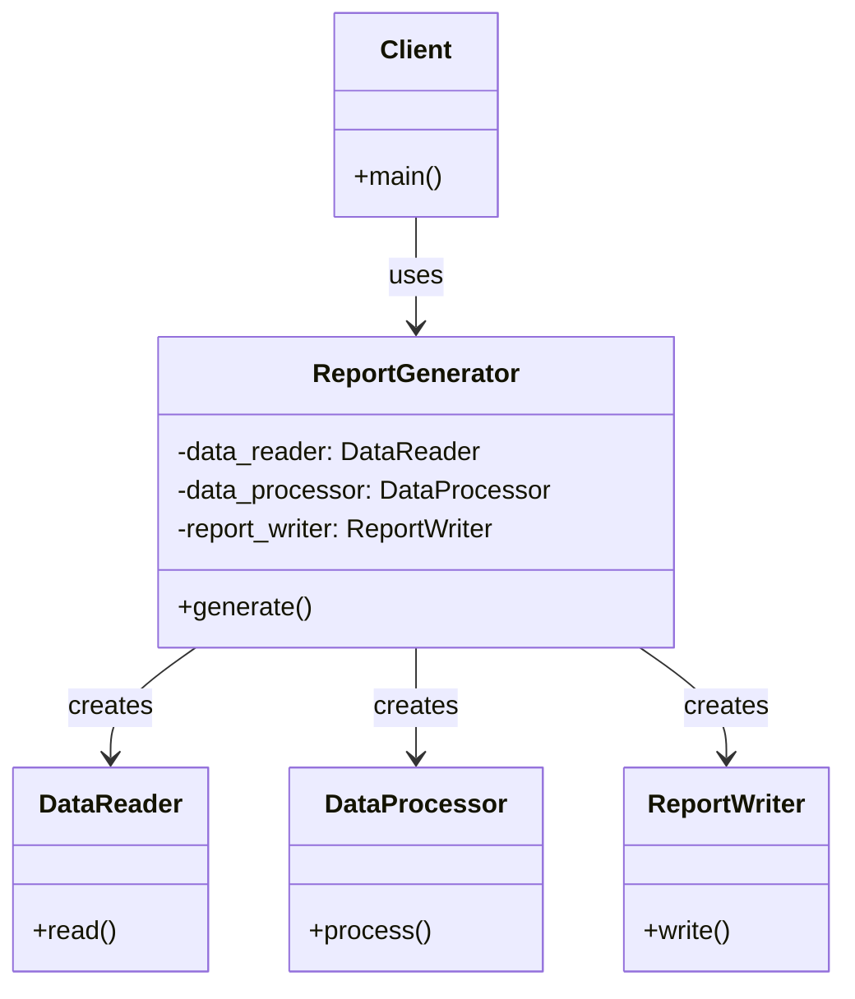

[@nqounet](https://x.com/nqounet)です。

「レポート生成ツールを作ってみよう」シリーズの第7回（最終回）です。

前回は、複雑な処理を1メソッドにまとめる `ReportGenerator` クラスを作成しました。まだ読んでいない方は、先にこちらをご覧ください。

(前回のリンク)

今回は、この `ReportGenerator` クラスの設計手法に名前を付けます。

## Facadeパターンとは

前回作成した `ReportGenerator` クラス。実は、これは **Facadeパターン（ファサードパターン）** と呼ばれるデザインパターンの実装なのです。

Facadeパターンは、Gang of Four（GoF）が定義した23種類のデザインパターンのひとつで、構造パターンに分類されます。

### Facadeの意味

Facade（ファサード）とは、建築用語で「建物の正面」を意味します。豪華なホテルの正面玄関を想像してみてください。お客さんは正面玄関から入るだけで、裏側の複雑な配管や電気系統を意識する必要はありません。

プログラミングにおけるFacadeも同じです。複雑なサブシステムに対して、シンプルな入口（インターフェース）を提供します。

### Facadeパターンの構造

今回作成したレポート生成ツールの構造を図で表すと、以下のようになります。



この図のポイントは以下のとおりです。

- **Client（クライアント）**: `ReportGenerator` のみを使用する
- **ReportGenerator（Facade）**: 3つのサブシステムへのアクセスを統合する
- **DataReader、DataProcessor、ReportWriter（サブシステム）**: 実際の処理を担当する

クライアントは `ReportGenerator` だけを知っていればよく、内部の3つのクラスの存在を意識する必要がありません。

## GoFデザインパターンについて

Facadeパターンは、1994年に出版された書籍『Design Patterns: Elements of Reusable Object-Oriented Software』で紹介されたデザインパターンのひとつです。この書籍は4人の著者（Erich Gamma、Richard Helm、Ralph Johnson、John Vlissides）によって書かれ、彼らは「Gang of Four（GoF）」と呼ばれています。



GoFは、ソフトウェア設計でよく使われるパターンを23種類に分類しました。

| カテゴリ | パターン数 | 例 |
|---------|----------|---|
| 生成パターン | 5 | Singleton、Factory Method |
| 構造パターン | 7 | **Facade**、Adapter、Decorator |
| 振る舞いパターン | 11 | Strategy、Observer |

Facadeパターンは構造パターンに分類され、「複雑なサブシステムに対して統一された簡潔なインターフェースを提供する」ことを目的としています。

## Facadeパターンのメリットとデメリット

### メリット

- **複雑性の低減**: クライアントは複雑なサブシステムの詳細を知る必要がない
- **結合度の低減**: クライアントとサブシステム間の依存関係が疎結合になる
- **保守性の向上**: 変更箇所がFacadeに集中するため、修正が容易
- **テストの容易化**: Facadeをモック化することで、サブシステム全体をスタブ化できる

### デメリット

- **過剰な抽象化のリスク**: シンプルなシステムに対しては不要な複雑さを追加してしまう
- **柔軟性の低下**: Facadeが公開しない高度な機能にアクセスできなくなる
- **神クラス化のリスク**: Facadeに過剰な責任を持たせると、単一責任の原則に違反する

## 連載の振り返り

ここで、全7回の連載を振り返ってみましょう。

| 回 | 学んだこと | 作成したもの |
|---|-----------|------------|
| 第1回 | スクリプトの基本構造 | 固定データを表示するスクリプト |
| 第2回 | ファイル読み込み | DataReaderクラス |
| 第3回 | データ変換 | DataProcessorクラス |
| 第4回 | 出力フォーマット | ReportWriterクラス |
| 第5回 | クラスの連携 | 3クラスを使うメインスクリプト（問題点を体験） |
| 第6回 | Facadeクラス | ReportGeneratorクラス |
| 第7回 | Facadeパターン | デザインパターンとしての理解 |

最初はシンプルなスクリプトから始まり、機能を追加するたびにコードが複雑になっていきました。そして第6回で Facade（ReportGenerator）を導入することで、再びシンプルに使えるようになりました。

この流れを体験したことで、Facadeパターンの価値を実感できたのではないでしょうか。

## 完成コード

最終回として、完成したコードを再掲します。

**言語・バージョン**: Perl v5.36以降  
**外部依存**: Moo, List::Util（コアモジュール）

```perl
#!/usr/bin/env perl
use v5.36;
use Moo;
use List::Util qw(sum);

# DataReaderクラス（サブシステム1）
package DataReader {
    use Moo;
    use v5.36;

    has file_path => (is => 'ro', required => 1);

    sub read($self) {
        open my $fh, '<', $self->file_path
            or die "Cannot open file: $!";

        my $header_line = <$fh>;
        chomp $header_line;
        my @headers = split /,/, $header_line;

        my @data;
        while (my $line = <$fh>) {
            chomp $line;
            my @values = split /,/, $line;
            my %row;
            for my $i (0 .. $#headers) {
                $row{$headers[$i]} = $values[$i];
            }
            push @data, \%row;
        }

        close $fh;
        return \@data;
    }
}

# DataProcessorクラス（サブシステム2）
package DataProcessor {
    use Moo;
    use v5.36;
    use List::Util qw(sum);

    sub process($self, $data) {
        my @sorted = sort { $b->{score} <=> $a->{score} } @$data;

        my $total = sum(map { $_->{score} } @sorted);
        my $average = $total / scalar(@sorted);

        return {
            records => \@sorted,
            average => $average,
            count   => scalar(@sorted),
        };
    }
}

# ReportWriterクラス（サブシステム3）
package ReportWriter {
    use Moo;
    use v5.36;

    has title => (is => 'ro', default => '成績レポート');

    sub write($self, $processed_data) {
        my @lines;

        push @lines, "=== " . $self->title . " ===";
        push @lines, '';

        for my $row (@{$processed_data->{records}}) {
            push @lines, "$row->{name}: $row->{score}点";
        }

        push @lines, '';
        push @lines, sprintf("平均点: %.1f点", $processed_data->{average});
        push @lines, "受験者数: $processed_data->{count}名";
        push @lines, '';
        push @lines, '=== レポート終了 ===';

        return join("\n", @lines);
    }
}

# ReportGeneratorクラス（Facade）
package ReportGenerator {
    use Moo;
    use v5.36;

    has data_reader    => (is => 'lazy');
    has data_processor => (is => 'lazy');
    has report_writer  => (is => 'lazy');

    has file_path => (is => 'ro', required => 1);
    has title     => (is => 'ro', default => '成績レポート');

    sub _build_data_reader($self) {
        return DataReader->new(file_path => $self->file_path);
    }

    sub _build_data_processor($self) {
        return DataProcessor->new;
    }

    sub _build_report_writer($self) {
        return ReportWriter->new(title => $self->title);
    }

    sub generate($self) {
        my $raw_data  = $self->data_reader->read;
        my $processed = $self->data_processor->process($raw_data);
        my $report    = $self->report_writer->write($processed);
        return $report;
    }
}

# メイン処理（クライアント）
package main;

my $generator = ReportGenerator->new(
    file_path => 'data.csv',
    title     => '成績レポート',
);
my $report = $generator->generate;

say $report;
```

## 次のステップ

Facadeパターンを学んだあなたには、以下のステップをおすすめします。

### 他のデザインパターンを学ぶ

GoFの23パターンには、他にも有用なパターンがたくさんあります。例えば、前シリーズ「Mooで覚えるオブジェクト指向プログラミング」の最終回で紹介した Strategy パターンも、よく使われるパターンのひとつです。



### Facadeパターンを実際のプロジェクトで使う

今回学んだFacadeパターンを、実際のプロジェクトで使ってみてください。例えば、以下のような場面で活用できます。

- 複雑なライブラリやAPIのラッピング
- レイヤードアーキテクチャのエントリーポイント
- レガシーシステムの統合

### 参考リソース

Facadeパターンについてさらに学びたい方は、以下のリソースを参照してください。



## まとめ

- 前回作成した `ReportGenerator` は Facadeパターン の実装である
- FacadeパターンはGoFの23パターンのひとつで、構造パターンに分類される
- 複雑なサブシステムに対して、シンプルなインターフェースを提供することが目的である
- 適切に使うことで、コードの複雑性を低減し、保守性を向上させる

## おわりに

全7回にわたる「レポート生成ツールを作ってみよう」シリーズを最後までお読みいただき、ありがとうございました。

このシリーズでは、シンプルなスクリプトから始めて、機能を追加しながらプログラムを成長させてきました。その過程で、コードが複雑になっていく問題を体験し、Facadeパターンで解決する方法を学びました。

デザインパターンは、覚えるだけでなく「なぜ必要なのか」を体験することが大切です。このシリーズがその一助となれば幸いです。

次のシリーズでお会いしましょう。Happy Hacking!
