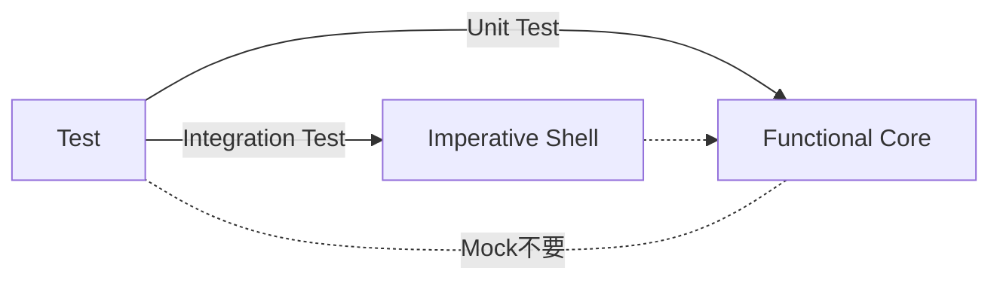

オブジェクト指向（OOP）だけで設計することに限界を感じていませんか？
複雑に絡み合った依存関係、予期せぬ状態変更によるバグ、テストの難しさ...。

かといって、関数型プログラミング（FP）に完全に移行するのは学習コストが高すぎると感じるかもしれません。

答えは「どちらか」ではなく「両方」です。

本記事では、OOPの「構造を作る力」とFPの「複雑さを扱う力」を融合させた「ハイブリッド設計」について解説します。
ECサイトの注文処理システムを題材に、具体的なコード（Perl v5.36+）を使って、痛みのある設計から理想的なアーキテクチャへと段階的にリファクタリングしていく過程を追体験してください。

この完全版では、全8回の連載内容を1つの記事に凝縮し、体系的に学べるように構成しました。

---


## 第1章: 動いているコードが壊れる夜 - OOPの限界を知る

オブジェクト指向プログラミングにおいて、最も厄介なバグの原因の一つが「可変状態（Mutable State）」です。
「オブジェクトは状態を持つもの」という教えに従って素直に実装すると、次のような問題に直面します。

### 壊れるコードの例

```perl
package Order;
use Moo;
use v5.36;

# BAD: 変更可能な属性
has items => (is => 'rw', default => sub { [] });
has total => (is => 'rw', default => 0);

sub add_item ($self, $name, $price) {
    push $self->items->@*, { name => $name, price => $price };
    # 状態を直接書き換える
    $self->total( $self->total + $price );
}

# BAD: 計算のつもりで状態を変更してしまう
sub apply_discount ($self, $rate) {
    $self->total( $self->total * (1 - $rate) );
}
```

このコードの問題点は、`apply_discount` を呼ぶと「元のオブジェクトが破壊される」ことです。
例えば、ユーザーへのプレビュー表示のために割引後の価格を計算しようとしただけで、システム内部で保持している注文データの金額まで変わってしまうのです。

```perl
my $order = Order->new;
$order->add_item('Widget', 1000);

# プレビュー表示（のつもり）
$order->apply_discount(0.1); 

# ！！問題発生！！
# プレビューが終わっても、元の $order は割引されたまま...
# 本来の 1000 円という情報は失われてしまった
```

これを防ぐために「コピーを作成してから操作する」などの規律を守ろうとしますが、人間は忘れる生き物です。
言語やフレームワークのレベルで防ぐ必要があります。

---

## 第2章: 時を戻そう - イミュータビリティの魔法


解決策はシンプルです。「オブジェクトを変えない」ことです。
変更が必要なときは、変更された「新しいオブジェクト」を作成します。これを「イミュータビリティ（不変性）」と呼びます。

### イミュータブルな実装

MooやMooseでは、属性を `is => 'ro'`（読み取り専用）にするだけで、意図しない変更をコンパイルレベルや実行時エラーとして防ぐことができます。

```perl
package ImmutableOrder;
use Moo;
use v5.36;

# GOOD: 読み取り専用
has items => (is => 'ro', default => sub { [] });
has total => (is => 'ro', default => 0);

sub add_item ($self, $name, $price) {
    # 変更する代わりに、新しい自分自身を返す
    return $self->new(
        items => [ $self->items->@*, { name => $name, price => $price } ],
        total => $self->total + $price,
    );
}
```

### イミュータブルのメリット

この設計なら、何度操作しても元のオブジェクトは安全です。


「毎回オブジェクトを作ると遅くなるのでは？」と心配されるかもしれませんが、現代のPerlやサーバではオブジェクト生成のコストは十分に低く、バグを探す人件費に比べれば無視できるレベルです。

---

## 第3章: 副作用という名の地雷 - 純粋関数で守る

次に問題になるのが「副作用」です。
メソッドの中でログを出力したり、DBに書き込んだりすると、そのメソッドはテストが困難になります。

```perl
# BAD: 副作用とロジックが混在
sub calculate_and_save ($self) {
    my $total = ...; # 計算ロジック
    $self->logger->info("Total: $total"); # 副作用
    $self->db->save($total);              # 副作用
    return $total;
}
```

このメソッドをテストするには、LoggerやDBのモック（偽物）を用意しなければなりません。面倒です。

### 純粋関数（Pure Function）の導入

計算ロジックだけを切り出し、外部の状態に依存せず、外部の状態を変更しない関数を作ります。これを「純粋関数」と呼びます。

```perl
package OrderCalculator;
use v5.36;

# Pure Function: 入力だけで出力が決まる
sub calculate_discount ($class, $total, $rate) {
    return $total * (1 - $rate);
}
```

呼び出し側（Shell）で副作用を扱います。

```perl
# Shell: 副作用と純粋関数の調整役
sub process_order ($self, $order) {
    # ロジックは純粋関数に丸投げ
    my $new_total = OrderCalculator->calculate_discount($order->total, 0.1);
    
    # 副作用はここで行う
    $self->logger->info("Discounted: $new_total");
}
```

これにより、重要なビジネスロジック（`OrderCalculator`）は、モックなしで簡単にテストできるようになります。

---

## 第4章: ループ地獄からの脱出 - 高階関数という武器

Perlには強力なリスト処理関数 `map`, `grep`, そして `List::Util` の `reduce` があります。
これらを活用することで、「どう処理するか（How）」ではなく「何をしたいか（What）」を記述する「宣言的プログラミング」が可能になります。

### Before: 命令的なループ

```perl
my $total = 0;
for my $item ($items->@*) {
    if ($item->{category} eq 'elect') {
        $total += $item->{price};
    }
}
```

### After: 宣言的なパイプライン

```perl
use List::Util qw(sum0);

my $total = sum0 map { $_->{price} }
                 grep { $_->{category} eq 'elect' }
                 $items->@*;
```

コードが「電化製品（grep）の価格（map）の合計（sum0）」という、意味そのものを表すようになりました。
バグが入り込む隙間（ループ変数の管理ミスなど）が減り、可読性が劇的に向上します。

---

## 第5章: コアとシェルを分ける - Functional Core, Imperative Shell


これまでの概念を統合するアーキテクチャパターンが 「"Functional Core, Imperative Shell" (FCIS)」 です。
Gary Bernhardt氏によって提唱されたこのパターンは、システムを2つの層に明確に分離します。

1. Functional Core (関数型コア):
   - 全てのビジネスロジックを含む
   - 純粋関数で構成される
   - イミュータブルなデータのみを扱う
   - テストが容易で、バグが少ない

2. Imperative Shell (命令的シェル):
   - 外部世界（DB, API, UI）とのインターフェース
   - 副作用（I/O）を担当する
   - Coreを呼び出し、結果を保存する
   - ロジックを持たず、薄く保つ

### FCISの構成図

```mermaid
graph TB
    subgraph "Imperative Shell (副作用層)"
        S[OrderService]
        DB[Database]
        API[Payment API]
    end
    
    subgraph "Functional Core (純粋計算層)"
        C[OrderCalculator]
        D[DiscountRules]
        M[Order (Immutable)]
    end
    
    S -->|Load| DB
    S -->|Delegates Logic| C
    C -->|Uses| D
    C -->|Returns| M
    S -->|Save| DB
    S -->|Call| API
    
    style S fill:#ffdddd,stroke:#cc0000
    style C fill:#ddffdd,stroke:#00cc00
```

この分離により、複雑なビジネスロジックは安全な「Core」の中で守られ、予測不可能な外界との接触は「Shell」に隔離されます。

---

## 第6章: 型で守る境界線 - 安全な設計の仕上げ


Coreを守るためのもう一つの防壁が「型（Type）」です。
Perlは動的型付け言語ですが、`Types::Standard` などのモジュールを使うことで、強力な型制約を導入できます。

特にイミュータブルオブジェクトのコンストラクタで型チェックを行うことで、不正なデータがシステム内に侵入するのを防げます。

```perl
package Order;
use Moo;
use Types::Standard qw(Int ArrayRef Dict Str Optional);

has id => (is => 'ro', isa => Int, required => 1);

has items => (
    is => 'ro',
    isa => ArrayRef[Dict[
        product => Str,
        price   => Int,
        qty     => Optional[Int]
    ]],
    default => sub { [] }
);
```

これにより、`price` に文字列が混入したり、必須項目が欠落したりといったバグを、実行時の早い段階（境界）で検知できます。
「型はドキュメント」でもあります。コードを読むだけでデータの構造が理解できるようになります。

---

## 第7章: テストが書きやすい設計 - FCISの真価


ハイブリッド設計の最大の恩恵は、テストの容易さにあります。
FCISパターンに従えば、テスト戦略は非常にシンプルになります。

### Coreのテスト（単体テスト）
Coreは純粋関数とイミュータブルデータだけなので、モックが一切不要です。
入力値を与えて、期待する戻り値と比較するだけ。非常に高速で、並列実行も安全です。

```perl
# CoreCalculatorのテスト
is OrderCalculator->calculate_discount(1000, 0.1), 900;
```

### Shellのテスト（統合テスト）
Shellは複雑なロジックを持たないため、境界値テストのような細かい網羅は不要です。
「DBから読み込んで、Coreを呼んで、保存する」というフローが繋がっているかどうかの確認（統合テスト）だけで十分です。



---

## 第8章: ハイブリッド設計の完成形 - まとめと実践ガイド


これまでの旅路を経て、私たちは「ハイブリッド設計」という目的地に到達しました。

1. 「データ構造」はOOP（Moo + Types::Standard）で定義し、イミュータブルにして型で守る【シェルの防御壁】
2. 「処理ロジック」はFP（純粋関数）で記述し、Coreに集約する【コアの知能】
3. 「副作用」はShellの薄い層に隔離し、Coreと外界を仲介させる【シェルの外交】

### 導入へのステップ

いきなり全てを変える必要はありません。以下の順序で段階的に導入できます。

1. 新規クラスをイミュータブルにする: `is => 'ro'` をデフォルトにする。
2. ロジックを切り出す: メソッド内の計算部分を `sub` として別の場所に移動してみる。
3. 宣言的に書く: `for` ループを `map/grep` に書き換えてみる。
4. FCISを意識する: 次の機能追加で「Core」と「Shell」を意識してファイルを分けてみる。

「OOP vs FP」という不毛な対立を乗り越え、それぞれの良いとこ取りをするこの設計スタイルは、
Perlのような柔軟な言語と非常に相性が良いです。

あなたのコードベースに、少しの「関数型のスパイス」を加えてみませんか？
きっと、驚くほど見通しが良く、堅牢なコードに生まれ変わるはずです。

### 参考文献・リソース

- Types::Standard: 堅牢な型制約システム
- Moo: 軽量で現代的なOOPフレームワーク
- List::Util: Perl標準のリスト処理モジュール
- Boundaries (Gary Bernhardt): FCISパターンの原典となるトーク
