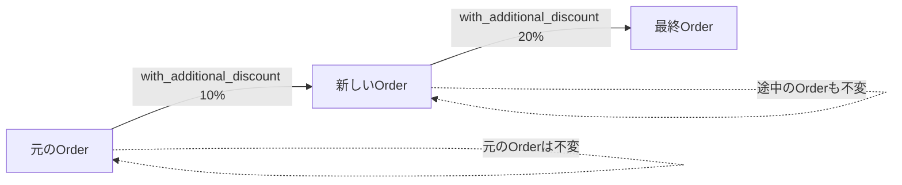
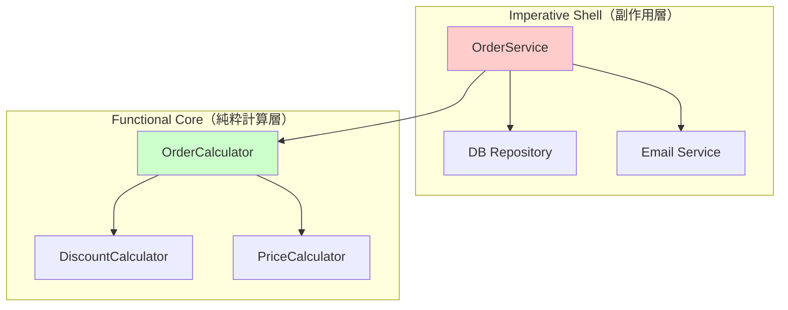
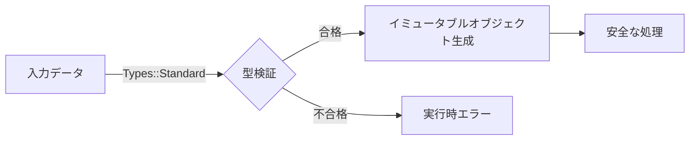
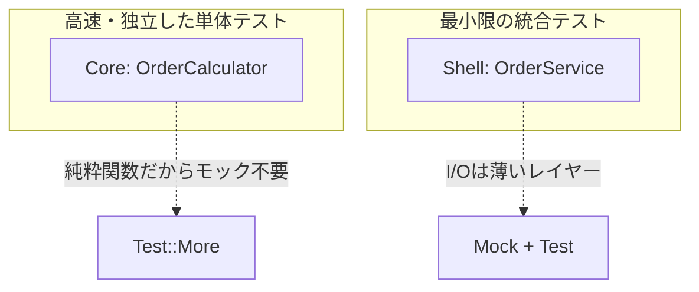
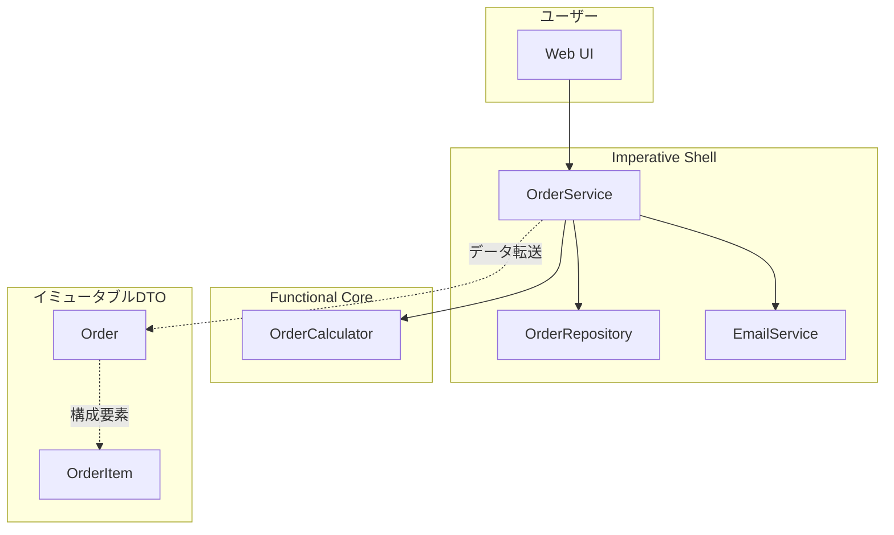

## はじめに

「クラス設計はできるけど、コードが複雑になるとどこかで壊れる…」

そんな経験はありませんか？

オブジェクト指向プログラミング（OOP）は強力ですが、**可変状態**と**副作用**が絡み合うと、デバッグが困難なスパゲッティコードに陥りがちです。一方、関数型プログラミング（FP）は純粋で美しいですが、実務のI/O処理やDB操作との折り合いが難しい。

**この記事では、OOPとFPの「いいとこ取り」をした「ハイブリッド設計」を学びます。**

ECサイトの注文処理システムを題材に、「動く → 破綻 → パターン導入 → 完成」というストーリーで、段階的にコードを改善していきます。

### この記事で学べること

| 章 | テーマ | 学べること |
|---|--------|-----------|
| 1 | 可変状態の問題 | なぜMutableなオブジェクトは壊れやすいか |
| 2 | イミュータビリティ | Mooの`is => 'ro'`と`with_*`パターン |
| 3 | 純粋関数 | 副作用を分離してテスタビリティを向上 |
| 4 | 高階関数 | map/grep/reduceで宣言的に書く |
| 5 | FCISパターン | Functional Core, Imperative Shell |
| 6 | 型制約 | Types::Standardで実行時エラーを防ぐ |
| 7 | テスト戦略 | FCISパターンでテストが書きやすくなる理由 |
| 8 | 完成形 | ハイブリッド設計の全体像 |

### 対象読者

- OOPの基本（クラス、継承、カプセル化）は理解している
- 複雑な状態管理やスパゲッティコードに悩んでいる
- Perlで実務的なコードを書いている

### 技術スタック

- **Perl v5.36以降**（シグネチャ、`say`、postfix dereferenceなど）
- **Moo**（軽量OOPフレームワーク）
- **Types::Standard**（型制約）
- **List::Util**（高階関数）

---

## 第1章：動いているコードが壊れる夜 - 可変状態の問題


### 今回の目標

- 可変状態（Mutable State）がどのようにバグを引き起こすか理解する
- 「同じオブジェクトを複数箇所で変更する」危険性を体感する

### 動く：ECサイトの注文クラス

まずは素朴な注文クラスを作ってみましょう。

```perl
package Order;
use v5.36;
use Moo;

has customer_name => (is => 'rw', required => 1);
has items         => (is => 'rw', default => sub { [] });
has discount_rate => (is => 'rw', default => 0);
has total         => (is => 'rw', default => 0);

sub add_item ($self, $item) {
    push $self->items->@*, $item;
    $self->_recalculate_total();
}

sub apply_discount ($self, $rate) {
    $self->discount_rate($rate);
    $self->_recalculate_total();
    say "割引 $rate% を適用しました";  # 副作用！
}

sub _recalculate_total ($self) {
    my $subtotal = 0;
    for my $item ($self->items->@*) {
        $subtotal += $item->{price} * $item->{quantity};
    }
    my $discount = $subtotal * ($self->discount_rate / 100);
    $self->total($subtotal - $discount);
}

1;
```

一見問題なさそうですが…

### 破綻：予期せぬバグ

このコードには複数の問題が潜んでいます。

```perl
my $order = Order->new(customer_name => 'Alice');
$order->add_item({ name => 'Book', price => 1000, quantity => 2 });
say "注文合計: " . $order->total;  # 2000

# クーポン処理
my $coupon_handler = sub ($o) {
    $o->apply_discount(10);  # 10%割引
};

# 会員割引処理
my $member_handler = sub ($o) {
    $o->apply_discount(20);  # 20%割引（クーポンを上書き！）
};

$coupon_handler->($order);
say "クーポン後: " . $order->total;  # 1800

$member_handler->($order);
say "会員割引後: " . $order->total;  # 1600
```

**問題**: クーポン10%と会員割引20%で合計30%引きを期待していたのに、**割引が上書きされて20%しか適用されていません**。

これが**可変状態の罠**です。

### 問題の本質

1. **予測不能**: 同じオブジェクトを複数箇所で変更すると、状態がどうなるか予測困難
2. **追跡困難**: どこでいつ状態が変わったかデバッグしにくい
3. **テスト困難**: テスト前後で状態が変わるため、独立したテストが書きにくい

### 今回のポイント

- `is => 'rw'`（Read-Write）は便利だが危険
- 「誰でも変更できる」は「誰もが壊せる」
- 次章で、この問題を**イミュータビリティ**で解決します

---

## 第2章：時を戻そう - イミュータビリティの魔法

### 前章の振り返り

可変状態は、複数箇所からの変更により予期せぬバグを引き起こしました。

### 今回の目標

- イミュータブル（不変）オブジェクトの概念を理解する
- Mooの`is => 'ro'`と`with_*`パターンを習得する

### 完成：イミュータブルな注文クラス

```perl
package Order::Immutable;
use v5.36;
use Moo;

has customer_name => (is => 'ro', required => 1);  # 読み取り専用！
has items         => (is => 'ro', default => sub { [] });
has discount_rate => (is => 'ro', default => 0);

# 合計は毎回計算（導出値）
sub total ($self) {
    my $subtotal = 0;
    for my $item ($self->items->@*) {
        $subtotal += $item->{price} * $item->{quantity};
    }
    return $subtotal * (1 - $self->discount_rate / 100);
}

# with_* パターン: 新しいオブジェクトを返す
sub with_item ($self, $item) {
    my @new_items = ($self->items->@*, $item);
    return Order::Immutable->new(
        customer_name => $self->customer_name,
        items         => \@new_items,
        discount_rate => $self->discount_rate,
    );
}

sub with_discount ($self, $rate) {
    return Order::Immutable->new(
        customer_name => $self->customer_name,
        items         => $self->items,
        discount_rate => $rate,
    );
}

sub with_additional_discount ($self, $rate) {
    my $new_rate = $self->discount_rate + $rate;
    return $self->with_discount($new_rate);
}

1;
```

### 安全な処理フロー

```perl
my $order = Order::Immutable->new(customer_name => 'Alice')
    ->with_item({ name => 'Book', price => 1000, quantity => 2 });

say "注文合計: " . $order->total;  # 2000

my $apply_coupon = sub ($o) {
    return $o->with_additional_discount(10);  # 新しいオブジェクトを返す
};

my $apply_member = sub ($o) {
    return $o->with_additional_discount(20);
};

my $order_coupon = $apply_coupon->($order);
say "クーポン後: " . $order_coupon->total;  # 1800

my $order_both = $apply_member->($order_coupon);
say "両方適用後: " . $order_both->total;  # 1400 (30%引き！)

# 元のオブジェクトは変わっていない
say "元の注文: " . $order->total;  # 2000
```

**ポイント**: 各関数は新しいオブジェクトを返すので、割引が正しく合算されます。

### イミュータブル更新フロー



### 今回のポイント

- `is => 'ro'`でフィールドを読み取り専用にする
- 変更が必要な場合は`with_*`メソッドで新しいオブジェクトを返す
- 元のオブジェクトは常に不変 → 安全

---

## 第3章：副作用という名の地雷 - 純粋関数で守る

### 前章の振り返り

イミュータビリティにより、状態の予期せぬ変更を防げるようになりました。

### 今回の目標

- 純粋関数と副作用の違いを理解する
- 副作用を分離してテスタビリティを向上させる

### 動く：副作用が混在したコード

```perl
sub calculate_subtotal_impure ($items, $db, $logger) {
    $logger->info("計算開始: " . scalar(@$items) . "件");  # 副作用
    
    my $subtotal = 0;
    for my $item (@$items) {
        $subtotal += $item->{price} * $item->{quantity};
        $db->update_stock($item->{id}, $item->{quantity});  # 副作用
    }
    
    $logger->info("計算完了: $subtotal");  # 副作用
    return $subtotal;
}
```

**問題**: ログ出力、DB更新が計算ロジックと混在しており、テストが困難。

### 破綻：テストが書けない

```perl
# このテストを書くには、$db と $logger のモックが必要
# さらに、実行するたびにDBが更新される副作用がある
```

### 完成：純粋関数として抽出

```perl
# 純粋関数: 入力だけで出力が決まる、副作用なし
sub calculate_subtotal_pure ($items) {
    my $subtotal = 0;
    for my $item (@$items) {
        $subtotal += $item->{price} * $item->{quantity};
    }
    return $subtotal;
}

sub calculate_discount_pure ($subtotal, $discount_rate) {
    return $subtotal * ($discount_rate / 100);
}

sub calculate_total_pure ($subtotal, $discount) {
    return $subtotal - $discount;
}
```

### テストが簡単に

```perl
use Test::More;

is(calculate_subtotal_pure([
    { price => 1000, quantity => 2 },
    { price => 500,  quantity => 3 },
]), 3500, '小計計算');

is(calculate_discount_pure(10000, 10), 1000, '10%割引');
is(calculate_total_pure(10000, 1000), 9000, '合計計算');

done_testing;
```

**ポイント**: モック不要、外部依存なし、高速実行。

### 純粋関数の特徴

| 特徴 | 純粋関数 | 不純な関数 |
|------|----------|------------|
| 同じ入力 | 常に同じ出力 | 出力が変わる可能性 |
| 副作用 | なし | あり（ログ、DB、ファイル等） |
| テスト | 簡単 | モックが必要 |
| 実行順序 | 関係なし | 依存する場合あり |

### 今回のポイント

- 純粋関数 = 入力だけで出力が決まる、副作用なし
- 計算ロジックを純粋関数として抽出する
- 副作用（ログ、DB）は呼び出し側に押し出す

---

## 第4章：ループ地獄からの脱出 - 高階関数という武器

### 前章の振り返り

純粋関数により、テストしやすいコードになりました。

### 今回の目標

- 命令的なloopを宣言的なコードに書き換える
- map/grep/reduceの使い方を習得する

### 動く：命令的なループ

```perl
sub process_items_imperative ($orders) {
    my @result;
    
    for my $order (@$orders) {
        for my $item ($order->{items}->@*) {
            if ($item->{in_stock}) {
                for my $i (1 .. $item->{quantity}) {
                    push @result, {
                        order_id   => $order->{id},
                        item_name  => $item->{name},
                        unit_price => $item->{price},
                    };
                }
            }
        }
    }
    
    my $total = 0;
    for my $r (@result) {
        $total += $r->{unit_price};
    }
    
    return { items => \@result, total => $total };
}
```

**問題**: 3重ネストのループは読みづらく、バグが入りやすい。

### 完成：宣言的なパイプライン

```perl
use List::Util qw(reduce);

sub filter_available_items ($items) {
    return [ grep { $_->{in_stock} } @$items ];
}

sub calculate_totals_by_category ($items) {
    return reduce {
        my $cat = $b->{category} // 'other';
        $a->{$cat} //= 0;
        $a->{$cat} += $b->{price} * $b->{quantity};
        $a;
    } {}, @$items;
}
```

### 高階関数の使い分け

| 関数 | 用途 | 例 |
|------|------|-----|
| `map` | 変換 | 価格を税込みに変換 |
| `grep` | フィルタ | 在庫ありだけ抽出 |
| `reduce` | 集約 | 合計金額を計算 |

### 今回のポイント

- `grep`: 条件に合う要素を抽出
- `map`: 各要素を変換
- `reduce`: 畳み込み（集約）
- 宣言的コードは「何をするか」を記述、命令的コードは「どうやるか」を記述

---

## 第5章：コアとシェルを分ける - FCISパターン


### 前章の振り返り

高階関数により、宣言的で読みやすいコードになりました。

### 今回の目標

- Functional Core, Imperative Shell（FCIS）パターンを理解する
- ビジネスロジックとI/Oを分離する

### FCISパターンとは

**Functional Core（純粋計算層）**:
- 純粋関数だけで構成
- 副作用なし
- テストが簡単

**Imperative Shell（副作用層）**:
- I/O処理（DB、ファイル、ネットワーク）
- 状態管理
- Coreを呼び出して結果を副作用に変換

### FCISレイヤー図



### 完成：FCIS分離後の設計

#### Functional Core

```perl
package OrderCalculator;
use v5.36;

sub calculate_discount ($subtotal, $rate) {
    return $subtotal * ($rate / 100);
}

sub calculate_tax ($amount, $rate) {
    return int($amount * ($rate / 100));
}

sub calculate_shipping ($subtotal, $threshold, $fee) {
    return $subtotal >= $threshold ? 0 : $fee;
}

sub calculate_total ($params) {
    my $subtotal = $params->{subtotal};
    my $discount = calculate_discount($subtotal, $params->{discount_rate} // 0);
    my $after_discount = $subtotal - $discount;
    my $tax = calculate_tax($after_discount, $params->{tax_rate} // 10);
    my $shipping = calculate_shipping(
        $subtotal, 
        $params->{free_shipping_threshold} // 5000, 
        $params->{shipping_fee} // 500
    );
    
    return {
        subtotal       => $subtotal,
        discount       => $discount,
        after_discount => $after_discount,
        tax            => $tax,
        shipping       => $shipping,
        total          => $after_discount + $tax + $shipping,
    };
}

sub validate_order ($order) {
    my @errors;
    push @errors, 'customer_name is required' unless $order->{customer_name};
    push @errors, 'items must not be empty' unless $order->{items} && @{$order->{items}};
    
    return {
        is_valid => @errors ? 0 : 1,
        errors   => \@errors,
    };
}

1;
```

#### Imperative Shell

```perl
package OrderService;
use v5.36;
use Moo;

has db     => (is => 'ro', required => 1);
has mailer => (is => 'ro', required => 1);
has logger => (is => 'ro', required => 1);

sub process_order ($self, $order_data) {
    # 1. 検証（Core）
    my $validation = OrderCalculator::validate_order($order_data);
    unless ($validation->{is_valid}) {
        $self->logger->error("Validation failed");
        return { success => 0, errors => $validation->{errors} };
    }
    
    # 2. 計算（Core）
    my $calculation = OrderCalculator::calculate_total({
        subtotal      => $self->_calc_subtotal($order_data->{items}),
        discount_rate => $order_data->{discount_rate} // 0,
    });
    
    # 3. 保存（Shell - 副作用）
    my $order_id = $self->db->save_order({ %$order_data, %$calculation });
    
    # 4. メール送信（Shell - 副作用）
    $self->mailer->send_confirmation($order_data->{customer_email}, {
        order_id => $order_id,
        total    => $calculation->{total},
    });
    
    # 5. ログ（Shell - 副作用）
    $self->logger->info("Order $order_id processed");
    
    return { success => 1, order_id => $order_id };
}

1;
```

### 今回のポイント

- **Core（内側）**: 純粋関数、テスト容易、ビジネスロジック
- **Shell（外側）**: 副作用、I/O処理、Coreのラッパー
- 「計算」と「作用」を分離することで、テストしやすく保守しやすい設計に

---

## 第6章：型で守る境界線 - Types::Standardの実践

### 前章の振り返り

FCISパターンにより、ロジックとI/Oを分離できました。

### 今回の目標

- Types::Standardで型制約を実装する
- 実行時エラーを入口で防ぐ

### 動く：型制約なしのコード

```perl
package OrderItem::NoType;
use v5.36;
use Moo;

has name     => (is => 'ro');  # 何でも入る
has price    => (is => 'ro');  # 負の値も文字列も入る
has quantity => (is => 'ro');  # 小数も入る
```

**問題**: 不正な値が渡されても、計算時まで気づかない。

### 完成：型制約付きクラス

```perl
package OrderItem;
use v5.36;
use Moo;
use Types::Standard qw(Str Int Num);

has name => (
    is       => 'ro',
    isa      => Str,
    required => 1,
);

has price => (
    is       => 'ro',
    isa      => Int->where(sub { $_ > 0 }),  # 正の整数のみ
    required => 1,
);

has quantity => (
    is       => 'ro',
    isa      => Int->where(sub { $_ > 0 }),  # 正の整数のみ
    required => 1,
);

sub total ($self) {
    return $self->price * $self->quantity;
}

1;
```

### 型違反は即座にエラー

```perl
# これは成功
my $item = OrderItem->new(name => 'Book', price => 1000, quantity => 2);

# これはエラー（負の価格）
eval {
    my $bad = OrderItem->new(name => 'Invalid', price => -100, quantity => 1);
};
say "Error: $@" if $@;  # 型エラーがキャッチされる
```

### 型制約フロー図



### 今回のポイント

- `isa => Str`でStringを強制
- `Int->where(sub { $_ > 0 })`で正の整数を強制
- 型制約により「設計意図」をコードで表現

---

## 第7章：テストが書きやすい設計 - FCISの真価

### 前章の振り返り

型制約により、不正な入力を入口で防げるようになりました。

### 今回の目標

- FCISパターンがなぜテストしやすいか理解する
- Core（純粋関数）とShell（副作用）のテスト戦略を学ぶ

### Coreのテスト：モック不要、高速

```perl
use Test::More;

# 純粋関数はモック不要でテスト可能
is(OrderCalculator::calculate_discount(10000, 10), 1000, '割引計算');
is(OrderCalculator::calculate_tax(1000, 10), 100, '税金計算');
is(OrderCalculator::calculate_shipping(5000, 5000, 500), 0, '送料無料');
is(OrderCalculator::calculate_shipping(4999, 5000, 500), 500, '送料有料');

subtest 'validate_order' => sub {
    my $valid = OrderCalculator::validate_order({
        customer_name => 'Alice',
        items => [{ name => 'Book', price => 1000, quantity => 1 }],
    });
    ok($valid->{is_valid}, '有効な注文');
    
    my $invalid = OrderCalculator::validate_order({ items => [] });
    ok(!$invalid->{is_valid}, '無効な注文');
};

done_testing;
```

### Shellのテスト：最小限のモック

```perl
# Shellは薄いレイヤーなので、統合テストも簡単
my $mock_db = MockDB->new;
my $mock_mailer = MockMailer->new;
my $mock_logger = MockLogger->new;

my $service = OrderService->new(
    db     => $mock_db,
    mailer => $mock_mailer,
    logger => $mock_logger,
);

my $result = $service->process_order({ ... });

# 副作用の確認
is(scalar(@{$mock_db->saved}), 1, 'DBに1件保存');
is(scalar(@{$mock_mailer->sent}), 1, 'メール1件送信');
```

### テスト戦略図



### 今回のポイント

- **Core**: 純粋関数なのでモック不要、高速、決定的
- **Shell**: 薄いレイヤーなので統合テストも簡単
- 「良い設計 = テストしやすい設計」

---

## 第8章：ハイブリッド設計の完成形


### これまでの振り返り

| 章 | 学んだこと |
|---|------------|
| 1 | 可変状態の危険性 |
| 2 | イミュータビリティで安全に |
| 3 | 純粋関数で副作用を分離 |
| 4 | 高階関数で宣言的に |
| 5 | FCISパターンでアーキテクチャ設計 |
| 6 | 型制約で入口を守る |
| 7 | テスト戦略 |

### 完成：ECサイト注文処理システム

すべての概念を統合した完成形を見てみましょう。

#### 全体アーキテクチャ図



#### イミュータブルなデータ構造

```perl
package OrderItem;
use v5.36;
use Moo;
use Types::Standard qw(Str Int);

has name     => (is => 'ro', isa => Str, required => 1);
has price    => (is => 'ro', isa => Int->where(sub { $_ > 0 }), required => 1);
has quantity => (is => 'ro', isa => Int->where(sub { $_ > 0 }), required => 1);

sub total ($self) { $self->price * $self->quantity }

sub with_quantity ($self, $qty) {
    return OrderItem->new(
        name     => $self->name,
        price    => $self->price,
        quantity => $qty,
    );
}

1;
```

```perl
package Order;
use v5.36;
use Moo;
use Types::Standard qw(Str Num ArrayRef InstanceOf Maybe);

has id             => (is => 'ro', isa => Maybe[Str]);
has customer_name  => (is => 'ro', isa => Str, required => 1);
has customer_email => (is => 'ro', isa => Str, required => 1);
has items          => (is => 'ro', isa => ArrayRef[InstanceOf['OrderItem']], default => sub { [] });
has discount_rate  => (is => 'ro', isa => Num->where(sub { $_ >= 0 && $_ <= 100 }), default => 0);
has status         => (is => 'ro', isa => Str, default => 'pending');

sub with_item ($self, $item) {
    return Order->new(
        id             => $self->id,
        customer_name  => $self->customer_name,
        customer_email => $self->customer_email,
        items          => [@{$self->items}, $item],
        discount_rate  => $self->discount_rate,
        status         => $self->status,
    );
}

sub with_discount ($self, $rate) {
    return Order->new(
        id             => $self->id,
        customer_name  => $self->customer_name,
        customer_email => $self->customer_email,
        items          => $self->items,
        discount_rate  => $rate,
        status         => $self->status,
    );
}

1;
```

### 使用例

```perl
# イミュータブルなデータ構造で注文を構築
my $order = Order->new(
    customer_name  => 'Alice',
    customer_email => 'alice@example.com',
)->with_item(
    OrderItem->new(name => '入門書', price => 3000, quantity => 1)
)->with_item(
    OrderItem->new(name => 'ノート', price => 500, quantity => 3)
)->with_discount(10);

# サービスで処理
my $result = $order_service->create_order($order);

if ($result->{success}) {
    say "注文ID: " . $result->{order}->id;
    say "合計: ¥" . $result->{calculation}->{total};
}
```

### ハイブリッド設計の原則まとめ

1. **イミュータビリティ**: `is => 'ro'` + `with_*`パターン
2. **純粋関数**: 副作用のない計算ロジック
3. **高階関数**: map/grep/reduceで宣言的に
4. **FCIS**: Core（計算）とShell（副作用）の分離
5. **型制約**: Types::Standardで入口を守る

### 既存コードへの導入ガイド

1. **まず純粋関数を抽出**: 既存メソッドから計算部分だけを取り出す
2. **イミュータブル化**: `is => 'rw'`を`is => 'ro'`に変更、`with_*`メソッドを追加
3. **型制約を追加**: 重要なフィールドからTypes::Standardを導入
4. **徐々にFCISへ**: 新規コードからFCISパターンを適用

---

## おわりに

「OOPを捨てるな、FPを混ぜろ。」

この記事では、OOPとFPを融合した「ハイブリッド設計」を学びました。

- **OOP**は「構造」を守る盾
- **FP**は「計算」を純粋に保つ武器

両者を組み合わせることで、**安全で、テストしやすく、保守しやすい**コードが書けます。

ぜひ、明日からのコーディングに取り入れてみてください！

---

## 参考資料

- [Moo - Minimalist Object Orientation](https://metacpan.org/pod/Moo)
- [Types::Standard](https://metacpan.org/pod/Types::Standard)
- [List::Util](https://metacpan.org/pod/List::Util)
- [Functional Core, Imperative Shell (Gary Bernhardt)](https://www.destroyallsoftware.com/screencasts/catalog/functional-core-imperative-shell)
