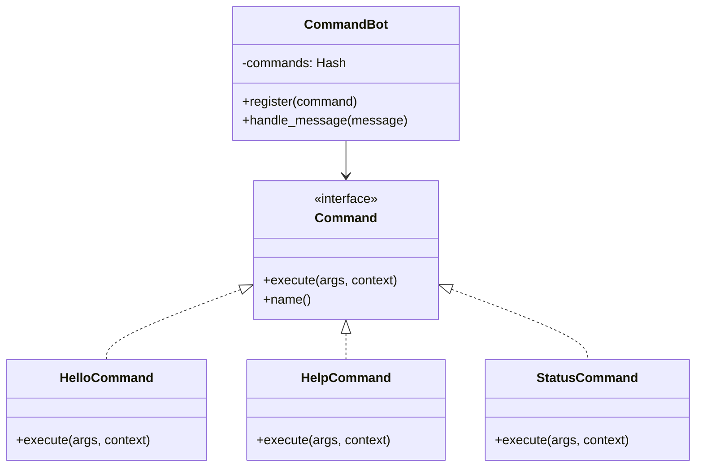
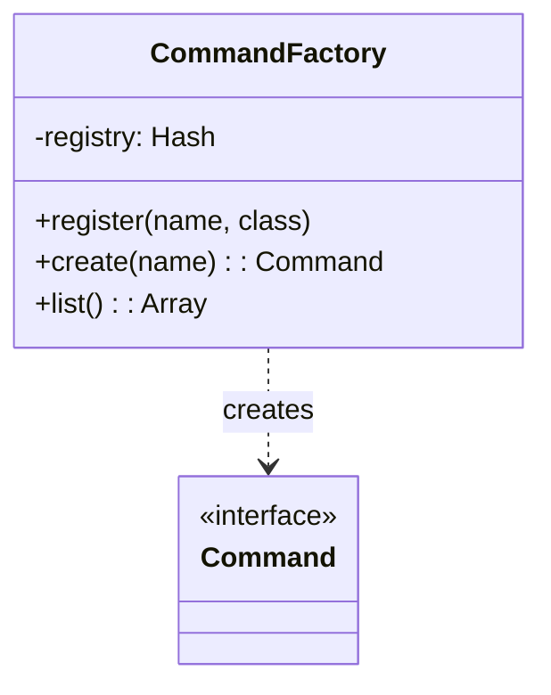
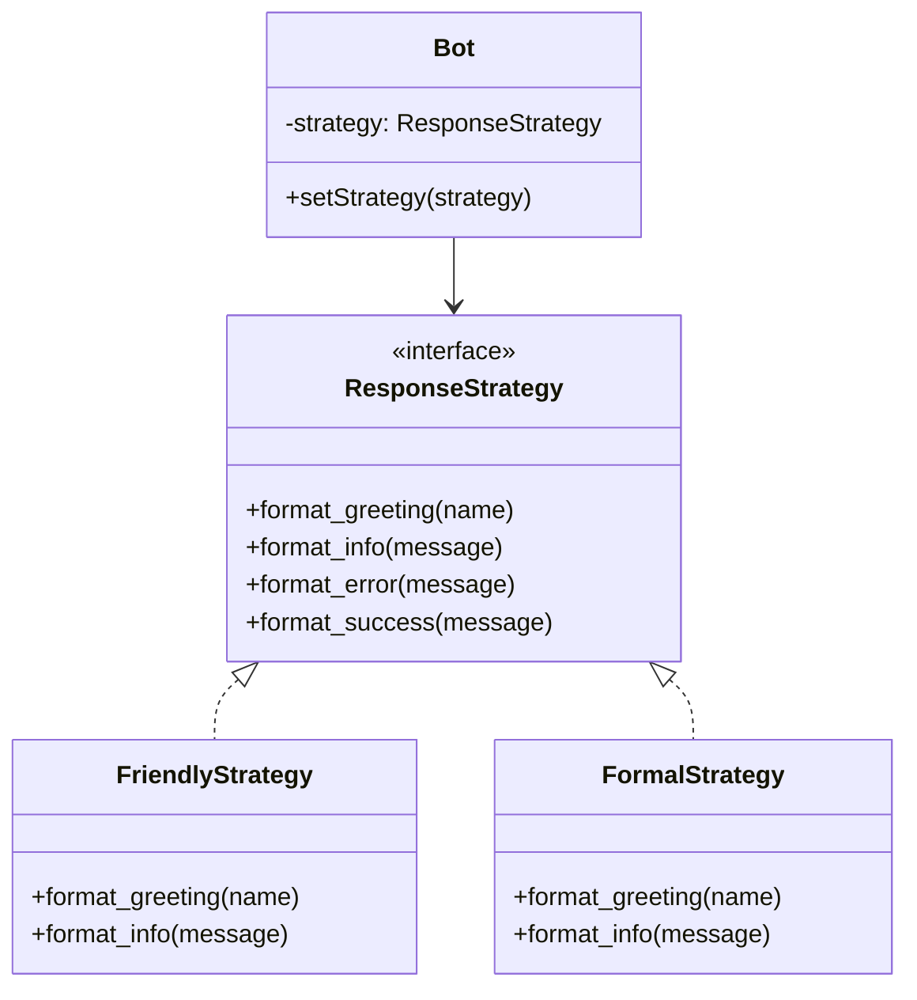
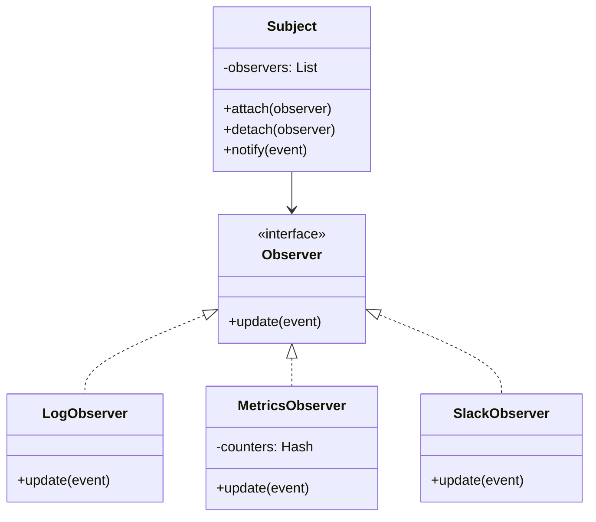
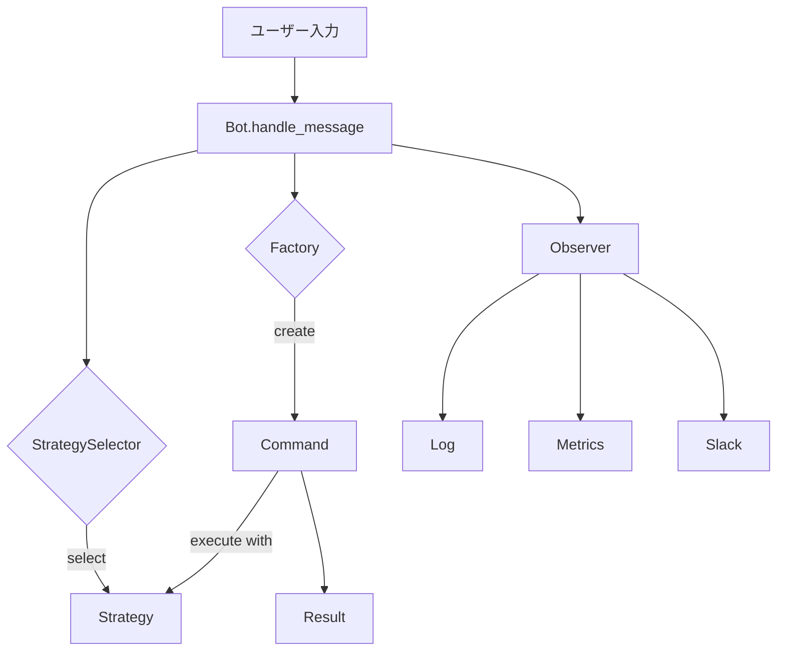

## はじめに

「デザインパターンの理論は学んだ。でも、いざコードを書こうとすると手が止まる...」

そんな経験はありませんか？

このシリーズでは、**Discord/Slack Bot**を題材に、4つのデザインパターンを**手を動かして**身につけます。完成するのは、友人に自慢できる「執事Bot」。コマンドを打てば応答し、性格を変えれば話し方が変わる、実用的なBotフレームワークです。

### 習得できるパターン

| パターン | 役割 | 登場章 |
|---------|------|-------|
| **Command** | コマンドをオブジェクトとしてカプセル化 | 第2-3章 |
| **Factory** | コマンド名からインスタンスを自動生成 | 第4-5章 |
| **Strategy** | 応答スタイルを動的に切り替え | 第6-7章 |
| **Observer** | コマンド実行を複数システムに通知 | 第8章 |

### 対象読者

- デザインパターンの理論は学んだが実践経験が少ない
- Perlの基本文法は理解している
- 「友人に自慢できる何か」を作りたい
- 実務で使えるスキルを身につけたい

### 技術スタック

- Perl v5.36以降
- Moo（オブジェクトシステム）
- signatures、postfix dereference等のモダンPerl機能

それでは、執事Botを作り始めましょう！

---

## 第1章: 執事Botの誕生〜最初の挨拶

### 今回の目標

- Botの基本構造を作る
- メッセージに応答する仕組みを理解する
- コマンド解析の必要性に気づく

### 動く：最初の実装

まずは、すべてのメッセージに「Hello!」と返す、シンプルなBotを作ってみましょう。

```perl
#!/usr/bin/env perl
use v5.36;
use warnings;

package SimpleBot {
    use Moo;

    sub handle_message ($self, $message) {
        # すべてのメッセージに「Hello!」と返す
        return "Hello! I received: $message";
    }
}

# メイン処理
my $bot = SimpleBot->new;

my @messages = (
    "こんにちは",
    "/help",
    "/status",
    "今日の天気は？",
);

for my $msg (@messages) {
    my $response = $bot->handle_message($msg);
    say "User: $msg";
    say "Bot: $response";
    say "---";
}
```

実行すると、すべてのメッセージに同じパターンで応答します。

### 破綻：問題が発生

この実装には問題があります：

1. **すべてのメッセージに同じ応答** - `/help`も`こんにちは`も区別できない
2. **コマンドを識別できない** - `/status`のような特別なコマンドを処理できない
3. **機能追加が困難** - 新しい機能を追加するとhandle_messageが肥大化する

### 完成：コマンドを識別する

`/hello`コマンドに応答できるように改善しましょう。

```perl
#!/usr/bin/env perl
use v5.36;
use warnings;

package HelloBot {
    use Moo;

    sub handle_message ($self, $message) {
        # コマンドかどうかを判定
        if ($message =~ m{^/hello\s*(.*)$}) {
            my $name = $1 || 'Guest';
            return "Hello, $name! Welcome to Butler Bot!";
        }
        
        # コマンド以外は無視（またはデフォルト応答）
        return undef;
    }
}

my $bot = HelloBot->new;

my @messages = (
    "/hello",
    "/hello World",
    "/hello Perl Developer",
    "こんにちは",      # コマンドではないので無視
    "/help",           # 未実装コマンドなので無視
);

for my $msg (@messages) {
    my $response = $bot->handle_message($msg);
    say "User: $msg";
    if (defined $response) {
        say "Bot: $response";
    } else {
        say "Bot: (no response)";
    }
    say "---";
}
```

### 今回のポイント

- コマンドを正規表現で識別できるようになった
- 引数も受け取れる（`/hello World`）
- ただし、コマンドが増えると新たな問題が...

次の章では、複数のコマンドを追加するときに直面する「if-else地獄」を体験し、Commandパターンで解決します。

---


## 第2章: コマンドを増やす〜if-else地獄からの脱出

### 前章の振り返り

前章では`/hello`コマンドに応答できるようになりました。今回は`/help`、`/status`、`/joke`など、複数のコマンドを追加します。

### 今回の目標

- 複数のコマンドを実装する
- if-else地獄を体験する
- Commandパターンで解決する

### 動く：if-elseで分岐

素直に実装すると、こうなります。

```perl
package IfElseBot {
    use Moo;
    
    has 'jokes' => (is => 'ro', default => sub {
        [
            "Why do programmers prefer dark mode? Because light attracts bugs!",
            "There are only 10 types of people: those who understand binary and those who don't.",
        ]
    });

    sub handle_message ($self, $message) {
        if ($message =~ m{^/hello\s*(.*)$}) {
            my $name = $1 || 'Guest';
            return "Hello, $name!";
        }
        elsif ($message =~ m{^/help$}) {
            return "Available commands: /hello, /help, /status, /joke";
        }
        elsif ($message =~ m{^/status$}) {
            return "Bot status: online";
        }
        elsif ($message =~ m{^/joke$}) {
            my $jokes = $self->jokes;
            return $jokes->[rand @$jokes];
        }
        # 新しいコマンドを追加するたびにelsifを追加...
        
        return undef;
    }
}
```

### 破綻：if-else地獄

コマンドが10個、20個と増えていくと...

```perl
if ($cmd eq 'hello') { ... }
elsif ($cmd eq 'help') { ... }
elsif ($cmd eq 'status') { ... }
elsif ($cmd eq 'joke') { ... }
elsif ($cmd eq 'weather') { ... }
elsif ($cmd eq 'remind') { ... }
elsif ($cmd eq 'translate') { ... }
elsif ($cmd eq 'meme') { ... }
elsif ($cmd eq 'quote') { ... }
# まだまだ続く...
```

問題点：
1. **handle_messageが巨大化** - 100個のコマンド = 100個のelsif
2. **変更が困難** - 新しいコマンドを追加するたびにこのファイルを修正
3. **テストが困難** - 全体をテストしないといけない

### 完成：Commandパターン

コマンドをオブジェクトとして切り出しましょう。

```perl
# ===== コマンド基底クラス =====
package Command {
    use Moo::Role;
    
    requires 'execute';
    
    sub name ($self) {
        my $class = ref($self) || $self;
        $class =~ s/.*:://;
        $class =~ s/Command$//;
        return lc($class);
    }
}

# ===== 各コマンド実装 =====
package HelloCommand {
    use Moo;
    with 'Command';
    
    sub execute ($self, $args, $context) {
        my $name = $args || 'Guest';
        return "Hello, $name!";
    }
}

package HelpCommand {
    use Moo;
    with 'Command';
    
    sub execute ($self, $args, $context) {
        my @commands = sort keys %{$context->{commands}};
        return "Available commands: " . join(", ", map { "/$_" } @commands);
    }
}

package StatusCommand {
    use Moo;
    with 'Command';
    sub execute ($self, $args, $context) { "Bot status: online" }
}

package JokeCommand {
    use Moo;
    with 'Command';
    
    has 'jokes' => (is => 'ro', default => sub {
        [
            "Why do programmers prefer dark mode? Because light attracts bugs!",
            "There are only 10 types of people: those who understand binary and those who don't.",
        ]
    });
    
    sub execute ($self, $args, $context) {
        my $jokes = $self->jokes;
        return $jokes->[rand @$jokes];
    }
}

# ===== Bot本体 =====
package CommandBot {
    use Moo;
    
    has 'commands' => (is => 'ro', default => sub { {} });
    
    sub register ($self, $command) {
        my $name = $command->name;
        $self->commands->{$name} = $command;
        return $self;
    }
    
    sub handle_message ($self, $message) {
        if ($message =~ m{^/(\w+)\s*(.*)$}) {
            my ($cmd_name, $args) = ($1, $2);
            
            if (my $command = $self->commands->{$cmd_name}) {
                my $context = { commands => $self->commands };
                return $command->execute($args, $context);
            }
            return "Unknown command: /$cmd_name";
        }
        return undef;
    }
}

# 使用例
my $bot = CommandBot->new;
$bot->register(HelloCommand->new)
    ->register(HelpCommand->new)
    ->register(StatusCommand->new)
    ->register(JokeCommand->new);

say $bot->handle_message("/hello World");  # Hello, World!
say $bot->handle_message("/help");         # Available commands: /hello, /help, ...
```

### 今回のポイント

- **コマンドごとに独立したクラス** - 責任が明確
- **新しいコマンドは登録するだけ** - 既存コードを修正しない（Open-Closed原則）
- **個別にテスト可能** - 各コマンドを独立してテストできる



---

## 第3章: コマンドに引数を渡す〜/weather Tokyo

### 前章の振り返り

Commandパターンで、コマンドをオブジェクトとしてカプセル化しました。今回は、引数を受け取るコマンドを実装します。

### 今回の目標

- 引数付きコマンドを実装する
- 引数解析の重複を体験する
- 基底クラスに引数解析を集約する

### 動く：引数を受け取る

`/weather Tokyo`のように引数を受け取るコマンドを作ります。

```perl
package WeatherCommand {
    use Moo;
    with 'Command';
    
    has 'weather_data' => (is => 'ro', default => sub {{
        tokyo  => { temp => 15, condition => 'Sunny' },
        osaka  => { temp => 14, condition => 'Cloudy' },
        kyoto  => { temp => 13, condition => 'Rainy' },
    }});
    
    sub execute ($self, $args, $context) {
        my @parts = split /\s+/, ($args // '');
        my $city = $parts[0] // '';
        
        if (!$city) {
            return "Usage: /weather <city>";
        }
        
        my $data = $self->weather_data->{lc $city};
        return "Unknown city: $city" unless $data;
        
        return "$city: $data->{temp}°C, $data->{condition}";
    }
}
```

### 破綻：引数解析の重複

`/remind 10:00 Meeting`や`/translate en ja Hello`など、引数を取るコマンドが増えると...

```perl
# WeatherCommand
my @parts = split /\s+/, ($args // '');
my $city = $parts[0] // '';

# RemindCommand
my @parts = split /\s+/, ($args // ''), 2;
my $time = $parts[0] // '';
my $message = $parts[1] // '';

# TranslateCommand
my @parts = split /\s+/, ($args // ''), 3;
my $from = $parts[0] // '';
my $to = $parts[1] // '';
my $text = $parts[2] // '';
```

同じようなコードが各コマンドに散在しています。

### 完成：引数解析を集約

引数解析を基底Roleに集約しましょう。

```perl
# ===== 引数解析用のRole =====
package ArgumentParser {
    use Moo::Role;
    
    sub argument_spec ($self) { [] }  # サブクラスでオーバーライド
    
    sub parse_args ($self, $args_string) {
        my $spec = $self->argument_spec;
        my @parts = split /\s+/, ($args_string // '');
        
        my %parsed;
        my @errors;
        
        for my $i (0 .. $#$spec) {
            my $arg_def = $spec->[$i];
            my $value = $parts[$i];
            
            if ($arg_def->{required} && !defined $value) {
                push @errors, "Missing: $arg_def->{name}";
            }
            
            $parsed{$arg_def->{name}} = $value // $arg_def->{default};
        }
        
        return (\%parsed, \@errors);
    }
    
    sub usage ($self) {
        my $spec = $self->argument_spec;
        my @args = map {
            $_->{required} ? "<$_->{name}>" : "[$_->{name}]"
        } @$spec;
        return "Usage: /" . $self->name . " " . join(" ", @args);
    }
}

# ===== コマンド（引数spec付き）=====
package WeatherCommand {
    use Moo;
    with 'Command', 'ArgumentParser';
    
    sub argument_spec ($self) {
        [{ name => 'city', required => 1 }]
    }
    
    sub execute ($self, $args, $context) {
        my ($parsed, $errors) = $self->parse_args($args);
        return join("\n", @$errors, $self->usage) if @$errors;
        
        # 本来の処理
        return "Weather in $parsed->{city}: 15°C, Sunny";
    }
}
```

### 今回のポイント

- 引数解析ロジックは基底Roleに集約
- 各コマンドは`argument_spec`を定義するだけ
- Usageメッセージは自動生成

---


## 第4章: コマンド工場を作る〜名前からコマンドを生成

### 前章の振り返り

引数解析を基底クラスに集約し、コマンドがスッキリしました。今回は、コマンドの登録・生成をFactoryパターンで自動化します。

### 今回の目標

- コマンドの手動登録の問題を体験
- Factoryパターンでコマンドを自動生成
- 動的なコマンド登録を実現

### 動く：手動でコマンドを登録

現状、コマンドを追加するには以下のようにコードを修正します。

```perl
sub get_command ($self, $name) {
    if ($name eq 'hello') { return HelloCommand->new }
    elsif ($name eq 'help') { return HelpCommand->new }
    elsif ($name eq 'status') { return StatusCommand->new }
    elsif ($name eq 'joke') { return JokeCommand->new }
    elsif ($name eq 'weather') { return WeatherCommand->new }
    # 新しいコマンドを追加するたびにelsifを追加...
    return undef;
}
```

### 破綻：Open-Closed原則違反

新しいコマンドを追加するたびに：
1. コマンドクラスを作成
2. `get_command`メソッドを修正

これは**Open-Closed原則**に違反しています。

### 完成：Factoryパターン

コマンドの登録と生成をFactoryに委譲します。

```perl
package CommandFactory {
    use Moo;
    
    has 'registry' => (is => 'ro', default => sub { {} });
    
    sub register ($self, $name, $class) {
        $self->registry->{$name} = $class;
        return $self;
    }
    
    sub create ($self, $name) {
        my $class = $self->registry->{$name};
        return undef unless $class;
        return $class->new;
    }
    
    sub list ($self) {
        return sort keys %{$self->registry};
    }
}

# 使用例
my $factory = CommandFactory->new;
$factory->register('hello', 'HelloCommand')
        ->register('help', 'HelpCommand')
        ->register('status', 'StatusCommand');

my $bot = FactoryBot->new(factory => $factory);
```

### 今回のポイント



- **Factoryに登録するだけ** - 既存コードを修正しない
- **コマンド一覧を自動取得** - `/help`がFactory経由で一覧を取得
- **設定ファイルからの登録も可能** - 動的な拡張が容易

---

## 第5章: プラグインシステム〜コマンドを外部ファイルで追加

### 前章の振り返り

Factoryパターンでコマンドの登録・生成を自動化しました。今回は、さらに進んで、外部ファイルからコマンドを動的にロードする「プラグインシステム」を作ります。

### 今回の目標

- プラグインの動的ロードを実装
- メタデータの必要性を理解
- 依存関係管理を実装

### 動く：ファイルを読み込む

ディレクトリ内の`.pm`ファイルを読み込むシンプルな実装から始めます。

```perl
package SimplePluginLoader {
    use Moo;
    use File::Spec;
    
    has 'plugin_dir' => (is => 'ro', required => 1);
    
    sub load_plugins ($self) {
        opendir(my $dh, $self->plugin_dir) or die;
        my @files = grep { /\.pm$/ } readdir($dh);
        closedir($dh);
        
        for my $file (@files) {
            require File::Spec->catfile($self->plugin_dir, $file);
            # ファイル名からコマンド名を推測...
        }
    }
}
```

### 破綻：メタデータがない

問題点：
- ファイル名からコマンド名を推測（不確実）
- プラグインのバージョンがわからない
- 依存関係を管理できない

### 完成：プラグインメタデータ

プラグインにメタデータを持たせましょう。

```perl
package Plugin {
    use Moo::Role;
    
    sub meta_info ($self) {
        return {
            name        => 'unknown',
            version     => '0.0.1',
            description => 'No description',
            command     => 'unknown',
            requires    => [],  # 依存するプラグイン
        };
    }
}

package GreetCommand {
    use Moo;
    with 'Command', 'Plugin';
    
    sub meta_info ($self) {
        return {
            name        => 'GreetCommand',
            version     => '1.0.0',
            description => 'Greet users with customizable messages',
            command     => 'greet',
            requires    => [],
        };
    }
    
    sub execute ($self, $args, $ctx) {
        return "Greetings, " . ($args || 'Guest') . "!";
    }
}
```

### 今回のポイント

- プラグインがメタデータを持つ
- バージョン、説明、依存関係を明示
- プラグイン一覧を動的に取得可能

---


## 第6章: Botの性格を変える〜フレンドリー/フォーマル

### 前章の振り返り

プラグインシステムで、コマンドを動的にロードできるようになりました。今回は、Botの「性格」を切り替える機能を実装します。

### 今回の目標

- 応答スタイルの固定問題を体験
- Strategyパターンでスタイルを動的切り替え
- 新しいスタイルを簡単に追加できる設計

### 動く：固定の応答

現状、応答メッセージはハードコードされています。

```perl
package HelloCommand {
    sub execute ($self, $args, $ctx) {
        return "Hello, " . ($args || 'Guest') . "!";
    }
}
```

### 破綻：スタイルが変えられない

- フレンドリーに「Hey! 👋」と言いたい
- フォーマルに「Good day, Sir.」と言いたい
- テクニカルに「[INFO] Connection established」と言いたい

全コマンドを修正する必要があります。

### 完成：Strategyパターン

応答スタイルをStrategyとして切り出します。

```perl
# ===== 応答戦略Role =====
package ResponseStrategy {
    use Moo::Role;
    
    requires 'format_greeting';
    requires 'format_info';
    requires 'format_error';
    requires 'format_success';
}

# ===== フレンドリー戦略 =====
package FriendlyStrategy {
    use Moo;
    with 'ResponseStrategy';
    
    sub format_greeting ($self, $name) { "Hey $name! 👋 Great to see you!" }
    sub format_info ($self, $message)  { "ℹ️ $message" }
    sub format_error ($self, $message) { "😅 Oops! $message" }
    sub format_success ($self, $msg)   { "🎉 Awesome! $msg" }
}

# ===== フォーマル戦略 =====
package FormalStrategy {
    use Moo;
    with 'ResponseStrategy';
    
    sub format_greeting ($self, $name) { "Good day, $name. Welcome to Butler Bot." }
    sub format_info ($self, $message)  { "Information: $message" }
    sub format_error ($self, $message) { "Error: $message" }
    sub format_success ($self, $msg)   { "Success: $msg" }
}

# ===== コマンドが戦略を使用 =====
package HelloCommand {
    use Moo;
    with 'Command';
    
    sub execute ($self, $args, $ctx) {
        my $name = $args || 'Guest';
        return $ctx->{strategy}->format_greeting($name);
    }
}
```

### 今回のポイント



- 応答スタイルを動的に切り替え可能
- 新しいスタイルは新しいStrategyクラスを追加するだけ
- コマンドのコードは変更不要

---

## 第7章: ユーザーを見分ける〜戦略の自動選択

### 前章の振り返り

Strategyパターンで応答スタイルを切り替えられるようになりました。今回は、ユーザーのレベルに応じて自動的にスタイルを選択する機能を実装します。

### 今回の目標

- ユーザーレベル判定の重複を体験
- Strategyの自動選択を実装
- ユーザー適応型応答を実現

### 動く：各コマンドでレベル判定

```perl
package HelpCommand {
    sub execute ($self, $args, $ctx) {
        my $level = $ctx->{user}{level} // 'beginner';
        
        if ($level eq 'expert') {
            return "Commands: /hello, /help, /status, /config, /debug, /admin";
        }
        elsif ($level eq 'intermediate') {
            return "Commands: /hello, /help, /status, /config";
        }
        else {
            return "Commands: /hello, /help, /status\n(Tip: Type /hello to greet!)";
        }
    }
}
```

### 破綻：レベル判定の重複

すべてのコマンドで同じif-else判定を書く必要があります。

### 完成：Strategyの自動選択

```perl
package StrategySelector {
    use Moo;
    
    has 'strategies' => (is => 'ro', default => sub {
        {
            beginner     => BeginnerStrategy->new,
            intermediate => IntermediateStrategy->new,
            expert       => ExpertStrategy->new,
        }
    });
    
    sub select_for_user ($self, $user) {
        my $level = $user->{level} // 'beginner';
        return $self->strategies->{$level};
    }
}
```

### 今回のポイント

- ユーザーレベルから戦略を自動選択
- コマンドはレベル判定を行わない
- 新しいレベルは新しいStrategyを追加するだけ

---


## 第8章: 執事の業務日報〜コマンド実行ログ

### 前章の振り返り

ユーザーレベルに応じた戦略の自動選択を実装しました。今回は、コマンドの実行ログを記録する機能を追加します。

### 今回の目標

- ログ出力のハードコード問題を体験
- Observerパターンで複数通知先に対応
- 監査システムを実装

### 動く：ログを出力

```perl
package SimpleLogBot {
    sub handle_message ($self, $user_id, $message) {
        # ... コマンド実行 ...
        
        # ログ出力
        $self->_log_command($user_id, $cmd_name, $args);
        
        return $result;
    }
    
    sub _log_command ($self, $user_id, $cmd_name, $args) {
        say "[LOG] User: $user_id, Command: /$cmd_name";
    }
}
```

### 破綻：通知先を追加できない

- メール通知も欲しい
- Slack通知も欲しい
- メトリクス収集も欲しい

すべてをhandle_messageに追加すると、コードが肥大化します。

### 完成：Observerパターン

```perl
# ===== Observer Role =====
package Observer {
    use Moo::Role;
    requires 'update';
}

# ===== 各種Observer =====
package LogObserver {
    use Moo;
    with 'Observer';
    
    sub update ($self, $event) {
        say "[LOG] $event->{user_id}: /$event->{command}";
    }
}

package MetricsObserver {
    use Moo;
    with 'Observer';
    
    has 'counters' => (is => 'ro', default => sub { {} });
    
    sub update ($self, $event) {
        $self->counters->{$event->{command}}++;
    }
}

package SlackObserver {
    use Moo;
    with 'Observer';
    
    sub update ($self, $event) {
        # Slack Webhookで通知
        say "[SLACK] $event->{user_id} executed /$event->{command}";
    }
}

# ===== Subject（通知元）=====
package Subject {
    use Moo::Role;
    
    has 'observers' => (is => 'ro', default => sub { [] });
    
    sub attach ($self, $observer) {
        push @{$self->observers}, $observer;
        return $self;
    }
    
    sub notify ($self, $event) {
        $_->update($event) for @{$self->observers};
    }
}
```

### 今回のポイント



- 通知先はObserverとして登録するだけ
- 新しい通知先はObserverを追加
- Bot本体のコードは変更不要

---

## 第9章: 執事Botを完成させる〜コマンド帝国の支配者に

### 前章の振り返り

Observerパターンでログ・メトリクス・通知を統合しました。今回は、これまでの4つのパターンをすべて統合し、完成版のButler Botを作ります。

### 今回の目標

- Command + Factory + Strategy + Observer を統合
- インターフェース設計の見直し
- 実用レベルのBotを完成

### 動く：統合に挑戦

各パターンを組み合わせると、インターフェースの不整合でバグが発生します。

```perl
sub handle_message ($self, $user_id, $message) {
    my $command = $self->factory->create($cmd_name);
    
    # バグ: strategyをcontextに渡し忘れ
    my $result = $command->execute($args, {});
    
    # バグ: 出力をstrategyでフォーマットし忘れ
    
    $self->notify($event);
    return $result;
}
```

### 完成：正しく統合

```perl
package ButlerBot {
    use Moo;
    with 'Subject';
    
    has 'factory'  => (is => 'ro', required => 1);
    has 'selector' => (is => 'ro', default => sub { StrategySelector->new });
    has 'users'    => (is => 'ro', default => sub { {} });
    
    sub handle_message ($self, $user_id, $message) {
        if ($message =~ m{^/(\w+)\s*(.*)$}) {
            my ($cmd_name, $args) = ($1, $2);
            
            if (my $command = $self->factory->get($cmd_name)) {
                # Strategy: ユーザーに応じたスタイルを選択
                my $style = $self->get_user_style($user_id);
                my $strategy = $self->selector->get($style);
                
                # Context: 全コンポーネントを渡す
                my $context = {
                    factory  => $self->factory,
                    strategy => $strategy,
                    selector => $self->selector,
                    user_id  => $user_id,
                };
                
                # Command: 実行
                my $result = $command->execute($args, $context);
                
                # Observer: 通知
                my $event = CommandEvent->new(
                    user_id => $user_id,
                    command => $cmd_name,
                    args    => $args,
                    result  => $result,
                );
                $self->notify($event);
                
                return $result;
            }
        }
        return undef;
    }
}
```

### 完成版の実行例

```
╔═══════════════════════════════════════════════╗
║       🎩 Butler Bot - Command Empire 🏰        ║
╚═══════════════════════════════════════════════╝

Alice: /hello
Bot: Hey Alice! 👋 Welcome!

Bob: /style formal
Bot: Success: Style changed to: formal

Bob: /hello
Bot: Good day, Bob. Welcome to Butler Bot.

Admin: /metrics
Bot: Command usage:
  • hello: 2
  • style: 1
```

### 今回のポイント

- 4つのパターンが協調して動作
- 各コンポーネントが疎結合
- 拡張が容易な設計

---

## 第10章: パターンを振り返る〜執事が使った技術

### これまでの旅

10章にわたって、執事Botを作りながら4つのデザインパターンを学びました。最後に、各パターンの役割と選択理由を振り返ります。

### 使用したパターン一覧

| パターン | 役割 | 解決した問題 |
|---------|------|-------------|
| **Command** | コマンドをオブジェクト化 | if-else地獄 |
| **Factory** | コマンドの登録・生成 | Open-Closed原則違反 |
| **Strategy** | 応答スタイルの切り替え | ハードコード問題 |
| **Observer** | 監査システムへの通知 | 通知先追加の困難さ |

### パターン間の協調



### なぜこれらのパターンを選んだのか

1. **Command** - コマンドが増えることが予想される → 拡張性が必要
2. **Factory** - コマンドの登録を外部化したい → 動的な生成が必要
3. **Strategy** - 応答スタイルを変えたい → 振る舞いの切り替えが必要
4. **Observer** - 複数の監査システムに通知したい → 1対多の通知が必要

### パターンを使わない理由がない

このシリーズを通じて、「パターンを使わない」選択をした場合に何が起こるかを体験しました：

- **if-else地獄** → 保守不能なコード
- **手動登録** → Open-Closed原則違反
- **ハードコード** → 柔軟性のないシステム
- **密結合** → テスト困難なコード

パターンは「使うべきもの」ではなく、「自然にそうなるもの」です。問題に直面し、解決策を探すと、自然とパターンに行き着きます。

### 次のステップ

この執事Botをベースに、さらに拡張してみましょう：

1. **本物のDiscord APIに接続** - `WebService::Discord`を使用
2. **データベース連携** - ユーザー設定の永続化
3. **Webダッシュボード** - メトリクスの可視化
4. **AIチャット機能** - LLM APIとの連携

### おわりに

デザインパターンは魔法ではありません。問題を解決するための「先人の知恵」です。

このシリーズで作った執事Botは、あなたのポートフォリオに追加できる実績です。「自作Botでチーム作業を自動化してる」と言えるようになりました。

おめでとうございます！🎉

---

## 参考資料

- [GoFデザインパターン](https://ja.wikipedia.org/wiki/%E3%83%87%E3%82%B6%E3%82%A4%E3%83%B3%E3%83%91%E3%82%BF%E3%83%BC%E3%83%B3_(%E3%82%BD%E3%83%95%E3%83%88%E3%82%A6%E3%82%A7%E3%82%A2))
- [Moo ドキュメント](https://metacpan.org/pod/Moo)
- [Perl v5.36 新機能](https://metacpan.org/release/RJBS/perl-5.36.0/view/pod/perldelta.pod)
