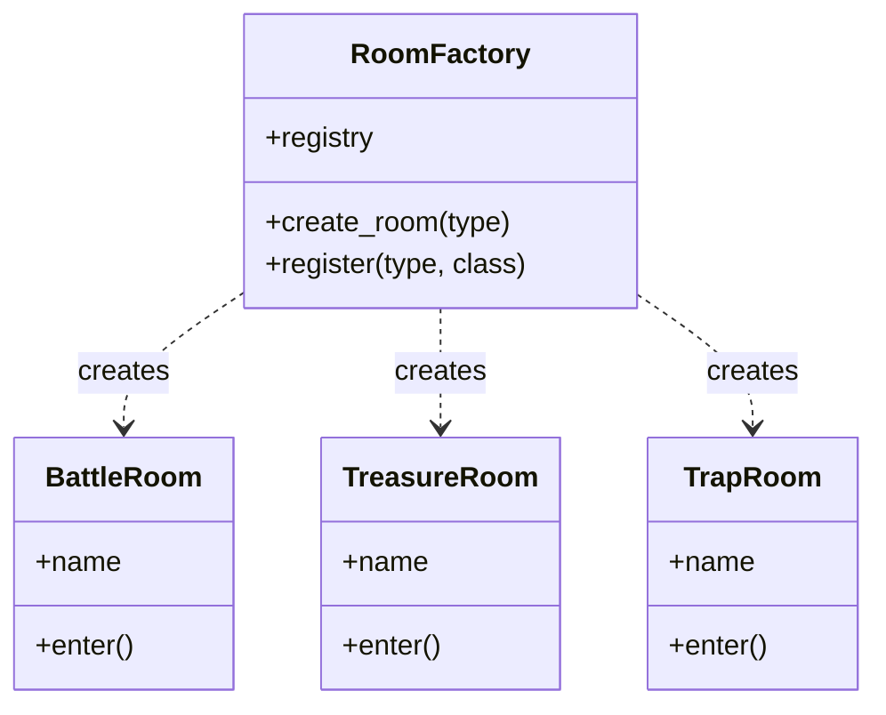
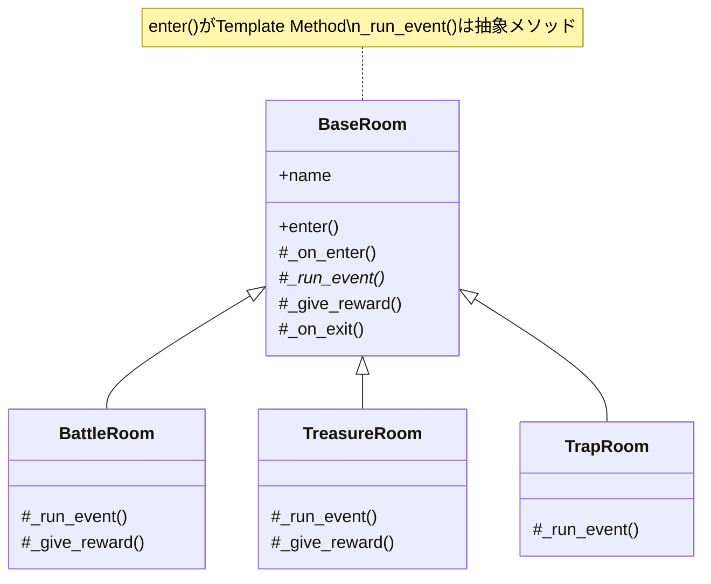
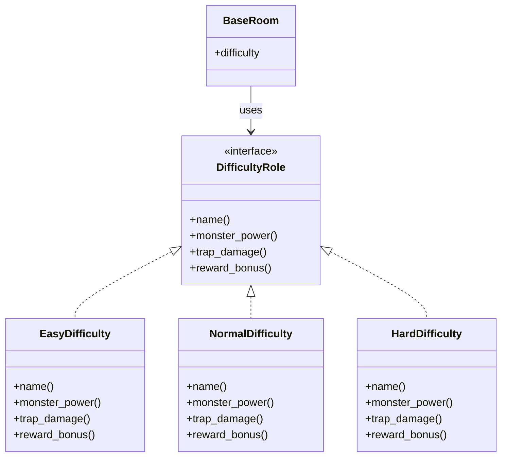
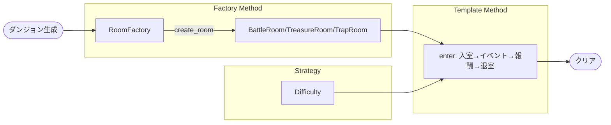
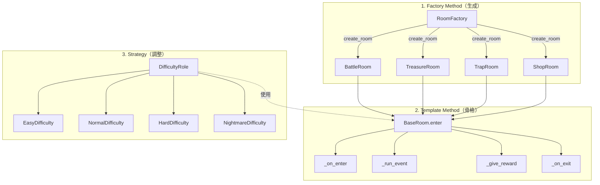

「デザインパターンの本は読んだけど、実際に使えるかというと…」

そんな悩みを持っていませんか？Strategy、Factory Method、Template Method——名前は知っているし、サンプルコードも見た。でも、自分でゼロから設計しようとすると、気づけばまたif/elseの山。

この記事では、ローグライク風ダンジョン生成器を作りながら、3つのデザインパターンを手で覚えます。「動く→破綻→パターン導入」のサイクルを繰り返すことで、「なぜこのパターンが必要なのか」が腹落ちする体験をお届けします。

完成したら、友人に「俺が作ったローグライク風ゲームやる？」と自慢しましょう。

---

## この記事で習得できること

| パターン | 役割 | 本記事での実装 |
|---------|------|--------------|
| Factory Method | オブジェクト生成の責務分離 | 部屋タイプ名から部屋オブジェクト生成 |
| Template Method | 処理の骨格固定 | 入室→イベント→報酬→退室のフロー |
| Strategy | アルゴリズムの切り替え | 難易度（Easy/Normal/Hard）の調整 |

---

## 対象読者

- 「デザインパターン学習シリーズ」を一通り読んだが、まだ自力で使いこなせない方
- if/elseから脱却したい方
- 手を動かしながらパターンを定着させたい方

---

## 技術スタック

| 項目 | バージョン・ライブラリ |
|------|----------------------|
| Perl | v5.36以降（signatures、postfix dereference対応） |
| オブジェクト指向 | Moo |
| 乱数 | 標準関数（rand、int） |

---

## 第1章: ダンジョンに部屋を追加しよう

### 今回の目標

- BattleRoom（戦闘部屋）クラスを作成する
- 入室→戦闘→退室の基本的な流れを実装する

### 動く：最初の実装

まずは1種類の部屋だけを持つシンプルなダンジョンを作ります。

```perl
#!/usr/bin/env perl
use v5.36;

# 戦闘部屋クラス
package BattleRoom {
    use Moo;
    
    has name => (is => 'ro', default => '戦闘の間');
    
    sub enter($self) {
        say "【" . $self->name . "】に入った！";
        $self->_battle();
        say "部屋をクリアした！\n";
    }
    
    sub _battle($self) {
        my @monsters = ('ゴブリン', 'スライム', 'コウモリ');
        my $monster = $monsters[int(rand(@monsters))];
        say "  $monster が現れた！";
        say "  $monster を倒した！";
    }
}

# メイン処理
package main {
    say "=== ダンジョン探索開始 ===\n";
    
    my $room = BattleRoom->new;
    $room->enter;
    
    say "=== 探索終了 ===";
}
```

### 実行結果

```
=== ダンジョン探索開始 ===

【戦闘の間】に入った！
  ゴブリン が現れた！
  ゴブリン を倒した！
部屋をクリアした！

=== 探索終了 ===
```

動きました！入室→戦闘→退室の基本的な流れができています。

### 今回のポイント

- Mooの`has`で属性を定義し、`sub`でメソッドを実装
- `$self`を使ったオブジェクト指向の基本構造
- 乱数でモンスターをランダムに選択

次の章では、部屋の種類を増やしていきます。

---

## 第2章: 部屋の種類を増やしたい！

### 前章の振り返り

BattleRoomクラスを作成し、入室→戦闘→退室の流れを実装しました。

### 今回の目標

- TreasureRoom（宝箱部屋）とTrapRoom（罠部屋）を追加する
- 部屋タイプに応じて処理を分岐させる

### 動く：if/elseで部屋を判定

新しい部屋を追加してみましょう。

```perl
#!/usr/bin/env perl
use v5.36;

# 部屋タイプごとの処理（if/else版）
sub create_room($type) {
    if ($type eq 'battle') {
        return {
            name => '戦闘の間',
            event => sub {
                my @monsters = ('ゴブリン', 'スライム', 'コウモリ');
                my $monster = $monsters[int(rand(@monsters))];
                say "  $monster が現れた！";
                say "  $monster を倒した！";
            }
        };
    }
    elsif ($type eq 'treasure') {
        return {
            name => '宝物庫',
            event => sub {
                my @items = ('回復薬', '金貨100枚', '古びた剣');
                my $item = $items[int(rand(@items))];
                say "  宝箱を発見！";
                say "  $item を手に入れた！";
            }
        };
    }
    elsif ($type eq 'trap') {
        return {
            name => '罠の間',
            event => sub {
                my @traps = ('落とし穴', '毒矢', '閃光');
                my $trap = $traps[int(rand(@traps))];
                say "  罠だ！ $trap！";
                say "  ダメージを受けた...";
            }
        };
    }
    else {
        die "Unknown room type: $type";
    }
}

sub enter_room($room) {
    say "【" . $room->{name} . "】に入った！";
    $room->{event}->();
    say "部屋をクリアした！\n";
}

# メイン処理
package main {
    say "=== ダンジョン探索開始 ===\n";
    
    my @room_types = ('battle', 'treasure', 'trap', 'battle', 'treasure');
    
    for my $type (@room_types) {
        my $room = create_room($type);
        enter_room($room);
    }
    
    say "=== 探索終了 ===";
}
```

### 破綻：問題が発生


一応動きますが、問題が見えてきました。

問題点1: `create_room`関数が肥大化
- 部屋タイプが増えるたびにif/elseが増える
- ShopRoom、BossRoom、RestRoomなど追加するたびに膨らむ

問題点2: 処理が散在している
- 部屋の名前、イベント処理、報酬処理が1つの関数に詰め込まれている
- どこを変更すればいいか分かりにくい

問題点3: テストしづらい
- 各部屋のロジックが関数内部にハードコードされている
- 部屋単体でのテストが困難

```perl
# これが10種類になったら...？
if ($type eq 'battle') { ... }
elsif ($type eq 'treasure') { ... }
elsif ($type eq 'trap') { ... }
elsif ($type eq 'shop') { ... }       # 追加
elsif ($type eq 'boss') { ... }       # 追加
elsif ($type eq 'rest') { ... }       # 追加
elsif ($type eq 'puzzle') { ... }     # 追加
elsif ($type eq 'event') { ... }      # さらに追加...
# if/else地獄！
```

### 今回のポイント

- 機能追加のたびにif/elseが増える「条件分岐の爆発」が発生
- コードの見通しが悪くなり、保守が困難に
- 次章でこの問題を解決します

---

## 第3章: 部屋を工場で生産しよう

### 前章の振り返り

部屋タイプが増えるとif/elseが爆発する問題が発生しました。

### 今回の目標

- 各部屋タイプを独立したクラスにする
- Factory Methodパターンで部屋オブジェクトを生成する

### 破綻からの脱出：Factory Methodの導入

部屋の生成をレジストリに委譲することで、if/elseを排除します。

```perl
#!/usr/bin/env perl
use v5.36;

# ====================
# 部屋クラス群
# ====================

package BattleRoom {
    use Moo;
    
    has name => (is => 'ro', default => '戦闘の間');
    
    sub enter($self) {
        say "【" . $self->name . "】に入った！";
        my @monsters = ('ゴブリン', 'スライム', 'コウモリ');
        my $monster = $monsters[int(rand(@monsters))];
        say "  $monster が現れた！";
        say "  $monster を倒した！";
        say "部屋をクリアした！\n";
    }
}

package TreasureRoom {
    use Moo;
    
    has name => (is => 'ro', default => '宝物庫');
    
    sub enter($self) {
        say "【" . $self->name . "】に入った！";
        my @items = ('回復薬', '金貨100枚', '古びた剣');
        my $item = $items[int(rand(@items))];
        say "  宝箱を発見！";
        say "  $item を手に入れた！";
        say "部屋をクリアした！\n";
    }
}

package TrapRoom {
    use Moo;
    
    has name => (is => 'ro', default => '罠の間');
    
    sub enter($self) {
        say "【" . $self->name . "】に入った！";
        my @traps = ('落とし穴', '毒矢', '閃光');
        my $trap = $traps[int(rand(@traps))];
        say "  罠だ！ $trap！";
        say "  ダメージを受けた...";
        say "部屋をクリアした！\n";
    }
}

# ====================
# 部屋ファクトリ（Factory Method）
# ====================

package RoomFactory {
    use Moo;
    
    # 部屋タイプからクラスへのマッピング
    has registry => (
        is => 'ro',
        default => sub {
            {
                battle   => 'BattleRoom',
                treasure => 'TreasureRoom',
                trap     => 'TrapRoom',
            }
        }
    );
    
    # Factory Method: 部屋タイプ名から部屋オブジェクトを生成
    sub create_room($self, $type) {
        my $class = $self->registry->{$type}
            or die "Unknown room type: $type";
        return $class->new;
    }
    
    # 新しい部屋タイプを登録
    sub register($self, $type, $class) {
        $self->registry->{$type} = $class;
    }
}

# ====================
# メイン処理
# ====================

package main {
    say "=== ダンジョン探索開始 ===\n";
    
    my $factory = RoomFactory->new;
    my @room_types = ('battle', 'treasure', 'trap', 'battle', 'treasure');
    
    for my $type (@room_types) {
        my $room = $factory->create_room($type);
        $room->enter;
    }
    
    say "=== 探索終了 ===";
}
```

### 何が改善されたか？

1. if/elseが消えた: `registry`ハッシュでタイプとクラスをマッピング
2. 部屋ごとにクラスが独立: BattleRoom、TreasureRoom、TrapRoomが別々のクラスに
3. 拡張が容易: 新しい部屋タイプは`register`メソッドで追加可能

```perl
# 新しい部屋を追加するのはこれだけ！
$factory->register('shop', 'ShopRoom');
```

### Factory Methodパターンとは



Factory Methodは「オブジェクトの生成をサブクラスに委ねる」パターンです。本記事では、レジストリを使った簡易版を実装しています。

### 今回のポイント

- 部屋タイプからクラスへのマッピングをレジストリで管理
- `create_room`メソッドが生成の責務を担う
- 新しい部屋の追加が`register`一発で完了

次の章では、各部屋で共通の処理フローを整理します。

---

## 第4章: 部屋イベントの流れを決めよう

### 前章の振り返り

Factory Methodパターンで部屋生成を整理しました。if/elseが消え、新しい部屋の追加が容易になりました。

### 今回の目標

- 全ての部屋に共通する「処理の流れ」を基底クラスで定義する
- Template Methodパターンで処理の骨格を固定する

### 問題：各部屋で似たような処理が散在

現状のコードを見ると、各部屋のenterメソッドに似たような処理があります：

```perl
# BattleRoom
sub enter($self) {
    say "【" . $self->name . "】に入った！";  # ← 共通
    # ... 戦闘処理 ...
    say "部屋をクリアした！\n";               # ← 共通
}

# TreasureRoom  
sub enter($self) {
    say "【" . $self->name . "】に入った！";  # ← 共通
    # ... 宝箱処理 ...
    say "部屋をクリアした！\n";               # ← 共通
}
```

「入室メッセージ」と「クリアメッセージ」が重複しています。さらに、以下のような要件が追加されたらどうでしょう？

- 入室前に準備処理を行いたい
- イベント後に報酬を付与したい
- 退室時にログを記録したい

全ての部屋クラスを修正する必要があります。これは辛い！

### 完成：Template Methodの導入

処理の骨格を基底クラスで定義し、各部屋は具体的なイベント部分だけを実装するようにします。

```perl
#!/usr/bin/env perl
use v5.36;

# ====================
# 基底部屋クラス（Template Method）
# ====================

package BaseRoom {
    use Moo;
    
    has name => (is => 'ro', required => 1);
    
    # Template Method: 処理の骨格を定義
    sub enter($self) {
        $self->_on_enter;      # 1. 入室
        $self->_run_event;     # 2. イベント（サブクラスで実装）
        $self->_give_reward;   # 3. 報酬
        $self->_on_exit;       # 4. 退室
    }
    
    # フック: 入室時（オーバーライド可能）
    sub _on_enter($self) {
        say "【" . $self->name . "】に入った！";
    }
    
    # 抽象メソッド: サブクラスで必ず実装
    sub _run_event($self) {
        die "サブクラスで_run_eventを実装してください";
    }
    
    # フック: 報酬付与（デフォルトは何もしない）
    sub _give_reward($self) {
        # デフォルトでは何もしない（オーバーライド可能）
    }
    
    # フック: 退室時
    sub _on_exit($self) {
        say "部屋をクリアした！\n";
    }
}

# ====================
# 具象部屋クラス群
# ====================

package BattleRoom {
    use Moo;
    extends 'BaseRoom';
    
    has '+name' => (default => '戦闘の間');
    
    sub _run_event($self) {
        my @monsters = ('ゴブリン', 'スライム', 'コウモリ');
        my $monster = $monsters[int(rand(@monsters))];
        say "  $monster が現れた！";
        say "  $monster を倒した！";
    }
    
    sub _give_reward($self) {
        my $exp = int(rand(50)) + 10;
        say "  経験値 $exp を獲得！";
    }
}

package TreasureRoom {
    use Moo;
    extends 'BaseRoom';
    
    has '+name' => (default => '宝物庫');
    
    sub _run_event($self) {
        say "  宝箱を発見！";
    }
    
    sub _give_reward($self) {
        my @items = ('回復薬', '金貨100枚', '古びた剣');
        my $item = $items[int(rand(@items))];
        say "  $item を手に入れた！";
    }
}

package TrapRoom {
    use Moo;
    extends 'BaseRoom';
    
    has '+name' => (default => '罠の間');
    
    sub _run_event($self) {
        my @traps = ('落とし穴', '毒矢', '閃光');
        my $trap = $traps[int(rand(@traps))];
        say "  罠だ！ $trap！";
        say "  ダメージを受けた...";
    }
    
    # 罠の間には報酬なし（デフォルトのまま）
}

# ====================
# 部屋ファクトリ
# ====================

package RoomFactory {
    use Moo;
    
    has registry => (
        is => 'ro',
        default => sub {
            {
                battle   => 'BattleRoom',
                treasure => 'TreasureRoom',
                trap     => 'TrapRoom',
            }
        }
    );
    
    sub create_room($self, $type) {
        my $class = $self->registry->{$type}
            or die "Unknown room type: $type";
        return $class->new;
    }
}

# ====================
# メイン処理
# ====================

package main {
    say "=== ダンジョン探索開始 ===\n";
    
    my $factory = RoomFactory->new;
    my @room_types = ('battle', 'treasure', 'trap');
    
    for my $type (@room_types) {
        my $room = $factory->create_room($type);
        $room->enter;
    }
    
    say "=== 探索終了 ===";
}
```

### 実行結果

```
=== ダンジョン探索開始 ===

【戦闘の間】に入った！
  ゴブリン が現れた！
  ゴブリン を倒した！
  経験値 42 を獲得！
部屋をクリアした！

【宝物庫】に入った！
  宝箱を発見！
  金貨100枚 を手に入れた！
部屋をクリアした！

【罠の間】に入った！
  罠だ！ 落とし穴！
  ダメージを受けた...
部屋をクリアした！

=== 探索終了 ===
```

### Template Methodパターンとは




Template Methodは「処理の骨格を基底クラスで定義し、詳細をサブクラスに任せる」パターンです。

- `enter()`：処理の骨格（Template Method）
- `_run_event()`：必ず実装するメソッド（Primitive Operation）
- `_give_reward()`：オーバーライド可能なフック（Hook Method）

### 今回のポイント

- 共通処理を基底クラスに集約し、DRY原則を実現
- サブクラスは違いの部分だけを実装すればよい
- 新しい共通処理（ログ記録など）を追加してもサブクラスへの影響が最小限

---

## 第5章: 難易度を切り替えよう

### 前章の振り返り

Template Methodパターンで処理の骨格を固定し、各部屋は具体的なイベントだけを実装するようになりました。

### 今回の目標

- 難易度（Easy/Normal/Hard）を導入する
- Strategyパターンで難易度調整ロジックを切り替え可能にする

### 問題：難易度によって処理が変わる

ゲームとして面白くするには、難易度設定が必要です。

- Easy: モンスターが弱い、報酬が多い
- Normal: 標準的なバランス
- Hard: モンスターが強い、罠のダメージが大きい

これをif/elseで実装すると...

```perl
# また地獄のif/else！
sub get_damage($self, $difficulty) {
    if ($difficulty eq 'easy') {
        return int(rand(10)) + 5;
    }
    elsif ($difficulty eq 'normal') {
        return int(rand(20)) + 10;
    }
    elsif ($difficulty eq 'hard') {
        return int(rand(40)) + 20;
    }
    # NightmareやHellが追加されたら...
}
```

### 完成：Strategyの導入

難易度調整ロジックをStrategyオブジェクトとしてカプセル化します。

```perl
#!/usr/bin/env perl
use v5.36;

# ====================
# 難易度ロール（Strategy Interface）
# ====================

package DifficultyRole {
    use Moo::Role;
    
    requires 'name';
    requires 'monster_power';   # モンスターの強さ倍率
    requires 'trap_damage';     # 罠のダメージ
    requires 'reward_bonus';    # 報酬ボーナス
}

# ====================
# 難易度戦略クラス群
# ====================

package EasyDifficulty {
    use Moo;
    with 'DifficultyRole';
    
    sub name($self)         { 'イージー' }
    sub monster_power($self) { 0.5 }
    sub trap_damage($self)   { int(rand(5)) + 1 }
    sub reward_bonus($self)  { 1.5 }
}

package NormalDifficulty {
    use Moo;
    with 'DifficultyRole';
    
    sub name($self)         { 'ノーマル' }
    sub monster_power($self) { 1.0 }
    sub trap_damage($self)   { int(rand(15)) + 5 }
    sub reward_bonus($self)  { 1.0 }
}

package HardDifficulty {
    use Moo;
    with 'DifficultyRole';
    
    sub name($self)         { 'ハード' }
    sub monster_power($self) { 2.0 }
    sub trap_damage($self)   { int(rand(30)) + 15 }
    sub reward_bonus($self)  { 0.8 }
}

# ====================
# 基底部屋クラス（難易度対応版）
# ====================

package BaseRoom {
    use Moo;
    
    has name => (is => 'ro', required => 1);
    has difficulty => (is => 'ro', required => 1);  # Strategy
    
    sub enter($self) {
        $self->_on_enter;
        $self->_run_event;
        $self->_give_reward;
        $self->_on_exit;
    }
    
    sub _on_enter($self) {
        say "【" . $self->name . "】に入った！（" . 
            $self->difficulty->name . "モード）";
    }
    
    sub _run_event($self) {
        die "サブクラスで_run_eventを実装してください";
    }
    
    sub _give_reward($self) { }
    
    sub _on_exit($self) {
        say "部屋をクリアした！\n";
    }
}

# ====================
# 具象部屋クラス群（難易度対応版）
# ====================

package BattleRoom {
    use Moo;
    extends 'BaseRoom';
    
    has '+name' => (default => '戦闘の間');
    
    sub _run_event($self) {
        my @monsters = ('ゴブリン', 'スライム', 'コウモリ');
        my $monster = $monsters[int(rand(@monsters))];
        my $power = int(10 * $self->difficulty->monster_power);
        say "  $monster (強さ: $power) が現れた！";
        say "  $monster を倒した！";
    }
    
    sub _give_reward($self) {
        my $base_exp = int(rand(50)) + 10;
        my $exp = int($base_exp * $self->difficulty->reward_bonus);
        say "  経験値 $exp を獲得！";
    }
}

package TreasureRoom {
    use Moo;
    extends 'BaseRoom';
    
    has '+name' => (default => '宝物庫');
    
    sub _run_event($self) {
        say "  宝箱を発見！";
    }
    
    sub _give_reward($self) {
        my $base_gold = int(rand(100)) + 50;
        my $gold = int($base_gold * $self->difficulty->reward_bonus);
        say "  金貨 $gold 枚を手に入れた！";
    }
}

package TrapRoom {
    use Moo;
    extends 'BaseRoom';
    
    has '+name' => (default => '罠の間');
    
    sub _run_event($self) {
        my @traps = ('落とし穴', '毒矢', '閃光');
        my $trap = $traps[int(rand(@traps))];
        my $damage = $self->difficulty->trap_damage;
        say "  罠だ！ $trap！";
        say "  $damage ダメージを受けた...";
    }
}

# ====================
# 部屋ファクトリ（難易度対応版）
# ====================

package RoomFactory {
    use Moo;
    
    has difficulty => (is => 'ro', required => 1);
    
    has registry => (
        is => 'ro',
        default => sub {
            {
                battle   => 'BattleRoom',
                treasure => 'TreasureRoom',
                trap     => 'TrapRoom',
            }
        }
    );
    
    sub create_room($self, $type) {
        my $class = $self->registry->{$type}
            or die "Unknown room type: $type";
        return $class->new(difficulty => $self->difficulty);
    }
}

# ====================
# メイン処理
# ====================

package main {
    # 難易度を選択
    my $difficulty = HardDifficulty->new;
    
    say "=== ダンジョン探索開始（" . $difficulty->name . "）===\n";
    
    my $factory = RoomFactory->new(difficulty => $difficulty);
    my @room_types = ('battle', 'treasure', 'trap');
    
    for my $type (@room_types) {
        my $room = $factory->create_room($type);
        $room->enter;
    }
    
    say "=== 探索終了 ===";
}
```

### 実行結果（ハードモード）

```
=== ダンジョン探索開始（ハード）===

【戦闘の間】に入った！（ハードモード）
  ゴブリン (強さ: 20) が現れた！
  ゴブリン を倒した！
  経験値 36 を獲得！
部屋をクリアした！

【宝物庫】に入った！（ハードモード）
  宝箱を発見！
  金貨 96 枚を手に入れた！
部屋をクリアした！

【罠の間】に入った！（ハードモード）
  罠だ！ 毒矢！
  28 ダメージを受けた...
部屋をクリアした！

=== 探索終了 ===
```

### Strategyパターンとは




Strategyは「アルゴリズムをカプセル化し、実行時に切り替え可能にする」パターンです。

- `DifficultyRole`：戦略のインターフェース
- `EasyDifficulty`, `NormalDifficulty`, `HardDifficulty`：具体的な戦略
- `BaseRoom`：戦略を使用するコンテキスト

### 今回のポイント

- 難易度ロジックを独立したクラスに分離
- 実行時に難易度を切り替え可能（Easy→Hard など）
- 新しい難易度（Nightmare等）の追加が容易

---

## 第6章: 全パターンでダンジョン生成

### 前章の振り返り

Strategyパターンで難易度を切り替え可能にしました。

### 今回の目標

- 3つのパターンを統合したダンジョン生成器を完成させる
- パターン間の協調動作を確認する

### 3パターンの協調動作


ここまでで導入した3パターンが、どのように連携しているか確認しましょう。



1. Factory Method: 部屋タイプ名から適切な部屋オブジェクトを生成
2. Template Method: 生成された部屋が共通の処理フローで実行
3. Strategy: 難易度に応じてダメージや報酬を調整

### 完成版：ダンジョンマスター

```perl
#!/usr/bin/env perl
use v5.36;

# ====================
# 難易度戦略（Strategy）
# ====================

package DifficultyRole {
    use Moo::Role;
    requires 'name';
    requires 'monster_power';
    requires 'trap_damage';
    requires 'reward_bonus';
}

package EasyDifficulty {
    use Moo;
    with 'DifficultyRole';
    sub name($self)         { 'イージー' }
    sub monster_power($self) { 0.5 }
    sub trap_damage($self)   { int(rand(5)) + 1 }
    sub reward_bonus($self)  { 1.5 }
}

package NormalDifficulty {
    use Moo;
    with 'DifficultyRole';
    sub name($self)         { 'ノーマル' }
    sub monster_power($self) { 1.0 }
    sub trap_damage($self)   { int(rand(15)) + 5 }
    sub reward_bonus($self)  { 1.0 }
}

package HardDifficulty {
    use Moo;
    with 'DifficultyRole';
    sub name($self)         { 'ハード' }
    sub monster_power($self) { 2.0 }
    sub trap_damage($self)   { int(rand(30)) + 15 }
    sub reward_bonus($self)  { 0.8 }
}

# ====================
# 基底部屋クラス（Template Method）
# ====================

package BaseRoom {
    use Moo;
    has name => (is => 'ro', required => 1);
    has difficulty => (is => 'ro', required => 1);
    
    sub enter($self) {
        $self->_on_enter;
        $self->_run_event;
        $self->_give_reward;
        $self->_on_exit;
    }
    
    sub _on_enter($self) {
        say "【" . $self->name . "】に入った！";
    }
    sub _run_event($self) { die "Implement in subclass" }
    sub _give_reward($self) { }
    sub _on_exit($self) { say "部屋をクリアした！\n" }
}

# ====================
# 具象部屋クラス群
# ====================

package BattleRoom {
    use Moo;
    extends 'BaseRoom';
    has '+name' => (default => '戦闘の間');
    
    sub _run_event($self) {
        my @monsters = ('ゴブリン', 'スライム', 'コウモリ', 'オーク', 'スケルトン');
        my $monster = $monsters[int(rand(@monsters))];
        my $power = int(10 * $self->difficulty->monster_power);
        say "  🗡️ $monster (強さ: $power) が現れた！";
        say "  ⚔️ $monster を倒した！";
    }
    
    sub _give_reward($self) {
        my $base_exp = int(rand(50)) + 10;
        my $exp = int($base_exp * $self->difficulty->reward_bonus);
        say "  ✨ 経験値 $exp を獲得！";
    }
}

package TreasureRoom {
    use Moo;
    extends 'BaseRoom';
    has '+name' => (default => '宝物庫');
    
    sub _run_event($self) {
        say "  📦 宝箱を発見！";
    }
    
    sub _give_reward($self) {
        my @items = ('回復薬', '聖なる剣', '魔法の盾', 'エリクサー', 'ドラゴンの鱗');
        my $item = $items[int(rand(@items))];
        my $base_gold = int(rand(100)) + 50;
        my $gold = int($base_gold * $self->difficulty->reward_bonus);
        say "  💎 $item を手に入れた！";
        say "  💰 金貨 $gold 枚を獲得！";
    }
}

package TrapRoom {
    use Moo;
    extends 'BaseRoom';
    has '+name' => (default => '罠の間');
    
    sub _run_event($self) {
        my @traps = ('落とし穴', '毒矢', '閃光', '爆発', '凍結');
        my $trap = $traps[int(rand(@traps))];
        my $damage = $self->difficulty->trap_damage;
        say "  ⚠️ 罠だ！ $trap！";
        say "  💥 $damage ダメージを受けた...";
    }
}

# ====================
# 部屋ファクトリ（Factory Method）
# ====================

package RoomFactory {
    use Moo;
    has difficulty => (is => 'ro', required => 1);
    has registry => (
        is => 'ro',
        default => sub {{
            battle   => 'BattleRoom',
            treasure => 'TreasureRoom',
            trap     => 'TrapRoom',
        }}
    );
    
    sub create_room($self, $type) {
        my $class = $self->registry->{$type}
            or die "Unknown room type: $type";
        return $class->new(difficulty => $self->difficulty);
    }
    
    sub register($self, $type, $class) {
        $self->registry->{$type} = $class;
    }
}

# ====================
# ダンジョンマスター（統合クラス）
# ====================

package DungeonMaster {
    use Moo;
    
    has difficulty => (is => 'ro', required => 1);
    has room_count => (is => 'ro', default => 5);
    has factory => (is => 'lazy');
    
    sub _build_factory($self) {
        RoomFactory->new(difficulty => $self->difficulty);
    }
    
    sub generate_dungeon($self) {
        my @types = ('battle', 'treasure', 'trap');
        my @rooms;
        
        for (1 .. $self->room_count) {
            my $type = $types[int(rand(@types))];
            push @rooms, $self->factory->create_room($type);
        }
        
        return @rooms;
    }
    
    sub run($self) {
        say "╔══════════════════════════════════════╗";
        say "║     ダンジョンマスター               ║";
        say "║     難易度: " . $self->difficulty->name . "                    ║";
        say "╚══════════════════════════════════════╝\n";
        
        my @rooms = $self->generate_dungeon;
        my $floor = 1;
        
        for my $room (@rooms) {
            say "--- 第${floor}層 ---";
            $room->enter;
            $floor++;
        }
        
        say "╔══════════════════════════════════════╗";
        say "║     🎉 ダンジョン踏破おめでとう！    ║";
        say "╚══════════════════════════════════════╝";
    }
}

# ====================
# メイン処理
# ====================

package main {
    # 難易度を選択（ここを変えるだけでゲームバランスが変わる）
    my $difficulty = NormalDifficulty->new;
    
    my $game = DungeonMaster->new(
        difficulty => $difficulty,
        room_count => 5,
    );
    
    $game->run;
}
```

### 実行結果

```
╔══════════════════════════════════════╗
║     ダンジョンマスター               ║
║     難易度: ノーマル                    ║
╚══════════════════════════════════════╝

--- 第1層 ---
【戦闘の間】に入った！
  🗡️ オーク (強さ: 10) が現れた！
  ⚔️ オーク を倒した！
  ✨ 経験値 47 を獲得！
部屋をクリアした！

--- 第2層 ---
【宝物庫】に入った！
  📦 宝箱を発見！
  💎 エリクサー を手に入れた！
  💰 金貨 123 枚を獲得！
部屋をクリアした！

--- 第3層 ---
【罠の間】に入った！
  ⚠️ 罠だ！ 凍結！
  💥 18 ダメージを受けた...
部屋をクリアした！

--- 第4層 ---
【戦闘の間】に入った！
  🗡️ スケルトン (強さ: 10) が現れた！
  ⚔️ スケルトン を倒した！
  ✨ 経験値 35 を獲得！
部屋をクリアした！

--- 第5層 ---
【宝物庫】に入った！
  📦 宝箱を発見！
  💎 魔法の盾 を手に入れた！
  💰 金貨 89 枚を獲得！
部屋をクリアした！

╔══════════════════════════════════════╗
║     🎉 ダンジョン踏破おめでとう！    ║
╚══════════════════════════════════════╝
```

### 今回のポイント

- 3パターンが自然に協調動作している
- `DungeonMaster`クラスが全体を統括
- 難易度を変えるだけでゲームバランスが変化

---

## 第7章: 新しい部屋と難易度を追加

### 前章の振り返り

3パターンを統合したダンジョン生成器が完成しました。

### 今回の目標

- 新しい部屋タイプ（ShopRoom）を追加する
- 新しい難易度（NightmareDifficulty）を追加する
- OCP（開放閉鎖原則） を体験する

### 拡張：ShopRoom（買い物部屋）の追加

既存のコードを一切修正せず、新しい部屋を追加します。

```perl
# 新しい部屋タイプを追加（既存コード無修正）
package ShopRoom {
    use Moo;
    extends 'BaseRoom';
    
    has '+name' => (default => '旅の商人');
    
    sub _on_enter($self) {
        say "【" . $self->name . "】に出会った！";
        say "  🛒 「いらっしゃい、何をお求めかな？」";
    }
    
    sub _run_event($self) {
        my @goods = (
            { name => '回復薬', price => 50 },
            { name => '解毒剤', price => 30 },
            { name => '松明',   price => 20 },
        );
        say "  📋 商品リスト:";
        for my $item (@goods) {
            say "    - $item->{name}: $item->{price}G";
        }
    }
    
    sub _give_reward($self) {
        # 買い物なので報酬はなし（購入処理は省略）
        say "  💬 「またのお越しを！」";
    }
    
    sub _on_exit($self) {
        say "商人と別れた。\n";
    }
}
```

### 拡張：NightmareDifficulty（悪夢モード）の追加

既存のコードを一切修正せず、新しい難易度を追加します。

```perl
# 新しい難易度を追加（既存コード無修正）
package NightmareDifficulty {
    use Moo;
    with 'DifficultyRole';
    
    sub name($self)         { '🔥悪夢🔥' }
    sub monster_power($self) { 5.0 }         # モンスター5倍！
    sub trap_damage($self)   { int(rand(100)) + 50 }  # 罠も激痛
    sub reward_bonus($self)  { 2.0 }         # 報酬2倍（釣り合い）
}
```

### ファクトリへの登録

```perl
# レジストリに追加するだけ
$factory->register('shop', 'ShopRoom');
```

### 実行例（悪夢モード + 商人）

```perl
package main {
    my $difficulty = NightmareDifficulty->new;
    
    my $factory = RoomFactory->new(difficulty => $difficulty);
    $factory->register('shop', 'ShopRoom');
    
    my @room_types = ('battle', 'shop', 'trap');
    
    say "=== 悪夢のダンジョン ===\n";
    for my $type (@room_types) {
        my $room = $factory->create_room($type);
        $room->enter;
    }
}
```

### 出力

```
=== 悪夢のダンジョン ===

【戦闘の間】に入った！
  🗡️ オーク (強さ: 50) が現れた！
  ⚔️ オーク を倒した！
  ✨ 経験値 94 を獲得！
部屋をクリアした！

【旅の商人】に出会った！
  🛒 「いらっしゃい、何をお求めかな？」
  📋 商品リスト:
    - 回復薬: 50G
    - 解毒剤: 30G
    - 松明: 20G
  💬 「またのお越しを！」
商人と別れた。

【罠の間】に入った！
  ⚠️ 罠だ！ 爆発！
  💥 87 ダメージを受けた...
部屋をクリアした！
```

### OCP（開放閉鎖原則）とは

> 「ソフトウェアの構成要素は、拡張に対して開いており、修正に対して閉じているべきである」

- 開いている: 新しい機能（ShopRoom、NightmareDifficulty）を追加できる
- 閉じている: 既存のコード（BaseRoom、RoomFactory、他の部屋クラス）を修正しない

今回の追加で修正が必要だったのは：
- 新クラスの作成
- `register`呼び出しの1行

既存の`BattleRoom`、`TreasureRoom`、`TrapRoom`、`BaseRoom`、`RoomFactory`は一切触っていません。これがOCPの力です。

### 今回のポイント

- 新しいクラスを追加するだけで機能拡張
- 既存コードへのリスクがゼロ
- 3パターンの組み合わせがOCPを実現

---

## 第8章: 振り返り〜3つのデザインパターン

### 前章の振り返り

新しい部屋タイプ（ShopRoom）と難易度（NightmareDifficulty）を、既存コード無修正で追加しました。

### 今回の目標

- 使用した3つのデザインパターンを明確にする
- パターン間の関係を整理する
- 発展的な拡張への道筋を示す

### 使用したパターン一覧

| パターン | 分類 | 役割 | 本記事での実装 |
|---------|------|------|--------------|
| Factory Method | 生成パターン | オブジェクト生成の責務分離 | `RoomFactory.create_room()` |
| Template Method | 振る舞いパターン | 処理の骨格固定 | `BaseRoom.enter()` |
| Strategy | 振る舞いパターン | アルゴリズムの切り替え | `DifficultyRole` + 各Difficulty |

### パターン間の関係図



### なぜこの組み合わせが効果的か

| 責務 | パターン | if/elseでやった場合の問題 |
|------|----------|--------------------------|
| 生成 | Factory Method | 部屋タイプごとのif/elseが膨張 |
| 処理フロー | Template Method | 各部屋で同じ処理をコピペ |
| パラメータ調整 | Strategy | 難易度ごとのif/elseが散在 |

3つのパターンがそれぞれ異なる責務を担当し、互いに干渉しません。

### 設計判断のまとめ

1. Factory Methodを選んだ理由
   - 部屋タイプが増えることが予想される
   - 生成ロジックを一箇所に集約したい
   - if/elseを排除したい

2. Template Methodを選んだ理由
   - 全ての部屋で共通の処理フローがある
   - 差異は一部のメソッドだけ
   - 新しい共通処理を追加しやすくしたい

3. Strategyを選んだ理由
   - 難易度は実行時に決まる
   - 難易度ロジックを部屋から分離したい
   - 新しい難易度の追加を容易にしたい

### 発展的な拡張案

この設計をベースに、以下のような拡張が可能です：

| 拡張 | 追加パターン | 説明 |
|------|-------------|------|
| ボス部屋 | State | ボスのフェーズ（怒り、防御等）を状態で管理 |
| セーブ機能 | Memento | ダンジョン状態をスナップショット保存 |
| イベントログ | Observer | 部屋クリア時に通知を飛ばす |
| 部屋の装飾 | Decorator | 「呪われた」「祝福された」などの効果を重ねがけ |

### 最終的なクラス構成

```
DungeonMaster
├── Factory Method
│   └── RoomFactory
│       ├── registry: { battle => BattleRoom, ... }
│       └── create_room(type)
│
├── Template Method
│   └── BaseRoom
│       ├── enter() ← Template Method
│       ├── _on_enter()
│       ├── _run_event() ← 抽象
│       ├── _give_reward()
│       └── _on_exit()
│       │
│       ├── BattleRoom (extends BaseRoom)
│       ├── TreasureRoom (extends BaseRoom)
│       ├── TrapRoom (extends BaseRoom)
│       └── ShopRoom (extends BaseRoom)
│
└── Strategy
    └── DifficultyRole
        ├── EasyDifficulty
        ├── NormalDifficulty
        ├── HardDifficulty
        └── NightmareDifficulty
```

### まとめ

この記事では、ローグライク風ダンジョン生成器を作りながら、3つのデザインパターンを実践的に学びました。

1. Factory Method: 生成の責務を分離し、if/elseを排除
2. Template Method: 処理の骨格を固定し、共通処理を集約
3. Strategy: アルゴリズムをカプセル化し、実行時に切り替え

「動く→破綻→パターン導入」のサイクルを体験することで、「なぜこのパターンが必要なのか」が実感できたのではないでしょうか。

完成したダンジョンマスターは、友人に「俺が作ったローグライク風ゲームやる？」と自慢できる立派なゲームエンジンです。ぜひ、新しい部屋や難易度を追加して、自分だけのダンジョンを作ってみてください！

---

## 関連記事

デザインパターンをさらに深く学びたい方は、以下のシリーズもご覧ください：

- [データエクスポーターを作ろう](/2026/01/09/005530/)（Strategyパターン）
- [APIレスポンスシミュレーターを作ろう](/2026/01/17/132411/)（Factory Methodパターン）
- [Webスクレイパーを作ろう](/2026/01/19/002047/)（Template Methodパターン）
- [テキストRPG戦闘エンジン](/2026/01/31/001956/)（4パターン組み合わせ）
