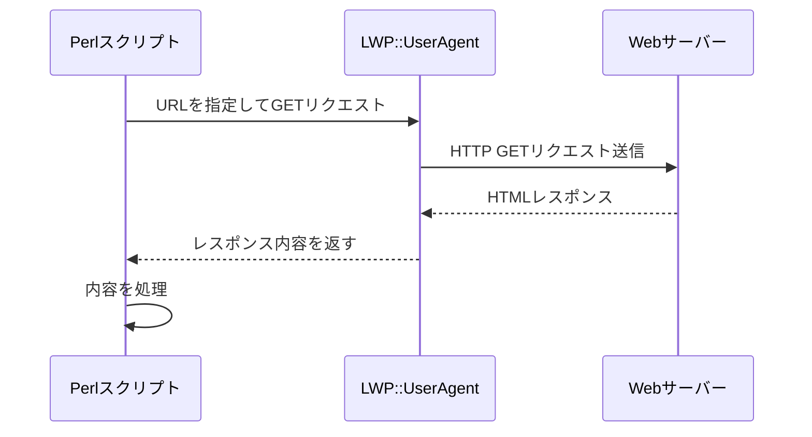

## あの価格、また変わってる...？

「競合サイトの価格が気になる」「政府の公開情報が更新されたらすぐ知りたい」「お気に入りのニュースサイトに新着記事が出たら通知してほしい」──そんな経験、ありませんか？

毎日手動でブラウザを開いてチェックするのは面倒です。かといって、月額課金のWebモニタリングSaaSに頼るのももったいない。そこで、Perlで自作してしまいましょう。

このシリーズでは、「Webページ変更ハンター」を段階的に構築していきます。URLリストを登録し、定期的にWebページをチェック、変更があれば複数の通知先（メール、Slack、ログ）に通知。過去のスナップショットと比較して「何が」変わったかを可視化する──そんなツールを、デザインパターンを学びながら作っていきます。

まず第1回は、「Webページの内容を取得する」という基礎から。これができなければ何も始まりません。

## HTTP通信の基礎

WebページをPerlで取得するには、HTTP通信を行う必要があります。Perlには定番のモジュール「LWP::UserAgent」があります（"LWP"は"Library for WWW in Perl"の略）。

基本的な流れはこうです：



## シンプルな取得スクリプト

まずは最小限のコードで、指定したURLの内容を取得してみましょう：

```perl
#!/usr/bin/env perl
use v5.36;
use utf8;
use LWP::UserAgent;

# UserAgentを作成
my $ua = LWP::UserAgent->new(
    timeout => 10,
    agent   => 'WebHunter/0.1',
);

# URLを取得
my $url = 'https://example.com';
my $response = $ua->get($url);

# 成功したか確認
if ($response->is_success) {
    say "取得成功！";
    say "Content-Type: ", $response->header('Content-Type');
    say "文字数: ", length($response->decoded_content);
    say "\n--- 内容 ---";
    say substr($response->decoded_content, 0, 500);  # 最初の500文字だけ表示
} else {
    die "取得失敗: ", $response->status_line;
}
```

`v5.36` を使うことで、`say`（末尾に改行を自動追加する`print`）やその他のモダン機能が使えます。`timeout`で通信のタイムアウトを設定し、`agent`でUserAgent文字列を指定します（礼儀正しく自分の名前を名乗りましょう）。

`decoded_content` は、文字コードを自動判定してデコードしてくれる便利なメソッドです。

## Mooでクラス化してみる

さて、これを「何度も使える部品」にするため、Mooでクラス化してみましょう。Mooは軽量なオブジェクト指向フレームワークで、Mooseよりも高速で依存が少ないのが魅力です。

```perl
#!/usr/bin/env perl
use v5.36;
use utf8;

package WebHunter::Fetcher {
    use Moo;
    use LWP::UserAgent;
    use namespace::clean;

    has ua => (
        is      => 'lazy',
        builder => sub {
            LWP::UserAgent->new(
                timeout => 10,
                agent   => 'WebHunter/0.1',
            );
        },
    );

    has timeout => (
        is      => 'ro',
        default => 10,
    );

    sub fetch ($self, $url) {
        my $response = $self->ua->get($url);
        
        return {
            success => $response->is_success,
            status  => $response->status_line,
            content => $response->is_success ? $response->decoded_content : undef,
            headers => { $response->headers->flatten },
        };
    }
}

# 使ってみる
package main {
    my $fetcher = WebHunter::Fetcher->new;
    my $result  = $fetcher->fetch('https://example.com');

    if ($result->{success}) {
        say "取得成功！";
        say "ステータス: $result->{status}";
        say "文字数: ", length($result->{content});
    } else {
        say "取得失敗: $result->{status}";
    }
}
```

### ここでのポイント

1. **`has ua => (is => 'lazy', builder => sub {...})`**: `ua`属性は最初にアクセスされたときに自動生成されます（遅延初期化）。毎回UserAgentオブジェクトを作るのは無駄なので、インスタンスごとに1つだけ作ります。

2. **`sub fetch ($self, $url)`**: Perl v5.36以降の「signatures」機能を使っています。従来の`my ($self, $url) = @_;`よりスッキリ。

3. **`namespace::clean`**: クラス定義内で`use`したモジュールの関数がメソッドとして見えないようにします。これがないと、`LWP::UserAgent`の関数が誤って`WebHunter::Fetcher`のメソッドとして呼べてしまう可能性があります。

4. **戻り値はハッシュリファレンス**: 成功/失敗、ステータス、内容、ヘッダーをまとめて返します。これで呼び出し側が必要な情報を自由に取り出せます。

## 次回予告

URLの内容を取得できるようになりました。でも、これだけでは「監視」になりません。次回は「前回取得した内容」と「今回取得した内容」を比較して、変更を検知する仕組みを作ります。

Webページが変わったかどうかを判定するには、どうすればいいでしょう？テキストの完全一致？ハッシュ値の比較？──次回をお楽しみに。


