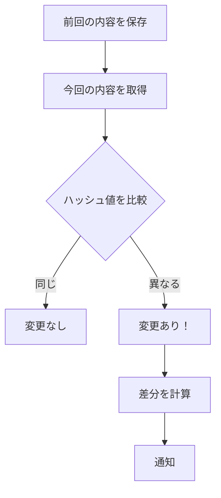

## 「変わった」をどう判定するか

前回、Webページの内容を取得できるようになりました。しかし、これだけでは「監視」にはなりません。「前回見たとき」と「今回見たとき」を比較して、「変わったかどうか」を判定する必要があります。

では、どうやって「変わった」を判定しましょう？

最も単純なのは、「前回の内容」と「今回の内容」をテキストとして完全一致比較することです。しかし、これには問題があります。HTMLには、広告バナーのランダム表示、アクセスカウンター、タイムスタンプなど、「本質的でない変更」が頻繁に含まれます。これらに反応してしまうと、誤検知が多発します。

今回は、まず基本的な「ハッシュ値による変更検知」を実装します。ハッシュ値とは、テキストを固定長の文字列に変換したもので、元のテキストが1文字でも変われば全く異なる値になります。この性質を使えば、長大なHTMLを毎回全文比較せずとも、変更を高速に検知できます。

## ハッシュ値で変更を検知

MD5ハッシュ（128ビット）を使いましょう。Perlのコアモジュール「Digest::MD5」で簡単に計算できます：

```perl
#!/usr/bin/env perl
use v5.36;
use utf8;
use Digest::MD5 qw(md5_hex);

my $text1 = "Hello, World!";
my $text2 = "Hello, World!";
my $text3 = "Hello, Perl!";

say "text1のハッシュ: ", md5_hex($text1);  # 65a8e27d8879283831b664bd8b7f0ad4
say "text2のハッシュ: ", md5_hex($text2);  # 65a8e27d8879283831b664bd8b7f0ad4
say "text3のハッシュ: ", md5_hex($text3);  # d41d8cd98f00b204e9800998ecf8427e

say "text1とtext2は同じ？ ", md5_hex($text1) eq md5_hex($text2) ? "YES" : "NO";
say "text1とtext3は同じ？ ", md5_hex($text1) eq md5_hex($text3) ? "YES" : "NO";
```

同じテキストなら同じハッシュ値、1文字でも違えば全く異なるハッシュ値になります。これで、「前回のハッシュ」と「今回のハッシュ」を比較すれば、変更の有無がわかります。

## ChangeDetectorクラスを作る

では、変更検知機能をクラス化しましょう：

```perl
#!/usr/bin/env perl
use v5.36;
use utf8;

package WebHunter::ChangeDetector {
    use Moo;
    use Digest::MD5 qw(md5_hex);
    use namespace::clean;

    # 前回のハッシュ値を保存
    has previous_hash => (
        is      => 'rw',
        default => '',
    );

    # 変更を検知
    sub detect ($self, $content) {
        my $current_hash = md5_hex($content);
        
        # 初回チェック（前回のハッシュがない）
        if (!$self->previous_hash) {
            $self->previous_hash($current_hash);
            return {
                changed      => 0,
                first_check  => 1,
                current_hash => $current_hash,
            };
        }

        # 変更チェック
        my $changed = ($current_hash ne $self->previous_hash);
        
        my $result = {
            changed       => $changed,
            first_check   => 0,
            current_hash  => $current_hash,
            previous_hash => $self->previous_hash,
        };

        # ハッシュを更新
        $self->previous_hash($current_hash) if $changed;

        return $result;
    }
}

# 使ってみる
package main {
    use WebHunter::Fetcher;  # 前回作ったクラス

    my $fetcher  = WebHunter::Fetcher->new;
    my $detector = WebHunter::ChangeDetector->new;

    # 1回目のチェック
    say "=== 1回目のチェック ===";
    my $result1 = $fetcher->fetch('https://example.com');
    if ($result1->{success}) {
        my $detection = $detector->detect($result1->{content});
        if ($detection->{first_check}) {
            say "初回チェックです。ハッシュを記録しました。";
        }
    }

    # 2回目のチェック（すぐに実行すると変わってないはず）
    say "\n=== 2回目のチェック ===";
    my $result2 = $fetcher->fetch('https://example.com');
    if ($result2->{success}) {
        my $detection = $detector->detect($result2->{content});
        if ($detection->{changed}) {
            say "変更を検知しました！";
        } else {
            say "変更なし";
        }
    }
}
```

### ポイント解説

1. **`has previous_hash => (is => 'rw')`**: `rw`（read-write）なので、読み書き両方できます。変更検知後に新しいハッシュに更新する必要があるため。

2. **初回チェック判定**: `previous_hash`が空なら初回です。この場合、「変更」とは扱わず、単にハッシュを記録します。

3. **変更時のみハッシュ更新**: 変更がなければ`previous_hash`はそのまま。変更があったときだけ新しいハッシュに更新します。

## 実際の変更を見てみる

ハッシュ値だけでは「何が」変わったかわかりません。実際の差分を確認するには、テキスト比較が必要です：



次回は、この「変更あり」を検知したときに、複数の通知先（メール、Slack、ログファイル）に自動通知する仕組みを作ります。ここでデザインパターンの「Observer」が登場します。

## 今回学んだこと

- ハッシュ値による効率的な変更検知
- Mooの`rw`属性による状態管理
- 初回チェックと2回目以降の区別

次回からは、いよいよデザインパターンの出番です。複数の通知先に「変更があったよ！」と伝える──これをスマートに実現するのが「Observerパターン」です。




