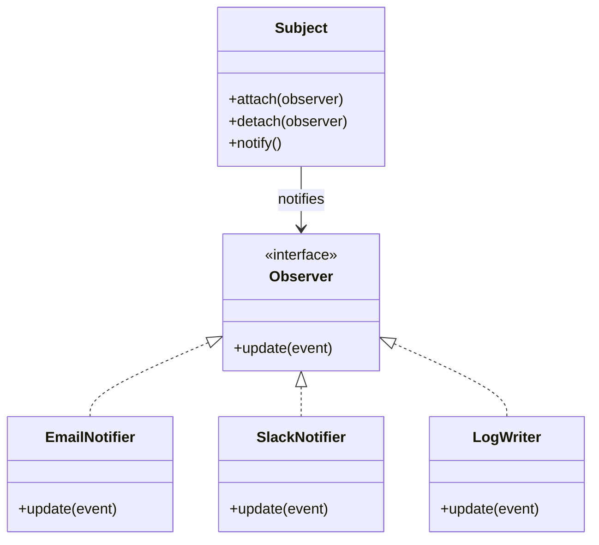
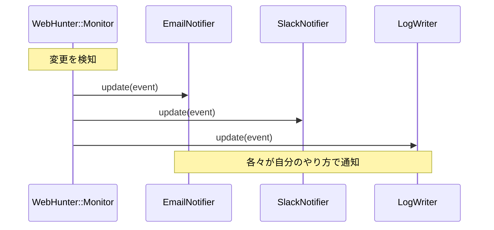

## 通知先が増えると破綻する

前回、Webページの変更を検知できるようになりました。しかし、検知だけでは意味がありません。「変更があった」という事実を、誰か（あるいは何か）に伝える必要があります。

最初は「メールで通知すればいいや」と思うかもしれません。しかし、次第に要求が増えます：

- 「Slackにも通知してほしい」
- 「ログファイルにも記録したい」
- 「重要なサイトだけLINEにも送りたい」

こういうとき、ベタに書くとこうなります：

```perl
# ❌ こうなると悲惨
sub on_change ($self, $url, $content) {
    # メール送信
    $self->send_email($url, $content);
    
    # Slack通知
    $self->send_slack($url, $content);
    
    # ログ記録
    $self->write_log($url, $content);
    
    # LINE通知（重要サイトのみ）
    if ($self->is_important($url)) {
        $self->send_line($url, $content);
    }
}
```

通知先が増えるたびに、この関数を修正しなければなりません。これは「Open-Closed Principle（開放閉鎖原則）」違反です。「拡張には開いているが、修正には閉じている」べきなのに、通知先を追加するたびに既存コードを変更しています。

## Observerパターンの登場

そこで登場するのが「Observerパターン」です。これは「何か変化があったとき、登録された全ての観察者（Observer）に通知する」仕組みです。



「Subject（主体）」は、変更を検知する側。「Observer（観察者）」は、通知を受け取る側。Subjectは複数のObserverを登録でき、変更があったときに全員に`update()`メソッドを呼びます。

新しい通知先を追加するときは、新しいObserverクラスを作って`attach()`で登録するだけ。既存コードを一切変更しません。

## Observerを実装してみる

まず、Observerの「役割」を定義します。Perlには厳密なインターフェースの概念はありませんが、Mooの「Role」で同じことができます：

```perl
package WebHunter::Observer {
    use Moo::Role;
    use namespace::clean;

    requires 'update';  # このRoleを使うクラスは必ずupdateメソッドを実装すること
}
```

次に、具体的なObserverたちを作ります：

```perl
package WebHunter::Observer::Email {
    use Moo;
    use namespace::clean;
    
    with 'WebHunter::Observer';

    has to => (
        is       => 'ro',
        required => 1,
    );

    sub update ($self, $event) {
        say "[EMAIL] 宛先: ", $self->to;
        say "  URL: $event->{url}";
        say "  変更検知時刻: $event->{timestamp}";
        say "  （実際にはここでメール送信処理）";
    }
}

package WebHunter::Observer::Slack {
    use Moo;
    use namespace::clean;
    
    with 'WebHunter::Observer';

    has webhook_url => (
        is       => 'ro',
        required => 1,
    );

    sub update ($self, $event) {
        say "[SLACK] Webhook: ", substr($self->webhook_url, 0, 30), "...";
        say "  URL: $event->{url}";
        say "  変更検知時刻: $event->{timestamp}";
        say "  （実際にはここでSlack Webhook呼び出し）";
    }
}

package WebHunter::Observer::Log {
    use Moo;
    use namespace::clean;
    
    with 'WebHunter::Observer';

    has logfile => (
        is      => 'ro',
        default => 'webhunter.log',
    );

    sub update ($self, $event) {
        say "[LOG] ログファイル: ", $self->logfile;
        say "  URL: $event->{url}";
        say "  変更検知時刻: $event->{timestamp}";
        say "  （実際にはここでログファイルに追記）";
    }
}
```

### ポイント

- **`with 'WebHunter::Observer'`**: このクラスは`WebHunter::Observer`ロールを「持つ」（with）。つまり、`update`メソッドを実装することを約束します。
- **`required => 1`**: コンストラクタで必須の引数。Emailなら宛先、Slackなら Webhook URL。
- **イベント情報**: `update`メソッドは、「何が起きたか」の情報を受け取ります。URLや検知時刻など。

## Subject（監視主体）を作る

次に、これらのObserverを管理するSubjectを作ります：

```perl
package WebHunter::Monitor {
    use Moo;
    use namespace::clean;

    # 登録されたObserver一覧
    has observers => (
        is      => 'ro',
        default => sub { [] },
    );

    # Observerを登録
    sub attach ($self, $observer) {
        push $self->observers->@*, $observer;
    }

    # Observerを解除
    sub detach ($self, $observer) {
        $self->observers->@* = grep { $_ != $observer } $self->observers->@*;
    }

    # 全Observerに通知
    sub notify ($self, $event) {
        for my $observer ($self->observers->@*) {
            $observer->update($event);
        }
    }

    # 変更を検知したときに呼ばれる
    sub on_change ($self, $url, $content) {
        my $event = {
            url       => $url,
            content   => $content,
            timestamp => time,
        };
        $self->notify($event);
    }
}
```

`->@*` は「postfix dereference」という構文で、Perl v5.20以降で使えます。`@{ $self->observers }` と同じ意味ですが、より読みやすいです。

## 実際に使ってみる

これで、通知先を自由に追加できるようになりました：

```perl
package main {
    use WebHunter::Monitor;
    use WebHunter::Observer::Email;
    use WebHunter::Observer::Slack;
    use WebHunter::Observer::Log;

    # 監視オブジェクトを作成
    my $monitor = WebHunter::Monitor->new;

    # 通知先を登録
    $monitor->attach(WebHunter::Observer::Email->new(to => 'admin@example.com'));
    $monitor->attach(WebHunter::Observer::Slack->new(webhook_url => 'https://hooks.slack.com/...'));
    $monitor->attach(WebHunter::Observer::Log->new(logfile => 'change.log'));

    # 変更を検知したと仮定
    $monitor->on_change('https://example.com', '<html>...</html>');
}
```

実行すると、3つの通知先すべてに通知が飛びます。新しい通知先（例：LINE、Discord、Telegram）を追加したいときは、新しいObserverクラスを作って`attach()`するだけ。既存コードは一切変更不要です。

## Observerパターンの本質



Observerパターンの本質は「疎結合」です。Monitorは「誰が」通知を受け取るかを知る必要がありません。Observerは「update()できるオブジェクト」というインターフェースさえ満たせば、何でもOK。

これで、Open-Closed Principleを守りながら、機能を拡張できるようになりました。

## 次回予告

通知の仕組みができました。しかし、まだ問題があります。「昨日の状態」と比較したいとき、どうすればいいでしょう？今のままでは、直前のハッシュ値しか保存していません。

次回は、「過去の状態を丸ごと保存・復元する」仕組みを作ります。ここで登場するのが「Mementoパターン」です。




