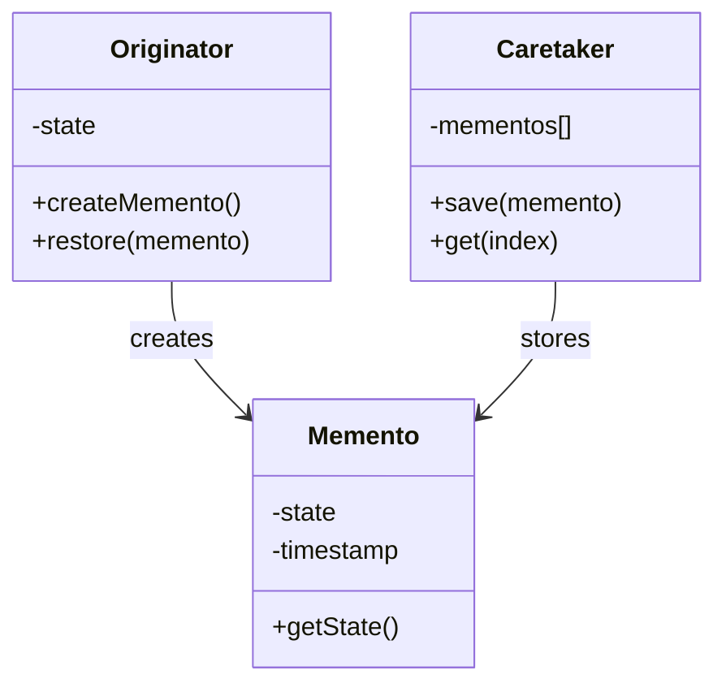
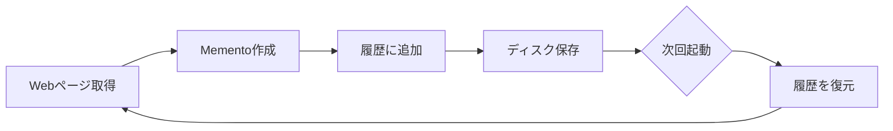

## 「いつ」変わったか知りたい

Observerパターンで通知の仕組みができました。しかし、実際に運用してみると、新たな要求が出てきます：

- 「昨日の状態と比較したい」
- 「先週のスナップショットを見たい」
- 「変更履歴をタイムラインで確認したい」

今のままでは、「直前のハッシュ値」しか保存していません。過去の状態を複数保存し、いつでも取り出せるようにする必要があります。

ここで登場するのが「Mementoパターン」です。日本語では「記念品パターン」とも呼ばれます。オブジェクトの内部状態をスナップショットとして保存し、後で復元できるようにする仕組みです。

## Mementoパターンの仕組み

Mementoパターンには3つの役割があります：



- **Originator（作成者）**: 状態を持つオブジェクト。スナップショットを作成する。
- **Memento（記念品）**: 状態のスナップショット。不変オブジェクト。
- **Caretaker（管理者）**: Mementoを保存・管理する。

重要なのは、「カプセル化を破らない」こと。Mementoの中身はOriginatorだけが知っていて、Caretakerは「不透明な塊」として扱います。

## WebPageMementoを作る

まず、Webページのスナップショットを表すMementoクラスを作ります：

```perl
package WebHunter::Memento {
    use Moo;
    use Digest::MD5 qw(md5_hex);
    use namespace::clean;

    has url => (
        is       => 'ro',
        required => 1,
    );

    has content => (
        is       => 'ro',
        required => 1,
    );

    has timestamp => (
        is      => 'ro',
        default => sub { time },
    );

    has hash => (
        is      => 'lazy',
        builder => sub ($self) {
            md5_hex($self->content);
        },
    );

    # 人間が読みやすい形式で出力
    sub to_string ($self) {
        my $time = localtime($self->timestamp);
        my $size = length($self->content);
        return sprintf("[%s] %s (hash: %s, size: %d bytes)",
            $time, $self->url, substr($self->hash, 0, 8), $size);
    }
}
```

Mementoは「不変」であるべきなので、すべての属性を`is => 'ro'`（読み取り専用）にしています。一度作ったら変更できません。

## Caretaker（管理者）を作る

次に、Mementoを保存・管理するCaretakerを作ります：

```perl
package WebHunter::History {
    use Moo;
    use Storable qw(store retrieve);
    use namespace::clean;

    has snapshots => (
        is      => 'ro',
        default => sub { [] },
    );

    has storage_file => (
        is      => 'ro',
        default => 'webhunter_history.dat',
    );

    # スナップショットを追加
    sub save ($self, $memento) {
        push $self->snapshots->@*, $memento;
    }

    # 最新のスナップショットを取得
    sub latest ($self) {
        return undef if !$self->snapshots->@*;
        return $self->snapshots->[-1];
    }

    # N番目のスナップショットを取得（0-indexed）
    sub get ($self, $index) {
        return $self->snapshots->[$index];
    }

    # 全スナップショット数
    sub count ($self) {
        return scalar $self->snapshots->@*;
    }

    # ディスクに永続化
    sub persist ($self) {
        store($self->snapshots, $self->storage_file);
    }

    # ディスクから復元
    sub load ($self) {
        return unless -e $self->storage_file;
        my $data = retrieve($self->storage_file);
        $self->snapshots->@* = $data->@*;
    }
}
```

`Storable`はPerlのコアモジュールで、Perlのデータ構造をバイナリ形式でファイルに保存・復元できます。オブジェクトをそのまま保存できるので便利です。

## Originator（WebMonitor）を改良

WebMonitorに、Memento生成機能を追加します：

```perl
package WebHunter::WebMonitor {
    use Moo;
    use WebHunter::Memento;
    use WebHunter::History;
    use namespace::clean;

    has url => (
        is       => 'ro',
        required => 1,
    );

    has history => (
        is      => 'lazy',
        builder => sub {
            my $h = WebHunter::History->new;
            $h->load;  # 前回の履歴を読み込み
            return $h;
        },
    );

    # 現在の状態からMementoを作成
    sub create_memento ($self, $content) {
        return WebHunter::Memento->new(
            url     => $self->url,
            content => $content,
        );
    }

    # スナップショットを保存
    sub take_snapshot ($self, $content) {
        my $memento = $self->create_memento($content);
        $self->history->save($memento);
        $self->history->persist;  # ディスクに保存
        return $memento;
    }

    # 前回からの変更をチェック
    sub check_change ($self, $content) {
        my $current_memento = $self->create_memento($content);
        my $latest = $self->history->latest;

        # 初回チェック
        if (!$latest) {
            $self->take_snapshot($content);
            return { changed => 0, first_check => 1 };
        }

        # ハッシュ値で比較
        my $changed = ($current_memento->hash ne $latest->hash);

        # 変更があれば新しいスナップショットを保存
        if ($changed) {
            $self->take_snapshot($content);
        }

        return {
            changed  => $changed,
            previous => $latest,
            current  => $current_memento,
        };
    }
}
```

## 実際に使ってみる

これで、過去の状態を保存できるようになりました：

```perl
package main {
    use WebHunter::WebMonitor;
    use WebHunter::Fetcher;

    my $url     = 'https://example.com';
    my $fetcher = WebHunter::Fetcher->new;
    my $monitor = WebHunter::WebMonitor->new(url => $url);

    # 1回目のチェック
    say "=== 1回目のチェック ===";
    my $result1 = $fetcher->fetch($url);
    if ($result1->{success}) {
        my $check = $monitor->check_change($result1->{content});
        if ($check->{first_check}) {
            say "初回チェック完了";
        }
    }

    # 履歴を確認
    say "\n=== 保存された履歴 ===";
    say "スナップショット数: ", $monitor->history->count;
    for my $i (0 .. $monitor->history->count - 1) {
        my $snapshot = $monitor->history->get($i);
        say "[$i] ", $snapshot->to_string;
    }

    # 2回目のチェック（すぐに実行すると変わってないはず）
    say "\n=== 2回目のチェック ===";
    my $result2 = $fetcher->fetch($url);
    if ($result2->{success}) {
        my $check = $monitor->check_change($result2->{content});
        if ($check->{changed}) {
            say "変更を検知！";
            say "前回: ", $check->{previous}->to_string;
            say "今回: ", $check->{current}->to_string;
        } else {
            say "変更なし";
        }
    }
}
```

プログラムを終了しても、`webhunter_history.dat`に履歴が保存されています。次回起動時には自動的に読み込まれ、過去のスナップショットと比較できます。

## Mementoパターンの利点



Mementoパターンの利点は：

1. **カプセル化を守る**: Mementoの中身はOriginatorだけが知っている。Caretakerは「中身がわからない箱」として扱う。
2. **履歴管理が簡単**: 複数のスナップショットを時系列で保存できる。
3. **永続化が容易**: StorableやJSONで簡単にディスク保存できる。

## 次回予告

過去のスナップショットを保存できるようになりました。しかし、「10個のスナップショットを順番に見たい」とき、どうすればいいでしょう？配列のインデックスで直接アクセスする？それとも、もっとスマートな方法がある？

次回は、「コレクションを順番に巡回する」仕組み、「Iteratorパターン」を学びます。




