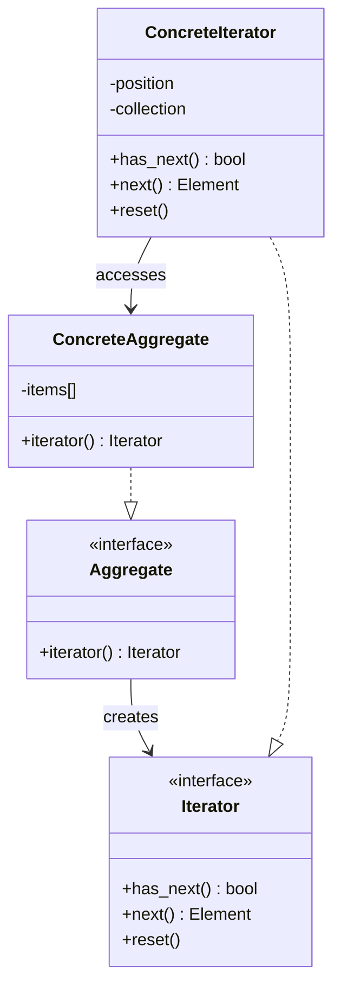
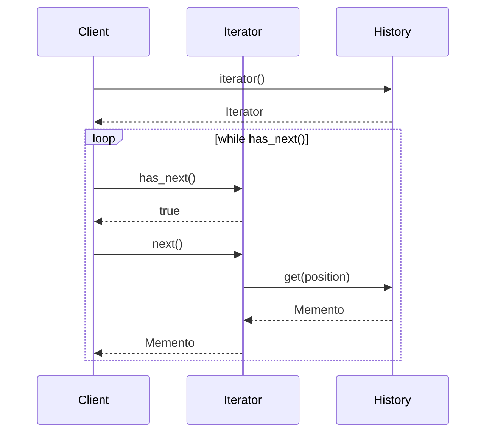

## コレクションの巡回、どうする？

前回、過去のスナップショットを複数保存できるようになりました。しかし、これらを「順番に見る」とき、どう実装すればいいでしょう？

素朴に書くとこうなります：

```perl
# ❌ 内部構造に依存している
for my $i (0 .. $history->count - 1) {
    my $snapshot = $history->snapshots->[$i];
    say $snapshot->to_string;
}
```

これには問題があります。`$history->snapshots`という内部の配列構造に直接アクセスしています。もし将来、履歴の保存方法が「配列」から「リンクリスト」や「データベース」に変わったら、このコードは全部壊れます。

「内部構造を隠蔽しながら、要素を順番にアクセスする」──これを実現するのが「Iteratorパターン」です。

## Iteratorパターンの仕組み

Iteratorパターンには2つの役割があります：



- **Iterator**: 要素を順番に取り出すインターフェース。`has_next()`、`next()`、`reset()`などのメソッドを持つ。
- **Aggregate（集約）**: Iteratorを生成するインターフェース。コレクションの内部構造を知っている。

利用者は、内部が配列でもリンクリストでも気にせず、「`has_next()`で次があるか確認して、`next()`で取り出す」という統一的な方法でアクセスできます。

## HistoryIteratorを作る

まず、履歴を巡回するIteratorを作ります：

```perl
package WebHunter::HistoryIterator {
    use Moo;
    use namespace::clean;

    has history => (
        is       => 'ro',
        required => 1,
    );

    has position => (
        is      => 'rw',
        default => 0,
    );

    # 次の要素があるか？
    sub has_next ($self) {
        return $self->position < $self->history->count;
    }

    # 次の要素を取得（位置を進める）
    sub next ($self) {
        return undef unless $self->has_next;
        my $item = $self->history->get($self->position);
        $self->position($self->position + 1);
        return $item;
    }

    # 先頭に戻る
    sub reset ($self) {
        $self->position(0);
    }

    # 現在の位置
    sub current_position ($self) {
        return $self->position;
    }
}
```

### ポイント

- **`has_next()`**: 次の要素があるかどうかを真偽値で返す。
- **`next()`**: 次の要素を返し、内部の位置を1つ進める。要素がなければ`undef`を返す。
- **`reset()`**: 位置を先頭に戻す。同じコレクションを何度も巡回できる。

## Historyクラスにiteratorメソッドを追加

次に、Historyクラスに「Iteratorを返すメソッド」を追加します：

```perl
package WebHunter::History {
    use Moo;
    use Storable qw(store retrieve);
    use WebHunter::HistoryIterator;
    use namespace::clean;

    has snapshots => (
        is      => 'ro',
        default => sub { [] },
    );

    has storage_file => (
        is      => 'ro',
        default => 'webhunter_history.dat',
    );

    # （前回のメソッドは省略）

    # Iteratorを生成
    sub iterator ($self) {
        return WebHunter::HistoryIterator->new(history => $self);
    }

    # 逆順Iteratorを生成（新しい順）
    sub reverse_iterator ($self) {
        return WebHunter::HistoryReverseIterator->new(history => $self);
    }
}
```

## 逆順Iteratorも作ってみる

履歴は「新しい順」で見たいことが多いです。逆順Iteratorも作りましょう：

```perl
package WebHunter::HistoryReverseIterator {
    use Moo;
    use namespace::clean;

    has history => (
        is       => 'ro',
        required => 1,
    );

    has position => (
        is      => 'lazy',
        builder => sub ($self) {
            $self->history->count - 1;
        },
    );

    sub has_next ($self) {
        return $self->position >= 0;
    }

    sub next ($self) {
        return undef unless $self->has_next;
        my $item = $self->history->get($self->position);
        $self->position($self->position - 1);
        return $item;
    }

    sub reset ($self) {
        $self->position($self->history->count - 1);
    }
}
```

## 実際に使ってみる

Iteratorを使えば、内部構造を気にせず履歴を巡回できます：

```perl
package main {
    use WebHunter::WebMonitor;
    use WebHunter::Fetcher;

    my $url     = 'https://example.com';
    my $monitor = WebHunter::WebMonitor->new(url => $url);

    # （何度かチェックを実行して履歴を蓄積したと仮定）

    # 古い順に表示
    say "=== 履歴（古い順） ===";
    my $iter = $monitor->history->iterator;
    my $count = 1;
    while ($iter->has_next) {
        my $snapshot = $iter->next;
        say "[$count] ", $snapshot->to_string;
        $count++;
    }

    # 新しい順に表示
    say "\n=== 履歴（新しい順） ===";
    my $rev_iter = $monitor->history->reverse_iterator;
    $count = 1;
    while ($rev_iter->has_next) {
        my $snapshot = $rev_iter->next;
        say "[$count] ", $snapshot->to_string;
        $count++;
    }

    # もう一度巡回（resetで先頭に戻る）
    say "\n=== もう一度巡回 ===";
    $iter->reset;
    while ($iter->has_next) {
        my $snapshot = $iter->next;
        say $snapshot->to_string;
    }
}
```

## Iteratorの利点



Iteratorパターンの利点は：

1. **内部構造の隠蔽**: 利用者は配列かリンクリストか知る必要がない。
2. **統一的なアクセス**: どんなコレクションも`has_next()`/`next()`で巡回できる。
3. **複数の巡回方法**: 順方向、逆方向、フィルタリング付きなど、様々なIteratorを提供できる。
4. **Single Responsibility Principle（単一責任原則）**: コレクションは「保存」、Iteratorは「巡回」と責任が分離される。

## Perlの組み込みIteratorパターン

実は、Perlの`each`や`values`も一種のIteratorです：

```perl
my %hash = (a => 1, b => 2, c => 3);

# each はIteratorのように振る舞う
while (my ($key, $value) = each %hash) {
    say "$key => $value";
}
```

ただし、これは「ハッシュの内部状態を変更する」ため、複数のIteratorを同時に使うと壊れます。今回作ったIteratorは、内部状態を持つので、複数のIteratorを同時に使っても安全です。

## 次回予告

これで、Observer、Memento、Iteratorの3つのパターンが揃いました。しかし、まだ「1つのURL」しか監視できません。

次回は、「複数のサイトを同時監視」できるようにします。10個、100個のURLを登録し、定期的にチェックし、変更があったら通知する──実用的なツールに仕上げていきます。




