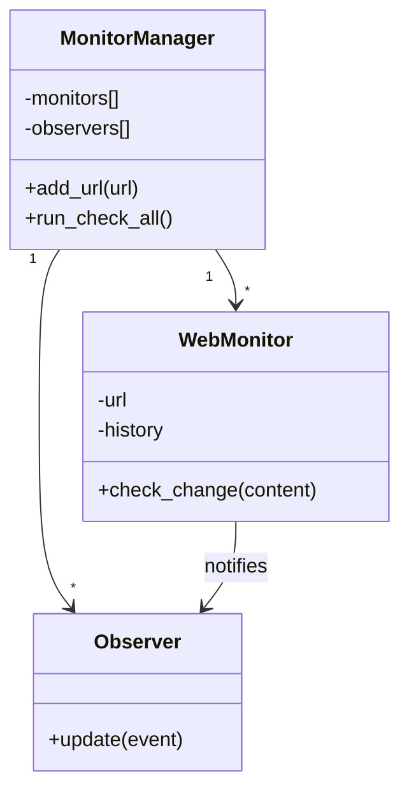
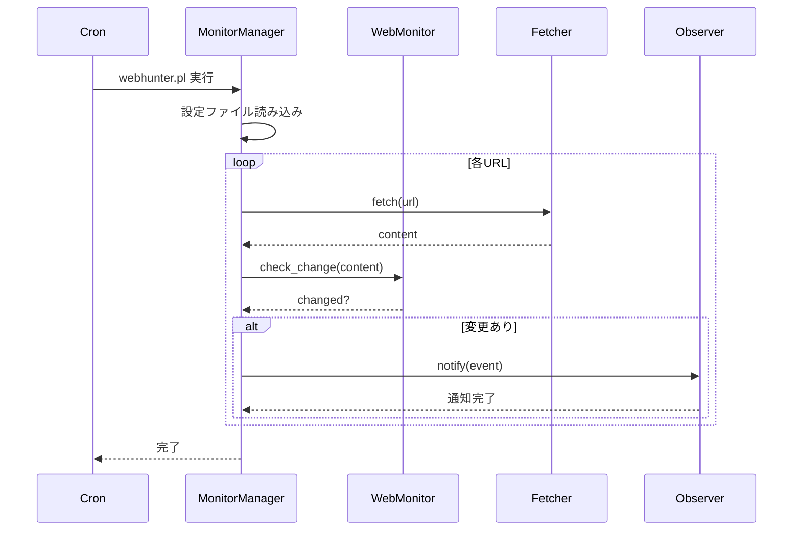

## 1つだけじゃ物足りない

これまで、1つのURLを監視する仕組みを作ってきました。しかし、実際には複数のサイトを同時に監視したいですよね。

- 競合サイト5社の価格ページ
- お気に入りのニュースサイト10個
- 政府の公開情報ページ3つ

これらを全部、別々のスクリプトで管理するのは面倒です。1つのツールで、複数のURLをまとめて監視したい。

今回は、「複数URL管理」「設定ファイル」「定期実行」を実装して、実用的なツールに仕上げます。

## 複数URL管理の設計

まず、どう設計するか考えましょう：



`MonitorManager`が複数の`WebMonitor`を管理し、一括でチェックを実行します。Observerは全モニターで共有（メール通知先は全URL共通など）。

## 設定ファイルを作る

監視対象URLを設定ファイルで管理しましょう。YAML形式が読みやすいです：

```yaml
# webhunter_config.yaml
urls:
  - url: https://example.com/price
    name: 競合A社価格ページ
    check_interval: 3600  # 秒単位

  - url: https://news.example.com/
    name: ニュースサイト
    check_interval: 1800

  - url: https://government.example.com/data
    name: 政府公開情報
    check_interval: 7200

observers:
  - type: email
    to: admin@example.com

  - type: slack
    webhook_url: https://hooks.slack.com/services/YOUR/WEBHOOK/URL

  - type: log
    logfile: webhunter.log
```

## MonitorManagerクラスを作る

設定ファイルを読み込み、複数のモニターを管理するクラスを作ります：

```perl
package WebHunter::MonitorManager {
    use Moo;
    use YAML::PP;
    use WebHunter::WebMonitor;
    use WebHunter::Fetcher;
    use WebHunter::Observer::Email;
    use WebHunter::Observer::Slack;
    use WebHunter::Observer::Log;
    use namespace::clean;

    has config_file => (
        is      => 'ro',
        default => 'webhunter_config.yaml',
    );

    has monitors => (
        is      => 'ro',
        default => sub { {} },  # URLをキーとするハッシュ
    );

    has observers => (
        is      => 'ro',
        default => sub { [] },
    );

    has fetcher => (
        is      => 'lazy',
        builder => sub { WebHunter::Fetcher->new },
    );

    # 設定ファイルを読み込んで初期化
    sub BUILD ($self, $args) {
        $self->load_config;
    }

    sub load_config ($self) {
        return unless -e $self->config_file;

        my $yp = YAML::PP->new;
        my $config = $yp->load_file($self->config_file);

        # URLを登録
        for my $url_config ($config->{urls}->@*) {
            my $monitor = WebHunter::WebMonitor->new(
                url => $url_config->{url},
            );
            $self->monitors->{$url_config->{url}} = {
                monitor        => $monitor,
                name           => $url_config->{name} // $url_config->{url},
                check_interval => $url_config->{check_interval} // 3600,
            };
        }

        # Observerを登録
        for my $obs_config ($config->{observers}->@*) {
            my $observer;
            if ($obs_config->{type} eq 'email') {
                $observer = WebHunter::Observer::Email->new(
                    to => $obs_config->{to}
                );
            } elsif ($obs_config->{type} eq 'slack') {
                $observer = WebHunter::Observer::Slack->new(
                    webhook_url => $obs_config->{webhook_url}
                );
            } elsif ($obs_config->{type} eq 'log') {
                $observer = WebHunter::Observer::Log->new(
                    logfile => $obs_config->{logfile}
                );
            }
            push $self->observers->@*, $observer if $observer;
        }
    }

    # 全URLをチェック
    sub run_check_all ($self) {
        my @results;

        for my $url (sort keys $self->monitors->%*) {
            my $info    = $self->monitors->{$url};
            my $monitor = $info->{monitor};
            my $name    = $info->{name};

            say "チェック中: $name ($url)";

            # Webページ取得
            my $result = $self->fetcher->fetch($url);
            unless ($result->{success}) {
                warn "取得失敗: $url - $result->{status}";
                next;
            }

            # 変更チェック
            my $check = $monitor->check_change($result->{content});
            
            if ($check->{changed}) {
                say "  ✓ 変更検知！";
                
                # Observerに通知
                my $event = {
                    url       => $url,
                    name      => $name,
                    content   => $result->{content},
                    previous  => $check->{previous},
                    current   => $check->{current},
                    timestamp => time,
                };
                
                $self->notify_observers($event);
                
                push @results, { url => $url, changed => 1 };
            } else {
                say "  変更なし";
                push @results, { url => $url, changed => 0 };
            }
        }

        return \@results;
    }

    # 全Observerに通知
    sub notify_observers ($self, $event) {
        for my $observer ($self->observers->@*) {
            $observer->update($event);
        }
    }

    # 監視対象URL数
    sub count ($self) {
        return scalar keys $self->monitors->%*;
    }
}
```

### ポイント

- **`BUILD`**: Mooのコンストラクタ後フック。インスタンス生成時に自動で設定ファイルを読み込みます。
- **`monitors`はハッシュ**: URLをキーにすることで、重複登録を防ぎます。
- **YAML::PP**: YAMLパーサー。`YAML::Tiny`より高機能で、複雑な構造も扱えます（CPANから入手）。

## コマンドラインツールを作る

実際に実行するスクリプトを作りましょう：

```perl
#!/usr/bin/env perl
use v5.36;
use utf8;
use lib 'lib';
use WebHunter::MonitorManager;

my $manager = WebHunter::MonitorManager->new(
    config_file => $ARGV[0] // 'webhunter_config.yaml'
);

say "=================================";
say "  WebHunter - Webページ変更監視";
say "=================================";
say "監視対象URL数: ", $manager->count;
say "";

my $results = $manager->run_check_all;

say "\n=== チェック完了 ===";
my $changed_count = grep { $_->{changed} } @$results;
say "変更検知: $changed_count / ", scalar(@$results), " サイト";
```

このスクリプトを`webhunter.pl`として保存し、実行します：

```bash
perl webhunter.pl
```

## cronで定期実行

定期的にチェックするには、cronを使います。例えば、1時間ごとに実行：

```cron
0 * * * * cd /path/to/webhunter && perl webhunter.pl >> logs/webhunter.log 2>&1
```

これで、完全に自動化された監視システムの完成です。

## 実行の流れ



## さらなる改善案

実用性を高めるには、こんな機能も欲しいですね：

- **エラーリトライ**: 一時的なネットワークエラーを自動リトライ
- **タイムアウト設定**: URL毎に異なるタイムアウト
- **フィルタリング**: HTMLから特定部分だけを抽出して比較（広告やタイムスタンプを無視）
- **通知の優先度**: 重要なサイトだけLINEにも送る

次回は、「どこが変わったか一目でわかる」差分表示機能を実装します。




