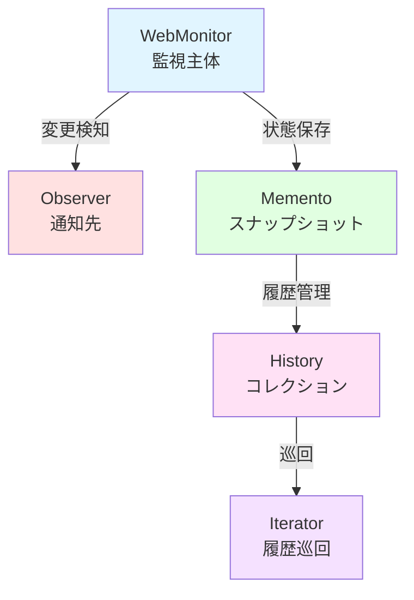
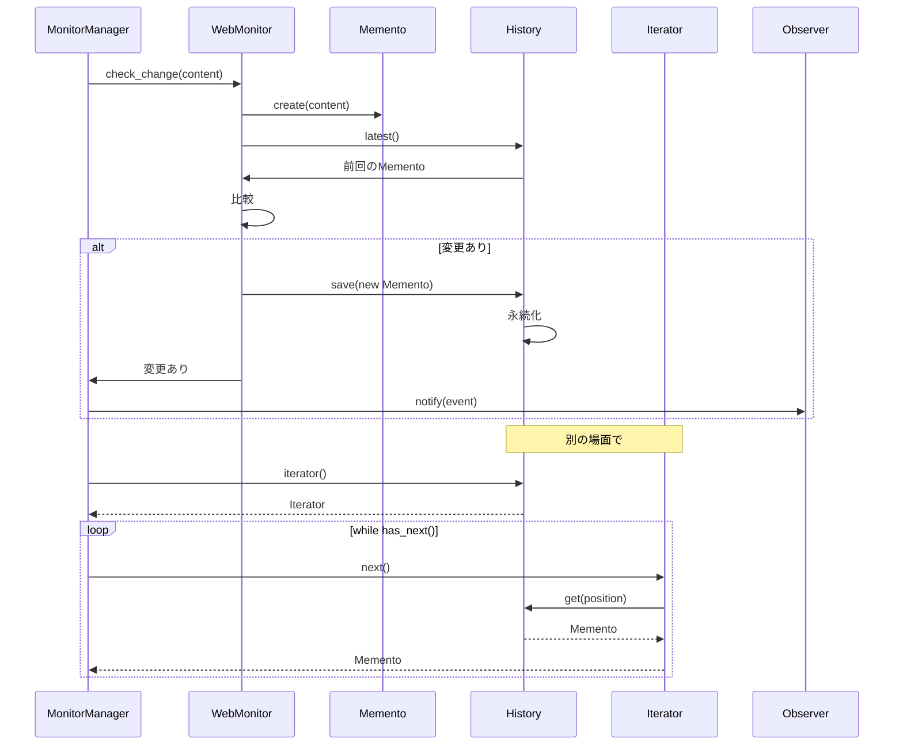

## 振り返り：何を作ったか

全7回で、Webページ変更監視ツール「WebHunter」を作ってきました。機能をおさらいしましょう：

1. **Webページ取得**（第1回）: LWP::UserAgentでHTTP通信
2. **変更検知**（第2回）: ハッシュ値による効率的な比較
3. **通知機能**（第3回）: 複数の通知先（メール、Slack、ログ）
4. **履歴保存**（第4回）: 過去のスナップショットを保存・復元
5. **履歴巡回**（第5回）: 保存された履歴を順番に確認
6. **複数サイト監視**（第6回）: 設定ファイルで一括管理
7. **差分表示**（第7回）: どこが変わったか視覚化

これら全体を支える設計思想が、「Observer」「Memento」「Iterator」という3つのデザインパターンでした。最終回の今回は、これらのパターンがどう協調し、どんな原則に基づいているかを解説します。

## 3つのパターンの役割



### Observerパターン：変更の通知

**役割**: 変更が起きたとき、登録された全ての観察者に通知する。

**実装**:
- `WebHunter::Observer` (Role)
- `WebHunter::Observer::Email`
- `WebHunter::Observer::Slack`
- `WebHunter::Observer::Log`
- `WebHunter::MonitorManager` (Subject)

**利点**:
- 通知先を後から追加しても、既存コードを変更不要（Open-Closed Principle）
- 主体と観察者が疎結合（依存性逆転の原則）

### Mementoパターン：状態の保存

**役割**: オブジェクトの内部状態をカプセル化して保存・復元する。

**実装**:
- `WebHunter::Memento` (スナップショット)
- `WebHunter::WebMonitor` (Originator)
- `WebHunter::History` (Caretaker)

**利点**:
- カプセル化を守りながら状態を保存（情報隠蔽）
- 永続化が容易（Storableで簡単にディスク保存）

### Iteratorパターン：コレクションの巡回

**役割**: コレクションの内部構造を隠蔽しながら、要素を順番にアクセスする。

**実装**:
- `WebHunter::HistoryIterator`
- `WebHunter::HistoryReverseIterator`
- `WebHunter::History` (Aggregate)

**利点**:
- 内部実装（配列/リンクリスト）を隠蔽
- 複数の巡回方法を提供可能（順方向、逆方向、フィルタリング）
- Single Responsibility Principle（巡回ロジックを分離）

## パターンの協調

これら3つのパターンは、単独ではなく協調して動作します：



1. **Mementoで状態保存** → 過去の状態を保持
2. **Iteratorで履歴巡回** → 過去の状態を順番に確認
3. **Observerで変更通知** → 変更を複数の宛先に伝達

それぞれが独立しつつ、連携してツール全体を構成します。

## SOLID原則との対応

このツールは、SOLID原則を自然に満たしています：

### S: Single Responsibility Principle（単一責任原則）

各クラスは1つの責任だけを持ちます：

- `WebHunter::Fetcher`: HTTP通信のみ
- `WebHunter::ChangeDetector`: 変更検知のみ
- `WebHunter::Memento`: 状態の保持のみ
- `WebHunter::History`: 履歴の管理のみ
- `WebHunter::HistoryIterator`: 巡回のみ

### O: Open-Closed Principle（開放閉鎖原則）

「拡張には開いているが、修正には閉じている」：

- 新しい通知先（Discord、LINE）を追加しても、既存のObserverクラスは変更不要
- 新しいIterator（フィルタリング付き、期間指定）を追加しても、Historyクラスは変更不要

### L: Liskov Substitution Principle（リスコフの置換原則）

派生クラスは基底クラス（Role）と置き換え可能：

- どのObserver実装（Email、Slack、Log）も、`update()`メソッドを持ち、同じインターフェースで使える
- どのIterator実装も、`has_next()`/`next()`で巡回できる

### I: Interface Segregation Principle（インターフェース分離原則）

クライアントは使わないメソッドに依存しない：

- Observerは`update()`だけを要求（他のメソッドは不要）
- Iteratorは`has_next()`/`next()`だけを要求

### D: Dependency Inversion Principle（依存性逆転の原則）

具象ではなく抽象に依存：

- `MonitorManager`は具体的なObserver実装（EmailNotifierなど）ではなく、`Observer` Roleに依存
- `History`は具体的なIterator実装ではなく、「iteratorメソッドがある」という契約に依存

## パターンを使わなかったら？

もしパターンを使わず、ベタに書いたらどうなるでしょう？

```perl
# ❌ パターンなし版（悲惨な例）
sub check_and_notify ($url, $content) {
    # 前回の内容を読み込み（ファイル名決め打ち）
    my $prev_file = "/tmp/prev_$url.txt";
    my $prev_content = read_file($prev_file);
    
    # 比較
    if ($content ne $prev_content) {
        # メール送信（ハードコーディング）
        send_email('admin@example.com', "変更検知: $url");
        
        # Slack通知（ハードコーディング）
        post_slack('https://hooks.slack.com/...', "変更検知: $url");
        
        # ログ記録（ハードコーディング）
        append_log('/var/log/webhunter.log', "変更検知: $url");
        
        # 内容を保存（前回のを上書き）
        write_file($prev_file, $content);
    }
}
```

この実装の問題点：

1. **通知先が固定**: 新しい通知先を追加するには、このコードを直接修正する必要がある
2. **履歴が1つだけ**: 「昨日の状態」しか残らない。「先週の状態」は消えている
3. **巡回方法がない**: 過去の履歴を順番に見る方法がない
4. **テストしづらい**: 実際にファイルI/Oやメール送信が走る
5. **再利用できない**: 他のプロジェクトに持っていけない

パターンを使うことで、これらの問題が全て解決されます。

## パターンの選択基準

「いつパターンを使うべきか？」という疑問があるかもしれません。答えは：

### 使うべきとき

- **同じような問題を何度も解いている**: パターンは「定石」。再利用可能な解決策。
- **将来の拡張が予想される**: 通知先が増える、保存先が変わるなど。
- **複雑さを整理したい**: 責任が混在しているコードを分離したい。

### 使わなくていいとき

- **極小規模なスクリプト**: 100行以下の使い捨てスクリプト。
- **要求が完全に固定**: 「絶対に変わらない」と確信できる部分。
- **パフォーマンスがクリティカル**: パターンは抽象化の層を増やす。実行速度が最優先なら、ベタ書きが速い場合も。

## Perlでパターンを実装する楽しさ

Perlは「柔軟性」が持ち味です。デザインパターンも、他の言語（Java、C#）より簡潔に書けます：

- **Mooのhas**: 属性定義が簡潔（`lazy`、`builder`、`default`）
- **Signature**: `sub update ($self, $event)` で引数が明確
- **Postfix dereference**: `$self->observers->@*` が読みやすい
- **Role**: MixinとInterfaceの両方の役割

Perlのパターン実装は、「ボイラープレートが少ない」「読みやすい」「柔軟」という特徴があります。

## まとめ：パターンは道具

デザインパターンは「銀の弾丸」ではありません。適材適所で使う「道具」です。

- **Observer**: 1対多の依存関係、変更の通知
- **Memento**: 状態の保存・復元、Undo機能
- **Iterator**: コレクションの巡回、内部構造の隠蔽

この3つを組み合わせることで、「Webページ変更監視ツール」という実用的なプログラムが完成しました。

そして何より、Perlという言語の表現力と、Mooという軽量OOPフレームワークの使いやすさを実感できたはずです。

## 次のステップ

このツールをさらに発展させるなら：

1. **Strategyパターン**: 複数の変更検知戦略（ハッシュ、テキスト、DOM比較）を切り替え可能に
2. **Factoryパターン**: Observer生成を工場クラスに委譲
3. **Commandパターン**: チェック操作をオブジェクト化、Undo/Redo対応
4. **Decoratorパターン**: Observerに追加機能（リトライ、レート制限）を動的に追加

Perlの世界は広大です。ぜひ、自分なりの応用を見つけてください。

Happy Hacking!




